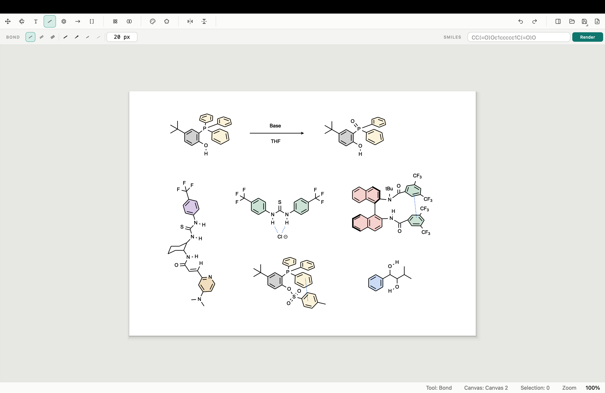

# Chemvas

A lightweight, PyQt6-based 2D chemical structure drawing app for quickly sketching
molecules and reaction schemes — and exporting publication-ready figures.

[](https://github.com/dhsohn/Chemvas/actions/workflows/ci.yml)
[](LICENSE)
[](https://www.python.org/)

**English** · [한국어](README.ko.md)



Chemvas lets you combine molecular bonds/rings/labels, arrows, and bracket
annotations on a single canvas. The default style follows the ACS 1996 conventions,
and the goal is to draft figures for lab notebooks or papers fast. RDKit is an
optional backend used for SMILES import, formula/weight calculation, and 2D→3D
conversion — Chemvas runs without it.

## Features

- **Bonds** — single / double / triple, bold, wedge & hash; 30° angle snapping and
  a consistent default bond length.
- **Rings & templates** — benzene, cycloalkanes, chair/boat conformers placed by
  live preview and click-to-insert.
- **Arrows** — reaction, equilibrium, resonance, curved, and dashed arrows with
  adjustable width and head scale.
- **Brackets & annotations** — square / round / curly brackets, dagger (`†`) and
  double dagger (`‡`) annotation objects.
- **Atom labels** — elements, charges, radicals, and common alias labels
  (`Me`, `Et`, `OH`, `Ph`, `OMe`, `Boc`, `CO2Me`, `t-Bu`, `i-Pr`).
- **SMILES import** _(RDKit)_ — type a SMILES string, preview it under the cursor,
  and click to place it on the canvas.
- **Molecule Info window** _(RDKit)_ — 3D preview (drag to rotate, scroll to zoom)
  plus molecular formula and weight for the current selection.
- **Figure export** — SVG / PDF / PNG / TIFF with outlined glyphs (so screen, vector,
  and raster output never diverge) and deterministic physical sizing
  (bond-length or 84 / 174 mm column fit), independent of zoom.
- **2D→3D `.xyz` export** _(RDKit)_ — convert the current molecule or atom/bond
  selection into 3D coordinates; charges/radicals and wedge/hash stereo are carried
  through, and common alias labels are expanded into explicit fragments.
- **Editing** — select / move, horizontal & vertical flip, perspective rotation,
  and delta-based undo/redo.
- **ChemDraw-compatible shortcuts** — a substantial subset (see below).
- **Save / load** — `.chemvas` JSON documents preserve the full working state.

## Install

Requires **Python 3.13+** and **PyQt6**.

```bash
# from a clone of this repo
python -m pip install -e .

# optional: enable SMILES / formula / 3D features
python -m pip install -e ".[rdkit]"
```

> A PyPI release and prebuilt binaries are on the roadmap (see below). For now,
> install from source.

## Running

```bash
python app/main.py    # development tree
chemvas               # after install
```

Pick a tool from the left toolbar and click/drag on the canvas to draw. Enter a
SMILES string in the top input and press **Render** to enter placement mode: move
the mouse to preview, click to insert, `Esc` to cancel. Templates work the same
preview-and-click way.

## Examples

Open [`examples/template1.chemvas`](examples/template1.chemvas) via **File ▸ Open** to
explore the document shown above — a reaction scheme plus several organocatalyst
structures.

## File format

File ▸ Save / Open works with `.chemvas` files — a JSON-based format holding the
molecule model, annotations, arrows, bracket annotations, and settings:

```json
{ "type": "chemvas", "version": 1, "state": { /* ... */ } }
```

## 3D export & Molecule Info

- Export scope is the current chemical graph or the current atom/bond selection.
  Arrows, bracket annotations, and free text are **not** included in `.xyz`.
- `+`/`-`/radical marks become formal charges / radical electrons; wedge/hash bonds
  on single bonds become RDKit stereochemistry hints.
- Unsupported labels, mis-connected aliases, and invalid wedge/hash use fail with an
  explicit error message instead of guessing.
- `.xyz` stores element symbols and 3D coordinates only — it is **not** a full
  round-trip of bond orders, stereochemistry, or reaction semantics.

## Keyboard shortcuts

Chemvas supports a major subset of ChemDraw-compatible shortcuts.

- **Empty canvas (tool hotkeys):** Select/Marquee `Space`, Bond `X`, Atom/Text `T`,
  Arrow `E`, Benzene `J`, Brackets `Shift+T`, Orbitals `Shift+G`,
  Chemical symbols `Shift+E`, Perspective `Alt+D`
- **Atom hotkeys (hover over an atom):** element/alias labels
  `c n o s p f h b i l m e r x d` and `Shift+f/p/a/b/s/n/e/z/m/l/o/q/h/y`, charge `+`/`-`,
  edit label `Enter`, sprout `0/1/2/3/a/4/5/6/7/8/9/z/v/u` (`9` = gem-dimethyl)
- **Bond hotkeys (hover over a bond):** Single `1`, Double `2`, Triple `3`,
  Bold `b`/`Shift+B`, Wedge `w`, Hash `h`/`Shift+H`, Dashed `d`/`Shift+D`,
  double-bond position `l`/`c`/`r`, Benzene fusion `a`,
  Ring fusion `4/5/6/7/8`, Chair fusion `9/0`
- **Objects:** Flip Horizontal `Ctrl+Shift+H`, Flip Vertical `Ctrl+Shift+V`,
  Rotate selection `Alt+Up/Down` (15°) and `Alt+Left/Right` (1°),
  Nudge selection `Shift+Arrows` (10 pt)
- **View:** Actual size `F5`, Fit to window `F6`, Magnify `F7`, Reduce `F8`
- **File / edit:** Save / Open / Undo / Redo (platform defaults), `Ctrl+A` (select
  all, switches to the Select tool), `Ctrl+C` (copy
  selection as image), `Ctrl+X` (cut selection), `Ctrl+G` / `Ctrl+Shift+G`
  (group / ungroup selection), `Delete`/`Backspace` (delete
  selection, or edit/delete the hovered atom/bond), `Esc` (cancel template /
  SMILES insertion)

## Development

CI runs `ruff`, `mypy`, and the test suite headlessly (`QT_QPA_PLATFORM=offscreen`).
See [CONTRIBUTING.md](CONTRIBUTING.md) for dev setup, how to run the tests, and the
**architecture conventions** — the codebase is split into many small
`*_ports` / `*_access` / `*_state` / `*_service` modules **on purpose**, and that
boundary is enforced by a test. Read CONTRIBUTING before restructuring anything.

The high-level design is in [docs/ARCHITECTURE.md](docs/ARCHITECTURE.md).

## Roadmap / not yet supported

These are known gaps, not bugs — contributions welcome:

- **Bond-aware interchange:** MOL / SDF **import**, and SDF (multi-molecule) export.
  `.mol` export, SMILES export ("copy as SMILES"), and InChI / InChIKey have landed.
- **Vector clipboard:** `Ctrl+C` currently copies a PNG only; PDF/SVG clipboard
  flavors (for pasting into Illustrator / Office as vector) are planned.
- **Distribution:** PyPI release and one-file desktop binaries.
- **Multi-molecule / reaction-scheme 3D export** and richer template libraries.

## License

[MIT License](LICENSE)
