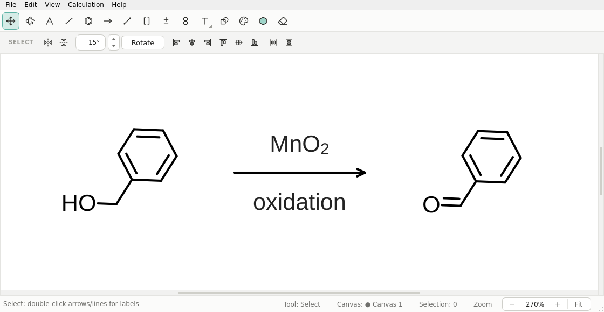

<p align="center">
  
</p>

<p align="center">
  <a href="https://github.com/dhsohn/Chemvas/actions/workflows/ci.yml"></a>
  <a href="LICENSE"></a>
  <a href="https://www.python.org/"></a>
</p>

<p align="center"><b>English</b> · <a href="README.ko.md">한국어</a></p>

A lightweight, PyQt6-based 2D chemical structure drawing app for quickly sketching
molecules and reaction schemes — and exporting publication-ready figures.



Chemvas lets you combine molecular bonds/rings/labels, arrows, and bracket
annotations on a single canvas. The default style follows the ACS 1996 conventions,
and the goal is to draft figures for lab notebooks or papers fast. RDKit is an
optional backend used for SMILES import, formula/weight calculation, and 2D→3D
conversion — Chemvas runs without it.

## Features

- **Bonds** — single / double / triple, bold, wedge & hash; 30° angle snapping and
  a consistent default bond length.
- **Rings & templates** — benzene, cycloalkanes, chair/boat conformers placed by
  live preview and click-to-insert.
- **Arrows** — reaction, equilibrium, resonance, curved, and dashed arrows with
  adjustable width and head scale.
- **Brackets & annotations** — square / round / curly brackets, dagger (`†`) and
  double dagger (`‡`) annotation objects.
- **Atom labels** — elements, charges, radicals, and common alias labels
  (`Me`, `Et`, `OH`, `Ph`, `OMe`, `Boc`, `CO2Me`, `t-Bu`, `i-Pr`).
- **SMILES import** _(RDKit)_ — type a SMILES string, preview it under the cursor,
  and click to place it on the canvas.
- **MOL interchange** — open MDL Molfiles (`.mol`, V2000) as new documents and
  export the selected structure as `.mol`. Import and plain-element export need
  no RDKit; abbreviation labels require optional RDKit expansion. Property
  records are limited to `M  CHG` / `M  RAD`, wedge/hash stereo to single bonds,
  and the counts-line chiral flag to zero. Singlet `M  RAD` code 1 is rejected
  until the annotation model can preserve spin multiplicity.
- **Molecule Info window** _(RDKit)_ — 3D preview (drag to rotate, scroll to zoom),
  molecular formula and weight, and one-click copy of the canonical SMILES,
  InChI, and InChIKey for the current selection.
- **Figure export** — plain SVG / PDF / PNG / TIFF with outlined glyphs (so screen,
  vector, and raster output never diverge) and deterministic physical sizing
  (bond-length or 84 / 174 mm column fit), independent of zoom. Editable Chemvas
  SVG is opt-in and embeds the source document in SVG metadata.
- **2D→3D `.xyz` export** _(RDKit)_ — convert the current molecule or atom/bond
  selection into 3D coordinates; charges/radicals and wedge/hash stereo are carried
  through, and common alias labels are expanded into explicit fragments.
- **Editing** — select / move, an eraser tool (click or drag to erase),
  horizontal & vertical flip, perspective rotation, and delta-based undo/redo.
- **Desktop menus** — standard File / Edit / View menus, including a
  **Canvas Size** dialog for the sheet size and orientation.
- **ChemDraw-compatible shortcuts** — a substantial subset (see below).
- **Save / load** — `.chemvas` JSON documents preserve the full working state.
- **Autosave & recovery** — open documents are snapshotted every few seconds, so
  an unexpected exit costs you almost nothing: the next launch restores your
  unsaved work and reopens your last session automatically. Unsaved tabs show a
  `●` marker, the File menu keeps an **Open Recent** list, and reopening an
  already-open file switches to its window instead of duplicating it.

## Install

Requires **Python 3.12+** and **PyQt6**.

```bash
pip install chemvas

# optional: enable SMILES / formula / 3D features
pip install "chemvas[rdkit]"
```

Or install from a clone of this repo — append `".[rdkit]"` for the optional
features:

```bash
python -m pip install -e .
```

> Prebuilt one-file desktop binaries are still on the roadmap (see below).

## Running

```bash
python app/main.py    # development tree
chemvas               # after install
```

Pick a tool from the top toolbar and click/drag on the canvas to draw. Enter a
SMILES string in the top input and press **Insert** to enter placement mode: move
the mouse to preview, click to insert, `Esc` to cancel. Templates work the same
preview-and-click way.

## Examples

Open [`examples/template1.chemvas`](examples/template1.chemvas) via **File ▸ Open** to
explore the document shown above — a reaction scheme plus several organocatalyst
structures.

## File format

File ▸ Save / Open works with `.chemvas` files — a JSON-based format holding the
molecule model, annotations, arrows, bracket annotations, and settings:

```json
{ "type": "chemvas", "version": 5, "state": { /* ... */ } }
```

Version 5 can also carry an optional `calculation_plan`: reusable calculation
states plus elementary-step endpoint roles and explicit atom correspondence.
Older v1-v4 drawings remain loadable.

Figure export defaults to plain SVG without Chemvas source metadata. Choose
**Editable Chemvas SVG** only when you want the SVG to carry the original
document payload for round-tripping back into Chemvas.

## Autosave & recovery

Chemvas snapshots every open document to a per-user app-data folder every few
seconds — nothing is written next to your own files. If the app is killed or
crashes, the next launch restores those documents (unsaved ones flagged with a
`●` and a status-bar note); a clean quit simply reopens whatever files were
open. Snapshots are pruned once a session has been restored or closed cleanly.

## 3D export & Molecule Info

- Export scope is the current chemical graph or the current atom/bond selection.
  Arrows, bracket annotations, and free text are **not** included in `.xyz`.
- `+`/`-`/radical marks become formal charges / radical electrons; wedge/hash bonds
  on single bonds become RDKit stereochemistry hints.
- Unsupported labels, mis-connected aliases, and invalid wedge/hash use fail with an
  explicit error message instead of guessing.
- `.xyz` stores element symbols and 3D coordinates only — it is **not** a full
  round-trip of bond orders, stereochemistry, or reaction semantics.

## Agent-safe document editing

### Headless document rendering

An agent can render the complete drawing through the same figure-export path as
the desktop app without opening a window or loading RDKit:

```bash
chemvas render-document scheme.chemvas --output scheme.svg
chemvas render-document scheme.chemvas --output scheme.png --dpi 600
chemvas render-document scheme.chemvas --output scheme-transparent.png \
  --background transparent
```

The output suffix selects SVG or PNG. White is the default background; PNG DPI
may be 150, 300, 600, or 1200, while SVG ignores DPI. The command starts only an
invisible offscreen Qt canvas, does not start session recovery, and leaves the
source untouched. It refuses existing files, directories, and symlinks and
publishes the new output atomically.

Standard output is a deterministic JSON report containing the exact source and
output SHA-256 hashes, document version, output byte count, physical point size,
and PNG pixel dimensions. Repeated renders are byte-identical within the same
Chemvas/Qt/font environment; Qt or font changes can alter path geometry or encoded
bytes, so consumers should use the reported hash rather than assume
cross-platform byte identity. Rendering is fail-closed at 8 MiB of source data,
20,000 graphics records, 64 MiB of output, 14,400 points per side, and—for
PNG—10,000 pixels per side or 25 million total pixels.

### Graph Patch v1

An agent can inspect every stable atom ID and then propose a bounded Graph Patch
without starting Qt or rewriting the whole `.chemvas` document:

```bash
chemvas inspect-document scheme.chemvas > inspection.json
chemvas apply-patch scheme.chemvas patch.json --dry-run
chemvas apply-patch scheme.chemvas patch.json --output revised.chemvas
```

`inspect-document` reports the exact source-file SHA-256, document version,
`next_atom_id`, complete atom/bond inventory, effective charge/radical annotations,
connected components, and dependent scene-state counts. The agent copies that exact
hash into a Graph Patch v1 precondition:

```json
{
  "format": "chemvas-graph-patch",
  "version": 1,
  "source_sha256": "<64 lowercase hexadecimal characters>",
  "operations": [
    {"op": "add_atom", "atom_id": 12, "element": "O",
     "x": 216.0, "y": 72.0, "color": "#000000", "explicit_label": true},
    {"op": "add_bond", "a": 4, "b": 12, "order": 1,
     "style": "single", "color": "#000000"},
    {"op": "update_bond", "a": 4, "b": 12,
     "changes": {"order": 2, "style": "double"}}
  ]
}
```

Supported operations are `add_atom`, `update_atom` (element/color/explicit label),
`move_atom`, `add_bond`, `update_bond`, and `remove_bond`. Operations run in order on
a private copy and publish only after full document and Calculation Plan validation.
`move_atom` also moves dependent ring-fill, bound-mark, and perspective coordinates.
Dry-run performs the identical validation and reports the candidate file hash but
writes nothing. Apply preserves the input document version, never changes the source,
and refuses to replace an existing file or symlink.

Graph Patch v1 deliberately does not delete atoms or edit charge/radical annotations,
arrows, groups, or Calculation Plans. It makes no chemical or mechanistic inference;
use the GUI or a separately reviewed plan update for those semantics.

## Headless calculation bundles

Installed Chemvas can expose structures to an agent without starting Qt. First
inspect the connected components, then package one explicit component:

```bash
chemvas inspect scheme.chemvas
chemvas pack scheme.chemvas \
  --component 0 --species-id reactant-a \
  --charge 0 --multiplicity 1 \
  --output reactant-a.bundle
```

`inspect` needs no RDKit and prints JSON. `pack` requires the optional RDKit
dependency and creates a new, non-overwriting Calculation Bundle v1 directory:
`source.chemvas`, `structure.mol`, `geometry.xyz`, `atom_map.json`, and
`manifest.json`. The manifest records payload-file SHA-256 hashes, the selected
Chemvas atom IDs, declared charge/multiplicity, modeled formal charge/radicals,
RDKit version, and atom counts. The atom map explains alias expansion and
implicit hydrogens so the coordinate indices can be traced back to the drawing.

Chemvas rejects a declared charge that differs from the attached charge marks.
Multiplicity is always explicit; Chemvas checks only its electron-count parity
and records that no spin state was inferred from the 2D drawing. It does not
guess reaction roles or a mechanism.

Give every species/run a unique output directory. `pack` rejects an existing
target but does not coordinate multiple orchestrators racing for the same path.

### Calculation states and elementary steps

Draw the reactant, product, catalyst, and spectators on one canvas, then open
**Calculation ▸ Edit States and Steps...**. For each endpoint, assign every
connected component one of these inclusion modes:

- `included`: enters the XYZ geometry, electron count, charge, and multiplicity
  validation;
- `context_only`: records a catalyst, solvent, additive, or other condition but
  does not enter the calculation coordinates.

Roles (`reactant`, `product`, `catalyst`, `spectator`) belong to a step endpoint,
not globally to a structure. A state can therefore be S01's product and S02's
reactant without changing the state itself. The atom-correspondence table lists
only included reactant atoms and offers same-element product atoms by stable
Chemvas ID. Exact IDs shared by both endpoints, such as a drawn catalyst reused
on both sides, are suggested once; they are not inferred by element or position,
and an explicit **Unmapped** choice is preserved. Duplicate product mappings are
rejected. The GUI saves an incomplete table as a draft, while its mapped/total
status stays blocked until every included atom on both endpoints has a complete
one-to-one source map. This status covers the source mapping gate; RDKit geometry
generation and downstream chemical review are still separate requirements.
Selecting a mapping row, or moving through its product menu, marks the reactant
with a blue solid **R** and the product with an orange dashed **P** on the canvas.
These markers are temporary overlays: closing the dialog removes them without
changing the drawing, the current canvas selection, or undo history.

Agents can attach and inspect the same contract without Qt:

```bash
chemvas attach-plan scheme.chemvas plan.json --output mechanism.chemvas
chemvas inspect-plan mechanism.chemvas
chemvas pack-step mechanism.chemvas --step S01 --output calculations/S01
```

`plan.json` uses Calculation Plan v1. States own calculation membership and
charge/multiplicity; step endpoints own roles:

```json
{
  "format": "chemvas-calculation-plan",
  "version": 1,
  "states": [
    {"id": "R01", "charge": 0, "multiplicity": 1,
     "members": [
       {"component_atom_ids": [0, 1], "inclusion": "included"},
       {"component_atom_ids": [9], "inclusion": "context_only"}]},
    {"id": "P01", "charge": 0, "multiplicity": 1,
     "members": [{"component_atom_ids": [2, 3], "inclusion": "included"}]}
  ],
  "steps": [{
    "id": "S01",
    "reactant": {"state_id": "R01", "roles": [
      {"component_atom_ids": [0, 1], "role": "reactant"},
      {"component_atom_ids": [9], "role": "spectator"}]},
    "product": {"state_id": "P01", "roles": [
      {"component_atom_ids": [2, 3], "role": "product"}]},
    "atom_correspondence": [
      {"reactant_atom_id": 0, "product_atom_id": 2},
      {"reactant_atom_id": 1, "product_atom_id": 3}]
  }]
}
```

Every `component_atom_ids` list must equal one complete connected component and
must be sorted. `pack-step` creates `reactant.bundle/`, `product.bundle/`,
`atom_correspondence.json`, `bond_changes.json`, and `step_manifest.json`. It
also requires a complete mapping for RDKit-generated atoms; draw transferred
hydrogens explicitly when implicit-hydrogen counts differ between endpoints.
Multi-component coordinates are only initial guesses: the manifest explicitly
records that Chemvas does not guarantee a catalyst/substrate interaction
geometry, and downstream quantum optimization plus researcher review remain
required.

## Keyboard shortcuts

Chemvas supports a major subset of ChemDraw-compatible shortcuts.

- **Empty canvas (tool hotkeys):** Select/Marquee `Space`, Bond `X`, Atom `A`,
  Text `T`, Arrow `E`, Benzene `J`, Brackets `Shift+T`, Orbitals `Shift+G`,
  Chemical symbols `Shift+E`, Perspective `Alt+D`
- **Atom hotkeys (hover over an atom):** element/alias labels
  `c n o s p f h b i l m e r x d` and `Shift+f/p/a/b/s/n/e/z/m/l/o/q/h/y`, charge `+`/`-`,
  edit label `Enter`, sprout `0/1/2/3/a/4/5/6/7/8/9/z/v/u` (`9` = gem-dimethyl)
- **Bond hotkeys (hover over a bond):** Single `1`, Double `2`, Triple `3`,
  Bold `b`/`Shift+B`, Wedge `w`, Hash `h`/`Shift+H`, Dashed `d`/`Shift+D`,
  double-bond position `l`/`c`/`r`, Benzene fusion `a`,
  Ring fusion `4/5/6/7/8`, Chair fusion `9/0`
- **Objects:** Flip Horizontal `Ctrl+Shift+H`, Flip Vertical `Ctrl+Shift+V`,
  Rotate selection `Alt+Up/Down` (15°) and `Alt+Left/Right` (1°),
  Nudge selection `Shift+Arrows` (10 pt)
- **View:** Actual size `F5`, Fit to window `F6`, Magnify `F7`, Reduce `F8`
- **File / edit:** Save / Open / Undo / Redo (platform defaults), `Ctrl+A` (select
  all, switches to the Select tool), `Ctrl+C` (copy selection — PNG plus SVG/PDF
  vector clipboard flavors), `Ctrl+X` (cut selection), `Ctrl+V` (paste the copied
  selection), `Ctrl+G` / `Ctrl+Shift+G` (group / ungroup selection),
  `Delete`/`Backspace` (delete selection, or edit/delete the hovered atom/bond),
  `Esc` (cancel template / SMILES insertion)

## Development

CI runs `ruff`, `mypy`, and the test suite headlessly (`QT_QPA_PLATFORM=offscreen`).
See [CONTRIBUTING.md](CONTRIBUTING.md) for dev setup, how to run the tests, and the
**architecture conventions**. Transitional UI code keeps its established
`*_ports` / `*_access` / `*_state` / `*_service` boundaries where they still
separate real responsibilities; new features do not copy that layout by default.
The active boundaries are enforced by tests, so read CONTRIBUTING before
restructuring anything.

The high-level design is in [docs/ARCHITECTURE.md](docs/ARCHITECTURE.md).

## Roadmap / not yet supported

These are known gaps, not bugs — contributions welcome:

- **SDF (multi-molecule) interchange:** import and export. Single-molecule
  `.mol` import/export, SMILES export ("copy as SMILES"), and InChI / InChIKey
  have landed.
- **Distribution:** one-file desktop binaries (Chemvas is already on PyPI —
  `pip install chemvas`).
- **Multi-molecule / reaction-scheme 3D export** and richer template libraries.
- **Deliberately out of scope for now:** printing (export a PDF instead),
  persistent preferences (every document starts from the ACS 1996 defaults),
  pasting external clipboard content, and drag-and-drop file open.

## License

[MIT License](LICENSE)
