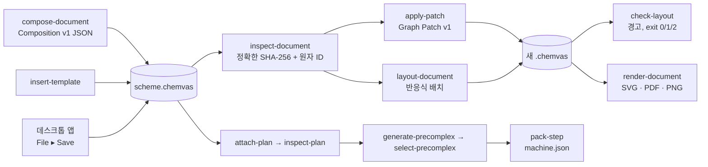

# Chemvas 에이전트 CLI

[English](AGENT_CLI.md)

Chemvas는 문서 연산을 헤드리스 명령으로 노출하므로, 에이전트(또는 어떤
스크립트든)가 Qt 창을 띄우지 않고 렌더링, 검사, 편집, 계산 전달을 할 수
있습니다. 아래 각 명령은 자기 보장을 문서화하며, 공통 주제는 추측하는 대신 실패로
닫히는 좁은 계약입니다. 사용자 대상 상세(GUI, 파일 형식, 단축키)는
[REFERENCE.ko.md](REFERENCE.ko.md)에 있습니다.

## 명령들이 이어지는 방식



모든 명령은 정확한 원본 바이트를 읽고, 가능한 곳에서는 Qt가 필요해지기 전에
검증합니다. 출력 경로를 받는 명령(`compose-document`, `insert-template`,
`apply-patch`, `layout-document`, `render-document`, `attach-plan`,
`generate-precomplex`, `select-precomplex`, `pack-step`)은 새 파일 하나를
원자적으로 게시하고 입력을 절대 편집하지 않습니다. `inspect`, `inspect-document`,
`inspect-plan`, `inspect-precomplex`, `check-layout`과 모든 `--dry-run`은 JSON
보고서만 출력하고 아무것도 쓰지 않습니다. 아래 그림들은 문서화된 예제를
`render-document`로 렌더링한 것입니다.
POSIX에서 원자적으로 게시한 새 파일은 소유자 전용 권한(0600)입니다. 공유할 때
읽기 권한을 명시적으로 부여하세요. 디렉터리에서 공개 공유 의도를 추정하지 않습니다.
최상위 CLI 옵션 오타는 데스크톱 시작 전에 실패합니다.

## 헤드리스 문서 구성

에이전트는 내부 문서 상태를 조립하는 대신 더 작은 공개 Composition v1 계약으로
정규적이고 다시 열 수 있는 Chemvas v7 문서를 만들 수 있습니다.

```bash
chemvas compose-document scheme.json --output scheme.chemvas
```

선택적 `images` 배열은 원본 장면 객체 옆에 PNG/JPEG 파일을 내장합니다. 경로는 구성
JSON 파일 기준 상대 경로입니다. 정확한 필드, 픽셀 보존, GUI 편집, 자원 한계는
[이미지 객체](IMAGE_OBJECTS.ko.md)를 보세요.

최소 구성은 다음과 같습니다.

```json
{
  "format": "chemvas-document-composition",
  "version": 1,
  "atoms": [
    {"id": 0, "element": "O", "x": 72.0, "y": 72.0,
     "explicit_label": true, "formal_charge": -1},
    {"id": 1, "element": "P", "x": 92.0, "y": 72.0,
     "formal_charge": 1}
  ],
  "bonds": [{"a": 0, "b": 1, "order": 1}],
  "notes": [
    {"text": "Condition", "x": 64.0, "y": 108.0,
     "style": {"font_size": 12, "font_weight": 700,
               "italic": false, "color": "#245caa"}}
  ]
}
```


원자 ID는 0부터 연속이고 순서대로여야 합니다. 선택적 원자 필드는 `color`,
`explicit_label`, `formal_charge`, `radical_electrons`입니다. Chemvas는 그 주석에서
연결된 시각적 전하/라디칼 표시를 유도하고, 전자적 의미가 일관되지 않은 후보를
거부합니다. 결합은 보통의 Chemvas 차수/스타일/색 계약을 받습니다. manifest에는
유계 `notes`, `arrows`, `shapes`, `ring_fills`, `ts_brackets`와 문서화된 캔버스
`settings`도 담을 수 있습니다. 캔버스 설정은 실제 가로 A4 기본값에서 시작하며,
전역 텍스트 크기는 대화형 노트 편집과 같은 6–96 pt 범위로 제한됩니다. 구조화된
노트 스타일은 `font_size`(6–96 pt), `font_weight`(100–900, 100 단위), `italic`,
16진 `color`, `vertical_align`(`baseline`, `sub`, `super`)만 받습니다. 텍스트는
임의 HTML을 받는 대신 Chemvas가 이스케이프해 안전한 정규 HTML로 변환합니다.

혼합 조판에는 노트에 `text`와 `runs` 중 정확히 하나를 줍니다. 비어 있지 않은
`runs` 배열은 `text`와 선택적 `style`을 가진 객체를 최대 256개 담습니다.

```json
{
  "x": 64, "y": 108, "style": {"font_size": 12},
  "runs": [
    {"text": "TS", "style": {"font_weight": 700, "italic": true}},
    {"text": "2", "style": {"vertical_align": "sub"}},
    {"text": "‡", "style": {"vertical_align": "super", "color": "#075CAD"}}
  ]
}
```

노트 수준 스타일이 기본값을 제공하고 개별 run 스타일이 이를 덮어씁니다. 일반
텍스트는 run을 이어 붙여 유도하며 두 번 제공하지 않습니다. run 사이의 공백과
줄바꿈은 원본 노트 HTML 경로를 통해 보존됩니다. 노트도 run도 `html` 필드를 받지
않습니다.

화살표에는 `kind`, `start`, `end`가 필요하고, 선택적 필드는 `control`, `double`,
`labels`, 16진 `color`입니다. 보통 기본 펜을 쓰려면 `color`를 생략합니다.
`curved_single`과 `curved_double`에서 생략된 `double` 플래그는 `kind`에서 유도되며,
모순되는 명시적 플래그는 거부됩니다. `control`은 곡선 화살표만 허용하며 다른 종류는
데스크톱 저장 시 버리는 대신 거부합니다. Composition과 Graph Patch는 원소 문자열
앞뒤 공백을 제거합니다. 명시적 `control`은 곡선의 제어점을 정하고,
생략하면 원본 기본 곡선을 유지합니다. 화살표별 색은 원본 문서와 선택 클립보드에
저장됩니다. 이 필드가 없는 옛 Chemvas 릴리스는 이를 담은 문서를 읽을 수 없으며,
화살표 색이 없는 기존 문서는 계속 지원됩니다.

TS 장식은 별도 선분이 아니라 기존 원본 괄호 객체를 씁니다. 각 `ts_brackets`
항목은 정확히 `bracket_kind`, `left`, `top`, `right`, `bottom`을 갖습니다.

```json
{"bracket_kind": "square_pair", "left": 40, "top": 40, "right": 160, "bottom": 120}
```

지원 종류는 `square_pair`, `parentheses_pair`, `braces_pair`, `square_left`,
`parenthesis_left`, `brace_left`, `dagger`, `double_dagger`입니다. 괄호 쌍 옆의
전이 상태 기호에는 별도의 `double_dagger` 장식을 더하세요. 배열은 다른 장면
배열처럼 4,096개 객체로 유계입니다.

화살표 라벨은 선택 사항입니다. 라벨 있는 화살표에는 `"labels": {"above": "THF"}`
같은 비어 있지 않은 매핑을 쓰세요. 면은 `above`와 `below`뿐이고, 공백 아닌 값은
최대 200자입니다. 빈 문자열을 주는 대신 쓰지 않는 면을 생략하고, 라벨 없는
화살표에는 `labels`를 통째로 생략하세요. 잘못된 구성 라벨은 출력이 게시되기 전에
0부터 시작하는 화살표 인덱스와 라벨 필드를 보고합니다.

명령은 중복 JSON 키, 비유한 수, 알 수 없는 키, 잘못된 그래프 참조, 지원하지 않는
스타일, 1 MiB보다 큰 입력을 거부합니다. 완전한 후보를 메모리에서 만들고
검증하며, 기존 또는 심링크 출력을 거부하고, 새 정규 파일 하나를 원자적으로
게시합니다. 표준 출력은 출력 SHA-256, 문서 버전, 원자/결합 수를 담은 결정적 JSON
보고서입니다. 기존 원본 그림은 이 명령의 입력이 아니며 절대 수정되지 않습니다.

### 작성 필드와 한계

모든 수는 유한해야 하며 boolean은 수가 아닙니다. 선택 배열은 생략할 수 있지만
목록/객체 대신 JSON `null`을 넣지 마세요. 좌표는 출력 이미지 픽셀이 아닌 캔버스
단위입니다. 구성 한계는 원자 4,096개, 결합 8,192개이며 notes, arrows, shapes,
ring_fills, ts_brackets 각각 4,096개입니다. 이미지는 앞서 연결한 별도 한계를 씁니다.

`settings`는 아래 필드의 부분집합을 받으며 다른 키는 오류입니다.

| 필드 | 허용값 |
| --- | --- |
| `bond_length_px` | 양수, 최대 1,073,741,823(Qt 글리프 크기 경계); 보통 그림은 약 20 |
| `arrow_line_width`, `arrow_head_scale` | 각각 0.5 이상; 0.1–0.8 |
| `text_font_size`, `text_font_weight` | 각각 정수 6–96; 정수 1–1000 |
| `text_font_family`, `text_color` | 비어 있지 않은 UTF-8 문자열; `#RRGGBB` |
| `text_alignment`, `text_line_spacing` | `left`, `center`, `right`, `justify`; 0.8 이상 |
| `text_italic`, `orbital_phase_enabled`, `note_box_enabled`, `note_border_enabled` | Boolean |
| `note_box_color`, `note_border_color` | `#RRGGBB` |
| `note_box_alpha`, `note_border_width`, `note_padding` | 각각 0–1; 0.5 이상; 2 이상 |
| `sheet_size`, `sheet_orientation` | `A4`; `landscape` 또는 `portrait` |

원본 v7 파일은 더 넓은 저장 글꼴 범위(6–2,147,483,647)를 유지합니다. 이는 직렬화
한계이지 실사용 크기가 아닙니다. 원본 mark text는 null 또는 200자 이하입니다.
잘못된 Unicode, 누락/미지의 필드와 범위 밖 설정은 캔버스 복원 전 공유 검증에서
실패합니다.

원본 문서에서 원자에 붙은 mark의 `atom_id`와 고리 채움 `atom_ids`의 각 값은
따옴표로 감싼 숫자가 아닌 JSON 정수여야 합니다. `model.atoms`,
`model.atom_annotations`, `perspective.atom_coords_3d`의 십진 문자열 객체 키는
계속 지원합니다. 이런 매핑의 키와 원자 ID 값은 구분됩니다.

도형은 `shape_kind`(`circle`, `ellipse`, `rounded_rect`, `rect`),
`left`, `top`, `right`, `bottom`, `stroke_style`(`solid`, `dashed`,
`dotted`, `none`)이 필수이고 선택 필드는 `fill`(`#RRGGBB`),
`fill_alpha`(0–1)입니다. 고리 채움은 `atom_ids`(순환 순서의 서로 다른 기존 원자
최소 3개), `color`(`#RRGGBB`), `alpha`(0–1)가 필수이며 참조하는 순환이
실제로 존재해야 합니다.

`arrows[].kind`는 `arrow`, `equilibrium`, `equilibrium_forward`,
`equilibrium_reverse`, `resonance`, `curved_single`, `curved_double`,
`inhibit`, `dotted`, `line`, `line_dashed`, `line_wavy`, `line_bold`,
`arc_90_left/right`, `arc_180_left/right`, `arc_270_left/right`입니다.
슬래시는 각각 별개의 두 이름을 뜻합니다.
라벨은 한 줄용이며 [작은 라벨 문법](REFERENCE.ko.md)을 사용하고, 별도 장면 노트가
아닙니다. `inspect-document`는 일부 종속 항목(고리 채움, 붙은 표시, 그룹)의 개수를
보고하며 노트나 화살표 라벨 개수는 보고하지 않습니다. 초기 전하 표시는 결합 방향을
피해 배치하는 휴리스틱이므로
복잡한 그림은 `check-layout` 후 필요한 부분을 수동 조정하세요.

## 헤드리스 배치 진단

에이전트는 문서를 실제 offscreen 캔버스로 복원하고 읽기 전용 배치 경고를 요청할
수 있습니다.

```bash
chemvas check-layout scheme.chemvas > layout-report.json
```

현재 v1 검사기는 다음 안정된 경고 코드를 보고합니다.

- `text-text-overlap`: 보이는 노트, 원자 라벨, 붙은 화살표 라벨의 글리프 경로가
  교차;
- `text-arrow-overlap`: 붙은 화살표 라벨 잉크가 자기 또는 다른 화살표의 그려진
  획과 교차;
- `text-bond-overlap`: 붙은 화살표 라벨 잉크가 분자 결합과 교차;
- `atom-bond-overlap`: 원자 라벨 글리프가 인접하지 않은 분자 결합의 그려진 획과
  교차(그 원자에 붙은 결합은 제외);
- `charge-bond-overlap`: 붙은 전하 글리프가 그려진 결합과 교차(전하 자신의 원자에
  붙은 결합 포함);
- `arrow-structure-overlap`: 그려진 화살표 기하가 원자 라벨이나 그려진 분자 결합과
  교차;
- `text-shape-border-overlap`: 노트나 붙은 화살표 라벨 텍스트가 그려진 도형
  테두리와 교차;
- `outside-sheet`: 분자 구조, 화살표 획과 라벨, 노트, 도형, 표시, 고리 채움,
  오비탈, TS 괄호를 포함한 지원되는 보이는 원본 내용이 시트 밖으로 나감.

보고서에는 정확한 원본 SHA-256, 문서 버전, 결정적 경고 수, 저장된
노트/도형/화살표 인덱스, 안정된 원자 ID(결합 참조에는 결합 끝점), 반올림된 교차
범위가 들어 있습니다. 붙은 라벨 증거는 `kind: "arrow-label"`, 부모 화살표의
`index`, `side: "above"` 또는 `"below"`를 씁니다. `coverage` 객체는 검사한 부류와
검사하지 않은 부류를 나열합니다. `ok: true`는 검사한 부류에 경고가 없다는 뜻이지
의미나 시각 디자인 통과가 아닙니다. 검사기는 객체를 옮기거나 히스토리를 쓰거나
정규화하거나 원본을 저장하지 않습니다. Qt를 시작하기 전에 잠재적 텍스트 쌍,
원자–결합, 붙은 전하–결합, 노트–도형, 화살표–구조, 붙은 라벨–결합/화살표/도형,
기하 작업량이 10,000 단위를 넘는 문서를 보수적으로 거부하므로 완전한 결정적
경고 보고서는 유계로 남습니다. 종료 상태는 유효하고 깨끗한 문서에 `0`, 경고가
하나 이상인 유효한 문서에 `1`, 잘못된 입력 또는 부트스트랩/자원 실패에
`2`입니다. 이것은 진단 게이트이지 자동 배치 엔진이 아닙니다. 전하 증거는 저장된
표시 인덱스와 붙은 원자 ID를 포함하고, 결합 증거는 정렬된 끝점 ID를 씁니다.
숨겨진/투명한 잉크와 실제 점선/파선 틈은 충돌이 아닙니다. 결합과 자기 원자
라벨의 접촉, 채워진 강조 내부는 충돌 쌍이 아닙니다. 의도한 화살표–구조 접촉도
경고할 수 있습니다. 모든 경고를 화학의 오류로 보지 말고 보고된 교차를
검사하세요. 검사기는 모든 가능한 겹침(예: 노트–화살표, 원자–도형, TS 괄호
충돌)을 다루지 않으며, 그것들의 시트 포함 여부는 검사합니다. 시트 검사는 원자
중심이나 상호작용 히트 영역만이 아니라 원본의 보이는 텍스트/출력 범위와 그려진
기하를 씁니다. 텍스트 상자 여백과 획 범위가 가장자리에서 중요할 수 있습니다.
원자 라벨 범위는 원본 문서 복원이 만드는 글꼴을 따릅니다. Qt 원자 항목에 직접
주입한 밑줄/취소선 장식은 저장되지 않으며 이 계약 밖입니다. 작업량 한계는
레코드와 후보 쌍 수를 유계로 만들지 임의의 글꼴/글리프 복잡도를 다루지
않습니다. 시각 검토는 여전히 필요합니다.

쌍별 충돌 작업량 한계를 넘는 큰 그림에는 선형 시트 포함 검사만 요청하세요.

```bash
chemvas check-layout scheme.chemvas --sheet-only > sheet-report.json
```

공유 문서 크기와 그래픽 레코드 한계는 여전히 적용됩니다. 이 모드의 수는
`outside-sheet`만 담고, `coverage`는 충돌을 검사하지 않았음을 명시합니다. 따라서
exit `0`은 시트 포함만 통과했다는 뜻입니다. exit `1`은 경계 경고, exit `2`는 검사가
성공적으로 끝나지 않았음을 뜻합니다. 작업량 한계 거부를 깨끗한 보고서로 보거나
`outside-sheet` 경고를 조용히 버리지 마세요.

편집 가능한 그림을 납품하기 전에 **정확히 저장된 `.chemvas` 바이트**에 대한 깨끗한
시트 포함 결과를 요구하세요. 보고서의 `source_sha256`을 파일에 묶고 보고서를
보관한 뒤, 문서화된 범위 안에서 충돌을 검사하고, 의도한 물리 크기로 렌더링하고,
GUI에서 원본 그림을 검사하세요. 출력의 너비, 높이, 최소 글꼴 가드는 저장된 좌표를
바꾸거나 원본 작업 시트에 맞는다고 증명하지 않습니다. 이 진단은 보통의
Save/Open을 바꾸거나 내용을 자동으로 줄이거나 반응 경로를 재구성하지 않습니다.

## 명시적 반응식 배치

`layout-document`로 구조 블록 전체를 배치하고, 캡션 노트를 가운데 맞추고, 캡션
기준선을 정렬하고, 원본 GUI 그룹을 새 문서에 보존합니다. 명시적 `column_group`
이름은 열 공유를 관련된 비교 행으로 제한하고, `caption_alignment: "structure"`는
캡션을 자기 블록 가까이 둡니다. 선택적 `arrow_color`는 나열한 반응 화살표와 그
라벨만 다시 칠합니다. 그 외 기하와 스타일 기본값은 바뀌지 않습니다. 캡션 노트,
붙은 노트, 기존 화살표 조건을 명시적으로 지정하세요. 겹침을 피하려고 좁은 템플릿
주변에 자유 노트를 흩뿌리지 마세요. `"mode": "align-y"`를 고르면 모든 X 좌표,
캡션, 기존 그룹을 고정한 채 분자 그림만 수직으로 정렬합니다. 명시적 `parts`는
독립된 조각을 따로 정렬할 수 있으며, 생략하면 복합체를 강체로 유지합니다. 원본
고정 요청 형식, 예제, 한계는 [구조와 캡션 배치](SCHEME_LAYOUT.ko.md)를 보세요.

## 원본 고리 템플릿

RDKit 없이 데스크톱과 같은 고리 템플릿을 삽입합니다.

```bash
chemvas insert-template scheme.chemvas --request ring.json --dry-run
chemvas insert-template scheme.chemvas --request ring.json --output ring-added.chemvas
```

```json
{
  "format": "chemvas-template-insertion",
  "version": 1,
  "source_sha256": "<64 lowercase hexadecimal characters>",
  "ring_size": 6,
  "style": "benzene",
  "position": [200, 120],
  "anchor": {"kind": "free"}
}
```


모든 루트 필드가 필수입니다. `regular`는 고리 크기 3–12를 지원하고, `benzene`,
`chair`, `chair_flip`, `boat`는 크기 6이어야 합니다. position은 원본 템플릿 배치점이지
고리 중심이라는 약속이 아닙니다. 원자 앵커는 `{"kind":"atom","atom_id":0}`, 결합
앵커는 순서 없는 기존 끝점을 가진 `{"kind":"bond","a":0,"b":1}`을 씁니다. 기존
원본 기하와 점유 규칙이 배치를 결정합니다. 의자/보트 원자 앵커, 그룹 안의 앵커,
쐐기/해시 결합에 인접한 앵커는 거부됩니다. 의자나 보트의 명시적 선택은 그리기
선택이지 추론된 입체화학이 아닙니다.

CLI의 결합 앵커 허용 범위는 데스크톱의 대화형 고리 융합보다 의도적으로 좁습니다.
허용되는 앵커 결합 스타일은 `single`, `double`, `double_center`, `double_outer`입니다.
`regular`와 `benzene`은 결합 차수 1 또는 2를 허용하고, `chair`, `chair_flip`, `boat`는
차수 1만 허용합니다. 굵은 스타일, 점선/접촉 스타일, 삼중 결합은 거부됩니다.
쐐기/해시 자체를 앵커로 삼거나 앵커가 쐐기/해시 결합에 닿으면 입체화학 전용
오류를 표시합니다. 데스크톱 템플릿의 기하를 재사용한다는 말은 모든 대화형 융합
대상을 CLI에서도 허용한다는 뜻이 아닙니다.

명령은 정확한 원본 바이트를 고정하고, Qt 전에 검증하고, 사설 캔버스에서 원본
템플릿 계획기와 커밋을 호출하며, 원본 좌표, 기존 그래프/주석, 노트, 설정, 그룹,
고리 메타데이터를 보존합니다. `last_smiles_input`의 원본 삽입 초기화는
유지합니다. 삽입은 기존 결합 길이를 다시 계산하거나 찌그러진 원본 고리를
정규화하지 않습니다. 벤젠 고리 소속은 유지되어 렌더러가 이중 결합 획을 고리
안쪽에 둘 수 있습니다. Calculation Plan과 원근 문서는 데이터를 지우지 않고
거부됩니다.

한계: 요청 64 KiB, 원본/후보 96 MiB, 보수적 삽입 예약이 있는 그래픽 레코드
20,000개, ±1,000,000 안의 유한 좌표, 최대 1,000,000의 양의 결합 메트릭. 중복/알 수
없는 키, 오래된 해시, 잘못된 위상, 부분적 원본 변경, 안전하지 않은 앵커는 출력을
만들지 않습니다. Dry-run은 쓰기와 같은 후보를 만들고 검증합니다. 결정적 보고서는
원본/요청/후보 해시와 `added_atom_ids`를 담습니다. 기존 또는 심링크 출력은
거부되고 새 출력이 원자적으로 게시됩니다.

꺾인 O–Me 결합, 실제 스크립트, 공통 인쇄 배율이 있는 완전한 공개 명령 예제는
[출판 도식](PUBLICATION_SCHEMES.ko.md)을 보세요.

## 헤드리스 문서 렌더링

에이전트는 창을 열거나 RDKit을 로드하지 않고 데스크톱 앱과 같은 그림 출력 경로로
전체 그림을 렌더링할 수 있습니다.

```bash
chemvas render-document scheme.chemvas --output scheme.svg
chemvas render-document scheme.chemvas --output scheme.pdf --width-mm 174
chemvas render-document scheme.chemvas --output scheme.png --dpi 600
chemvas render-document scheme.chemvas --output journal.svg --width-mm 70 --max-height-mm 120
chemvas render-document scheme.chemvas --output readable.svg --width-mm 174 --min-font-pt 6
chemvas render-document scheme.chemvas --output scheme-transparent.png \
  --background transparent
```

출력 접미사가 SVG, PDF, PNG를 고릅니다. PDF는 데스크톱 앱과 같은 원본 벡터
출력기를 쓰며 문서 하나에서 한 페이지를 만듭니다. 흰색이 기본 배경입니다.
PNG/PDF DPI는 150, 300, 600, 1200이 가능하며, PDF에서는 경로가 벡터로 남은 채
페인트 장치 해상도를 정합니다. SVG는 DPI를 무시합니다. 명령은 보이지 않는
offscreen Qt 캔버스만 시작하고, 세션 복구를 시작하지 않으며, 원본을 건드리지
않습니다. 기존 파일, 디렉터리, 심링크를 거부하고 새 출력을 원자적으로
게시합니다.

`--width-mm`를 생략하면 프리셋 결합 길이 크기를 유지합니다. 양의 유한 너비는 GUI
출력과 같은 물리 크기 계획기를 통해 여백 포함 그림 너비를 요청하며 종횡비를
보존합니다. PNG 치수는 선택한 DPI에서 픽셀로 반올림됩니다. Qt의 SVG 물리 뷰포트는
정수 포인트로 반올림되지만 viewBox와 보고서는 계획된 소수 포인트 치수를
유지합니다. PDF 페이지는 Qt를 통해 정수 포인트로 반올림되며 보고서는 실제 페이지
치수를 씁니다. 선택적 `--max-height-mm`는 SVG 뷰포트, PDF 페이지, PNG 픽셀
반올림을 포함해 더 높은 출력을 그리기 전에 거부하며, 절대 맞추려고 그림을 줄이지
않습니다. 이 크기 옵션들은 그림을 다시 흐르게 하지 않으므로 최종 인쇄 크기를
고르기 전에 내용을 배치하세요.

선택적 `--min-font-pt`는 SVG와 PNG에 적용되며 최종 인쇄 글리프 크기의 양의 유한
최솟값을 제공합니다. 이 옵션이 있는 PDF는 렌더링 전에 거부됩니다. 작은 아래·위
첨자 글리프를 포함해 원본 출력이 쓰는 글꼴을 출력 배율에 대해 검사하고, 너무
작은 출력을 게시 전에 거부합니다. 글꼴이나 원본 기하는 바꾸지 않습니다. 예를 들어
6 pt는 사용자가 고른 문턱이지 내장된 저널 표준이 아닙니다. 글꼴 분석 없는 기존
렌더 경로를 유지하려면 이 옵션을 생략하세요. 너비 제한 행 줄바꿈은
[반응식 배치](SCHEME_LAYOUT.ko.md)를 보세요.

선택적 `font_readability` 보고서는 해석된 최소 글꼴 em 크기(포인트), 증거 항목
참조, 텍스트 종류별 범위를 줍니다. 보이는 원자 라벨, 노트, 화살표 라벨, 텍스트
전하 표시, 원본 TS 단검 글리프를 다루며, 글꼴이 아닌 획, 숨겨진/투명한 텍스트,
공백은 제외합니다. em 크기는 글꼴 크기이지 글리프 잉크의 높이가 아닙니다. 물리
SVG 뷰포트와 PNG 픽셀 반올림이 포함됩니다. 보이는 텍스트가 없으면 가상의
최솟값을 부여하는 대신 따로 보고합니다. 빠진 글리프, 빠진 글꼴 출처, 지원하지
않는 텍스트 변환은 가드가 켜져 있을 때 명시적 측정 오류를 냅니다. 통과해도
대비, 간격, 출판 품질을 증명하지 않습니다. 노트와 화살표 라벨은 출력 그림에서
원본 Qt 리치 텍스트 윤곽선 경로를 공유하며 캔버스 글리프 크기, 혼합
포인트/픽셀 run, 첨자를 보존합니다. Qt가 생성한 번호 목록 표식은 SVG에서 같은
원본 배치의 해석된 픽셀 글꼴로 텍스트를 유지합니다. 검사는 SVG와 PNG 모두에 그
구성 글꼴을 쓰고, 노트 증거를 원본 노트 인덱스로 식별합니다. Chemvas의 원본
HTML, 글꼴, 편집 가능성은 바뀌지 않습니다. 일반 SVG 노트 본문은 편집 가능한 SVG
텍스트가 아니라 경로이고, 편집 가능한 Chemvas SVG는 내장 문서를 유지합니다.
검사는 원자적 게시 전에 실행되며 출력을 거부하기 전에 사설로 렌더링할 수
있습니다. PNG 포인트 크기는 PNG 해상도 메타데이터의 미세한 정수 픽셀/미터 반올림
차이가 아니라 요청한 DPI와 반올림된 픽셀 치수를 씁니다. SVG 뷰포트와 PNG 픽셀
반올림은 최종 물리 배율에 작은 차이를 만들 수 있지만, 노트 글리프 구성은 더 이상
출력 형식에 따라 다르지 않습니다.

표준 출력은 정확한 원본과 출력 SHA-256 해시, 문서 버전, 출력 바이트 수, 물리
포인트 크기, PNG 픽셀 치수를 담은 JSON 보고서입니다. SVG와 PDF는 픽셀 치수를
null로 보고하고, PDF는 요청한 DPI를 보고합니다. 반복된 SVG/PNG 렌더링과 그
보고서 값은 제공한 출력 경로를 제외하면 같은 Chemvas/Qt/글꼴 환경에서 바이트
동일합니다. PDF 메타데이터에는 Qt가 생성한 식별자와 타임스탬프가 들어 있으므로
반복된 PDF 바이트와 출력 해시는 다를 수 있습니다. Qt나 글꼴 변경도 경로 기하나
인코딩된 바이트를 바꿀 수 있으므로, 소비자는 플랫폼 간 바이트 동일성을 가정하지
말고 보고된 해시를 써야 합니다. 렌더링은 원본 데이터 96 MiB, 그래픽 레코드
20,000개, 출력 64 MiB, 변당 14,400 포인트, 그리고 PNG는 변당 10,000 픽셀 또는 총
2,500만 픽셀에서 실패로 닫힙니다.

두 반올림된 출력 변은 SVG/PDF에서 최소 1 point, PNG/TIFF에서는 요청 DPI 기준
최소 1 pixel이어야 합니다. 더 작으면 조용히 늘리지 않고 거부합니다. 이는 형식의
표현 가능 경계이지 출판 크기 권장치가 아닙니다.

## Graph Patch v1

에이전트는 모든 안정된 원자 ID를 검사한 뒤 Qt를 시작하거나 `.chemvas` 문서 전체를
다시 쓰지 않고 유계 Graph Patch를 제안할 수 있습니다.

```bash
chemvas inspect-document ring-added.chemvas > inspection.json
chemvas apply-patch ring-added.chemvas patch.json --dry-run
chemvas apply-patch ring-added.chemvas patch.json --output revised.chemvas
```

`inspect-document`는 정확한 원본 파일 SHA-256, 문서 버전, `next_atom_id`, 완전한
원자/결합 목록, 실효 전하/라디칼 주석, 연결 성분, 종속 장면 상태 수를 보고합니다.
에이전트는 그 정확한 해시를 Graph Patch v1 전제 조건에 복사합니다. 이 예제는 위의
최소 구성과 자유 벤젠 삽입 결과를 이어 사용합니다. 고리 원자는 2–7이고
`next_atom_id`는 8입니다. 다른 입력에는 먼저 그 문서의 ID와 좌표를 검사하세요.

```json
{
  "format": "chemvas-graph-patch",
  "version": 1,
  "source_sha256": "<64 lowercase hexadecimal characters>",
  "operations": [
    {"op": "update_bond", "a": 2, "b": 3,
     "changes": {"order": 1, "style": "single"}},
    {"op": "add_atom", "atom_id": 8, "element": "O",
     "x": 237.32050807568876, "y": 110.0, "color": "#000000", "explicit_label": true},
    {"op": "add_bond", "a": 2, "b": 8, "order": 1,
     "style": "single", "color": "#000000"},
    {"op": "update_bond", "a": 2, "b": 8,
     "changes": {"order": 2, "style": "double"}}
  ]
}
```

인접한 고리 이중 결합을 먼저 단일로 바꾼 뒤 C=O를 더해 탄소의 결합 차수 합이 5가
되지 않도록 한 그림 편집 예제입니다. 반응 제안이 아닙니다. 변경 전/후입니다.


지원 연산은 `add_atom`, `update_atom`(원소/색/명시적 라벨), `move_atom`,
`set_terminal_angle`, `add_bond`, `update_bond`, `remove_bond`입니다. 최대 256개 연산을
받으며 각 `add_atom.atom_id`는 그 시점의 `next_atom_id`와 같아야 합니다(추가 후 증가).
연산은 사설
사본에서 순서대로 실행되고 전체 문서와 Calculation Plan 검증 뒤에만 게시됩니다.
문서가 검토된 반응 전 복합체 선택을 담고 있으면, 그 검증은 프로필, 공유
원본/환경 출처, 전자 그래프/계획 기반이 후보 그래프와 여전히 일치하는 완전한
원자적 반응물/생성물 검토 쌍도 요구합니다. 이를 오래된 것으로 만들 패치는 출력을
만들지 않습니다. `move_atom`은 종속 고리 채움, 결합 표시, 원근 좌표도 함께
옮깁니다. 화면상의 이동은 저장된 깊이와 카메라 투영을 보존합니다. `remove_bond`는
해당 간선을 순환 경로에 포함하는 고리 채움만 제거합니다. 다른 채움은 유지하며,
계산 계획의 참조가 무효가 되면 여전히 패치를 거부합니다.

### 잘못 연결된 별칭 그림 수리

저장된 그림이 문서 구조상 유효해도 별칭의 연결 규칙을 위반할 수 있습니다. 예를
들어 `OH`, `NH2`, `SH`에 결합이 두 개이거나 이중 결합이 붙은 경우입니다.
`inspect`와 `inspect-document`는 이런 의미 오류를 계속 거부합니다. `apply-patch`는
이를 수리할 수 있습니다. 편집 전에 원본 구조, 정확한 해시, 패치 요청을 검증하고,
편집 뒤 **최종 후보 전체**의 별칭 연결, 전하/라디칼 주석 일관성, Calculation Plan,
검토된 반응 전 복합체 쌍을 검증합니다. 변경하지 않았거나 일부만 수리하여 여전히
무효인 그림은 출력을 만들지 않습니다. 기존 검증 규칙을 적용하는 것이지, 일반적인
화학적 정확성을 보증하는 것은 아닙니다. 수리 내용을 자동으로 추론하지 않습니다.

검사가 막히면 네이티브 JSON의 `state.model.atoms` 키에서 안정된 원자 ID를,
`state.model.bonds`에서 결합 끝점을 읽고, 원본 파일의 정확한 바이트로 SHA-256을
계산하세요. 아래 읽기 전용 코드는 원시 필드를 보여줄 뿐 화학 의미를 검증하지
않습니다.

```bash
python - <<'PY'
import hashlib, json
from pathlib import Path
data = Path("drawing.chemvas").read_bytes()
model = json.loads(data)["state"]["model"]
print(json.dumps({"source_sha256": hashlib.sha256(data).hexdigest(),
                  "atoms": model["atoms"], "bonds": model["bonds"]}, indent=2))
PY
```

사용자가 원자 `1`이 `OH`가 아니라 명시적 산소여야 한다고 확인했다면, 해당 원본
해시와 함께 Graph Patch 요청에 아래 연산을 넣으세요.

```json
{"op":"update_atom", "atom_id":1, "changes":{"element":"O"}}
```

위 흐름처럼 `--dry-run` 뒤 새 `--output` 경로에 쓰고 결과를 검사하고 다시 여세요.
올바른 수리가 결합 편집일 수도 있으므로 검증 오류를 없애기 위해서가 아니라 의도한
그림에 맞게 결정해야 합니다. 이 흐름은 GUI 저장 경고를 추가하거나 검사 명령의
규칙을 완화하지 않습니다.

### 말단 각도 편집

`set_terminal_angle`은 손으로 쓴 말단 좌표의 제한된 대안입니다. 아래 연산은
[실행 가능한 출판 예제](../examples/publication_scheme.py)의 별도 aryl–O–Me 입력에
쓰는 것이며, 위의 ring-added 문서에 이어 적용하는 연산이 **아닙니다**.

```json
{"op":"set_terminal_angle", "pivot_id":6, "reference_id":2,
 "terminal_id":7, "angle_degrees":-120}
```

pivot→reference에서 pivot→terminal까지의 부호 있는 각도를 정합니다. 캔버스 좌표는
Y가 아래를 향하므로 양의 각도는 시계 방향입니다. 각도는 0을 제외하고 −180°와 180°
사이여야 합니다. pivot 차수는 정확히 2, terminal 차수는 정확히 1이어야 하며, 지정한
두 결합은 모두 보통 단일 결합이어야 합니다. terminal만 움직이고, 결합 길이와 종속
고리/표시 좌표는 기존 원자 이동 경로를 통해 보존됩니다. 명시적으로 그린
아릴–O–Me 조각에 유용하며, 임의의 조각 회전이나 기하 최적화가 아닙니다. pivot의
입체/반응 스타일 결합, 영향받는 원근 좌표, 비유한/0 길이 기하, 수치로 표현할 수
없는 결과, 무효 연산은 거부됩니다. 최종 문서/Calculation Plan 의미 게이트는
여전히 적용됩니다.

Dry-run은 같은 검증을 수행하고 후보 파일 해시를 보고하지만 아무것도 쓰지
않습니다. Apply는 입력 문서 버전을 보존하고, 원본을 절대 바꾸지 않으며, 기존
파일이나 심링크 교체를 거부합니다.

Graph Patch v1은 의도적으로 원자를 삭제하거나 전하/라디칼 주석, 화살표, 그룹,
Calculation Plan을 편집하지 않습니다. 화학적·메커니즘적 추론을 하지 않습니다. 그런
의미에는 GUI나 별도로 검토된 계획 갱신을 쓰세요. `remove_bond`는 제거로 결합이
없어져도 두 끝점 원자를 제자리에 둡니다. 라벨이나 표시가 보이게 하지 않는 새로
드러난 원자도 제거하는 GUI와 다릅니다.

## 헤드리스 구조 검사

설치된 Chemvas는 Qt를 시작하지 않고 에이전트에 구조를 노출할 수 있습니다.

```bash
chemvas inspect scheme.chemvas
```

`inspect`는 RDKit이 필요 없으며 안정된 원자 ID, 형식 전하, 주석 합계가 있는 연결
성분의 JSON 목록을 출력합니다. 각 성분의 `formula_labels`는 그려진 라벨 문자열의
개수이지 **분자식이 아닙니다**. 약어 확장이나 암시적 수소를 포함하지 않습니다.
`Ph`/`OTs`는 라벨 그대로이며 `Ac`/`Ts`도 자동으로 원소 기호로 해석하면 안 됩니다.
`bond_count`는 결합 차수 합이 아닌 그래프 간선 수이며, `bounds`는 원자 좌표의
[최소 X, 최소 Y, 최대 X, 최대 Y]입니다. 라벨을 그린 범위나 출력 사각형이 아닙니다.
기하의 기계 전달은 아래 `pack-step`이 게시하는
기본 단계 `machine.json`을 통해서만 이루어지며, 종별 번들 형식은 따로 없습니다.

## 계산 상태와 기본 단계

계산 전달을 쓰기 전에 RDKit extra를 설치합니다.

```bash
pip install "chemvas[rdkit]"
```

계획을 붙이고 검사하는 것은 RDKit을 호출하지 않지만, **Suggest by structure**,
`generate-precomplex`, `select-precomplex`, `pack-step`은 RDKit이 필요합니다.

반응물, 생성물, 촉매, 방관자를 한 캔버스에 그린 뒤 **Calculation ▸ Edit States and
Steps...**를 엽니다. 각 종점에서 모든 연결 성분에 다음 포함 모드 중 하나를
지정합니다.

- `included`: XYZ 기하, 전자 수, 전하, 다중도 검증에 들어감;
- `context_only`: 촉매, 용매, 첨가제, 그 밖의 조건을 기록하지만 계산 좌표에는
  들어가지 않음.

역할(`reactant`, `product`, `catalyst`, `spectator`)은 구조에 전역적으로가 아니라
단계 종점에 속합니다. 따라서 한 상태가 상태 자체를 바꾸지 않고 S01의 생성물이자
S02의 반응물일 수 있습니다. 성분을 한 종점의 자기 반응물이나 생성물로 포함하면
반대 종점에서는 비활성화되고(소비된 종은 양쪽에 있지 않음), 촉매와 방관자는 양쪽
모두에서 편집 가능합니다. 원자 대응표는 포함된 반응물 원자만 나열하고 같은
원소의 생성물 원자를 안정된 Chemvas ID로 제시합니다. **Suggest by structure**
_(RDKit)_는 최대 공통 부분 구조의 매핑되지 않은 원자를 채웁니다. 결합 차수는 느슨하게
맞추므로 결합 차수만 바뀌는 반응 중심(예: C-O → C=O)도 제안할 수 있습니다.
단일 연결 매치 휴리스틱이므로 대칭 조각, 여러 반응 성분, 이미 매핑된 촉매 때문에
다른 원자들도 미매핑으로 남을 수 있습니다. 새 매핑이 없다고 기질에 공통 부분
구조가 없다는 뜻은 아닙니다. 사용자가 만든 매핑을 절대 덮어쓰지 않으며,
검토 전용 출발점이지 자동 메커니즘 추론이 아닙니다. 대화상자가 열려 있는 동안
포함된 각 원자는 그림에 Chemvas ID로 표시됩니다. 매핑된 반응물 원자는 파랑,
매핑된 생성물 원자는 주황, 매핑되지 않은 원자는 회색이므로 매핑 진행이 구조에서
보입니다. 양쪽 종점에 그대로 있는 ID(예: 양쪽에 재사용된 그려진 촉매)는 한 번
제안되며 원소나 위치로 추론되지 않고, 명시적 **Unmapped** 선택은 보존됩니다. 중복
생성물 매핑은 거부됩니다. GUI는 불완전한 표를 초안으로 저장하며, 양쪽 종점의 모든
포함 원자가 완전한 일대일 원본 매핑을 가질 때까지 매핑됨/전체 상태는 막힌 채
남습니다. 이 상태는 원본 매핑 게이트를 다루며, RDKit 기하 생성과 이후 화학
검토는 여전히 별도 요구 사항입니다. 라벨은 임시 오버레이입니다. 대화상자를 닫으면
그림과 현재 캔버스 선택을 바꾸지 않고 사라집니다. 오버레이 제거는 히스토리를
추가하지 않지만, 확정한 계획 변경은 Undo/Redo로 되돌릴 수 있습니다. 변경 없이
확정하면 계획의 순서와 검토된 기하를 보존합니다. 공유 상태의 전하만 고치면 소속과
다중도는 유지하고 이전 계획에 연결된 검토 선택은 모두 해제합니다. 그래프 편집으로
성분 참조가 무효가 되면 편집기는 기존 계획을 보존하고 해당 편집을 취소하거나
수리한 계획을 붙이도록 안내하며 조용히 새로 시작하지 않습니다. 저장도 불일치하는
초안을 유지하거나 참조가 무효인 계획을 제외하기 전에 확인합니다.

에이전트는 Qt 없이 같은 계약을 붙이고 검사할 수 있습니다.

```bash
chemvas attach-plan scheme.chemvas plan.json --output mechanism.chemvas
chemvas inspect-plan mechanism.chemvas
chemvas pack-step mechanism.chemvas --step S01 --output calculations/machine.json
```

각 종점에 포함된 성분이 정확히 둘인 단계에는 패킹 전에 유계 강체 배치 후보를
생성하고 검토합니다.

```bash
chemvas generate-precomplex mechanism.chemvas precomplex-request.json \
  --step S01 --output mechanism-candidates.chemvas
chemvas inspect-precomplex mechanism-candidates.chemvas --step S01
chemvas select-precomplex mechanism-candidates.chemvas --step S01 \
  --reactant-candidate <candidate-id> --product-candidate <candidate-id> \
  --reviewer <reviewer> --output mechanism-reviewed.chemvas
chemvas pack-step mechanism-reviewed.chemvas --step S01 \
  --output calculations/machine.json
```

엄격한 요청은 `source_document_sha256`과 `step_id`로 생성을 정확한 입력에 묶고,
종점마다 성분 간 접촉 하나를 지정하고, 명시적 기체상 또는 용매 환경을 기록하고,
보존 후보 상한을 정합니다. 생성은 Calculation Plan v2와 `selection: null`이 있는 새
버전 7 문서를 쓰고, `inspect-precomplex`는 ID, 출처, 검증 지표, 해시, 정확한 XYZ를
노출합니다. `select-precomplex`는 같은 검토자와 타임스탬프로 반응물/생성물 쌍
하나를 기록하고 각 선택을 그 XYZ 해시에 묶습니다. 전달 전에 `pack-step`은 현재
그래프, 계획, RDKit 출처, 접촉, 프로필에서 두 유계 앙상블을 결정적으로 다시
생성하고 불일치를 거부합니다. 배치 점수는 기하학적 충돌과 접촉 지표이지
에너지나 안정성 순위가 아닙니다. 검토되지 않았거나 부분적으로 검토된 다성분
종점은 막힌 채 남습니다.

반응 전 복합체 생성은 요청 형식 v2만 받으며
`"profile": "chemvas-rigid-precomplex-placement/2"`가 필요합니다. 이 프로필은
[Cordero 외, Table 2](https://doi.org/10.1039/B801115J)의 공유 반지름(C sp3과 저스핀
Fe/Co 항목)과 [Alvarez, Table 1](https://doi.org/10.1039/C3DT50599E)의 반데르발스
반지름을 지원되는 모든 원소에 씁니다. 앙상블, 생성/검사 보고서, 최종
`machine.json` 배치 메타데이터는 프로필, 데이터셋 ID, DOI, 정확한 반지름 표
해시를 담습니다. 다른 요청 버전과 배치 프로필은 거부됩니다.

프로필은 문서 버전 7과 Calculation Plan v2에 저장됩니다. 이 인용된 반지름과
Chemvas의 문턱은 여전히 결정적 기하 휴리스틱을 정의합니다. 지정된 접촉은 공유
반지름 합의 `0.85 ×`를, 다른 쌍은 공유 반지름 합의 `1.05 ×`와 반데르발스 반지름
합의 `0.60 ×` 중 큰 값을, 부드러운 겹침 점수는 반데르발스 반지름 합의 `0.85 ×`를
씁니다. 이것은 강체 구 물리 모델도, 에너지도, 안정성 주장도 아닙니다. Fe/Co 스핀과
배위는 현재 입력 모델에 표현되지 않으므로 문서화된 저스핀 선택자는 추론되지
않고 고정됩니다. 연구자 검토와 이후 양자 최적화는 여전히 필요합니다.

### 완전한 precomplex 요청 v2

아래를 `precomplex-request.json`으로 저장합니다. 이것은 **별도의 2→2 예제**로,
반응물 성분은 [0,1]과 [2], 생성물 성분은 [3,4]와 [5]입니다.
아래 1→1 계획 예제에는 적용하지 않습니다. 계획을 붙인 실제 원본을 검사해
정확한 해시를 넣고, 실제 성분 간 접촉 원자 ID와 거리를 선택하세요.

```json
{
  "format": "chemvas-precomplex-request",
  "version": 2,
  "profile": "chemvas-rigid-precomplex-placement/2",
  "source_document_sha256": "<64 lowercase hexadecimal characters>",
  "step_id": "S01",
  "candidate_cap": 16,
  "environment": {"kind": "gas_phase"},
  "endpoints": {
    "reactant": {"contacts": [{
      "id": "nucleophile", "first_atom_id": 2, "second_atom_id": 0,
      "target_distance_angstrom": 3.0, "tolerance_angstrom": 0.2
    }]},
    "product": {"contacts": [{
      "id": "leaving", "first_atom_id": 4, "second_atom_id": 5,
      "target_distance_angstrom": 3.2, "tolerance_angstrom": 0.2
    }]}
  }
}
```

표시된 모든 필드는 필수이고, 각 수준에서 알 수 없는 키를 거부합니다.
`candidate_cap`은 정수 1–16입니다. 종점마다 접촉은 정확히 하나이며, 64자 이하의
비어 있지 않은 ID, 서로 다른 포함 성분에 속한 두 정수 Chemvas 원자 ID,
유한한 양의 목표 거리(Å), 유한한 허용 오차 0–1 Å를 지정합니다.
허용 오차는 거리 검증 기준이지 **방사 방향 샘플링 범위가 아닙니다**. 배치는 목표
거리를 지향하므로 허용 오차를 바꿔도 좌표가 같을 수 있습니다.
환경은 정확히 `{"kind":"gas_phase"}` 또는
`{"kind":"solvent","model":"CPCM","name":"THF"}`이며, 용매 model/name은
128자 이하의 비어 있지 않은 문자열입니다. 이것은 출처 기록이지 용매화 계산이나
특정 모델을 권장하는 뜻이 아닙니다.

현재 배치는 포함 성분이 정확히 2→2인 경우만 지원합니다. 직접 1→1 패킹에는 이
요청이 필요하지 않습니다. 2→1, 1→2와 더 큰 종점은 현재 프로필에서 명시적으로
미지원입니다. 후보 ID 수가 서로 다른 기하 수는 아닙니다.
`inspect-precomplex.candidate_geometry_summary`에서 후보 수, 고유 XYZ 해시 수,
중복 그룹을 확인하세요. 완전히 같은 기하도 후보 상한을 차지할 수 있으며 프로필 2는
중복 제거, 대칭 동등성, 원자 번호 변경에 독립적인 탐색을 보장하지 않습니다.
후보가 없다는 것은 유계 탐색의 실패이지 반응 불가능의 증거가 아닙니다.

### 화학적 해석의 한계

- 그려진 알켄/이민 E/Z 및 축/atropisomer 입체는 현재 변환 모델에 표현되지 않습니다.
  3D나 식별정보 결과를 해당 입체가 보존되었다는 증거로 사용하지 마세요.
  해석되지 않은 wedge/hash는 Chemvas 원자/결합 ID와 함께 거부하며 원본 그림은
  계속 편집할 수 있습니다.
- 지정된 사면체 SMILES 입체는 원본 그림으로 변환 후 유지되어야 하며, 그렇지 않으면
  삽입을 거부합니다. 외부 MOL의 이중 결합 입체 플래그 3(미지정/either)은 외부 도구에
  유효하지만 Chemvas 원본 MOL 가져오기는 지원하지 않습니다. 모든 MOL 내보내기를
  무손실로 다시 열 수 있다고 가정하지 마세요.
- 3D 생성에는 완전한 MMFF 또는 UFF 매개변수가 필요합니다. 매개변수 보유와 수렴만으로
  물리적 최소점이 보장되지는 않으며, 특이한 배위 화학에서는 특히 기하 검토와
  후속 검증이 필요합니다.
- 변환 그래프가 수소를 펼치므로 정규 SMILES에 명시적 수소가 들어갈 수 있습니다.
  더 짧은 표기와 다르다는 사실만으로 화학 오류는 아닙니다.
- `machine.json`은 앞서 설명한 공유 버전 계약을 유지합니다. 위 검사 진단은 해당
  페이로드에 필드를 추가하지 않습니다.

`plan.json`은 Calculation Plan v2를 씁니다. 상태가 계산 소속과 전하/다중도를
소유하고, 단계 종점이 역할을 소유합니다.

```json
{
  "format": "chemvas-calculation-plan",
  "version": 2,
  "states": [
    {"id": "R01", "charge": 0, "multiplicity": 1,
     "members": [
       {"component_atom_ids": [0, 1], "inclusion": "included"},
       {"component_atom_ids": [9], "inclusion": "context_only"}]},
    {"id": "P01", "charge": 0, "multiplicity": 1,
     "members": [{"component_atom_ids": [2, 3], "inclusion": "included"}]}
  ],
  "steps": [{
    "id": "S01",
    "reactant": {"state_id": "R01", "roles": [
      {"component_atom_ids": [0, 1], "role": "reactant"},
      {"component_atom_ids": [9], "role": "spectator"}],
      "precomplex": {"kind": "none"}},
    "product": {"state_id": "P01", "roles": [
      {"component_atom_ids": [2, 3], "role": "product"}],
      "precomplex": {"kind": "none"}},
    "atom_correspondence": [
      {"reactant_atom_id": 0, "product_atom_id": 2},
      {"reactant_atom_id": 1, "product_atom_id": 3}]
  }]
}
```

모든 `component_atom_ids` 목록은 완전한 연결 성분 하나와 같아야 하고 정렬되어
있어야 합니다. `pack-step`은 `machine.json`이라는 덮어쓰지 않는 파일 정확히 하나를
원자적으로 씁니다. 공유 `factory/machine-observation` v1 봉투와, 원본 문서 해시,
종점 상태와 RDKit 원자 출처, 완전한 원본/생성 원자 대응, 결합 변화를 담은
`chemistry/elementary-step` v1 페이로드를 씁니다. 암시적 수소 수가 종점 간에
다르면 이동한 수소를 명시적으로 그리세요. 생성된 원자도 완전한 전단사를 이뤄야
합니다.

`inspect-plan`은 각 단계에 결정적 `path_precheck`를 보고합니다. 원본 매핑이
완전하고, 두 종점의 전하와 다중도가 같고, 각 종점이 단일 성분이거나 두 다성분
종점 모두에 현재의 원자적 검토된 반응 전 복합체 쌍이 있으면, 단일 산출물의
`endpoint_pair`에 정확한 반응물/생성물 XYZ 텍스트와 해시가 들어 있습니다. 잘못된
검토 메타데이터/프로필은 `multicomponent_precomplex_review_pair_invalid`로,
그래프/계획 기반 불일치는 `multicomponent_precomplex_review_pair_stale`로 막힙니다.
짝지은 생성 출처에는 원본 문서 해시와 환경이 들어 있고, 기반 신선도는
원소/좌표/결합 의미, 환경, 실효 전하/라디칼 표시를 묶되 표시 그리기 좌표, 표시
색, 명시적 라벨 가시성은 무시합니다. 생성물 XYZ는 반응물 원자 정체성 순서로 다시
쓰이며, 같은 객체가 그 순서와 결합 변화 반응 중심 원자를 정규 0 기반 인덱스로
기록합니다. 따라서 이후 도구는 원소 순서나 좌표에서 매핑을 재구성할 필요가
없습니다.

불완전한 원본 매핑은 여전히 출력을 만들지 않고 `pack-step`을 막습니다. 그
게이트와 생성 원자 전단사를 통과하면, 검토되지 않은 다성분 종점이나 전자 상태
불일치는 `handoff.status: "blocked"`, 이름 공간이 있는 `handoff.codes`,
`payload.data.endpoint_pair: null`을 가진 관측 하나를 씁니다. Chemvas는 접촉을
지어내거나 후보를 자동으로 고르거나 생성된 좌표를 최적화된 최소점으로 보지
않습니다. 검토된 생성 좌표는 이후 양자 최적화와 과학적 검증이 필요한 초기
추측으로 남습니다.
