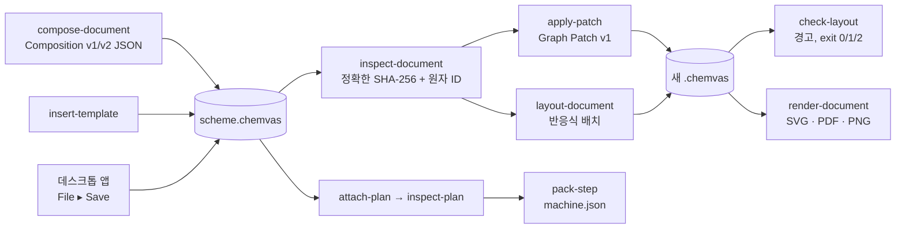

# Chemvas 에이전트 CLI

[English](AGENT_CLI.md)

Chemvas는 GUI 창을 띄우지 않고 문서 작업을 자동화하는 헤드리스 CLI를 제공합니다. 스크립트나 외부 도구는 명령줄에서 문서를 직접 검사, 생성, 패치 수정, 검증, 렌더링하고 계산 화학 입력 파일을 내보낼 수 있습니다.

## 명령 파이프라인



CLI 작업의 기본 동작 원칙:
- **비파괴적 파일 생성**: `--output` 경로를 지정하는 명령은 기존 입력을 수정하지 않고 항상 새 파일에 원자적으로 기록합니다.
- **순수 검사**: `inspect`, `inspect-document`, `inspect-plan`, `check-layout`은 파일 시스템을 변경하지 않고 구조화된 JSON 보고서만 출력합니다.

## 헤드리스 문서 구성 (Composition)

JSON 매니페스트로부터 다시 편집 가능한 유효한 `.chemvas` 문서를 생성합니다:

```bash
chemvas compose-document scheme.json --output scheme.chemvas
```

`images` 배열을 추가하면 PNG/JPEG 래스터 이미지를 캔버스 객체와 함께 내장할 수 있습니다 (경로는 매니페스트 파일 기준 상대 경로; [이미지 객체](IMAGE_OBJECTS.ko.md) 참고).

### 최소 구성 예시

```json
{
  "format": "chemvas-document-composition",
  "version": 1,
  "atoms": [
    {"id": 0, "element": "O", "x": 72.0, "y": 72.0,
     "explicit_label": true, "formal_charge": -1},
    {"id": 1, "element": "P", "x": 92.0, "y": 72.0,
     "formal_charge": 1}
  ],
  "bonds": [{"a": 0, "b": 1, "order": 1}],
  "notes": [
    {"text": "Condition", "x": 64.0, "y": 108.0,
     "style": {"font_size": 12, "font_weight": 700,
               "italic": false, "color": "#245caa"}}
  ]
}
```


- **원자 (Atoms)**: 0부터 시작하는 순차적인 정수 ID를 부여합니다. 선택 속성: `color`, `explicit_label`, `formal_charge`, `radical_electrons`.
- **결합 (Bonds)**: 원자 ID(`a`, `b`)와 차수(`order`), 스타일(`single`, `double`, `wedge`, `hash`), 선택적 색상(`color`)을 지정합니다.
- **노트 및 서식 런 (Runs)**: 일반 텍스트(`text`) 또는 개별 서식이 적용된 조각 배열(`runs`)을 사용합니다:

```json
{
  "x": 64, "y": 108, "style": {"font_size": 12},
  "runs": [
    {"text": "TS", "style": {"font_weight": 700, "italic": true}},
    {"text": "2", "style": {"vertical_align": "sub"}},
    {"text": "‡", "style": {"vertical_align": "super", "color": "#075CAD"}}
  ]
}
```

- **전이 상태 괄호 (TS Brackets)**: 괄호 종류와 캔버스 좌표 범위를 지정합니다:

```json
{"bracket_kind": "square_pair", "left": 40, "top": 40, "right": 160, "bottom": 120}
```

지원 종류: `square_pair`, `parentheses_pair`, `braces_pair`, `square_left`, `parenthesis_left`, `brace_left`, `dagger`, `double_dagger`.

## 레이아웃 진단 및 검사

캔버스 요소 간의 겹침 및 용지 경계 초과 여부를 사전 검사합니다:

```bash
chemvas check-layout scheme.chemvas > layout-report.json
```

주요 진단 경고 코드:
- `text-text-overlap`: 텍스트 노트, 원자 라벨, 화살표 라벨 간의 겹침.
- `text-arrow-overlap`: 텍스트와 반응 화살표 선의 충돌.
- `text-bond-overlap` / `atom-bond-overlap`: 텍스트나 원자 라벨이 분자 결합선과 겹침.
- `charge-bond-overlap`: 형식 전하 표시가 인접 결합선과 교차함.
- `outside-sheet`: 요소가 설정된 캔버스 용지 영역을 벗어남.

대규모 도식에서 용지 경계 초과 여부만 빠르게 검사하려면:

```bash
chemvas check-layout scheme.chemvas --sheet-only > sheet-report.json
```

종료 코드: `0` (정상 통과), `1` (경고 발견), `2` (입력 오류 또는 비정상 실패).

## 고리 템플릿 삽입

RDKit 없이 CLI를 통해 표준 고리 템플릿을 삽입합니다:

```bash
chemvas insert-template scheme.chemvas --request ring.json --dry-run
chemvas insert-template scheme.chemvas --request ring.json --output ring-added.chemvas
```

```json
{
  "format": "chemvas-template-insertion",
  "version": 1,
  "source_sha256": "<64 lowercase hexadecimal characters>",
  "ring_size": 6,
  "style": "benzene",
  "position": [200, 120],
  "anchor": {"kind": "free"}
}
```


지원 스타일: `regular` (고리 크기 3~12), `benzene`, `chair`, `chair_flip`, `boat`. 앵커 종류는 `free`(자유 배치), `atom`(특정 원자 부착), `bond`(결합 융합)를 지원합니다.

## 헤드리스 문서 렌더링

GUI 창을 실행하지 않고 터미널에서 고해상도 SVG, PDF, PNG를 바로 생성합니다:

```bash
chemvas render-document scheme.chemvas --output scheme.svg
chemvas render-document scheme.chemvas --output scheme.pdf --width-mm 174
chemvas render-document scheme.chemvas --output scheme.png --dpi 600
chemvas render-document scheme.chemvas --output journal.svg --width-mm 70 --max-height-mm 120
chemvas render-document scheme.chemvas --output readable.svg --width-mm 174 --min-font-pt 6
chemvas render-document scheme.chemvas --output scheme-transparent.png \
  --background transparent
```

- `--width-mm`: 논문 단 너비(1단 84 mm, 2단 174 mm 등)에 맞춰 전체 그림을 비율에 맞게 확대/축소 렌더링합니다.
- `--min-font-pt`: 출력 크기 축소 시 첨자를 포함한 텍스트가 지정한 pt 미만으로 작아지면 출력을 방지합니다.
- `--max-height-mm`: 허용된 세로 높이를 초과하는 그림 출력을 방지합니다.

## Graph Patch v1

문서 전체를 다시 작성하지 않고, 안정적인 원자 ID를 바탕으로 필요한 부분만 수정합니다:

```bash
chemvas inspect-document ring-added.chemvas > inspection.json
chemvas apply-patch ring-added.chemvas patch.json --dry-run
chemvas apply-patch ring-added.chemvas patch.json --output revised.chemvas
```

이중결합을 단일결합으로 줄이고 카보닐기(=O)를 추가하는 패치 예시:

```json
{
  "format": "chemvas-graph-patch",
  "version": 1,
  "source_sha256": "<64 lowercase hexadecimal characters>",
  "operations": [
    {"op": "update_bond", "a": 2, "b": 3,
     "changes": {"order": 1, "style": "single"}},
    {"op": "add_atom", "atom_id": 8, "element": "O",
     "x": 237.32050807568876, "y": 110.0, "color": "#000000", "explicit_label": true},
    {"op": "add_bond", "a": 2, "b": 8, "order": 1,
     "style": "single", "color": "#000000"},
    {"op": "update_bond", "a": 2, "b": 8,
     "changes": {"order": 2, "style": "double"}}
  ]
}
```


지원 연산: `add_atom`, `update_atom`, `move_atom`, `set_terminal_angle`, `add_bond`, `update_bond`, `remove_bond`.

### 패치 작성을 위한 원자 ID 조회

문서의 원자 ID와 SHA-256 해시를 빠르게 조회하는 스크립트:

```bash
python - <<'PY'
import hashlib, json
from pathlib import Path
data = Path("drawing.chemvas").read_bytes()
model = json.loads(data)["state"]["model"]
print(json.dumps({"source_sha256": hashlib.sha256(data).hexdigest(),
                  "atoms": model["atoms"], "bonds": model["bonds"]}, indent=2))
PY
```

원자 라벨을 변경하는 단일 연산:

```json
{"op":"update_atom", "atom_id":1, "changes":{"element":"O"}}
```

### 말단기 결합 각도 수정

말단 치환기의 결합 방향을 각도로 지정합니다:

```json
{"op":"set_terminal_angle", "pivot_id":6, "reference_id":2,
 "terminal_id":7, "angle_degrees":-120}
```

## 구조 정보 검사 (Inspect)

GUI 없이 분자의 연결 성분, 원자 목록, 전하 상태를 JSON으로 조회합니다:

```bash
chemvas inspect scheme.chemvas
```

## 계산 화학 상태 및 기본 반응 단계

계산 화학 연동 워크플로를 사용하려면 RDKit 백엔드를 설치하세요:

```bash
pip install "chemvas[rdkit]"
```

계산 계획을 확인하고 문서를 연결하는 것은 RDKit 없이도 가능하지만, 3D 좌표 생성과 원자 맵 검증을 수행하는 `pack-step` 명령에는 RDKit이 필요합니다.

```bash
chemvas attach-plan scheme.chemvas plan.json --output mechanism.chemvas
chemvas inspect-plan mechanism.chemvas
chemvas pack-step mechanism.chemvas --step S01 --output calculations/machine.json
```

### 계산 계획 스키마 (v2)

반응물, 생성물 및 반응 단계별 대응 원자를 정의합니다:

```json
{
  "format": "chemvas-calculation-plan",
  "version": 2,
  "states": [
    {"id": "R01", "charge": 0, "multiplicity": 1,
     "members": [
       {"component_atom_ids": [0, 1], "inclusion": "included"},
       {"component_atom_ids": [9], "inclusion": "context_only"}]},
    {"id": "P01", "charge": 0, "multiplicity": 1,
     "members": [{"component_atom_ids": [2, 3], "inclusion": "included"}]}
  ],
  "steps": [{
    "id": "S01",
    "reactant": {"state_id": "R01", "roles": [
      {"component_atom_ids": [0, 1], "role": "reactant"},
      {"component_atom_ids": [9], "role": "spectator"}],
      "precomplex": {"kind": "none"}},
    "product": {"state_id": "P01", "roles": [
      {"component_atom_ids": [2, 3], "role": "product"}],
      "precomplex": {"kind": "none"}},
    "atom_correspondence": [
      {"reactant_atom_id": 0, "product_atom_id": 2},
      {"reactant_atom_id": 1, "product_atom_id": 3}]
  }]
}
```

`pack-step`은 `chemistry/elementary-step` v2 규격을 준수하는 표준 `machine.json` 파일을 원자적으로 생성하여, 하류 양자 화학 계산 도구가 즉시 사용할 수 있는 3D 좌표와 원자 대응 정보를 제공합니다.
