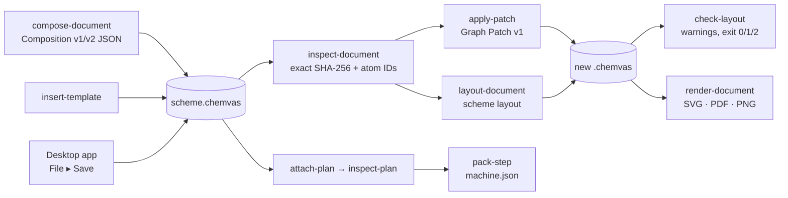

# Chemvas agent CLI

[한국어](AGENT_CLI.ko.md)

Chemvas provides a headless CLI for automating document operations without launching a graphical Qt window. Automation scripts and external tools can programmatically inspect, compose, patch, validate, render, and export calculation inputs.

## Command Workflow



All CLI operations enforce explicit validation contracts:
- **Non-destructive**: Commands taking an `--output` path write atomically to a new destination without modifying input files.
- **Pure Inspection**: `inspect`, `inspect-document`, `inspect-plan`, and `check-layout` output structured JSON reports without writing any files to disk.

## Headless document composition

Generate valid, editable `.chemvas` documents from structured JSON manifests:

```bash
chemvas compose-document scheme.json --output scheme.chemvas
```

The optional `images` array embeds PNG/JPEG rasters alongside native canvas objects. Paths are relative to the manifest file (see [Image Objects](IMAGE_OBJECTS.md)).

### Minimal Composition Example

```json
{
  "format": "chemvas-document-composition",
  "version": 1,
  "atoms": [
    {"id": 0, "element": "O", "x": 72.0, "y": 72.0,
     "explicit_label": true, "formal_charge": -1},
    {"id": 1, "element": "P", "x": 92.0, "y": 72.0,
     "formal_charge": 1}
  ],
  "bonds": [{"a": 0, "b": 1, "order": 1}],
  "notes": [
    {"text": "Condition", "x": 64.0, "y": 108.0,
     "style": {"font_size": 12, "font_weight": 700,
               "italic": false, "color": "#245caa"}}
  ]
}
```


- **Atoms**: IDs must be sequential starting from 0. Optional fields: `color`, `explicit_label`, `formal_charge`, `radical_electrons`.
- **Bonds**: Specifies connections between atom IDs (`a`, `b`) with `order` (1, 2, 3), `style` (`single`, `double`, `wedge`, `hash`), and optional `color`.
- **Notes & Runs**: Notes accept either plain `text` or rich-text `runs`:

```json
{
  "x": 64, "y": 108, "style": {"font_size": 12},
  "runs": [
    {"text": "TS", "style": {"font_weight": 700, "italic": true}},
    {"text": "2", "style": {"vertical_align": "sub"}},
    {"text": "‡", "style": {"vertical_align": "super", "color": "#075CAD"}}
  ]
}
```

- **Transition State Brackets**: Specify bracket kind and bounding coordinates:

```json
{"bracket_kind": "square_pair", "left": 40, "top": 40, "right": 160, "bottom": 120}
```

Supported kinds: `square_pair`, `parentheses_pair`, `braces_pair`, `square_left`, `parenthesis_left`, `brace_left`, `dagger`, and `double_dagger`.

## Headless layout diagnostics

Validate layout geometry, boundary containment, and overlapping elements:

```bash
chemvas check-layout scheme.chemvas > layout-report.json
```

Common diagnostic codes reported:
- `text-text-overlap`: Overlapping text notes, atom labels, or arrow labels.
- `text-arrow-overlap`: Text colliding with reaction arrow strokes.
- `text-bond-overlap` / `atom-bond-overlap`: Text or atom labels colliding with molecular bonds.
- `charge-bond-overlap`: Formal charge marks intersecting adjacent bonds.
- `outside-sheet`: Canvas elements extending beyond page boundaries.

For quick sheet boundary checks on complex schemes:

```bash
chemvas check-layout scheme.chemvas --sheet-only > sheet-report.json
```

Exit codes: `0` (clean), `1` (warnings detected), `2` (invalid document or error).

## Native ring templates

Insert standardized ring templates via CLI without requiring RDKit:

```bash
chemvas insert-template scheme.chemvas --request ring.json --dry-run
chemvas insert-template scheme.chemvas --request ring.json --output ring-added.chemvas
```

```json
{
  "format": "chemvas-template-insertion",
  "version": 1,
  "source_sha256": "<64 lowercase hexadecimal characters>",
  "ring_size": 6,
  "style": "benzene",
  "position": [200, 120],
  "anchor": {"kind": "free"}
}
```


Supported styles: `regular` (sizes 3–12), `benzene`, `chair`, `chair_flip`, and `boat`. Anchors can be `free`, bound to an `atom`, or fused onto a `bond`.

## Headless document rendering

Render publication-ready figures directly to SVG, PDF, or PNG without launching the desktop GUI:

```bash
chemvas render-document scheme.chemvas --output scheme.svg
chemvas render-document scheme.chemvas --output scheme.pdf --width-mm 174
chemvas render-document scheme.chemvas --output scheme.png --dpi 600
chemvas render-document scheme.chemvas --output journal.svg --width-mm 70 --max-height-mm 120
chemvas render-document scheme.chemvas --output readable.svg --width-mm 174 --min-font-pt 6
chemvas render-document scheme.chemvas --output scheme-transparent.png \
  --background transparent
```

- `--width-mm`: Scales the figure to fit specific column widths (e.g., 84 mm for single column, 174 mm for double column).
- `--min-font-pt`: Ensures rendered font sizes (including subscripts) remain readable.
- `--max-height-mm`: Rejects figures exceeding vertical layout limits.

## Graph Patch v1

Inspect stable atom IDs and apply targeted graph mutations without rewriting the entire document:

```bash
chemvas inspect-document ring-added.chemvas > inspection.json
chemvas apply-patch ring-added.chemvas patch.json --dry-run
chemvas apply-patch ring-added.chemvas patch.json --output revised.chemvas
```

Example patch reducing a double bond and adding a carbonyl group:

```json
{
  "format": "chemvas-graph-patch",
  "version": 1,
  "source_sha256": "<64 lowercase hexadecimal characters>",
  "operations": [
    {"op": "update_bond", "a": 2, "b": 3,
     "changes": {"order": 1, "style": "single"}},
    {"op": "add_atom", "atom_id": 8, "element": "O",
     "x": 237.32050807568876, "y": 110.0, "color": "#000000", "explicit_label": true},
    {"op": "add_bond", "a": 2, "b": 8, "order": 1,
     "style": "single", "color": "#000000"},
    {"op": "update_bond", "a": 2, "b": 8,
     "changes": {"order": 2, "style": "double"}}
  ]
}
```


Supported operations: `add_atom`, `update_atom`, `move_atom`, `set_terminal_angle`, `add_bond`, `update_bond`, `remove_bond`.

### Inspecting IDs for Patching

To extract atom IDs and compute SHA-256 for a patch request:

```bash
python - <<'PY'
import hashlib, json
from pathlib import Path
data = Path("drawing.chemvas").read_bytes()
model = json.loads(data)["state"]["model"]
print(json.dumps({"source_sha256": hashlib.sha256(data).hexdigest(),
                  "atoms": model["atoms"], "bonds": model["bonds"]}, indent=2))
PY
```

Example operation to update an atom label:

```json
{"op":"update_atom", "atom_id":1, "changes":{"element":"O"}}
```

### Adjusting Terminal Angles

Adjust terminal substituent orientation programmatically:

```json
{"op":"set_terminal_angle", "pivot_id":6, "reference_id":2,
 "terminal_id":7, "angle_degrees":-120}
```

## Structure inspection

Inspect chemical components, atom inventories, and formal charges:

```bash
chemvas inspect scheme.chemvas
```

## Calculation states and elementary steps

Install the optional RDKit backend to enable calculation workflow support:

```bash
pip install "chemvas[rdkit]"
```

While inspecting and attaching plans do not require RDKit, the `pack-step` command requires it to generate 3D coordinates and validate atom mappings.

```bash
chemvas attach-plan scheme.chemvas plan.json --output mechanism.chemvas
chemvas inspect-plan mechanism.chemvas
chemvas pack-step mechanism.chemvas --step S01 --output calculations/machine.json
```

### Desktop pair preparation

The desktop entry point is **Calculation → Reaction Pair Panel**. Choose
reactant and product components and set charge and multiplicity in the right
panel. On the Mapping tab, enable **Map atoms on canvas**, then click a reactant
atom followed by its matching product atom in the existing drawing. Matching
colors/numbers identify pairs and orange bonds indicate changes. Escape exits
mapping mode and resumes the existing drawing tool; no separate mapping window
opens. **Next unmapped atom** centers the canvas on an unmatched reactant atom.
The optional mapping table supports exact selection and clearing. IDs and
component roles are behind **Show IDs and component roles**.

**Check and export** runs the same `pack-step` builder in a cancellable subprocess.
Source mapping completeness, expanded-hydrogen/alias validation and researcher
confirmation are separate steps. Editing the pair invalidates the check and
confirmation. Drawing edits and document switches disable the old snapshot;
**Load drawing / discard panel draft** reloads the current drawing and its saved
plan. Save draft commits the plan through the document's undo history;
export alone writes a snapshot and does not change the source document.

Export creates a **new folder**, refusing to replace an existing destination. It
contains `source.chemvas` (the exact checked snapshot), `machine.json`, XYZ files
and a short README. A single component per side uses canonical path atom order
in `reactant.xyz` and `product.xyz`. Multiple components are exported separately;
their rows follow each component's `atom_indices` in `machine.json`. They have no
relative placement. These are inputs for external NEB preparation, not optimized
NEB endpoints: placement, quantum optimization and scientific review remain
external. Chemvas does not run NEB or infer spin states.

Precomplex support is removed. Calculation Plan v2 still requires its historical
`precomplex` field for durable document compatibility; new endpoints use
`{"kind":"none"}`. Historical ensembles are opaque archives, never calculation
inputs. Unchanged saves preserve them; editing an affected pair clears them.
Stored multi-step plans remain readable and individual pairs can be edited.

### Calculation Plan Schema (v2)

Define reaction states and elementary steps with mapped atoms:

```json
{
  "format": "chemvas-calculation-plan",
  "version": 2,
  "states": [
    {"id": "R01", "charge": 0, "multiplicity": 1,
     "members": [
       {"component_atom_ids": [0, 1], "inclusion": "included"},
       {"component_atom_ids": [9], "inclusion": "context_only"}]},
    {"id": "P01", "charge": 0, "multiplicity": 1,
     "members": [{"component_atom_ids": [2, 3], "inclusion": "included"}]}
  ],
  "steps": [{
    "id": "S01",
    "reactant": {"state_id": "R01", "roles": [
      {"component_atom_ids": [0, 1], "role": "reactant"},
      {"component_atom_ids": [9], "role": "spectator"}],
      "precomplex": {"kind": "none"}},
    "product": {"state_id": "P01", "roles": [
      {"component_atom_ids": [2, 3], "role": "product"}],
      "precomplex": {"kind": "none"}},
    "atom_correspondence": [
      {"reactant_atom_id": 0, "product_atom_id": 2},
      {"reactant_atom_id": 1, "product_atom_id": 3}]
  }]
}
```

`pack-step` generates a standardized `machine.json` file conforming to the `chemistry/elementary-step` v2 schema, containing validated 3D geometries, formal charges, atom correspondence tables, and reaction centers ready for downstream quantum chemistry workflows.
