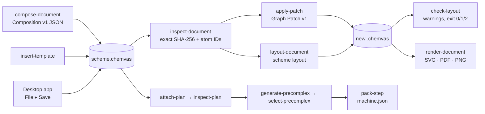
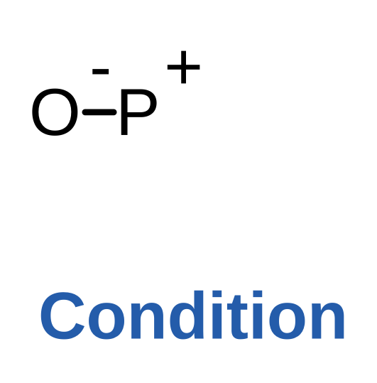
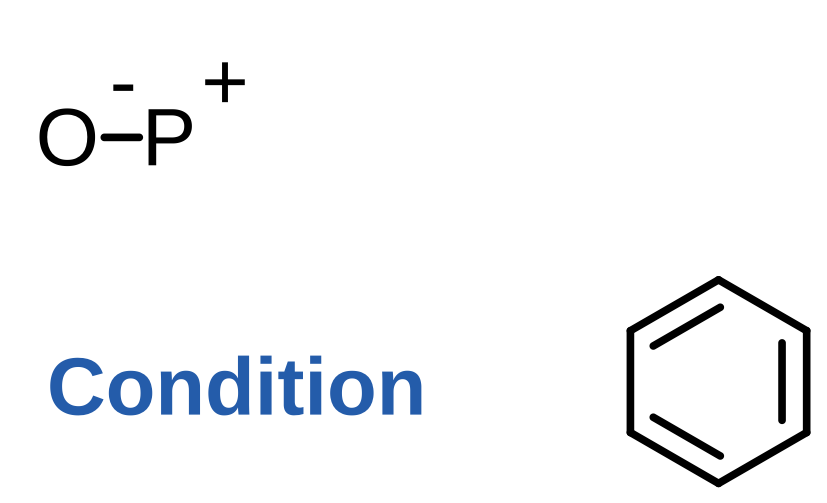
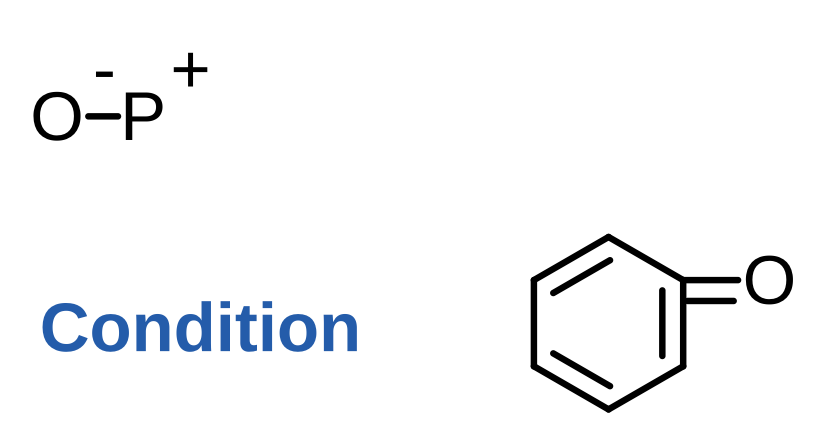

# Chemvas agent CLI

[한국어](AGENT_CLI.ko.md)

Chemvas exposes its document operations as headless commands, so an agent (or
any script) can render, inspect, edit, and hand off calculations without
starting a Qt window. Each command below documents its own guarantees; the
common theme is narrow contracts that fail closed instead of guessing.
User-facing detail (GUI, file format, shortcuts) is in
[REFERENCE.md](REFERENCE.md).

## How the commands fit together



Every command reads the exact source bytes and validates before it needs Qt
where it can. Commands that take an output path (`compose-document`,
`insert-template`, `apply-patch`, `layout-document`, `render-document`,
`attach-plan`, `generate-precomplex`, `select-precomplex`, `pack-step`)
publish one new file atomically and never edit their input; `inspect`,
`inspect-document`, `inspect-plan`, `inspect-precomplex`, `check-layout` and
every `--dry-run` only print a JSON report and write nothing.
The figures below are the documented examples rendered with `render-document`.
On POSIX, new atomically published files are private to their owner (mode 0600).
Grant wider read access explicitly when sharing; Chemvas does not infer a public
sharing policy from the directory. Root CLI typos fail before desktop startup.

## Headless document composition

An agent can create a canonical, reopenable Chemvas v7 document from the smaller
public Composition v1 contract instead of constructing internal document state:

```bash
chemvas compose-document scheme.json --output scheme.chemvas
```

The optional `images` array embeds PNG/JPEG files alongside native scene objects.
Paths are relative to the composition JSON file. See [image objects](IMAGE_OBJECTS.md)
for exact fields, pixel preservation, GUI editing and resource limits.

A minimal composition is:

```json
{
  "format": "chemvas-document-composition",
  "version": 1,
  "atoms": [
    {"id": 0, "element": "O", "x": 72.0, "y": 72.0,
     "explicit_label": true, "formal_charge": -1},
    {"id": 1, "element": "P", "x": 92.0, "y": 72.0,
     "formal_charge": 1}
  ],
  "bonds": [{"a": 0, "b": 1, "order": 1}],
  "notes": [
    {"text": "Condition", "x": 64.0, "y": 108.0,
     "style": {"font_size": 12, "font_weight": 700,
               "italic": false, "color": "#245caa"}}
  ]
}
```



Atom IDs must be contiguous and ordered from zero. Optional atom fields are
`color`, `explicit_label`, `formal_charge`, and `radical_electrons`; Chemvas
derives linked visual charge/radical marks from those annotations and rejects a
candidate whose electronic semantics are inconsistent. Bonds accept the normal
Chemvas order/style/color contract. The manifest can also contain bounded
`notes`, `arrows`, `shapes`, `ring_fills`, `ts_brackets`, and documented canvas `settings`.
Canvas settings start from the live A4 landscape defaults; the global text size
is limited to the same 6–96 pt range as interactive note editing. Structured
note style accepts only `font_size` (6–96 pt), `font_weight`
(100–900 in steps of 100), `italic`, hexadecimal `color`, and `vertical_align`
(`baseline`, `sub`, or `super`). Text is escaped and converted to safe canonical
HTML by Chemvas rather than accepting arbitrary HTML.

For mixed typography, give a note exactly one of `text` or `runs`. A non-empty
`runs` array contains at most 256 objects with `text` and optional `style`:

```json
{
  "x": 64, "y": 108, "style": {"font_size": 12},
  "runs": [
    {"text": "TS", "style": {"font_weight": 700, "italic": true}},
    {"text": "2", "style": {"vertical_align": "sub"}},
    {"text": "‡", "style": {"vertical_align": "super", "color": "#075CAD"}}
  ]
}
```

The note-level style supplies defaults; individual run styles override them.
Plain text is derived by concatenating the runs, not supplied a second time.
Spaces and line breaks between runs are preserved through the native note HTML
path. Neither a note nor a run accepts an `html` field.

Arrows require `kind`, `start`, and `end`; optional fields are `control`, `double`,
`labels`, and hexadecimal `color`. Omit `color` for the normal default pen. For
`curved_single` and `curved_double`, an omitted `double` flag is derived from
`kind`; an explicit contradictory flag is rejected. An explicit `control`
sets the curve's control point; omission keeps the native default curve.
Only curved arrows accept `control`; other kinds reject it rather than discard it
on desktop Save. Composition and Graph Patch trim surrounding element whitespace.
Per-arrow color is stored in the native document and selection clipboard.
Older Chemvas releases without this field cannot read documents that contain it;
existing documents without arrow colors remain supported.

TS decorations use the existing native bracket objects, not separate line
segments. Each `ts_brackets` entry has exactly `bracket_kind`, `left`, `top`,
`right`, and `bottom`:

```json
{"bracket_kind": "square_pair", "left": 40, "top": 40, "right": 160, "bottom": 120}
```

Supported kinds are `square_pair`, `parentheses_pair`, `braces_pair`,
`square_left`, `parenthesis_left`, `brace_left`, `dagger`, and `double_dagger`.
Add a separate `double_dagger` decoration for a transition-state symbol beside
a bracket pair. The array is bounded to 4,096 objects, like the other scene arrays.

Arrow labels are optional. For a labelled arrow, use a non-empty mapping such as
`"labels": {"above": "THF"}`; the only sides are `above` and `below`, with at most
200 characters per non-blank value. Omit unused sides instead of supplying empty
strings, and omit `labels` entirely for an unlabelled arrow. Invalid composition
labels report the zero-based arrow index and label field before any output is
published.

The command rejects duplicate JSON keys, non-finite numbers, unknown keys,
invalid graph references, unsupported styles, and inputs larger than 1 MiB. It
builds and validates the complete candidate in memory, refuses an existing or
symlink output, and publishes one new canonical file atomically. Standard output
is a deterministic JSON report with the output SHA-256, document version, and
atom/bond counts. Existing source drawings are not inputs to this command and
are never modified.

### Authoring fields and limits

All numbers must be finite; booleans are not numbers. Arrays may be omitted when
optional, but do not use JSON `null` in place of a list/object. Coordinates are
canvas units, not pixels of a rendered image. Composition limits are 4,096 atoms,
8,192 bonds and 4,096 entries each for notes, arrows, shapes, ring fills and TS
brackets (images have the separate limits above).

`settings` accepts any subset of these fields; other keys are errors:

| Fields | Accepted value |
| --- | --- |
| `bond_length_px` | Positive, at most 1,073,741,823 (Qt glyph-size bound); ordinary drawings use about 20 |
| `arrow_line_width`, `arrow_head_scale` | At least 0.5; 0.1–0.8 respectively |
| `text_font_size`, `text_font_weight` | Integer 6–96; integer 1–1000 respectively |
| `text_font_family`, `text_color` | Nonempty UTF-8 string; `#RRGGBB` |
| `text_alignment`, `text_line_spacing` | `left`, `center`, `right`, `justify`; at least 0.8 |
| `text_italic`, `orbital_phase_enabled`, `note_box_enabled`, `note_border_enabled` | Boolean |
| `note_box_color`, `note_border_color` | `#RRGGBB` |
| `note_box_alpha`, `note_border_width`, `note_padding` | 0–1; at least 0.5; at least 2 respectively |
| `sheet_size`, `sheet_orientation` | `A4`; `landscape` or `portrait` |

Native v7 files retain their broader saved-font range (6–2,147,483,647); that is a
serialization limit, not a usable drawing size. Native mark text is null or at
most 200 characters. Invalid Unicode, missing/unknown fields and out-of-range
settings fail shared validation before canvas restoration.

Native v7 and selection-clipboard v2 marks accept an optional `color` in `#RGB`
or `#RRGGBB` form. This applies independently to each `plus`, `minus`,
`circled_plus`, `circled_minus` and `radical`, whether bound to an atom or free.
Omitting it uses the document's default mark color, not the bound atom's color.
Explicit colors persist in native documents, clipboard selections and editable
SVG; they do not change formal charge, radical electrons or the precomplex
review basis. Unknown fields and invalid colors are rejected. The format
versions remain unchanged, but older releases without this field reject marks
that contain it; documents without mark colors remain supported. Graph Patch
does not gain a mark-color editing operation.

In native documents, a bound mark's `atom_id` and entries in ring-fill `atom_ids`
must be JSON integers, not quoted numbers. Decimal-string object keys in
`model.atoms`, `model.atom_annotations`, and `perspective.atom_coords_3d` remain
supported; those map keys are distinct from atom-ID values.

Shapes require `shape_kind` (`circle`, `ellipse`, `rounded_rect`, `rect`),
`left`, `top`, `right`, `bottom`, and `stroke_style` (`solid`, `dashed`,
`dotted`, `none`); optional `fill` is `#RRGGBB` and `fill_alpha` is 0–1.
Ring fills require `atom_ids` (at least three distinct existing atoms in cycle
order), `color` (`#RRGGBB`) and `alpha` (0–1); the referenced cycle must exist.

The `arrows[].kind` values are `arrow`, `equilibrium`,
`equilibrium_forward`, `equilibrium_reverse`, `resonance`, `curved_single`,
`curved_double`, `inhibit`, `dotted`, `line`, `line_dashed`, `line_wavy`,
`line_bold`, and `arc_90_left/right`, `arc_180_left/right`,
`arc_270_left/right` (each slash denotes two separate names).
Native v7 and selection-clipboard v2 equilibrium arrows (`equilibrium`,
`equilibrium_forward`, `equilibrium_reverse`) also accept an optional Boolean
`mirrored`. It records reflected harpoon geometry; omission means `false`, and
normal canvas serialization omits false values. Other arrow kinds reject the
field. Format versions are unchanged: existing documents still load, while older
readers without this field reject documents containing it. Editable SVG retains
the field in its embedded document. This does not add a `mirrored` field to
`compose-document` requests.
Labels are single-line, use the [small label grammar](REFERENCE.md), and are
not separate scene notes. `inspect-document` reports selected dependency counts
(ring fills, attached marks, groups), not note or arrow-label counts.
Initial charge-mark placement avoids incident bond directions heuristically;
run `check-layout` and make local adjustments for crowded drawings.

## Headless layout diagnostics

An agent can restore a document into the real offscreen canvas and request
read-only layout warnings:

```bash
chemvas check-layout scheme.chemvas > layout-report.json
```

The current v1 checker reports these stable warning codes:

- `text-text-overlap` for intersecting visible note, atom-label or attached
  arrow-label glyph paths;
- `text-arrow-overlap` for attached arrow-label ink crossing its own or another
  arrow's painted stroke;
- `text-bond-overlap` for attached arrow-label ink crossing a molecular bond;
- `atom-bond-overlap` for an atom-label glyph crossing a nonincident molecular
  bond's painted stroke (bonds attached to that atom are excluded);
- `charge-bond-overlap` for an attached charge glyph crossing a painted bond,
  including a bond attached to the charge's own atom;
- `arrow-structure-overlap` when painted arrow geometry crosses an atom label
  or a painted molecular bond;
- `text-shape-border-overlap` when note or attached arrow-label text crosses a
  painted shape border;
- `outside-sheet` when supported visible native content extends beyond the
  sheet, including molecular structures, arrow strokes and labels, notes,
  shapes, marks, ring fills, orbitals and TS brackets.

The report includes the exact source SHA-256, document version, deterministic
warning counts, persisted note/shape/arrow indices, stable atom IDs (bond endpoints
for bond references), and rounded intersection bounds. Attached label witnesses
use `kind: "arrow-label"`, the parent arrow's `index`, and `side: "above"` or
`"below"`. The `coverage` object lists checked and unchecked classes: `ok: true`
means no warnings in those checked classes, not a semantic or visual-design pass.
The checker does not move objects, write history, normalize, or save the source.
Before starting Qt it conservatively rejects a document whose potential
text-pair, atom–bond, attached-charge–bond, note–shape, arrow–structure,
attached-label–bond/arrow/shape and geometry work exceeds 10,000 units, so the
complete deterministic warning report remains bounded.
Exit status is `0` for a valid clean document, `1` for a valid document with one
or more warnings, and `2` for invalid input or bootstrap/resource failure. It is
a diagnostic gate, not an automatic layout engine. Charge witnesses include the
persisted mark index and attached atom ID; bond witnesses use sorted endpoint
IDs. Hidden/transparent ink and actual dash/dot gaps are not collisions.
Bond-to-own-atom label contact and
filled highlight interiors are not collision pairs. Intentional arrow-to-structure
contacts may still warn: inspect the reported intersection rather than treating
every warning as an error in the chemistry. The checker does not cover every
possible overlap (for example, note–arrow, atom–shape, or TS-bracket collisions),
even though their sheet containment is checked. Sheet checks use native visible
text/export bounds and painted geometry, not only atom centers or interaction
hit regions. Text-box margins and stroke extents can matter at the edge.
Atom-label coverage follows
the fonts produced by native document restore; underline/strikeout decorations
injected directly into Qt atom items are not persisted and are outside this
contract. The work limit bounds record and candidate-pair counts, not arbitrary
font/glyph complexity. Visual review is still required.

For a large drawing that exceeds the pairwise collision-work limit, request only
the linear sheet-containment check:

```bash
chemvas check-layout scheme.chemvas --sheet-only > sheet-report.json
```

The shared document-size and graphics-record limits still apply. This mode's
counts contain only `outside-sheet`, and its `coverage` explicitly states that
collisions were not checked. Exit `0` therefore means only that sheet containment
passed. Exit `1` means a boundary warning and exit `2` means the check did not
complete successfully. Do not treat a work-limit refusal as a clean report or
silently discard `outside-sheet` warnings.

Before delivering an editable drawing, require a clean sheet-containment result
for the **exact saved `.chemvas` bytes**. Bind the report's `source_sha256` to the
file and retain the report; then check collisions within the documented scope,
render at the intended physical size and inspect the native drawing in the GUI.
An export's width, height or minimum-font guard does not resize the stored
coordinates or certify that they fit the native working sheet. These diagnostics
do not alter ordinary Save/Open, automatically shrink content, or reorganize a
reaction path.

## Explicit scheme layout

Use `layout-document` to arrange whole structure blocks, center caption notes,
align caption baselines and preserve native GUI groups in a new document.
Explicit `column_group` names limit column sharing to related comparison rows;
`caption_alignment: "structure"` places captions close to their own blocks.
Optional `arrow_color` recolors only listed reaction arrows and their labels.
Otherwise geometry and style defaults remain unchanged. Assign caption notes,
attached notes and existing arrow conditions explicitly; do not scatter free
notes around a narrow template to avoid overlaps.
Choose `"mode": "align-y"` to align only molecular drawings vertically while
keeping all X coordinates, captions and existing groups fixed. Explicit `parts`
can align independent fragments separately; omission keeps complexes rigid.
See [structure and caption layout](SCHEME_LAYOUT.md) for the source-pinned
request format, examples and limits.

## Native ring templates

Insert the same ring templates used by the desktop, without RDKit:

```bash
chemvas insert-template scheme.chemvas --request ring.json --dry-run
chemvas insert-template scheme.chemvas --request ring.json --output ring-added.chemvas
```

```json
{
  "format": "chemvas-template-insertion",
  "version": 1,
  "source_sha256": "<64 lowercase hexadecimal characters>",
  "ring_size": 6,
  "style": "benzene",
  "position": [200, 120],
  "anchor": {"kind": "free"}
}
```


All root fields are required. `regular` supports ring sizes 3–12; `benzene`,
`chair`, `chair_flip`, and `boat` require size 6. Position is the native template
placement point, not a promise that it is the ring's centroid. Atom anchoring uses
`{"kind":"atom","atom_id":0}`; bond anchoring uses
`{"kind":"bond","a":0,"b":1}` with unordered existing endpoints. Existing
native geometry and occupancy rules determine placement. Chair/boat atom anchors,
anchors in groups, and anchors incident to wedge/hash bonds are rejected.
Explicit choice of a chair or boat is a drawing choice, not inferred stereochemistry.

The CLI intentionally has a narrower bond-anchor boundary than interactive desktop
fusion. Accepted anchor bond styles are `single`, `double`, `double_center`, and
`double_outer`. `regular` and `benzene` permit bond orders 1 or 2; `chair`,
`chair_flip`, and `boat` require order 1. Bold styles, dotted/contact styles, and
triple bonds are rejected. A wedge/hash anchor, or any anchor touching a wedge/hash
bond, receives a specific stereo diagnostic. Reusing the desktop's template
geometry does not mean that every interactive fusion target is accepted by the CLI.

The command pins exact source bytes, validates before Qt, invokes the native
template planner and commit on a private canvas, and preserves source coordinates,
existing graph/annotations, notes, settings, groups and ring metadata. It retains
the native insertion reset of `last_smiles_input`. Insertion never recalculates
an existing bond length or normalizes a distorted source ring. Benzene ring
membership is retained so the renderer can put double-bond strokes inside the ring.
Calculation Plan and perspective documents are rejected without deleting their data.

Limits: request 64 KiB, source/candidate 96 MiB, 20,000 graphics records with a
conservative insertion reservation, finite coordinates within ±1,000,000 and
a positive bond metric at most 1,000,000. Duplicate/unknown keys, stale hashes,
invalid topology, partial native mutation and unsafe anchors produce no output.
Dry-run constructs and validates the same candidate as a write. The deterministic
report includes source/request/candidate hashes and `added_atom_ids`. Existing
or symlink outputs are refused and a new output is published atomically.

For a complete public-command example with bent O–Me bonds, real scripts and a
common print scale, see [publication schemes](PUBLICATION_SCHEMES.md).

## Headless document rendering

An agent can render the complete drawing through the same figure-export path as
the desktop app without opening a window or loading RDKit:

```bash
chemvas render-document scheme.chemvas --output scheme.svg
chemvas render-document scheme.chemvas --output scheme.pdf --width-mm 174
chemvas render-document scheme.chemvas --output scheme.png --dpi 600
chemvas render-document scheme.chemvas --output journal.svg --width-mm 70 --max-height-mm 120
chemvas render-document scheme.chemvas --output readable.svg --width-mm 174 --min-font-pt 6
chemvas render-document scheme.chemvas --output scheme-transparent.png \
  --background transparent
```

The output suffix selects SVG, PDF, or PNG. PDF uses the same native vector
exporter as the desktop app and produces one page from one document. White is
the default background. PNG/PDF DPI may be 150, 300, 600, or 1200; for PDF it
sets the paint-device resolution while paths remain vectors. SVG ignores DPI.
The command starts only an invisible offscreen Qt canvas, does not start session
recovery, and leaves the source untouched. It refuses existing files, directories,
and symlinks and publishes the new output atomically.

Omitting `--width-mm` retains preset bond-length sizing. A positive finite width
requests the padded figure width through the same physical-size planner as GUI
export, preserving aspect ratio. Both rounded dimensions must be at least one
native output unit: one point for SVG/PDF, one pixel at the requested DPI for
PNG/TIFF. Smaller dimensions are rejected, not silently clamped; this is a format
representability bound, not a publication-size recommendation.
PNG dimensions round to pixels at the chosen
DPI; Qt's SVG physical viewport rounds to whole points while its viewBox and the
report retain the planned fractional point dimensions. PDF pages round to whole
points through Qt; their report uses the actual page dimensions. Optional
`--max-height-mm` rejects a taller output before painting, including SVG viewport,
PDF page, or PNG pixel rounding; it never shrinks the figure to fit. These size options do not reflow a drawing, so arrange the content
before choosing its final print size.

Optional `--min-font-pt` applies to SVG and PNG and supplies a positive finite
minimum for final printed glyph sizes. PDF with this option is rejected before
rendering. It checks the fonts used by native output, including small subscript
and superscript glyphs, against the output scale and rejects undersized output
before publication. It does not change fonts or source geometry. For example,
6 pt is a user-selected threshold, not a built-in journal standard. Omit this
option to keep the existing render path without font analysis. See
[scheme layout](SCHEME_LAYOUT.md) for width-limited row wrapping.

The optional `font_readability` report gives the minimum resolved font em size
in points, a witness item reference and coverage by text kind. It covers visible
atom labels, notes, arrow labels, text charge marks and native TS dagger glyphs;
non-font strokes, hidden/transparent text and whitespace are excluded. Em size
is the font size, not the height of the glyph's ink. Physical SVG viewport and
PNG pixel rounding are included. No visible text is reported separately rather
than assigned a fictitious minimum. Missing glyphs, missing font provenance and
unsupported text transforms cause an explicit measurement error when the guard
is enabled. Passing it does not certify contrast, spacing or publication quality.
Notes and arrow labels share the native Qt rich-text outline path in exported
figures, preserving the canvas glyph sizes, mixed point/pixel runs and scripts.
Qt-generated numbered-list markers retain text in SVG, with resolved pixel fonts
from that same native layout. The check uses those construction fonts for both
SVG and PNG, and identifies note witnesses by source-note index. Source HTML,
fonts and editability in Chemvas are unchanged. Plain SVG note bodies are paths,
not editable SVG text; editable Chemvas SVG retains the embedded document.
The check runs before atomic publication and may render privately before
rejecting an output.
PNG point sizes use the requested DPI and rounded pixel dimensions, not the tiny
integer pixels-per-metre rounding difference in PNG resolution metadata.
SVG viewport and PNG pixel rounding can produce a small difference in final
physical scale, but note glyph construction no longer differs by output format.

Standard output is a JSON report containing the exact source and output SHA-256
hashes, document version, output byte count, physical point size, and PNG pixel
dimensions. SVG and PDF report null pixel dimensions; PDF reports its requested
DPI. Repeated SVG/PNG renders and their report values are byte-identical within
the same Chemvas/Qt/font environment, apart from the supplied output path. PDF
metadata includes Qt-generated identifiers and timestamps, so repeated PDF bytes
and output hashes may differ. Qt or font changes can also alter path geometry
or encoded bytes; consumers should use the reported hash rather than assume
cross-platform byte identity. Rendering is fail-closed at 96 MiB of source data,
20,000 graphics records, 64 MiB of output, 14,400 points per side, and—for
PNG—10,000 pixels per side or 25 million total pixels.

## Graph Patch v1

An agent can inspect every stable atom ID and then propose a bounded Graph Patch
without starting Qt or rewriting the whole `.chemvas` document:

```bash
chemvas inspect-document ring-added.chemvas > inspection.json
chemvas apply-patch ring-added.chemvas patch.json --dry-run
chemvas apply-patch ring-added.chemvas patch.json --output revised.chemvas
```

`inspect-document` reports the exact source-file SHA-256, document version,
`next_atom_id`, complete atom/bond inventory, effective charge/radical annotations,
connected components, and dependent scene-state counts. The agent copies that exact
hash into a Graph Patch v1 precondition. This example continues from the minimal
composition and free benzene insertion above: atoms 2–7 are the ring and
`next_atom_id` is 8. On any other input, inspect its IDs and coordinates first:

```json
{
  "format": "chemvas-graph-patch",
  "version": 1,
  "source_sha256": "<64 lowercase hexadecimal characters>",
  "operations": [
    {"op": "update_bond", "a": 2, "b": 3,
     "changes": {"order": 1, "style": "single"}},
    {"op": "add_atom", "atom_id": 8, "element": "O",
     "x": 237.32050807568876, "y": 110.0, "color": "#000000", "explicit_label": true},
    {"op": "add_bond", "a": 2, "b": 8, "order": 1,
     "style": "single", "color": "#000000"},
    {"op": "update_bond", "a": 2, "b": 8,
     "changes": {"order": 2, "style": "double"}}
  ]
}
```

This drawing-edit example first reduces the adjacent ring double bond, then
adds C=O without giving carbon five bond orders. It is not a proposed reaction.
Before and after:





Supported operations are `add_atom`, `update_atom` (element/color/explicit label),
`move_atom`, `set_terminal_angle`, `add_bond`, `update_bond`, and `remove_bond`.
There are at most 256 operations. Each `add_atom.atom_id` must equal the current
`next_atom_id` (which advances after an addition). Operations run in order on
a private copy and publish only after full document and Calculation Plan validation.
If the document carries a reviewed precomplex selection, that validation also
requires a complete atomic reactant/product review pair whose profile, shared
source/environment provenance, and electronic graph/plan basis still match the
candidate graph. A patch that would make it stale produces no output.
`move_atom` also moves dependent ring-fill, bound-mark, and perspective coordinates.
Its screen-space movement preserves stored depth and the camera projection.
`remove_bond` removes any ring fill whose cycle contains that edge; it preserves
unrelated fills and still rejects invalid Calculation Plan references.

### Repairing an invalid alias drawing

A saved drawing can be structurally valid while violating an alias attachment
rule—for example, `OH`, `NH2`, or `SH` with two bonds or a double bond.
`inspect` and `inspect-document` still reject these semantic errors. `apply-patch`
can repair them: it validates the source structure, exact hash, and patch request
before editing, then validates **the entire final candidate**, including alias
attachments, charge/radical annotation consistency, Calculation Plans, and reviewed
precomplex pairs. An unchanged or only partly repaired invalid drawing produces
no output. These are the existing validation rules, not a general chemical
correctness guarantee; no repair is inferred automatically.

When inspection is blocked, read stable atom IDs from the native JSON's
`state.model.atoms` keys and bond endpoints from `state.model.bonds`, and compute
SHA-256 from the exact original file bytes. This read-only snippet reports the raw
fields; it does not validate their chemistry:

```bash
python - <<'PY'
import hashlib, json
from pathlib import Path
data = Path("drawing.chemvas").read_bytes()
model = json.loads(data)["state"]["model"]
print(json.dumps({"source_sha256": hashlib.sha256(data).hexdigest(),
                  "atoms": model["atoms"], "bonds": model["bonds"]}, indent=2))
PY
```

If a user confirms that atom `1` should be an explicit oxygen rather than `OH`,
put this operation in the Graph Patch request with that source hash:

```json
{"op":"update_atom", "atom_id":1, "changes":{"element":"O"}}
```

Use `--dry-run`, write to a new `--output` path, and inspect/reopen the result as
above. The correct repair may instead be a bond edit; choose it from the intended
drawing, not merely to silence validation. This workflow does not add a GUI save
warning or relax the inspection commands.

### Terminal angle edits

`set_terminal_angle` is a limited alternative to handwritten terminal coordinates.
The following operation belongs to the separate aryl–O–Me fixture in
[the runnable publication example](../examples/publication_scheme.py), **not**
to the ring-added document above:

```json
{"op":"set_terminal_angle", "pivot_id":6, "reference_id":2,
 "terminal_id":7, "angle_degrees":-120}
```

It sets the signed angle from pivot→reference to pivot→terminal; in canvas
coordinates Y points down, so positive angles turn clockwise. The angle must be
strictly between −180° and 180°, excluding zero. Pivot degree must be exactly 2,
terminal degree exactly 1, and both specified bonds must be ordinary single bonds.
Only the terminal moves; its bond length and dependent ring/mark coordinates are
preserved through the existing atom-move path. This is useful for an explicitly
drawn aryl–O–Me fragment, not arbitrary fragment rotation or geometry optimization.
Stereo/reaction-style bonds at the pivot, affected perspective coordinates,
nonfinite/zero-length geometry, numerically unrepresentable results and no-ops
are rejected. The final document/Calculation Plan semantic gate still applies.

Dry-run performs the identical validation and reports the candidate file hash but
writes nothing. Apply preserves the input document version, never changes the source,
and refuses to replace an existing file or symlink.

Graph Patch v1 deliberately does not delete atoms or edit charge/radical annotations,
arrows, groups, or Calculation Plans. It makes no chemical or mechanistic inference;
use the GUI or a separately reviewed plan update for those semantics. `remove_bond`
keeps both endpoint atoms in place even when the removal leaves them bond-less —
unlike the GUI, which also removes newly bare atoms that no label or mark keeps
visible.

## Headless structure inspection

Installed Chemvas can expose structures to an agent without starting Qt:

```bash
chemvas inspect scheme.chemvas
```

`inspect` needs no RDKit and prints a JSON inventory of connected components
with stable atom IDs, formal charges, and annotation totals.
Each component's `formula_labels` counts literal canvas labels, **not** a molecular
formula: it neither expands abbreviations nor includes implicit hydrogens.
For example, `Ph`/`OTs` remain labels, and `Ac`/`Ts` must not automatically be
interpreted as element symbols. `bond_count` counts graph edges, not bond orders;
`bounds` is [minimum X, minimum Y, maximum X, maximum Y] of atom coordinates,
not the painted-label/export rectangle. Machine handoff of
geometries happens exclusively through the elementary-step `machine.json`
published by `pack-step` below; there is no separate per-species bundle format.

## Calculation states and elementary steps

Install the RDKit extra before using calculation handoff:

```bash
pip install "chemvas[rdkit]"
```

Attaching and inspecting a plan do not invoke RDKit, but **Suggest by
structure**, `generate-precomplex`, `select-precomplex`, and `pack-step` require it.

Draw the reactant, product, catalyst, and spectators on one canvas, then open
**Calculation ▸ Edit States and Steps...**. For each endpoint, assign every
connected component one of these inclusion modes:

- `included`: enters the XYZ geometry, electron count, charge, and multiplicity
  validation;
- `context_only`: records a catalyst, solvent, additive, or other condition but
  does not enter the calculation coordinates.

Roles (`reactant`, `product`, `catalyst`, `spectator`) belong to a step endpoint,
not globally to a structure. A state can therefore be S01's product and S02's
reactant without changing the state itself. Including a component as an
endpoint's own reactant or product disables it on the opposite endpoint (a
consumed species is not present on both sides), while catalysts and spectators
stay editable on both. The atom-correspondence table lists
only included reactant atoms and offers same-element product atoms by stable
Chemvas ID. **Suggest by structure** _(RDKit)_ fills the unmapped atoms of the
maximum common substructure; bond orders are matched loosely, so a reaction
center whose bonds only change order (e.g. C-O → C=O) can be suggested too.
It is a single connected-match heuristic: symmetric fragments, multiple reacting
components, or an already-mapped catalyst can leave additional atoms unmapped.
No new pairs does not prove that the substrates share no substructure.
It never overwrites a
mapping you made and is a review-only starting point, not an automated mechanism
inference. While the dialog is open, each included atom is labelled with its
Chemvas ID on the drawing. Mapped reactant atoms are blue, mapped product atoms
are orange, and unmapped atoms stay gray, so mapping progress is visible on the
structure. Exact IDs shared by both endpoints, such as a drawn catalyst reused
on both sides, are suggested once; they are not inferred by element or position,
and an explicit **Unmapped** choice is preserved. Duplicate product mappings are
rejected. The GUI saves an incomplete table as a draft, while its mapped/total
status stays blocked until every included atom on both endpoints has a complete
one-to-one source map. This status covers the source mapping gate; RDKit geometry
generation and downstream chemical review are still separate requirements.
The labels are temporary overlays: closing the dialog removes them without
changing the drawing or the current canvas selection. Overlay removal adds no
history entry; an accepted plan change does, and supports Undo/Redo. Accepting
an unchanged plan preserves its ordering and reviewed geometry. A charge-only
correction to a shared state retains its membership and multiplicity but clears
all reviews tied to the old plan basis. Editing an existing step also keeps its
position and the order of surviving states; new steps and new state IDs append.
Reviewed geometry still binds the whole serialized plan, so changing another
step can make an otherwise untouched review stale. If a graph edit invalidates stored
component references, the editor keeps the plan and asks you to undo that edit
or attach a repaired plan; it does not silently start over. Save also asks before
keeping an inconsistent draft or omitting a topologically stale plan. A stale or
invalid reviewed precomplex pair also prompts before saving: **No** keeps the
current drawing and destination unchanged; **Yes** retains an editable draft and
the review data, not calculation readiness. Undo the invalidating edit or
regenerate and review the affected pair before `pack-step`.

Agents can attach and inspect the same contract without Qt:

```bash
chemvas attach-plan scheme.chemvas plan.json --output mechanism.chemvas
chemvas inspect-plan mechanism.chemvas
chemvas pack-step mechanism.chemvas --step S01 --output calculations/machine.json
```

For a step with exactly two included components on each endpoint, generate and
review bounded rigid-placement candidates before packing:

```bash
chemvas generate-precomplex mechanism.chemvas precomplex-request.json \
  --step S01 --output mechanism-candidates.chemvas
chemvas inspect-precomplex mechanism-candidates.chemvas --step S01
chemvas select-precomplex mechanism-candidates.chemvas --step S01 \
  --reactant-candidate <candidate-id> --product-candidate <candidate-id> \
  --reviewer <reviewer> --output mechanism-reviewed.chemvas
chemvas pack-step mechanism-reviewed.chemvas --step S01 \
  --output calculations/machine.json
```

The strict request binds generation to the exact input through
`source_document_sha256` and `step_id`, names one intercomponent contact per
endpoint, records an explicit gas-phase or solvent environment, and sets a
retained candidate cap. Generation writes a new version-7 document with
Calculation Plan v2 and `selection: null`; `inspect-precomplex` exposes IDs,
provenance, validation metrics, hashes, and exact XYZ. `select-precomplex`
records one reactant/product pair with the same reviewer and timestamp and binds
each selection to its XYZ hash. Before handoff, `pack-step` deterministically
regenerates both bounded ensembles from the current graph, plan, RDKit
provenance, contacts, and profile and rejects any mismatch. Placement scores are
geometric clash and contact metrics, not energies or stability rankings.
Unreviewed or partially reviewed multicomponent endpoints remain blocked.
Missing candidate ensembles report
`multicomponent_precomplex_geometry_not_provided`: run `generate-precomplex`.
When both ensembles exist but either selection is absent, the reason is
`multicomponent_precomplex_review_required`: inspect the candidates with
`inspect-precomplex`, then review a pair with `select-precomplex`. A missing
ensemble takes priority over an unreviewed one on the opposite endpoint.

Precomplex generation accepts request format v2 only and requires
`"profile": "chemvas-rigid-precomplex-placement/2"`. This profile uses the
covalent radii from [Cordero et al., Table 2](https://doi.org/10.1039/B801115J)
(C sp3 and low-spin Fe/Co entries) and the van der Waals radii from
[Alvarez, Table 1](https://doi.org/10.1039/C3DT50599E) for every supported
element. The ensemble, generation/inspection reports, and final
`machine.json` placement metadata carry the profile, dataset IDs, DOIs, and an
exact radius-table hash. Other request versions and placement profiles are
rejected.

The profile is stored in document version 7 and Calculation Plan v2. These
cited radii and Chemvas's thresholds still define a deterministic geometric
heuristic: designated contacts use `0.85 ×` the covalent-radius sum; other pairs
use the
larger of `1.05 ×` the covalent-radius sum and `0.60 ×` the van der Waals-radius
sum; soft-overlap scoring uses `0.85 ×` the van der Waals-radius sum. This is
not a hard-sphere physical model, energy, or stability claim. Fe/Co spin and
coordination are not represented in the current input model, so the documented
low-spin selector is fixed rather than inferred. Researcher review and
downstream quantum optimization remain required.

### Complete precomplex request v2

Save this as `precomplex-request.json`. This is a **separate 2→2 example**:
reactant components [0,1] and [2], product components [3,4] and [5].
It is not applicable to the 1→1 plan example below. Inspect your planned source,
substitute its exact hash, and choose actual intercomponent contact IDs/distances.

```json
{
  "format": "chemvas-precomplex-request",
  "version": 2,
  "profile": "chemvas-rigid-precomplex-placement/2",
  "source_document_sha256": "<64 lowercase hexadecimal characters>",
  "step_id": "S01",
  "candidate_cap": 16,
  "environment": {"kind": "gas_phase"},
  "endpoints": {
    "reactant": {"contacts": [{
      "id": "nucleophile", "first_atom_id": 2, "second_atom_id": 0,
      "target_distance_angstrom": 3.0, "tolerance_angstrom": 0.2
    }]},
    "product": {"contacts": [{
      "id": "leaving", "first_atom_id": 4, "second_atom_id": 5,
      "target_distance_angstrom": 3.2, "tolerance_angstrom": 0.2
    }]}
  }
}
```

Every field shown is required; unknown keys are rejected at every level.
`candidate_cap` is an integer 1–16. Each endpoint has exactly one contact:
a nonblank ID of at most 64 characters, two integer Chemvas atom IDs from
different included components, a finite positive target distance in Å, and
finite tolerance 0–1 Å. Tolerance validates distance; it is **not** a radial
sampling range. Placement aims at the target, so different tolerances can
produce identical coordinates.
Environment is exactly `{"kind":"gas_phase"}` or
`{"kind":"solvent","model":"CPCM","name":"THF"}`; solvent model/name are
nonblank strings of at most 128 characters. These record provenance, not a
solvation calculation or an endorsement of the named model.

Current placement supports exactly 2→2 included components; direct 1→1
packing does not use this request. 2→1, 1→2 and larger endpoints are explicitly
unsupported by the current profile. Candidate IDs are not counts of unique
geometries: `inspect-precomplex.candidate_geometry_summary` reports candidate
and unique-XYZ-hash counts plus duplicate groups. Exact duplicates can consume
the cap; deduplication, symmetry equivalence and renumbering-independent sampling
are not promised by profile 2. No surviving candidate is a bounded-search
failure, not evidence that the reaction is impossible.
The generation error retains `chemvas/precomplex_no_candidates_survived` and
reports the first rejected placement's clash/contact failure count, contact
error, and, when present, limiting pair with distance and threshold. Path indices
are 0-based; accompanying Chemvas IDs identify source atoms or the source parents
of generated hydrogens. This is one deterministic sample, not a best failed
geometry, a count of the most common blocking pair, or a unique cause of failure.

### Chemical interpretation limits

- Drawn alkene/imine E/Z and axial/atropisomeric stereo are not represented by
  the current conversion model. Do not treat a 3D/identifier result as proof that
  such drawn stereo was retained. Unconsumed wedge/hash stereo is rejected with
  Chemvas atom/bond IDs; the original drawing remains editable.
- Specified tetrahedral SMILES stereo must survive native depiction or insertion
  is refused. External MOL double-bond stereo flag 3 (unspecified/either) remains
  valid for external readers but is not supported by Chemvas's native MOL import;
  do not assume every exported MOL can be reopened losslessly.
- 3D generation requires complete MMFF or UFF parameters. Parameter coverage and
  convergence still do not certify a physical minimum, especially for unusual
  coordination chemistry. Review geometry and perform downstream validation.
- Canonical SMILES can contain explicit hydrogens because the conversion graph
  expands them. A different compact spelling is not by itself a chemistry error.
- `machine.json` retains the shared, versioned contract above; these inspection
  diagnostics do not add fields to that payload.

`plan.json` uses Calculation Plan v2. States own calculation membership and
charge/multiplicity; step endpoints own roles:

```json
{
  "format": "chemvas-calculation-plan",
  "version": 2,
  "states": [
    {"id": "R01", "charge": 0, "multiplicity": 1,
     "members": [
       {"component_atom_ids": [0, 1], "inclusion": "included"},
       {"component_atom_ids": [9], "inclusion": "context_only"}]},
    {"id": "P01", "charge": 0, "multiplicity": 1,
     "members": [{"component_atom_ids": [2, 3], "inclusion": "included"}]}
  ],
  "steps": [{
    "id": "S01",
    "reactant": {"state_id": "R01", "roles": [
      {"component_atom_ids": [0, 1], "role": "reactant"},
      {"component_atom_ids": [9], "role": "spectator"}],
      "precomplex": {"kind": "none"}},
    "product": {"state_id": "P01", "roles": [
      {"component_atom_ids": [2, 3], "role": "product"}],
      "precomplex": {"kind": "none"}},
    "atom_correspondence": [
      {"reactant_atom_id": 0, "product_atom_id": 2},
      {"reactant_atom_id": 1, "product_atom_id": 3}]
  }]
}
```

Every `component_atom_ids` list must equal one complete connected component and
must be sorted. `pack-step` atomically writes exactly one non-overwriting file
named `machine.json`. It uses the shared `factory/machine-observation` v1
envelope and a `chemistry/elementary-step` v1 payload containing the source
document hash, endpoint state and RDKit atom provenance, complete
source/generated atom correspondence, and bond changes. Draw transferred
hydrogens explicitly when implicit-hydrogen counts differ between endpoints;
the generated atoms must also form a complete bijection.

`inspect-plan` reports a deterministic `path_precheck` for each step. When the
source mapping is complete, both endpoints have the same charge and
multiplicity, and either each endpoint is single-component or both
multicomponent endpoints have a current atomic reviewed precomplex pair, the
single artifact's `endpoint_pair` contains the exact reactant/product XYZ text
and hashes. Invalid review metadata/profile is blocked with
`multicomponent_precomplex_review_pair_invalid`; a graph/plan basis mismatch is
blocked with `multicomponent_precomplex_review_pair_stale`. Paired generation
provenance includes the source-document hash and environment; basis freshness
binds element/coordinate/bond semantics, the environment, and effective
charge/radical marks, but ignores mark drawing coordinates, display colors, and
explicit-label visibility. The product XYZ is rewritten into the reactant
atom-identity order; the same object records that
order and the bond-change reaction-center atoms as canonical 0-based indices.
Downstream tools therefore do not need to reconstruct the mapping from element
order or coordinates.

An incomplete source mapping still blocks `pack-step` without creating the
output. Once that gate and the generated-atom bijection pass, an unreviewed
multicomponent endpoint or electronic-state mismatch writes one observation with
`handoff.status: "blocked"`, namespaced `handoff.codes`, and
`payload.data.endpoint_pair: null`. Chemvas does not invent contacts, select a
candidate automatically, or treat generated coordinates as optimized minima.
Reviewed generated coordinates remain initial guesses requiring downstream
quantum optimization and scientific validation.
