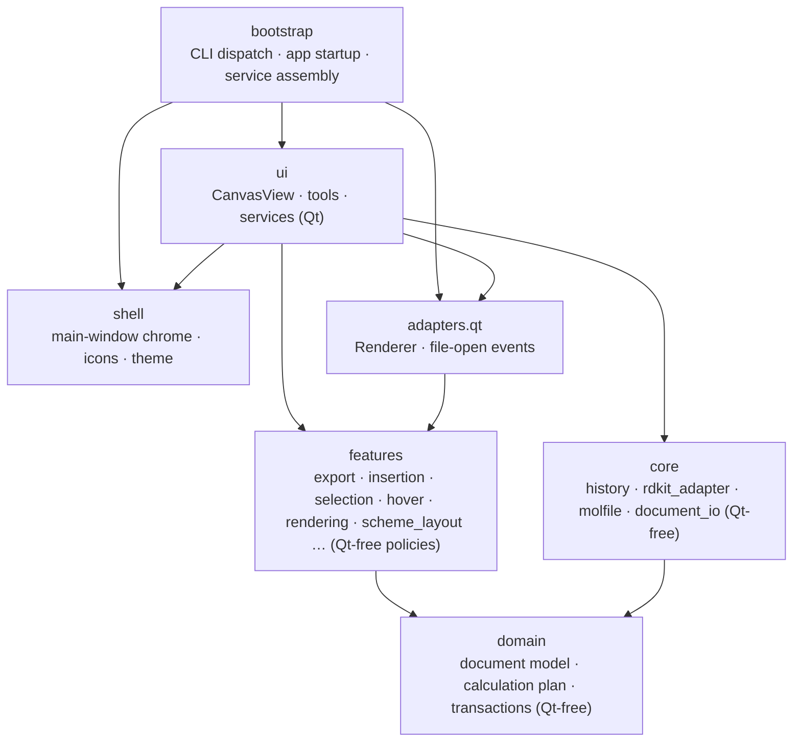
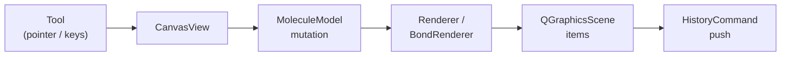

# 아키텍처

[English](ARCHITECTURE.md)

## 패키지 계층 구조

Chemvas는 기능 지향적(feature-oriented) 계층 아키텍처를 따릅니다. 의존성 화살표는 import하는 패키지에서 의존 대상 패키지로 향합니다 ([ADR 0001](adr/0001-feature-oriented-modularization.md)).

### 계층별 역할과 책임

| 계층 | 역할 및 책임 | Qt 의존성 없음 |
| --- | --- | :---: |
| `bootstrap` | CLI 디스패치, 앱 시작 및 서비스 조립 | 부분적 |
| `shell` | 메인 윈도우 프레임워크, 테마, 스타일시트 및 툴바 UI | 있음 |
| `ui` | `CanvasView`, 도구 이벤트 처리, 컨트롤러 및 캔버스 서비스 | 있음 |
| `adapters.qt` | Qt 기반 렌더링 및 OS 파일 열기 이벤트 필터 | 있음 |
| `features` | 순수 도메인 정책: 그림 내보내기, 구조 삽입, 선택, 호버, 레이아웃 | **없음** |
| `core` | 히스토리 명령, 선택적 RDKit 백엔드, molfile I/O | **없음** |
| `domain` | 핵심 분자 그래프, 문서 스키마, Calculation Plan, 트랜잭션 | **없음** |

## 핵심 컴포넌트

- **CanvasView** (`app/chemvas/ui/canvas_view.py`): 사용자 입력 처리, 도구 디스패치, 선택 상태 관리, 좌표계 변환을 담당합니다. 저수준 드로잉 처리는 직접 소유하지 않고 컨트롤러 및 렌더러와 협력합니다.
- **MoleculeModel** (`app/chemvas/domain/document/model.py`): 고유 정수 ID를 가진 원자 및 결합 데이터 구조이며 Qt 의존성이 없습니다.
- **RDKitAdapter** (`app/chemvas/core/rdkit_adapter.py`): SMILES 해석, 3D 좌표 생성, 화학적 특성 계산, 작용기 약어 확장을 담당하는 선택적 백엔드입니다.
- **Renderer** (`app/chemvas/adapters/qt/renderer.py`): `acs1996_style` 드로잉 정책을 적용하는 Qt 렌더링 구현체입니다.
- **HistoryCommand** (`app/chemvas/core/history.py`): 델타 기반 Undo/Redo 엔진입니다. 복합 작업은 `CompositeCommand`로 묶여 원자적으로 실행 취소/다시 실행됩니다.
- **장면 렌더링** (`scene_render_context.py`, `scene_rendering.py`): `SceneRenderContext`를 통해 뷰에 독립적인 분자 그래픽 및 주석 렌더링을 제공합니다 ([ADR 0004](adr/0004-view-independent-scene-rendering.md)).
- **도메인 문서** (`app/chemvas/domain/document`): 문서 직렬화, 스키마 검증 및 Calculation Plan v2 구조를 관리합니다.

## UI 아키텍처 및 경계 원칙

`app/chemvas/ui` 패키지의 모듈화와 결합도 최소화를 위한 규칙:
- **상태 모듈** (`*_state.py`): 캔버스 상태는 `CanvasRuntimeState`의 명시적인 데이터클래스로 관리합니다.
- **접근 모듈** (`*_access.py`): 내부 구현을 직접 노출하지 않고 타입이 정의된 접근자 함수를 통해 캔버스 상태를 조회합니다.
- **포트 모듈** (`*_ports.py`): 서비스 조회를 위한 명시적 인터페이스 계약을 정의합니다.
- **서비스 및 컨트롤러**: `canvas_services.py`에서 캔버스마다 명시적 주입으로 조립됩니다. 캔버스 상태 접근은 접근자 함수만을 사용합니다.
- **UI 독립적 Core**: `app/chemvas/core`와 `app/chemvas/domain`은 Qt import를 일체 포함하지 않습니다.
- **선택적 RDKit**: RDKit은 완전히 선택적이며, RDKit이 없어도 앱의 핵심 그리기와 편집 기능은 정상 동작합니다.

## 트랜잭션 및 복구 라이프사이클

- **원자적 트랜잭션**: `DocumentSavepoint`가 문서 전체 상태를 캡처하여 검증하고, 실패 시 안전하게 롤백합니다 ([ADR 0002](adr/0002-single-rollback-kernel.md)).
- **히스토리 관리**: `CanvasHistoryService`가 불변 스냅샷을 기반으로 실행 취소/다시 실행 스택을 관리합니다.
- **자동 저장 및 세션 복구**: 비정상 종료 시 앱 캐시에 저장된 PID 기반 세션 매니페스트를 통해 복구를 수행합니다.

## 데이터 및 렌더 흐름

### 대화형 편집 흐름

### 화학 및 3D 흐름
1. **선택 및 추출**: 선택된 원자와 결합이 정규화된 전하/라디칼 주석과 함께 `MoleculeModel` 서브그래프로 구성됩니다.
2. **백엔드 변환**: `RDKitAdapter`가 분자 그래프를 구성하고 3D 좌표를 생성합니다.
3. **출력**: 3D 미리보기 독에 전달되거나 `.xyz` 파일로 직접 내보내집니다.

### 헤드리스 문서 작업 흐름
헤드리스 CLI 명령(`inspect-document`, `apply-patch`, `render-document`)은 GUI 창이나 세션 복구 없이 독립적으로 소스를 검증하고 실행합니다.

## 화학 및 파일 형식 제약 사항

- **내보내기 범위**: 3D 변환 및 분자 내보내기 시 화학 그래프 데이터만 포함하며, 장면 전용 주석(화살표, 대괄호, 텍스트)은 제외합니다.
- **지원되는 작용기 약어**: `ATOM_ALIAS_DEFINITIONS`에 정의된 정규 별칭:
  `Me`, `Et`, `OH`, `NH2`, `SH`, `Ph`, `PPh3`, `OMe`, `Boc`, `CO2Me`, `t-Bu`, `tBu`, `i-Pr`, `CF3`, `OTs`, `Ts`, `OMs`, `Ms`, `OTf`, `Tf`, `Ns`, `OAc`, `Ac`.
- **입체화학**: 쐐기/해시 결합은 단일 결합에만 적용됩니다.
- **형식 호환성**: Chemvas는 문서 버전 7 및 8을 지원하며, 저장 시 버전 8(스키마 1)로 기록합니다.

## 아키텍처 결정 기록 (ADR)

- [ADR 0001: 기능 지향 모듈화](adr/0001-feature-oriented-modularization.md)
- [ADR 0002: 단일 롤백 커널](adr/0002-single-rollback-kernel.md)
- [ADR 0003: 선택 이동 저장점 범위](adr/0003-scoped-move-savepoint.md)
- [ADR 0004: 뷰 독립적 장면 렌더링](adr/0004-view-independent-scene-rendering.md)
