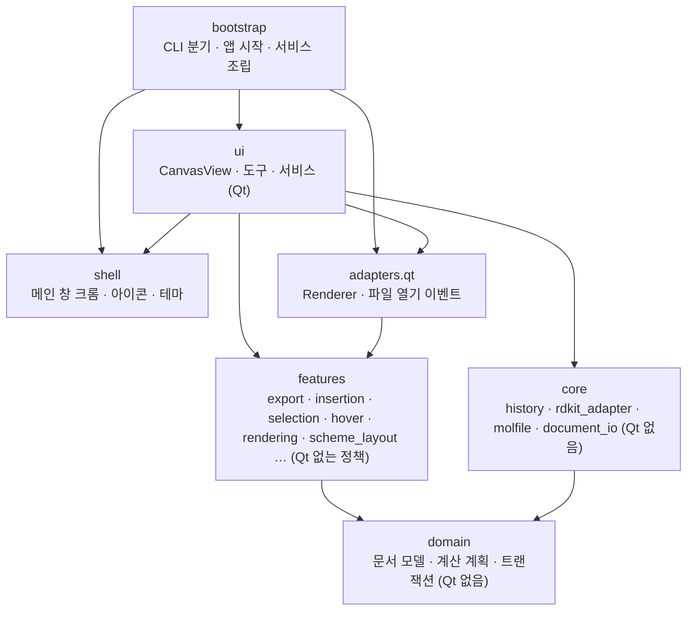
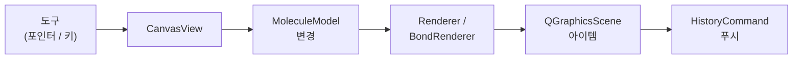

# 아키텍처

[English](ARCHITECTURE.md)

## 한눈에 보는 계층

누가 누구를 import할 수 있는지에 대한 규범 아닌 스냅샷이다. 화살표는
import하는 패키지에서 의존 대상 패키지로 향한다. 목표 경계는
[ADR 0001](adr/0001-feature-oriented-modularization.md)이 정한다.

## 현재 구현 지도 (규범 아님)

이 절은 마이그레이션 중인 현재 코드를 설명한다. 목표 패키지 경계와
의존 방향은 [ADR 0001](adr/0001-feature-oriented-modularization.md)에 정의되어
있다. 신규 기능은 아래의 평면 `core` / `ui` 배치를 복제하지 않고 ADR을
따른다.
- CanvasView (`app/chemvas/ui/canvas_view.py`): 입력 처리, 도구(tool) 디스패치, 선택 상태 관리, 그리고 모델/렌더/히스토리 업데이트의 조율을 담당한다. 저수준 드로잉 프리미티브(low-level drawing primitives)를 직접 소유해서는 안 된다.
- MoleculeModel (`app/chemvas/domain/document/model.py`): 순수한 원자/결합 데이터와 ID. Qt 의존성이 없다.
- RDKitAdapter (`app/chemvas/core/rdkit_adapter.py`): SMILES 가져오기, 물성 계산, 3D 좌표 생성, 별칭(alias) 확장, 미리보기 씬(preview scene) 구성을 담당하는 선택적 화학 백엔드. Alias 검증은 scene, XYZ, MOL, calculation-artifact 경로가 중앙에서 공유한다. Carbon-bound `PPh3`는 정확히 하나의 single bond를 가진 phosphonium `C-[P+](Ph)3`로만 확장하며, 모호한 attachment 또는 명시적인 전자 annotation은 fail closed한다. UI 코드는 RDKit을 필수 시작 의존성이 아니라 최선 노력(best-effort) 서비스로 취급해야 한다.
- Renderer (`app/chemvas/adapters/qt/renderer.py`): 순수
  `chemvas.features.rendering.acs1996_style` 정책을 사용하는 Qt 펜/브러시와
  폰트 설정.
- HistoryCommand (`app/chemvas/core/history.py`): 델타 기반 실행 취소/다시 실행(undo/redo). 다중 엔티티(multi-entity) 연산은 `CompositeCommand`로 그룹화되며, 이는 다시 실행 시 자식 델타 커맨드를 순서대로 적용하고 실행 취소 시 역순으로 적용한다.
- 장면 렌더링(`scene_render_context.py`, `scene_rendering.py`): 명시적인 `SceneRenderContext`가 scene, 현재 model, style, 공통 drawing state를 분자·annotation 렌더러에 제공한다. `CanvasRuntimeState`는 이 상태를 상속해 편집기 필드만 추가하므로 GUI가 drawing state 사본을 따로 유지하지 않는다. [ADR 0004](adr/0004-view-independent-scene-rendering.md) 참조.
- BondRenderer (`app/chemvas/ui/bond_renderer.py`): drawing context를 사용해 결합 QGraphicsItem을 생성·갱신한다. `SceneGeometry`와 `AtomLabelRenderer`가 뷰와 무관한 기하·label drawing을 소유하고, 편집 서비스는 변경과 history를 맡는다.
- 화살표와 선(`app/chemvas/ui/canvas_arrow_build_service.py`): `CanvasArrowBuildService`가 레코드 변경과 그로부터 만들어지는 경로·라벨을 소유한다. 직렬화, 이동, 핸들, 끝점 스냅은 공용 drawing state의 동일한 Qt-free `Arrow` 레코드를 읽는다. 메뉴 이벤트에는 표시 문자열 대신 kind ID를 전달한다.
- Graphics items (`app/chemvas/ui/graphics_items.py`): 선택 불가능한 QGraphicsItem 래퍼(wrapper).
- Label layout (`app/chemvas/features/annotations`): 원자 레이블을 조판 런과 배치로 파싱하는 순수(Qt-free) 공개 API이며 화면과 아웃라인 내보내기 타이포그래피의 단일 소유자다.
- Figure export (`app/chemvas/features/export`): feature 패키지가 공개 API, Qt-free 대화상자/계획 규칙, 씬 범위 처리, SVG/PDF/raster 렌더러를 소유한다. 외부 호출자는 `chemvas.features.export`만 import하고 렌더러 모듈은 비공개 구현 세부사항으로 남는다. 순수 plan은 패딩이 적용된 소스 사각형과 물리 출력 크기를 포인트 단위로 계산한다. Qt 서비스는 보이는 콘텐츠를 수집하고, 일시적 오버레이를 제외하며, 가능한 경우 항목별 export bounds를 사용하고, 레이블을 아웃라인 처리한 뒤 SVG/PDF/PNG/TIFF로 렌더링한다. `unit_scale` 또는 `target_width_pt`로 줌과 무관한 크기를 결정하고 `scope`와 `background`로 내용과 배경을 선택한다.
- 삽입 (`app/chemvas/ui/insert_controller.py`): `InsertController`가 SMILES·고리 삽입 세션, 모드 전환, 취소, 시트 경계 검사와 미리보기 수명을 소유한다. `app/chemvas/features/insertion`은 벤젠의 방향족 내부선을 포함한 순수 planning·geometry를, 공용 `preview_scene_*` 모듈은 미리보기 렌더링을 맡는다. `InsertCommitService`의 문서 변경·Undo·복구 경로는 유지한다. 고리 배치 성공 후에는 삽입 모드를 유지하고, SMILES 배치 성공 후에는 종료한다.
- Bond preview (`app/chemvas/features/rendering/bond_preview.py`, `app/chemvas/ui/bond_preview_renderer.py`): feature policy는 Qt 값 없이 plain-double preview segment를 계산하고, 단일 Qt renderer가 concrete `BondRenderer`를 통해 preview item을 생성·갱신·부착·정리한다. Canvas access leaf는 두 활성 호출자를 지원하며 resolver dataclass, 호출별 lambda 배선, 별도 geometry/scene-item 역할 모듈은 삭제되었다.
- Selection (`app/chemvas/features/selection`, `app/chemvas/ui/selection_controller.py`): feature 패키지는 Qt 없는 hit/geometry 정책을 소유한다. 캔버스별 `SelectionController` 하나가 구조·명시적 노트 선택, 그룹 조정, hit 우선순위, outline 갱신을 맡고 `SelectionOutlineService`는 그리기 협력자로 남는다. `selection_queries.py`는 scene/note 선택 합집합을 조회하며 snapshot은 Qt 선택을 한 번만 읽는다. `selection_state.py`는 `SelectionState`(명시적 노트 목록·색상·outline·갱신 중단 플래그)와 타입이 있는 단일 `selection_for(canvas)` 조회를 소유한다. Qt 노트 선택과 명시적 노트 선택의 그룹 의미는 구분해 보존한다. document/scene savepoint는 선택 목록 두 개의 값과 객체 identity를 복구하고 scene reset은 이를 비운다. `CanvasRuntimeServices.selection`은 컨트롤러를 직접 보관하며 공용 hit-testing 서비스는 별도 runtime 필드다. 기존 selection bundle·access 전달층과 네 개의 작은 서비스는 제거되었다.
- Hover (`app/chemvas/features/hover`, `app/chemvas/ui/hover.py`): feature 공개 API가 Qt-free transient state와 갱신 정책을 소유한다. 캔버스당 하나의 `HoverController`가 Qt 조율을 맡고, `hover_rendering.py`가 graphics item helper를 소유한다. `canvas_hover_state.py`는 eager import graph를 비순환으로 유지하기 위한 단일 함수 runtime-state leaf로 남는다. `CanvasRuntimeServices.hover`는 controller를 직접 노출하며, 기존 hover access/ports/bundle과 4개 service 스택은 삭제되었다.
- Domain document (`app/chemvas/domain/document`): Qt-free 분자 모델과 버전이 있는 문서/클립보드 직렬화·검증 정책을 소유한다. 기존 `chemvas.core.model`과 `document_state` 경로는 삭제되었다.
- 계산 plan과 artifact(`app/chemvas/domain/document/calculation_plan.py`, `app/chemvas/domain/document/plan_validation.py`, `app/chemvas/domain/document/conversion.py`, `app/chemvas/domain/document/precomplex.py`, `app/chemvas/domain/document/precomplex_profile.py`, `app/chemvas/features/calculation_bundle`, `app/chemvas/bootstrap/calculation_bundle.py`): document domain은 엄격한 Plan v2 스키마, plan의 일관성 규칙(state가 선언한 전하와 성분의 전하 대조, 대응된 원자의 원소 라벨 일치), 변환이 돌려주는 기록(`AtomMapEntry`, `CalculationArtifacts`)을 소유한다. Chemvas 0.15.0 이하가 쓴 endpoint precomplex 상태는 계속 읽고 검증하고 보존하며, profile registry는 그 검증에만 쓴다. Chemvas는 이제 그 상태를 생성하거나 사용하지 않으며, 그 상태를 담아 제공된 plan은 그대로 저장한다. Qt 비의존 feature API는 연결 성분 선택·endpoint별 역할·correspondence readiness·결합 변화·결정론적 path precheck·생성된 계산 artifact의 전자 상태와 원자 맵 검증·step endpoint 사이의 생성 원자 대응을 소유한다. Calculation dialog는 included 원자를 ID 기반 대응표 하나로 투영하고 부분 draft와 명시적인 unmapped 선택을 보존한 뒤, 최종 후보를 같은 feature/domain 검증 경로에 맡긴다. `calculation_mapping_highlight.py`는 dialog 수명에 한정된 비선택 atom-ID label을 mapping 상태에 따라 색칠하며 document serialization, selection state, history에 넣지 않고 모든 dialog 종료에서 제거한다. bootstrap은 `.chemvas` I/O, 선택적 RDKit 조립, 결정적 단일파일 step 직렬화, reactant identity 순서로 index한 성분별 기하 생성, 비덮어쓰기 원자적 공개를 맡는다. `application.main`은 Qt import 전에 `inspect`, `attach-plan`, `inspect-plan`, `pack-step`을 dispatch한다.
- Agent 문서 patch(`app/chemvas/features/document_patch`, `app/chemvas/bootstrap/document_patch.py`): Qt/provider 비의존 feature API가 결정적 전체 graph 검사, 엄격한 Graph Patch v1 검증, 복사본 기반 순차 mutation, 의존 좌표 이동, 최종 문서/Calculation Plan gate를 소유한다. bootstrap은 원본 bytes를 한 번 읽어 hash하고, 중복 key·비표준 JSON을 거부하며, 후보를 결정적으로 encode한 뒤 공용 원자적 비덮어쓰기 파일 생성기로 공개한다. `inspect-document`와 `apply-patch`는 Qt 전에 dispatch되며 Chemvas 내부에서 자연어 모델이나 화학 추론을 실행하지 않는다.
- 창 없는 문서 렌더링(`app/chemvas/bootstrap/document_render.py`): bootstrap은 파일과 출력 자원 계약을 먼저 검증한 뒤 `QApplication`, `QGraphicsScene`, drawing context를 지연 조립하며 `CanvasView`는 만들지 않는다. 공통 `populate_document_scene`가 graphics를 생성하고 GUI와 같은 전체 sheet `FigureExportService` 경로에서 내용을 한 번 계산하고 painting 전 자원 제한을 검사한 뒤 private 임시 저장소에 SVG/PNG/PDF를 렌더한다. bootstrap은 반환된 plan을 render report v1에 재사용하며 PDF의 실제 정수 point 크기도 반영한다. 제한을 통과한 출력만 기존 경로를 덮어쓰지 않고 원자적으로 공개하며 원본/출력 hash, point/pixel 크기, 문서 버전을 보고한다. 데스크톱 창, session recovery, RDKit loading, editable SVG payload, TIFF는 이 명령의 범위 밖이다.
- 이전된 feature 정책 (`app/chemvas/features/{export,session,annotations,rendering,insertion,selection,hover}`): 각 패키지는 응집된 planning/geometry/state 계약을 하나의 공개 API로 제공한다. 기존 평면 호환 모듈은 삭제되었고 `test_package_dependencies.py`가 재도입을 막는다.
- 메인 창 조립: `chemvas.shell.main_window`가 얇은 Qt 셸을 소유하고, `chemvas.bootstrap`이 runtime/service 조립·창 등록·문서 열기·앱 시작을 소유한다. Qt 파일 열기 이벤트는 `chemvas.adapters.qt`를 통해 들어온다.

`chemvas.domain.document.inspection`이 공통 연결 성분 inventory, 유효 전하·라디칼
표시, 모델과 표시의 일관성 검사를 소유한다. 문서 조합, graph 검사, patch와 계산 준비가
이 단일 소유자를 사용하며, `chemvas.domain.document.plan_validation`이 plan의
일관성 규칙을 같은 방식으로 소유한다. 계산 state 선택, readiness, 결합 변화,
artifact 검증은 `features.calculation_bundle`에 남고, 이 feature는 예전에 자기가
정의하던 domain 이름을 재수출한다. 저장, Graph Patch, RDKit 변환은 그 feature를
import하지 않으며 의존성 테스트가 이를 지킨다. inspection 모듈 자체는 Qt와
RDKit을 import하지 않는다.
이 의미 검사는 native 문서를 여는 gate가 아니다. 수정이 필요한 그림도 계속 열 수
있어야 한다. 기존에 공개한 calculation 패키지 루트의 공통 export는 동일한 정본 객체를
가리키고, 내부 호출자는 domain 소유자를 직접 import한다.

계산 plan 검증과 보고는 요청 안에서 이 `ComponentInventory`를 재사용한다. 편집 준비는
structural validation을 사용하므로 사용자가 맞지 않는 전하 같은 의미 오류를 수정할 수
있다. 중복 step 거부와 저장된 precomplex 상태의 유지·삭제는 calculation feature의 순수
step-edit 연산이 소유하며, dialog는 widget 입력 수집과 오류 표시를 맡는다. 문서 편집
사이에 inventory를 캐시하지 않는다.

**Calculation 지원 경계.** Calculation 메뉴의 동작과 문서에 저장된 계산 계획은
별도 책임이다. 메뉴는 지연 콜백을 등록하므로 메인 창을 열 때 계산 dialog, mapping
표시, 계산 feature를 불러오지 않는다. 기존 CLI dispatcher도 등록된 계산 명령에서만
계산 bootstrap을 불러온다. 현재 기능은 계속 지원하며 새 기능 스위치나 플러그인
프레임워크를 추가하지 않는다.

| 책임 | 소유자와 향후 지원 중단 시 원칙 |
| --- | --- |
| 계산 UI 동작 | `ui/calculation_step_dialog.py`, `ui/calculation_mapping_highlight.py`; 진입점은 `ui/main_window_menu_bar.py`의 `_build_calculation_menu`. |
| 계산 준비와 전달 | `features/calculation_bundle`, `bootstrap/calculation_bundle.py`; `bootstrap/application.py`가 `inspect`, `attach-plan`, `inspect-plan`, `pack-step`의 CLI 등록과 도움말을 소유한다. |
| 기존 문서 데이터 | document domain, canvas plan state, snapshot, history가 지원 중인 plan 스키마, 구조 검증, 보존, 편집 무결성 규칙을 유지한다. 선택적 계산 동작이 아니라 문서 호환성의 책임이다. |
| 공용 화학 서비스 | RDKit, 분자 검사, SMILES/MOL/XYZ 변환, Molecule Info는 다른 기능도 사용한다. Calculation 중단을 이유로 백엔드와 이 기능들을 함께 제거하지 않는다. 계산 전용 adapter 메서드는 실제 중단 시 호출자를 확인한다. |

나중에 지원을 중단하면 GUI 등록과 계산 CLI 등록·도움말을 동작 소비자와 함께 제거한다.
지원 중인 계획 데이터와 무결성 검사는 문서 호환성 정책에 따라 보존한다. 데이터 제거는
별도의 명시적 호환성 결정이 필요하다. 기능 import 실패를 잡아 계획을 조용히 버리지
않는다. 일반 편집 코드는 계산 동작 모듈에 새로 의존하지 않으며, 패키지 의존성 검사는
명시된 진입점과 내부 의존만 허용한다.
`test_calculation_feature_boundary.py`는 새 프로세스에서 계산 동작 모듈의 import를
차단하고 실제 메인 창 생성, draft plan 문서 열기, 원자 이동, 저장·다시 열기, PNG
렌더링을 수행한다. 결과 바이트를 정상 기준 실행 두 번과 대조하며, 메뉴 호출도 별도로
검사한다.

Figure export의 사전 검사와 렌더링은 동기 요청 하나 안에서 feature의
`resolve_export_plan`이 반환한 항목과 기하 정보를 공유한다. export service가 plan을 검증하면
`render_export_plan`이 다시 측정하지 않고 그린다. 별도의 `export_scene` 및
`plan_figure_export` 호출은 항상 새로 계산하며 편집 사이에 plan을 캐시하지 않는다.
선택 회전, 클립보드 배치, 원자 이동은
`chemvas.features.selection`의 순수 원근 기하 계산을 공유한다. 화면 좌표 이동은
저장 좌표에 역투영한 변화량을 적용해 깊이, 카메라 frame, 기존 stale 좌표의 오차를
보존한다. 선택 상태 집계는 Qt 선택과 선택된 노트 registry에 같은 item identity를
적용하여 겹치는 항목을 한 번만 센다.

## 전환기 UI 규율 (ports / access / state / services)
`app/chemvas/ui` 패키지는 구조 전환 중 실제 책임을 분리하는 경우에만 작은 역할 모듈을 유지한다. 목표는 `CanvasView`와 `MainWindow`를 얇은 Qt 셸로 유지하고(갓 오브젝트 금지), 모든 서비스를 헤드리스로 생성 가능하게 하며, 모든 의존성을 명시적으로 만드는 것이다.

이 규칙들은 평면 패키지에 남아 있는 코드의 마이그레이션 제약으로
유지한다. 모든 신규 기능이 복제할 템플릿은 아니며, 신규 feature 패키지는
실제 경계가 필요할 때만 역할별 모듈을 만든다.

- **State 모듈** (`*_state.py`): 아직 이전되지 않은 관심사는 dataclass 하나와 `<name>_state_for(canvas)` 접근자를 사용한다. 이 접근자들은 eager 생성되는 `CanvasRuntimeState` 컨테이너(`chemvas.ui.canvas_runtime_state.py`)에서 자기 필드를 직접 읽는다 — `return cast(CanvasGraphState, canvas.runtime_state.graph_state)`. 이 컨테이너는 `slots=True` dataclass여서 이름이 바뀌거나 틀린 필드는 상태를 조용히 둘로 쪼개는 대신 즉시 실패한다. lazy 부착도 plain-attribute fallback도 하지 않는다: 캔버스에 상태를 만들어 붙이던 `ensure_canvas_state`와 `canvas_state_object` seam은 모두 제거됐고, `document_metadata_state_for`도 다른 모든 상태 접근자와 같은 runtime-container 직접 조회 규칙을 따른다. `SheetSetupState`가 sheet 크기·방향·rect의 유일한 소유자이며 이 값들을 캔버스에 별도로 미러링하지 않는다. transaction snapshot도 선택적 runtime field를 컨테이너에서만 조회한다. 컨테이너가 없는 가벼운 model/scene-only capture는 같은 이름의 canvas attribute로 fallback하지 않고 runtime state를 생략한다. focused 테스트는 `tests/runtime_state.canvas_runtime_state(**states)`로 부분 컨테이너를 만들며, 이 헬퍼가 필드명을 실제 컨테이너와 대조한다. `model`은 runtime 필드가 아니라 캔버스 직접 속성이지만 setup이 생성하므로 `model_for`는 그것을 읽기만 한다 — 없는 캔버스는 배선 버그이며 빈 문서를 새로 만들어 덮지 않는다. `renderer`, `rdkit`, `bond_renderer`는 setup이 생성하는 직접 collaborator이며 각 access 모듈이 lazy 생성이나 fallback 없이 조회한다. 이전된 hover 상태는 `chemvas.features.hover`가 소유하며, 얇은 UI leaf는 필수 runtime field를 직접 읽을 뿐 부착하거나 fallback하지 않는다. input-view는 실제 상태 dataclass를 `input_view_state.py`에, 조회를 canonical `input_view_access.py`에 두고 callback state는 dataclass와 getter를 한 모듈에 유지한다. `test_state_accessors_read_the_runtime_container_directly`는 범위 안의 접근자를 **열거**하며, 컨테이너를 더 이상 읽지 않는 접근자를 위반으로 잡는다 — 이름만 바꾼 조회 헬퍼도, 자기 상태를 만들어내는 접근자도 통과하지 못한다.
- **Access 모듈** (`*_access.py`): 연산 하나를 감싸는 자유 함수(`foo_for(canvas)`). `canvas.services`에 직접 접근할 수 없고, 서비스 조회는 대응하는 ports 모듈에 위임한다.
- **Ports 모듈** (`*_ports.py`): 서비스 컨테이너(`canvas_services_for` / window 비공개 저장소)를 해석하는 일반 모듈. 그 외 모든 코드는 협력자를 주입받거나 port를 호출한다. 생산 코드의 port는 canonical `CanvasRuntimeServices` API만 사용한다. 응집된 그룹은 묶어서 유지하고 `graph_service`, `tool_controller`, `hover`, `selection`, `hit_testing_service`, `atom_label_service` 같은 단일 runtime은 직접 보관한다. 평면 서비스 별칭과 duck-typed 생산 adapter는 삭제되었고, 집중 테스트는 `tests/runtime_services.py`로 부분 canonical runtime을 만든다. `canvas_service_ports`는 역할에서 컨테이너 안의 위치로 가는 지도다. 그 모듈 안에서 컨테이너 경로 하나에는 포트 이름이 정확히 하나이고, 모든 포트와 포트 결과를 그대로 넘기는 접근 wrapper 네 개는 구체 서비스 타입을 돌려주므로, 결과를 쓰는 호출자는 자신이 받는 서비스에 대해 타입 검사를 받는다(`test_canvas_service_ports_name_each_container_path_once_with_its_type`). 창 포트는 `active_canvas_for_window`와 이 캔버스 포트를 조합할 뿐 컨테이너를 직접 해석하지 않으므로, 창 포트는 resolver를 추가하지 않는다. selection에는 명시적 예외가 하나 있다. 타입이 있는 leaf `selection_state.selection_for`가 `.services.selection`만 조회하여 port/access 전달층과 컨트롤러의 runtime import를 피한다(`CANVAS_SERVICE_CONTAINER_RESOLVERS`). `CanvasRuntimeServices`는 모든 bundle과 단일 runtime의 타입을 `TYPE_CHECKING` 아래에서 이름으로 적는다. 그래서 mypy는 컨테이너가 무엇을 담는지 보고, 모듈은 실행 시 잎으로 남는다. history/transaction 클러스터의 비순환 규칙은 eager import와 lazy import를 세고 주석 전용 간선은 세지 않는다 — 실행되지 않는 간선은 두 모듈을 서로 기다리게 만들 수 없기 때문이다. 그 `TYPE_CHECKING` 블록이 클러스터와, 클러스터를 eager하게 import하는 bundle들 사이의 유일한 분리막이다. 그 안의 import 하나를 모듈 수준이나 함수 안으로 옮기면 실제 순환이 닫히며, 클러스터 테스트와 eager-DAG 테스트가 모두 이를 거부한다. mypy는 주석 전용 순환을 한 단위로 해석하므로, 그 안의 모듈 간 속성은 추론에 맡기던 곳에도 명시적 주석이 필요하다(`Tool.canvas`). `CanvasView`의 이벤트 override는 `canvas_view_ports`에 input 또는 pointer controller를 물어 바로 호출하고, 서비스가 아직 붙지 않은 동안에는 Qt 기본 핸들러로 떨어진다. 그 사이에 router 모듈은 없다.
- **서비스와 컨트롤러**: `chemvas.ui.canvas_services.py`에서 캔버스당 한 번, 명시적 키워드 주입으로 조립된다 — 서비스 내부의 서비스 로케이터 금지, 누락된 배선을 숨기는 `=None` 협력자 기본값 금지. 조립은 응집된 그룹은 `CanvasRuntimeServices`의 bundle로 보관하고, runtime이 하나면 단일 멤버 bundle을 만들지 않고 직접 보관한다. 기존 graph/tool wrapper bundle과 builder 주입 composer 계층은 삭제되었다. 서비스는 캔버스를 접근 함수에 넘길 뿐 그 속성을 직접 건드리지 않는다 — `canvas.model`도, `canvas.scene()`도, 문자열 이름의 `getattr`도 안 된다 — 따라서 서비스가 닿을 수 있는 것은 그 모듈이 import한 접근 함수들과 그것이 돌려주는 것이며, 어떤 편집 규칙이 무엇을 바꿀 수 있는지 물을 때 볼 곳도 그 import 목록이다. `test_services_reach_the_canvas_only_through_access_functions`가 모든 `ui/*_service.py`·`ui/*_controller.py`에서 `canvas`·`_canvas`·`view`·`_view`라는 이름(그대로든 `self`를 거치든)에 대한 속성 접근을 예외 목록 없이 금지한다. 다른 이름으로 받은 캔버스는 리뷰어가 잡을 몫이다. 캔버스에서 새로 필요한 것이 생긴 서비스는 조립 단계가 줄 수 있으면 주입된 협력자로 받고(hit testing은 뷰의 `viewportTransform`을 이렇게 받는다), 그렇지 않을 때 접근 함수를 추가한다. 조회의 이름만 바꾸는 함수는 경계가 아니다.
- **core는 UI 및 Qt와 분리된다**: `app/chemvas/core`는 동적 import를 포함해 `ui`나 Qt를 import하지 않는다. History command는 UI 구현을 선택하지 않고 결합된 연산을 전달받는다. 구체 Qt 렌더링은 `chemvas.adapters.qt.renderer`에 둔다. 새로운 core-to-Qt 의존성은 금지한다.
- **RDKit은 선택적이다**: 앱 시작 경로에서 절대 하드 import가 되어서는 안 된다. RDKit이 필요한 기능은 그것이 없을 때 우아하게 축소되거나 명확한 메시지와 함께 실패한다 — `chemvas.core.rdkit_adapter` 참조. 아래 3D 제약은 이 규칙이 export 동작에 대해 무엇을 뜻하는지를 적은 것이고, 규칙 자체는 일반적이다.

두 view-controller 포트는 `CanvasInputController | None`과
`CanvasPointerController | None`을 명시적으로 반환한다. 구체 타입은
`TYPE_CHECKING` 아래에서만 import하며, Qt 초기화 중의 기존 `None` 반환은 유지한다.

이 규칙들은 `tests/test_architecture_boundaries.py`가 강제한다. 신규 규칙은
의존성 계약이나 일반 패턴 금지로 작성한다. 일부 전환기 검사는 아직 제거된
이름이나 구현 위치를 고정하고 있으므로, 각 feature 이전 시 패키지/공개 API
계약으로 교체한 뒤 퇴역시킨다.

이 규율의 알려진 트레이드오프(의도적으로 수용): 실재하는 간접 비용(ui LOC의 약 20%가 배선)과 캔버스 seam의 약한 정적 타이핑(`canvas: Any`). 이 `Any`는 서비스가 접근자에 넘기는 열쇠이지 서비스가 여는 문이 아니다 — 위의 속성 읽기 금지가 이것이 서비스 로케이터가 되는 것을 막는다. 하나의 불변식이 여러 작은 모듈에 걸칠 때는 일관성 계약을 소유 모듈 한 곳에 문서화해야 한다 — 파생 그래프 인덱스의 예로 `chemvas.features.graph` 패키지 독스트링과 `CanvasGraphService.bond_id_between_with_repair` 패턴을 참고.

## Feature Qt 마이그레이션 목록

목표 경계는 구체 Qt 통합을 `chemvas.adapters`에 둔다. 다만 진행 중인 namespace
마이그레이션에는 아직 고정된 일부 feature 구현 모듈의 직접 Qt import가 남아 있다.
`tests/test_package_dependencies.py`의 `FEATURE_QT_MIGRATION_ALLOWLIST`가 실행 가능한
목록이다. 새 모듈은 추가할 수 없고, 각 adapter 이전에서 해당 항목을 제거한다.

다만 **목록을 비우는 것은 현재 도달 가능한 목표가 아니다** — 남은 12항목 중 8건은 환원
불가능한 Qt이고(figure export는 입력 자체가 `QGraphicsScene`이다), 나머지를 옮기는 것은
실제 의존을 없애지 못한 채 port와 배선만 늘린다. 측정 근거는
[ADR 0001](adr/0001-feature-oriented-modularization.md)에 있다. 종료 형태가 결정되기
전까지 이 목록은 **줄어들기만 하는 동결 목록**으로 다룬다.

## 트랜잭션과 복구 소유권

- `ToolController.prepare_for_document_edit`는 키보드/메뉴의 문서 변경 전에
  진행 중인 포인터 제스처를 각 도구의 기존 소유자를 통해 취소한다. 도구의 기존
  상태를 읽으며 별도 마우스 상태를 만들지 않는다. 포커스가 있는 텍스트 편집기는
  기존 편집 경로를 유지한다. 일반 Perspective 도구 전환은 여전히 commit하며,
  이 변경 경계에서는 취소한다.
- `CanvasHistoryService`는 undo/redo stack 정책과 불변 `HistoryStackSnapshot` 값의 유일한 소유자다. 최상위 exact undo/redo 연산은 문서 savepoint를 하나만 캡처하고, 중첩 command는 그 연산에 위임한다.
- core와 UI history command는 전체 canvas가 아니라 결합된 연산을 전달받는다.
  작은 구조적 프로토콜이 각 command 계열에 필요한 연산을 명시한다.
  `CanvasRuntimeState.create`가 캔버스당 `CanvasHistoryOperations` 하나를 조립하며,
  이 UI adapter만 canvas를 비공개로 보관하고 정본 mutation·transaction 소유자를
  재사용한다. 공개 canvas 접근자나 범용 proxy는 없다. `CanvasHistoryService`는
  연산과 stack state를 명시적으로 주입받는다. 초기 실행, 역연산 보상, 복합 command의
  자식, 중첩 transaction scope는 모두 같은 연산 인스턴스를 사용한다. 기존 command의
  데이터 payload는 유지하며 annotation·sheet callback은 값만 받도록 결합한다.
  `test_history_operations.py`와 `test_history_atom_lifecycle_port.py`는 UI·Qt import나
  전역 resolver 패치 없이, 필요한 상태·연산만 가진 작은 대역으로 재실행을 검증한다.
  실제 Qt 테스트는 장면 객체의 동일성, 복구, stack 정책, GUI/CLI 동등성을 계속 검증한다.
  이는 실행 경계를 좁힌 것이며 별도 history 엔진이나 문서 savepoint의 대체물이 아니다.
- 선택 nudge/정렬 및 Select/Move 드래그 command는 기존 깊이 좌표와 종속 mark/ring fill을 포함한
  선택 영역 geometry의 정확한 before/after를 기록한다. 재생할 때 원자를 먼저,
  종속 scene item을 나중에 복원하고 선택 외곽선을 한 번 갱신한다. 이 command
  payload는 별도의 rollback 또는 stack 소유자가 아니다.
- 결합 길이 history는 같은 exact-geometry command를 확장한다. Undo/Redo 양쪽에서
  렌더러 길이와 mark 글리프 크기를 먼저 복원하고 원자 좌표, 부착 mark의 정확한
  위치를 뒤에 복원한다. 별도의 savepoint 소유자 없이 offset뿐 아니라 절대 좌표로
  부착 위치를 표현한 mark도 보존한다.
- 드래그 command payload는 기존 scoped savepoint와 함께 첫 유효 이동에서만
  캡처한다. 원자에 붙은 mark는 history 안에서만 정확한 Qt 로컬 위치도 보존하며,
  저장되는 결합 offset의 의미는 바꾸지 않는다.
- Perspective session은 전역 투영 프레임을 교체할 때 다른 분자의 캐시 좌표를
  새 프레임으로 재표현한다. 화면 위치와 깊이는 유지하며, 캐시만 바뀐 원자는
  scene item을 이동하지 않고 기존 회전 history/rollback payload에 포함한다.
  이 좌표는 drawing 좌표이며 과학적 conformer 기하의 보존을 보장하지 않는다.
- 문서 교체는 stack capture/restore를 해당 history owner에 맡기고, destructive scene reset도 알림 없는 stack discard를 위임한다. 이 연산은 기존 stack list를 보존한다. 문서 교체의 detached-scene snapshot은 원래 Qt scene item을 별도로 보존한다.
- 기록되는 구조 삽입은 history 기록 성공까지 작업 전 savepoint를 유지한다. 기록 실패는 기존 rollback authority로 복구하며, 성공한 발행을 검사하기 위해 전체 문서 savepoint를 다시 캡처하지 않는다.
- 벤젠 template 삽입도 같은 committer 범위 안에서 mutation-only ring builder를 호출하며 recorded build를 중첩하지 않는다. 성공한 삽입은 한 번 캡처하고 no-op·실패 복원도 같은 owner를 따른다. History push 실패 시 recorder가 사용하는 기존 역연산 command의 savepoint는 작업 전 캡처와 별도로 유지한다.
- `chemvas.ui.transactions.document.DocumentSavepoint`는 문서 전체 capture, restore, verify, release의 공개 소유자다. 같은 패키지의 하위 object-graph, scene-runtime, scene-rect primitive를 조합한다. `history_commands`는 command class만 소유하며 private snapshot toolkit을 내보내지 않는다.
- `chemvas.domain.transactions`는 프레임워크와 무관한 `RestoreOutcome` 검증, 복구 오류 note 부착, 1회 restore helper만 소유한다.
- restore는 한 번 적용하고 한 번 검증한다. exact 복원을 입증하지 못하면 history는 ADR 0002의 보수적인 fail-closed stack 정책을 적용하고 durable recovery는 autosave/session restore에 맡긴다. 제거된 retry, authority channel, compatibility probing, 병렬 stack snapshot 계층은 다시 도입할 수 없다.
- Autosave session 소유권은 PID와 process-creation identity의 조합에 묶인다. `session.json`은 동시에 실행 중인 이전 바이너리도 읽을 수 있는 엄격한 version-1 형태를 유지하고, 원자적으로 기록되는 `owner.json` sidecar가 새 reader를 위해 PID와 생성 identity를 연결한다. 같은 identity의 live PID 또는 identity를 읽을 수 없는 live PID는 그대로 보존하며, 다른 identity일 때만 PID 재사용이 입증되어 crashed session을 복구할 수 있다. identity가 없는 legacy manifest는 보수적인 live-PID 정책을 유지한다.
- 애플리케이션 Quit는 모든 창의 확인을 마친 뒤 버린 초안을 직렬화하지 않고
  다시 열 저장 파일 목록을 기록하며,
  기존 비동기 preview shutdown으로 창이 닫히는 동안 snapshot을 동결한다.
  다른 앱 데이터 위치의 복구 파일 탐색은 읽기 전용으로 경로만 알린다.
  세션을 병합하거나 별도의 영속 복구 장부를 만들지 않는다.
- 앱 시작 시 이전 문서를 자동으로 열지 않는다. 명시적으로 연 파일만 로드하며, 비정상 종료의 autosave snapshot은 삭제하지 않고 수동 복구 안내를 제공한다. 명시적 recovery API와 snapshot 형식은 유지한다.
- Desktop document path는 canonical `.chemvas`다. Startup, OS-open, File Open, Open Recent는 `.json` drawing path를 거부하거나 무시한다. 비정상 session snapshot은 현재 내부 autosave state를 복구할 수 있지만, 지원하지 않는 원본 path는 지우므로 recovered canvas는 path에 연결되지 않은 미저장 문서다.

## 데이터/렌더 흐름 (Data/Render Flow)
Tools -> CanvasView -> MoleculeModel 변경(mutation) -> Renderer/BondRenderer -> QGraphicsScene 업데이트 -> HistoryCommand 푸시.

3D 흐름: 내보내기 커맨드 또는 미리보기 새로고침 -> 현재 분자 / 활성 원자-결합 선택 -> MoleculeModel 서브그래프 + 원자 마크 주석(atom mark annotations) -> RDKitAdapter 변환 그래프 구성 -> RDKit 3D 임베딩 -> `.xyz` 라이터(writer) 또는 미리보기 씬.

계산 흐름: headless `inspect` -> 검증된 `.chemvas` state -> 안정적으로 index된 연결 성분·결합·alias attachment 목록; `attach-plan` 또는 Calculation dialog -> 재사용 state, endpoint별 역할, 명시적 included-atom 대응표, Calculation Plan v2를 가진 문서; dialog 수명 동안 mapping 상태 색상의 임시 atom-ID label; `inspect-plan` -> mapping/readiness와 path precheck 보고. 매핑이 완전하고 전하와 다중도가 같은 step은 성분 수와 관계없이 `pack-step`으로 갈 수 있다. `pack-step`은 전하·다중도·완전 bijection gate를 적용하고, 포함된 성분을 하나씩 따로 임베딩한 뒤 `factory/machine-observation` v1 / `chemistry/elementary-step` v2 `machine.json` 하나를 원자적으로 공개한다. 적합한 artifact는 reactant identity 순서 하나로 index한 성분별 XYZ, 공통 0-based 반응중심 index, 원자 index가 붙은 결합 변화를 담지만 서로 다른 분자의 상대 배치는 담지 않는다. GUI는 정확히 공유된 ID와 선택적인 same-element 구조 mapping을 제안할 뿐 반응기구를 추론하지 않는다. Chemvas는 성분을 배치하거나 최적화·안정성을 주장하지 않으며, 후속 양자화학 최적화와 과학적 검토를 대체하지 않는다.

Agent 편집 흐름: `inspect-document` -> 정확한 source SHA-256과 안정적인 atom/bond 목록 -> 신뢰하지 않는 Graph Patch v1 -> 엄격한 schema/hash gate -> deep copy에서 순차 mutation -> 구조 및 Calculation Plan 의미 검증 -> 결정적 후보 hash -> dry-run 보고 또는 단 한 번의 원자적 비덮어쓰기 `.chemvas` 공개. 입력 파일 버전과 범위 밖 scene state를 보존하며, 어느 operation이나 stale plan이라도 실패하면 output은 없다.

창 없는 렌더 흐름: `render-document` -> 원본 1회 읽기/hash 및 record-count gate -> 검증된 state를 뷰 독립 scene에 구성 -> canonical whole-sheet export plan -> point/pixel 자원 gate -> private SVG/PNG 렌더 -> output byte gate -> 단 한 번의 원자적 비덮어쓰기 공개 -> hash·크기 JSON report. painting에는 지연 import한 Qt가 필요하지만 RDKit과 desktop session-recovery service는 시작하지 않는다.

### 결합 제거의 공통 의미

결합 하나를 지울 때 함께 없어져야 할 것은 `domain.document.edits`에서 한 번만
정한다. `orphaned_atom_ids`는 결합이 없어진 끝점 중 sheet에 남길 이유가 없는 원자를,
`atom_shows_itself`는 결합 없이도 보이는 원자(heteroatom 또는 명시적 라벨; 표시는
호출자가 아는 정보)를, `broken_ring_fill_indices`/`ring_fill_is_intact`는 더 이상
결합된 순환을 이루지 않는 ring fill을 가려낸다. 단일 결합 삭제, 선택 삭제 계획, 지우개
세션, Graph Patch `remove_bond`가 모두 이 함수를 호출하고 결과를 각자의 방식으로
적용한다. GUI는 history command와 scene 갱신으로, patch는 복사본 state에서 제거된
원자의 원근 좌표와 group 소속을 함께 지우고 비어 버린 collection은 desktop이 저장할
때처럼 생략한다. ring fill은 지운 간선만 보지 않고 편집 뒤의 문서를 기준으로 판정한다.
`tests/test_document_edits.py`가 규칙을 고정하고,
`tests/test_document_edit_roundtrip.py`의 결합 삭제 사례는 같은 결합을 desktop과
`apply_document_patch`로 각각 지운 뒤 결과 문서를 비교한다. domain의 규칙 하나를
깨뜨리면 모든 경로의 테스트가 실패하며, 그것이 목적이다. 어떤 원자를 빈 원자로 볼지는
한 곳에서 고친다.

### 원자 이동의 공통 의미

GUI 이동과 Graph Patch의 `move_atom`은 `domain.document.perspective`의 역투영
규칙을 공유한다. GUI item 갱신·history와 CLI의 복사본 검증·파일 공개는 별도 책임으로
유지한다. `tests/test_document_move_equivalence.py`의 경로 간 회귀는 동일한 desktop
snapshot에서 실제 Select/Move 입력과 별도 `apply-patch` 프로세스를 실행해 비교한다.
이동 원자, 부착 표시, ring 기하, 저장된 깊이뿐 아니라 나머지 문서 내용 보존, GUI의
정확한 Undo/Redo와 양쪽 저장 결과를 GUI에서 다시 열었을 때의 상태를 확인한다.
실제 표시 중심과 ring polygon도 따로
검사한다. 올바른 snapshot만으로 화면의 종속 항목이 함께 움직였음을 증명할 수는 없다.

이는 원자 이동의 계약이지, 범용 편집 엔진이나 허용된 모든 입력의 바이트 동일성 약속이
아니다. Desktop snapshot은 이미 원자에서 ring 꼭짓점을 다시 만들고, raw patch는
문서 검증기가 허용한 정지 꼭짓점의 미세 잔차를 보존한다. Snapshot은 오래된 원근 캐시
항목도 제외한다. 해당 항목의 GUI 이동·history는 live state에서 따로 검사하며,
직렬화된 CLI 경로의 검증 범위라고 주장하지 않는다. GUI 취소·무이동의 history
정책과 CLI의 무이동 거절, CLI 전용 terminal-angle 제한도 구별한다. 실제 공통 규칙이
있는 연산부터 하나씩 공유 규칙과 경로 간 테스트를 확장한다.

### 결합 변경의 공통 의미

GUI 결합 단축키와 Graph Patch의 `update_bond`는 같은 문서 결합 필드를 변경한다.
GUI의 명명된 차수·스타일 동작에 대응하는 patch는 두 필드를 모두 명시한다.
CLI는 차수만 보고 GUI 프리셋을 추론하지 않는다. 순서 없는 끝점 쌍으로 결합을
찾더라도 저장된 방향은 유지하며, 이는 방향을 뒤집는 연산이 아니다.
GUI의 화면·history 갱신과 CLI의 복사본 검증·파일 공개는 별도 책임으로 유지한다.

`tests/test_document_bond_edit_equivalence.py`는 실제 hover·키 입력과 별도 공개
CLI 프로세스를, 요청한 결합 차수·스타일만 바꾼 명시적 기대 문서에 각각 대조한다.
단일·이중·삼중 결합, 방향이 있는 wedge/hash, 명시적인 미지정 입체표시 제거의 대표
사례에서 실제 Qt 도형과 그 페인트, 나머지 문서·선택 상태 보존, 정확한 Undo/Redo,
양쪽 저장 결과의 GUI 복원을 확인한다. 원자 이동 회귀와 기존 GUI fixture 및 공개
CLI 테스트 실행 부분을 공유하고, 연산별 fixture와 화면 기대값은 별도로 둔다.

입력 정책은 서로 대체하지 않는다. 같은 GUI 프리셋을 다시 적용하면 무변경일 수
있지만, 바뀌는 값이 없는 patch는 거절한다. 기존 이중 결합 위에 단일 결합을 새로
그리는 것은 덧그리기 동작이지 명명된 Single 동작이 아니다. GUI의 외형 단축키는
이중 결합의 미지정 입체정보를 보호하고, Double을 명시적으로 고르면 미지정 표시를
제거할 수 있다. CLI의 명시적 스타일 변경은 그 외형 단축키와 같은 의도가 아니다.
이 차이를 위해 별도의 공통 편집 엔진을 추가하지 않는다.

### 문서 데이터 소유권 (도형, TS 괄호, 화살표와 선)

`MoleculeModel`은 원자와 결합을 Qt 없는 데이터로 소유하고, 도형, TS 괄호, 화살표와 선은 레코드다(아래).
문서가 저장하는 나머지 그려지는 객체 — 고리 채움, 노트, 마크,
오비탈, 이미지 —
는 아직 문서를 쓸 때
살아 있는 그래픽 아이템에서 다시 읽으며, history 명령은 그 아이템을 들고 있다.
파일럿은 한 종류씩 분자와 같은 기반으로 옮기며, 도형에서 시작한다.
`chemvas.domain.document.Shape`가 Qt 없는 레코드이고, `shape_from_state`와
`shape_to_state`가 기존 스키마와 상호 변환하며, `validate_shape_fields`가 유효한
도형 state의 유일한 정의로 남는다. 그래픽 아이템은 그대로 둔다(복구는 계속 아이템
동일성을 검증한다). 단계적으로 바뀌는 것은 저장·undo·편집이 레코드를 읽고 아이템은
그것을 그리기만 한다는 점이다. 도형에 대해서는 이제 그렇다. 캔버스마다 도형
store(`CanvasShapeState`, 모든 롤백 경로가 캡처하는 runtime-state 필드)가 있고 모든
도형 아이템은 런타임 id를 가진다. 편집 — undo/redo/뒤집기/회전/스타일 변경을 위한
state 적용, 이동, 크기 조절, 채움, 색 롤백 — 은 새 `Shape`를 계산해
`set_shape_record_for`에 넘기고, 이 함수가 그 `normalized_shape`를 저장한 뒤 그것으로
아이템을 그린다(`render_shape_item`; 이 밖에 도형 아이템을 칠하는 것은 생성 시 한 번
칠하는 build service와, 캡처한 레코드와 함께 칠을 되돌리는 정확 롤백 스냅샷뿐이다).
도착하는 state — 열기, 붙여넣기, undo 재생성 — 는 주어진 그대로 레코드가 된다. 도형
state를 읽는 모든 곳 — 문서 저장, undo 캡처, 클립보드, 삭제 캡처, 뒤집기와 회전, scheme
layout — 은 `shape_state_dict_for`를 통해 레코드에서 읽는다. 레코드 없는 부착 도형은 붓에서
복원할 대상이 아니라 오류다. store는 조회용이지 도형 목록이 아니다. 문서에 어떤 도형이
있는지는 부착된 도형 아이템이 말한다. 분리된 레코드는 history나 롤백 스냅샷이 아이템을
보유하는 동안 남는다. 그래픽 아이템의 Python wrapper를 가리키는 마지막 참조가 해제되면
weak finalizer가 레코드를 지우므로, 버려진 redo 분기와 한도 밖으로 밀려난 history 항목이
더는 참조되지 않는 레코드를 남기지 않는다. finalizer는 아이템이 아니라 state와 id만
보유하고 실행 시 state의 현재 mapping을 읽는다. 롤백이나 문서 교체가 mapping을 바꿀 수
있기 때문이다. 새 문서는 여전히 store를 명시적으로 비우고, 이후의 삽입은 이전 history
명령이 참조하는 레코드를 유지한다. id는 재사용되지 않는다. id는 `new_scene_record_id`에서 나오며, 이 카운터는
런타임 상태 밖에 있어서 history가 더 뒤의 id를 가진 아이템을 쥐고 있는 동안 어떤 롤백도
카운터를 되감지 못한다.
따라서 저장되는 값은 문서가 말한 값이다. 불투명도 0.25는 0.25로 저장되며(예전에는 Qt의
재독 값 0.2500038이 쓰였다), Chemvas가 이미 저장한 파일은 다시 저장해도 바뀌지 않는다.
`tests/test_shape_record_first.py`가 두 기준을 담고, `tests/test_shape_store_sync.py`가
매 연산 뒤 아이템이 자기 레코드를 그리며 그 밖의 것은 지니지 않는지 확인한다. 도형
아이템은 종류와 id만 지니고 rect·종류·선 스타일은 지니지 않으며, 레코드 없이는 문서의
도형에 들어올 수 없다. `test_shape_values_live_in_records_not_on_graphics_items`가 도형
외곽선을 그리는 곳을 두 모듈로 묶고 예전의 아이템 쪽 reader가 돌아오지 못하게 한다.
같은 단계 — 레코드, store 동기화, 읽기 전환, 아이템 비우기 — 가 나머지 종류의 틀이다.

TS 괄호도 같은 record-first 소유권을 따른다. `chemvas.domain.document.TSBracket`이 레코드이고,
캔버스마다 괄호 store(`CanvasTSBracketState`, 도형 store와 같은 두 롤백 필드 목록에
들어 있다)가 있으며 괄호 아이템마다 런타임 id가 있다. 편집 —
`CanvasMoveController.move_item`, undo·redo·뒤집기·회전의 상태 적용 — 은 새
`TSBracket`을 계산해 `set_ts_bracket_record_for`에 넘기고, 이 함수가
`normalized_ts_bracket`을 저장한 뒤 그 레코드로 아이템을 그린다
(`render_ts_bracket_item`: 문서의 결합 설정으로 경로를 씬 좌표에 다시 만들고 아이템은
원점에 머문다). 도착하는 상태 — 열기, 붙여넣기, undo 재생성 — 는 주어진 그대로 레코드가
되고, 도구로 그린 괄호는 그릴 때의 rect와 종류에서 레코드를 얻는다. 괄호 상태의 모든
읽기 — 문서 저장, undo 캡처, 클립보드, 삭제 캡처, 뒤집기와 회전, scheme layout — 는
`ts_bracket_state_dict_for`를 거쳐 레코드에서 나오며, 레코드 없이 부착된 괄호는 오류다.
어떤 문서에도 담길 수 없는 `TSBracket`은 만들 수 없으므로, 그런 레코드를 만들 편집(문서가
담을 수 있는 가장 큰 수를 넘는 이동)은 레코드나 아이템을 건드리기 전에 예외를 낸다.
따라서 저장되는 값은 문서가 말한 값이다. 모서리를 뒤바꿔 준 rect는 Qt read-back이
10.199999999999989로 쓰던 자리에 10.2를 저장하고, Chemvas가 이미 저장한 파일은 다시
저장해도 바뀌지 않는다. 레코드 수명은 도형 규칙을 따르고, id는 `new_scene_record_id`에서
나온다. 실패한 추가는 store 전체를 복사하지 않고 새 레코드 하나만 지운다.
`tests/test_scene_record_lifetime.py`는 두 종류의 history와 롤백에서 레코드의 해제와
보존을 확인한다. 괄호 아이템은 scene 종류와 id를 지닐 뿐 rect와 괄호 종류를 중복해서
저장하지 않는다. 레코드 없는 아이템은 문서의 괄호에 들어올 수 없으며, 아이템만 읽는
reader·상태 적용 분기·입양 경로는 제거되었다. export readability는 괄호 종류를
레코드에서 읽되 실제 칠한 글꼴을 측정하기 위해 아이템의 construction glyph run은 유지한다.
전체·scoped graphics snapshot은 path와 함께 이 run을 보존하므로 실패한 redraw 뒤에도
원래 글꼴을 복원한다. 글꼴 근거가 사라진 임의의 path는 계속 fail closed로 거부한다.
`tests/test_ts_bracket_record_first.py`가 수락 기준을
담고, `tests/test_ts_bracket_store_sync.py`가 매 동작 뒤에 부착된 괄호 아이템이 정확히
자기 레코드를 보여 주는지 확인한다.

화살표와 선은 불변 `chemvas.domain.document.Arrow` 레코드와 기존 scene-items state
모듈의 `CanvasArrowState`를 사용한다. 뷰 없는 export를 포함해 공용
`SceneRenderState`가 store를 소유한다. `CanvasArrowBuildService.set_record`가
생성, 복원, 이동, 끝점·제어점 편집, 라벨과 색 변경을 위한 공통 저장·그리기 경로다.
아이템에는 종류와 런타임 id만 남고, `arrow_state_dict_for`는 페인트나 Qt payload가
아닌 레코드를 읽는다. 이동 시에는 씬 좌표로 경로를 다시 만든다. 곡선의 기본 제어점
정규화와 네이티브·클립보드 스키마는 유지한다. 기존 curved-path 서비스와 전달용
port는 제거되었다.

문서 롤백 필드 목록 두 곳 모두 화살표 store를 포함한다. history가 분리된 아이템을
보유하는 동안 레코드도 남으며, wrapper가 해제되면 weak finalizer가 store의 현재
mapping에서 레코드를 지운다. 실패한 추가는 예외가 아이템을 보유해도 새 레코드를
즉시 버린다. 문서 교체는 store를 비우고, 롤백은 원래 소유자·값·그래픽 객체 identity를
복구한다. `tests/test_arrow_record_first.py`는 레코드 소유권과 편집·추가 실패를,
`tests/test_scene_record_lifetime.py`는 직선 화살표·곡선·선의 history 수명과 해제를
검증한다.

## 복합 그룹화 (Composite Grouping)

네이티브 템플릿 CLI(`bootstrap.document_template`)는 기존 insertion 공개
planner·Qt geometry resolver·native template commit을 격리 캔버스에서 조립한다.
package dependency 테스트에 명시한 legacy UI 조립 경계이며 새 고리 엔진이 아니다.
원본 identity·기하 보존과 최종 문서 검증 후 원자적으로 공개한다. Qt-free Graph
Patch의 `set_terminal_angle`은 기존 move-atom 경로로 의존 좌표를 처리하고
최종 의미론 gate를 유지한다.

Layout QA의 원자–비인접 결합·부착 전하–결합 교차는 기존 네이티브 글리프와
실제 결합 페인트 경로를 재사용한다. bootstrap은 Qt 복원 전에 두 후보 쌍의
곱을 작업량에 포함한다. 화살표 라벨은 네이티브 above/below 식별을 가지며 같은
글리프 경로로 글자·결합·화살표 선·도형 테두리와의 교차를 검사한다. 이 비교도
Qt 이전 작업량에 포함한다. 보고서는 검사 범위를 명시하며 의미·디자인 승인을
주장하지 않는다. 읽기 전용 진단이며 새 폰트 렌더러나 기하 수정을 넣지 않는다.
기본 검사와 sheet-only 검사는 분자 페인트·장식의 자식 항목·화살표 라벨을
포함하는 하나의 네이티브 용지 경계 검사를 공유한다. sheet-only는 쌍별 비교를
실행하지 않고 입력 바이트·항목 수 한도를 유지하며, 충돌 검사 횟수나 승인을
보고하지 않는다. 출판 예제는 검사부터 렌더링까지 최종 문서 바이트를 고정한다.
일반 Save/Open과 출력에만 적용하는 물리 크기 설정은 이 검사와 독립적이다.

명시적 도식 배치는 `chemvas.features.scheme_layout`의 Qt-free 입력 검증,
headless bootstrap 명령, 기존 캔버스 이동 서비스 옆의
`ui.scheme_layout_service`로 구성한다. UI 통합은 정본 문서 항목 색인,
글자 페인트 기하와 이동 커널을 재사용한다. 출력에는 바뀐 좌표와 네이티브 그룹
소속을 반영하며, 명시적 화살표 색 지정은 기존 per-arrow 색 필드만 바꾼다.
글자·스타일 표현을 다시 직렬화하거나 별도 영속 배치 스키마를 추가하지 않는다.
이름을 지정한 비교행과 블록별 캡션 배치는 같은 배치기의 선택적 정책이다.

명시적 `align-y`는 같은 측정 계획·이동 파이프라인 안에서 분기한다. 분자 잉크만
측정하고, 겹치지 않는 명시적 원자 parts와 행별 기준 blocks를 받으며, 세로 기하
변경만 원본 복사본에 반영한다. 모든 X 좌표·설명문·기존 그룹은 그대로 보존한다.
mode 생략 시 기존 arrange 경로와 보고서를 유지하며 새 영속 스키마나 GUI 모드는 없다.

선택적 폭 제한 배치는 같은 측정값을 Qt-free 순서 보존 행 분할기에 전달한다.
연결 화살표는 다음 줄 맨 앞의 네이티브 화살표로 유지하고, 보고서에는 원본 행·블록
식별을 보존한다. 폭 제한을 생략하면 기존 공통 열 너비 경로를 유지한다.

데스크톱 Arrange Scheme 대화상자는 사용자가 고른 기존 그룹을 동일한 검증 요청으로
변환한다. 읽기 전용 배치 계획을 기존 document transaction 안의 네이티브 이동
명령으로 실행하고, 한 번의 composite undo/redo로 기록한다. 씬이나 그룹 객체는
교체하지 않는다. 명시적 화살표 색 지정은 같은 composite 안의 기존 씬 항목
상태 명령을 사용한다. 캡션 역할은 위치로 추정하지 않고 직접 선택한다.
GUI 내보내기는 공통 크기 한도와 가독성 검사를 사용하며,
기존 임시 파일 원자 writer가 검사 실패 시 목적지를 보존한다.
노트와 화살표 라벨은 하나의 네이티브 rich-text 윤곽 출력을 공유한다. 자동 목록
번호는 Qt 번호 생성과 해석된 픽셀 폰트를 사용하며, 별도 글자 배치나 SVG 폰트
파서를 유지하지 않는다.

하나의 연산이 여러 엔티티 유형을 동시에 다룰 때(예: 원자 생성과 결합 생성), CanvasView는 개별 델타 커맨드를 단일 `CompositeCommand`로 그룹화하여 전체 연산이 원자적으로(atomically) 실행 취소/다시 실행되도록 한다.

## 3D 변환 제약 (3D Conversion Constraints)
- 내보내기 범위는 화학 그래프 데이터로 제한된다. 화살표, 대괄호 주석(bracket annotations), 자유 텍스트, 기타 씬 전용 주석은 내보내기 페이로드를 구성할 때 무시해야 한다.
- RDKit은 선택적으로 유지된다. 사용 불가능한 경우, 내보내기 동작은 앱 시작에 하드 의존성을 도입하기보다는 명확한 메시지와 함께 실패해야 한다.
- 캔버스의 전하/라디칼 마크(charge/radical marks)는 변환 전에 원자별 주석으로 정규화되어야 하며, 그래야 형식 전하(formal charge)와 라디칼 전자가 RDKit으로 보존된다.
- 별칭의 정본은 `chemvas.domain.atom_aliases.ATOM_ALIAS_DEFINITIONS`이며 현재 `Me`, `Et`, `OH`, `NH2`, `SH`, `Ph`, `PPh3`, `OMe`, `Boc`, `CO2Me`, `t-Bu`, `tBu`, `i-Pr`, `CF3`, `OTs`, `Ts`, `OMs`, `Ms`, `OTf`, `Tf`, `Ns`, `OAc`, `Ac`를 포함한다. 이 별칭들은 변환 시점에 명시적 프래그먼트로 확장되어야 한다. 지원되지 않는 약어는 추측하지 말고 확실하게(loudly) 실패해야 한다.
- 쐐기/해시 결합(Wedge/hash bonds)은 단일 결합에 대해서만 RDKit 결합 방향으로 변환되어야 한다. 잘못된 입체(stereo) 사용은 정확한 메시지와 함께 실패해야 한다.
- SMILES 삽입은 RDKit wedging 후 결합 끝점을 복사해 절대 사면체 입체배치를 보존한다. 지정된 이중결합·비사면체·상대/라세미 입체화학은 거부한다. Kekulization 이후 RDKit의 단일·이중·삼중 결합 타입만 표현할 수 있으며, 배위·미지정·사중 결합이나 남은 aromatic 타입은 반올림·clamp하지 않고 거부한다. Molecule Info 식별자는 원소 라벨과 중성 말단 `OH`, `NH2`, `SH` 별칭에 미리보기 변환을 재사용한다. 이 세 별칭은 표시된 수소 수를 보존하도록 정확히 하나의 단일 결합(wedge/hash 허용)을 요구하며 0이 아닌 전하·라디칼 주석을 거부한다. 다른 별칭의 식별자는 계속 공백이다. SMILES 가져오기는 원소 라벨을 유지하며 수소 표시를 추론해 문서 원자에 기록하지 않는다.
- `.xyz`는 좌표 전용이다. 결합 차수(bond order)와 반응 의미(reaction semantics)는 출력 포맷에 보존되지 않으며 왕복 가능한(round-trippable) 상태로 취급해서는 안 된다.
- Calculation Plan v2는 명시적 state, `included`/`context_only` membership, endpoint별 역할, source atom correspondence를 저장한다. Chemvas 0.15.0 이하가 저장한 plan에는 `chemvas-rigid-precomplex-placement/2` profile로 만든 step-side precomplex ensemble과 reviewer 선택이 있을 수 있으며, 계속 읽고 보존하지만 사용하지 않는다. Plan은 역할·contact·spin state·coordination·반응기구를 추론하지 않는다. elementary-step handoff는 공통 envelope와 inline domain payload 안에 provenance, mapping, bond change, 조건부로 성분별 따로 임베딩한 기하를 담은 `machine.json` 하나다. 이 기하는 후속 배치, 양자화학 최적화, 연구자 검토가 필요한 초기 추정값이다.
- 미리보기 창은 사용자가 보는 것과 실제로 내보내지는 것 사이의 불일치를 피하기 위해 `.xyz` 내보내기와 동일한 변환 경로를 재사용해야 한다.
- 3D 미리보기는 **View ▸ Molecule Info**에서 별도의 모덜리스(modeless) 창으로 열린다. 선택된 구조 변환 경로를 사용하고, 선택된 분자에 대한 `Export 3D XYZ` 동작을 소유하며, 선택된 화학 구조가 없을 때는 빈 미리보기를 표시한다.
- 열려 있는 각 캔버스 탭은 자체 파일 경로와 clean/dirty 다이제스트(digest)를 가진 독립적인 문서다. `.chemvas` 로딩은 표준 단일 캔버스 페이로드만 허용한다.
- `.chemvas`는 version 7과 8을 읽으며 version 8, schema 1(최소 읽기 버전 0.18.0)로 쓴다. [문서 호환성 정책](DOCUMENT_COMPATIBILITY.ko.md)에 따라 앞으로 쓰기 버전이 바뀌어도 지원 중인 v7 읽기는 유지한다. Native I/O와 editable SVG에 내장된 문서는 domain의 같은 reader 검증을 사용한다. Canonical payload는 deleted-slot tombstone이 없는 compact bond array를 사용하며 plan이 있으면 Calculation Plan v2다. Calculation plan은 bond 위치가 아니라 안정적 atom id와 완전한 연결 성분 atom-id 집합을 참조한다.

## 리팩토링 순서

현재 모듈화 순서, 완료 조건, 의존성 규칙은
[ADR 0001](adr/0001-feature-oriented-modularization.md)에서 관리한다.
transaction/history rollback의 소유권·위협 모델·fail-closed 복구 의미론은
[ADR 0002](adr/0002-single-rollback-kernel.md)에서 결정한다.
selection move savepoint의 범위와 수용한 제한은
[ADR 0003](adr/0003-scoped-move-savepoint.md)에서 결정한다.
