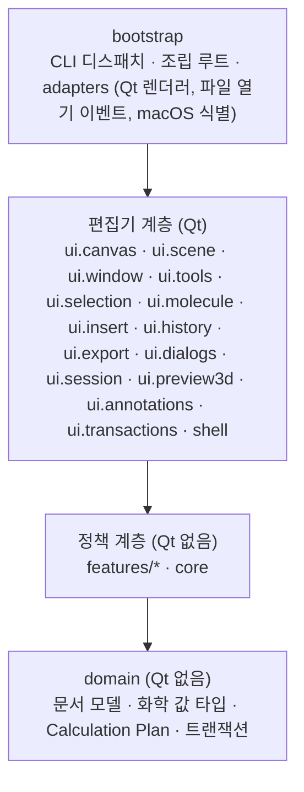
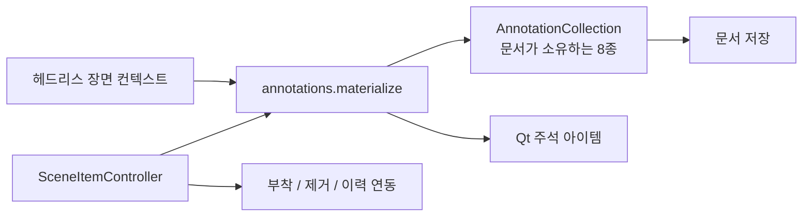
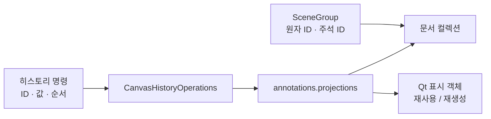
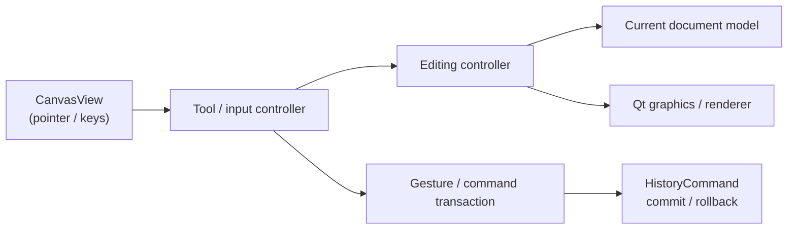

# 아키텍처

[English](ARCHITECTURE.md)

## 패키지별 책임

Chemvas는 책임을 기준으로 코드를 묶습니다. 아래 그림은 주요 패키지 관계를 보여 주며, 반드시 거쳐야 하는 호출 순서가 아닙니다. 현재 경계 규칙은 [ADR 0005](adr/0005-responsibility-based-editor-boundaries.md)에 기록되어 있습니다.

화살표는 아래 방향으로만 향합니다. 이 계층은 선언이 아니라 import 그래프 실측입니다.
`core`와 `features`는 `domain`만 import하고, 편집기 계층은 `features`·`core`·`domain`을
import하며, `bootstrap`만 adapters를 알고 편집기를 조립합니다. `ui.annotations`와
`ui.transactions`는 편집기 아래 계층이 아니라 편집기의 하위 패키지입니다.

### 계층별 역할과 책임

| 계층 | 역할 및 책임 | Qt 의존성 없음 |
| --- | --- | :---: |
| `bootstrap` | CLI 디스패치, 앱 시작, 창·캔버스 서비스 조립, Qt·OS adapters | 부분적 |
| `shell` | 메인 윈도우 셸, 창 레지스트리, 테마, 스타일시트 및 툴바 UI | 있음 |
| `ui.canvas` | `CanvasView`, 런타임 상태와 서비스, 캔버스 범위 컨트롤러 | 있음 |
| `ui.scene` | 장면 항목 작업: 클립보드, 삭제, 변환, 그룹, 기하, 레코드 | 있음 |
| `ui.window` | 메인 윈도우 서비스, 메뉴, 컨텍스트 바, 패널, 최근 문서 | 있음 |
| `ui.tools` | 그리기 도구, 도구 디스패치, 핸들, 스냅, 호버 피드백 | 있음 |
| `ui.selection` | 선택 상태, 외곽선, 조회, 회전, 선택 도구 | 있음 |
| `ui.molecule` | 원자·결합 그래픽, 라벨, 구조 생성 | 있음 |
| `ui.insert` | SMILES·템플릿 삽입 미리보기와 커밋 | 있음 |
| `ui.history` | Undo/Redo 명령 페이로드와 재생 연산 | 있음 |
| `ui.export`, `ui.dialogs`, `ui.session`, `ui.preview3d` | 그림 내보내기·레이아웃 검사, 편집기 대화상자, 자동 저장·복구, 3D 미리보기 도크 | 있음 |
| `ui.annotations` | 편집기와 헤드리스 장면이 공유하는 주석 표시·렌더링·레코드 연결·상태 변환 | 있음 |
| `ui.transactions` | 정확한 롤백을 위한 문서·장면 savepoint | 있음 |
| `features` | 기능 정책과 Qt 없는 구현 | 예 |
| `core` | Qt-free 엔진 계층: 히스토리 명령, 선택적 RDKit 백엔드, molfile·SVG 왕복, 문서 I/O | **없음** |
| `domain` | 핵심 분자 그래프, 문서 스키마, 화학 값 타입, Calculation Plan, 트랜잭션 | **없음** |

## 핵심 컴포넌트

- **CanvasView** (`app/chemvas/ui/canvas/canvas_view.py`): 사용자 입력 처리, 도구 디스패치, 좌표계 변환을 담당합니다. 선택 변경은 `SelectionController`가 소유합니다. 저수준 드로잉 처리는 직접 소유하지 않고 컨트롤러 및 렌더러와 협력합니다.
- **MoleculeModel** (`app/chemvas/domain/document/model.py`): 고유 정수 ID를 가진 원자 및 결합 데이터 구조이며 Qt 의존성이 없습니다.
- **RDKitAdapter** (`app/chemvas/core/rdkit_adapter.py`): SMILES 해석, 3D 좌표 생성, 화학적 특성 계산, 작용기 약어 확장을 담당하는 선택적 백엔드입니다.
- **Renderer** (`app/chemvas/adapters/qt/renderer.py`): `acs1996_style` 드로잉 정책을 적용하는 Qt 렌더링 구현체입니다.
- **HistoryCommand** (`app/chemvas/core/history.py`): 델타 기반 Undo/Redo 엔진입니다. 복합 작업은 `CompositeCommand`로 묶여 원자적으로 실행 취소/다시 실행됩니다.
- **장면 렌더링** (`scene_render_context.py`, `scene_rendering.py`): `SceneRenderContext`를 통해 뷰에 독립적인 분자 그래픽 및 주석 렌더링을 제공합니다 ([ADR 0004](adr/0004-view-independent-scene-rendering.md)).
- **도메인 문서** (`app/chemvas/domain/document`): 문서 직렬화, 스키마 검증 및 Calculation Plan v2 구조를 관리합니다.

## UI 아키텍처 및 경계 원칙

- **기능 소유권**: 상호작용 흐름은 컨트롤러 중심으로 구성하고 구체적인 협력 객체를 직접 주입받아 호출합니다. 캔버스가 소유하는 협력 객체는 한 가지 표기만 갖습니다. 런타임은 `canvas.services.<이름>`(평탄한 `CanvasRuntimeServices`), 상태는 `canvas.runtime_state.<이름>`, 캔버스 셋업이 만드는 객체는 `canvas.model`, `canvas.renderer`, `canvas.rdkit`, `canvas.render_context`, `canvas.bond_renderer`입니다. 이 표기로 단순 위임만 하던 모듈은 제거했습니다 ([ADR 0012](adr/0012-flat-editor-runtime-and-ui-packages.md)).
- **상태 소유권**: `CanvasRuntimeState`가 캔버스 런타임 상태의 단일 소유자이며 `SceneRenderState`를 확장합니다. 상태 복사본을 두지 않고 소유자의 공개 인터페이스를 통해 작업하며, 히스토리·캐시 무효화·수명 주기 처리는 해당 소유자가 전담합니다.
- **동적 의존성 및 수명**: 윈도우 액션은 호출 시점에 활성 문서를 조회합니다. 공통 렌더 컨텍스트는 모델 및 장면 교체 시 최신 인스턴스를 추적하며, 수명 주기 계약을 준수합니다.
- **문서 모델과 장면 분리**: 분자 그래프와 `AnnotationCollection`은 Qt와 독립적으로 문서 데이터를 소유합니다. 주석 8종 모두 이 컬렉션에서 존재 여부·순서·저장 값을 읽으며, 그래픽 아이템은 런타임 ID로 연결된 표시 객체입니다 ([ADR 0010](adr/0010-document-owned-notes-and-marks.md)).
- **의존성 경계**: `domain`과 `core`는 프레임워크 독립(Qt-free)을 유지합니다. 기능 모듈은 데스크톱 구현 시 Qt를 사용할 수 있으나 편집기 위젯이나 애플리케이션 진입점에는 의존하지 않습니다. 헤드리스 API의 GUI 독립성과 패키지 간 비순환 import를 보장합니다.
- **복구 및 렌더링 계약**: 트랜잭션 및 복구 작업은 `CanvasHistoryOperations`, 공통 문서 트랜잭션, `SceneRenderContext` 계약을 준수합니다.
- **선택적 RDKit**: 기본 편집, 그리기, 그림 내보내기는 RDKit 없이 독립적으로 동작합니다.

검토와 테스트 기준은 [기여 가이드](../CONTRIBUTING.ko.md#아키텍처-규칙)를 따릅니다.

### 선택과 문서 생성

`SelectionController`가 장면 선택 쓰기, ID 기반 복원, 전체 선택과 노트 선택을
소유합니다. 조회와 선택 스타일 모듈은 선택 상태를 읽기만 합니다. 클립보드·이미지·
원자 라벨 경로도 컨트롤러를 호출하며, 문서·히스토리 롤백 소유자는 정확한 선택 플래그
복원을 유지합니다. Qt는 러버밴드 입력을 소유합니다. 구조 선택은 중간 신호를 묶고
그룹을 확장한 뒤 완성된 윤곽을 한 번 게시합니다. 노트의 명시적 선택 목록과 Qt 선택
플래그라는 기존 이원 상태는 유지합니다.

`domain.document.build_normalized_document_payload`가 문서 상태를 검증하고 JSON
숫자를 정규화합니다. 데스크톱 생성과 CLI 조합·배치·템플릿 삽입·패치가 이를 공유합니다.
`DocumentPatchResult.payload`는 검증한 후보를 다시 조립하지 않고 CLI로 전달합니다.
CLI 인코딩과 바이트 제한은 `bootstrap.document_cli_shared`가 소유하며, 데스크톱과
CLI의 기존 바이트 형식과 오류 메시지는 유지합니다.

### 문서 내용 이동

`CanvasMoveController`가 원자와 주석의 이동 및 이에 따르는 표식·결합·고리 채움·핸들·
히트 테스트 무효화를 담당합니다. 도구 조립 시 해당 캔버스의 컨트롤러를 `ToolContext`에
주입하며, `MoveTool`, 선택 영역 드래그, `SceneTransformController`가 직접 호출합니다.
일회용 레이아웃 캔버스와 `CanvasHistoryOperations`도 자기 캔버스의 같은 컨트롤러를
사용합니다. 컨트롤러는 캔버스를 보관하고 실행 시 현재 모델을 조회하므로, 문서를 새로
불러온 뒤 이전 모델을 편집 명령에 붙잡아 두지 않습니다.

제스처 트랜잭션, 변환 트랜잭션, 이력 재생은 기존의 캡처·커밋·롤백 책임을 유지합니다.
이동 컨트롤러가 독자적으로 이력을 발행하지 않습니다.

### 문서가 소유하는 주석 컬렉션

`domain/document/annotation_collection.py`의 `AnnotationCollection[Record]`가
도형·화살표·TS 괄호·이미지·오비탈·고리 채움·노트·표식 ID의 순서와 원본 값을 소유합니다. 공통 렌더 상태는 이 문서와 그래픽 조회 사전을 함께 보관합니다.
저장은 문서를 직접 읽으므로 그래픽 아이템을 장면에서 떼거나 파괴해도 주석이
삭제되지 않습니다. 그룹 참조와 레이아웃 진단은 표시 객체가 없는 자리까지 포함한
문서 순서를 사용합니다.

명시적 생성·삭제와 이력 재생은 문서 목록과 그래픽 조회 사전을 함께 갱신하며,
Undo는 원래 순서를 복구합니다. 삭제된 주석의 임시 기록은 표시 객체가 사용하는 동안
유지됩니다. 이력은 ID와 복사한 값을 보관하므로 기록과 표시 객체가 해제돼도 다시
만들 수 있습니다. 아이템 해제는 문서에 남아 있는 주석을 지우지 않습니다. 기존
문서·장면 복구 장치는 작업 중의 롤백을 위해 목록·값·표시 객체를 함께 캡처합니다. 저장 형식과 GUI·헤드리스 공통 렌더러는 그대로 유지합니다.

이미지 레코드는 원본 인코딩 데이터·위치·크기·불투명도·종횡비 잠금을, 오비탈 레코드는
종류·중심·배율·회전을 보관합니다. 편집은 레코드를 갱신한 뒤 표시 객체를 다시 그립니다.
Qt 변환이나 데이터 역할만 바꾸는 것은 문서 편집이 아닙니다. 이미지 삽입과 붙여넣기의
용량 제한도 표시 객체의 생존 여부와 관계없이 문서의 모든 활성 이미지를 셉니다.

고리 채움 레코드는 원자 ID의 순서·색·정밀 불투명도를 보관하며, 좌표는 현재 분자
그래프에서 계산합니다. 저장과 복사는 다각형의 존재 여부에 관계없이 문서를 읽습니다.
고리를 끊는 삭제는 채움도 제거하며 Undo는 원래 문서 순서를 복구합니다. 표시 객체가
사라진 고리를 편집할 때는 같은 기록 ID로 다시 그립니다. 교체된 이전 객체가 나중에
해제돼도 Undo 데이터를 지우지 못하도록 기록 정리 책임도 이전합니다. Qt 브러시나
데이터 역할은 고리 상태의 원본이 아닙니다.
고리는 원자를 통해 그룹에 포함되며, 저장 그룹 형식에 별도 고리 아이템 인덱스를
추가하지 않습니다.

노트 기록은 평문·정제한 HTML·위치·회전을 소유합니다. Qt 편집기는 커서·포커스·텍스트
Undo를 담당하고 입력과 서식 변경 결과를 기록에 반영합니다. 표식 기록은 종류·텍스트·
소속 원자·오프셋·중심·색상을 소유하며 Qt 메타데이터는 이 기록에서 읽습니다. 저장,
원자에 붙은 표식 복사, 전하·라디칼 계산은 표시 객체가 없어도 기록을 읽습니다.
복구 중 위치·글꼴·텍스트를 차례로 되돌릴 때 생기는 중간 신호가 결과를 바꾸지 않도록
네이티브 상태 복원 후 캡처한 문서 기록을 복원합니다.
([ADR 0010](adr/0010-document-owned-notes-and-marks.md))

### 공통 주석 렌더링

`ui.annotations`는 Qt 주석 경계를 한 패키지로 묶습니다.

| 모듈 | 책임 |
| --- | --- |
| `items` | 노트·이미지·오비탈·고리 채움 Qt 아이템 구현 |
| `materialize` | 렌더 컨텍스트와 저장 상태로 주석 생성 |
| `graphics`, `arrows` | 주석 그리기와 화살표 렌더링 |
| `records` | 도형·TS 괄호 레코드와 표시 객체 연결 |
| `marks` | 표식의 네이티브 그래픽과 문서 값 연결 |
| `state` | Qt 경계에서 주석 상태 읽기·적용 |
| `projections` | 문서 ID 조회와 이력 재생 중 사라진 표시 객체 복원 |
| `text` | 공통 노트 글꼴·서식 적용 |

편집기는 노트 포커스 처리와 생성된 아이템의 부착을 담당합니다. 생성·서식·기하 처리는
헤드리스 장면과 같은 구현을 사용합니다. 종류별 복원 전달 함수 7쌍과 별도의 상태
재노출 모듈을 제거했습니다. 이 패키지는 편집 제스처나 이력 스택을 소유하지 않습니다.

### 문서 ID를 사용하는 그룹과 히스토리

`domain.document.groups`의 `SceneGroup`은 원자 ID와 주석 ID를 보관합니다. 저장과
복사는 표시 객체의 생존 여부와 관계없이 문서 순서로 ID를 해석합니다. 저장 파일의
그룹 형식은 그대로입니다.

주석·고리 기하·그룹·표식 소속·텍스트와 서식 변경 명령은 ID와 값을 보관합니다.
`CanvasHistoryOperations`가 재생 시 표시 객체를 찾고, `annotations.projections`는
살아 있는 객체를 재사용하거나 같은 ID로 다시 만듭니다. 약한 참조 캐시는 아이템의
수명을 늘리지 않습니다. 교체 시 기록 정리 책임을 이전하고, 재생 실패 시 캐시도
롤백합니다. Undo는 문서 순서·선택·깊이·분자 그림과의 쌓임 순서를 복원합니다.
서식 명령은 복사한 Qt 값 타입을 사용하지만 위젯·그래픽 아이템·캔버스를 붙잡는
콜백은 보관하지 않습니다.

`history_canvas_access`와 `history_recording_access` 전달 모듈을 제거했습니다.
소비자는 `DocumentSavepoint`, 히스토리 어댑터, 이력 기록 서비스의 실제 소유자에게
직접 요청합니다. ([ADR 0011](adr/0011-document-identities-for-groups-and-history.md))

### 남은 설계 개선

주석 8종의 값과 순서, 그룹 멤버십, 장기간 보관하는 히스토리 데이터가 문서 ID와
값을 사용합니다. 이는 완료한 소유권 경계이며 전체 설계의 완료율은 아닙니다.
이력 재생은 사라진 주석 표시 객체를 복원하지만, 외부에서 손상된 장면 전체를
자동 복구하는 기능은 아닙니다. 이번 범위 밖의 편집기 접근·포트·서비스 전달 모듈은
일부 남아 있습니다. 제스처 상태와 작업 중의 롤백 스냅샷은 정확한 복원을 위해
다루는 Qt 객체를 일시적으로 보관합니다.

## 트랜잭션 및 복구 라이프사이클

- **원자적 트랜잭션**: `DocumentSavepoint`가 문서 전체 상태를 캡처하여 검증하고, 실패 시 안전하게 롤백합니다 ([ADR 0002](adr/0002-single-rollback-kernel.md)).
- **히스토리 관리**: `CanvasHistoryService`가 Undo/Redo 명령과 롤백용 스택 스냅샷을 관리합니다. 명령은 문서 ID와 값을, 작업 중의 롤백 스냅샷은 정확한 네이티브 상태를 보관합니다.
- **자동 저장 및 세션 복구**: 비정상 종료 시 앱 캐시에 저장된 PID 기반 세션 매니페스트를 통해 복구를 수행합니다.

## 데이터 및 렌더 흐름

### 대화형 편집 흐름

### 화학 및 3D 흐름
1. **선택 및 추출**: 선택된 원자와 결합이 정규화된 전하/라디칼 주석과 함께 `MoleculeModel` 서브그래프로 구성됩니다.
2. **백엔드 변환**: `RDKitAdapter`가 분자 그래프를 구성하고 3D 좌표를 생성합니다.
3. **출력**: 3D 미리보기 독에 전달되거나 `.xyz` 파일로 직접 내보내집니다.

### 헤드리스 문서 작업 흐름
헤드리스 CLI 명령(`inspect-document`, `apply-patch`, `render-document`)은 GUI 창이나 세션 복구 없이 독립적으로 소스를 검증하고 실행합니다.

## 화학 및 파일 형식 제약 사항

- **내보내기 범위**: 3D 변환 및 분자 내보내기 시 화학 그래프 데이터만 포함하며, 분자가 아닌 주석(화살표, 대괄호, 텍스트)은 제외합니다.
- **지원되는 작용기 약어**: `ATOM_ALIAS_DEFINITIONS`에 정의된 정규 별칭:
  `Me`, `Et`, `OH`, `NH2`, `SH`, `Ph`, `PPh3`, `OMe`, `Boc`, `CO2Me`, `t-Bu`, `tBu`, `i-Pr`, `CF3`, `OTs`, `Ts`, `OMs`, `Ms`, `OTf`, `Tf`, `Ns`, `OAc`, `Ac`.
- **입체화학**: 쐐기/해시 결합은 단일 결합에만 적용됩니다.
- **형식 호환성**: Chemvas는 문서 버전 7 및 8을 지원하며, 저장 시 버전 8(스키마 1)로 기록합니다.

## 아키텍처 결정 기록 (ADR)

ADR을 언제 쓰는지, 작성 규칙과 템플릿은 [ADR 안내](adr/README.md)에 있습니다(영어).

- [ADR 0001: 기능 지향 모듈화](adr/0001-feature-oriented-modularization.md)
- [ADR 0002: 단일 롤백 커널](adr/0002-single-rollback-kernel.md)
- [ADR 0003: 선택 이동 저장점 범위](adr/0003-scoped-move-savepoint.md)
- [ADR 0004: 뷰 독립적 장면 렌더링](adr/0004-view-independent-scene-rendering.md)
- [ADR 0005: 책임을 기준으로 한 편집기 경계](adr/0005-responsibility-based-editor-boundaries.md)
- [ADR 0006: 문서가 소유하는 도형](adr/0006-document-owned-shapes.md)
- [ADR 0007: 문서가 소유하는 주석 컬렉션](adr/0007-document-owned-annotation-collections.md)
- [ADR 0008: 공통 주석 렌더링과 문서 레코드](adr/0008-shared-annotation-rendering-and-records.md)
- [ADR 0009: 문서가 소유하는 고리 채움](adr/0009-document-owned-ring-fills.md)
- [ADR 0010: 문서가 소유하는 노트와 마크](adr/0010-document-owned-notes-and-marks.md)
- [ADR 0011: 그룹과 히스토리의 문서 ID](adr/0011-document-identities-for-groups-and-history.md)
- [ADR 0012: 평탄한 편집기 런타임과 `ui` 하위 패키지](adr/0012-flat-editor-runtime-and-ui-packages.md)
- [ADR 0013: 모듈 분할, 창 포트, `core` 범위](adr/0013-editor-followups-splits-ports-core-scope.md)
- [ADR 0014: 캔버스·창 상태의 단일 표기](adr/0014-one-spelling-for-canvas-and-window-state.md)
- [ADR 0015: 모델·장면 아이템 접근의 소유자, Qt 없는 `features`](adr/0015-owners-and-qt-free-features.md)
- [ADR 0016: 타입이 있는 창 경계와 상태 쓰기의 소유자](adr/0016-typed-window-boundary-and-state-owners.md)
- [ADR 0017: 명시적 복구와 편집기 상태 정책](adr/0017-explicit-recovery-and-editor-state-policies.md)
