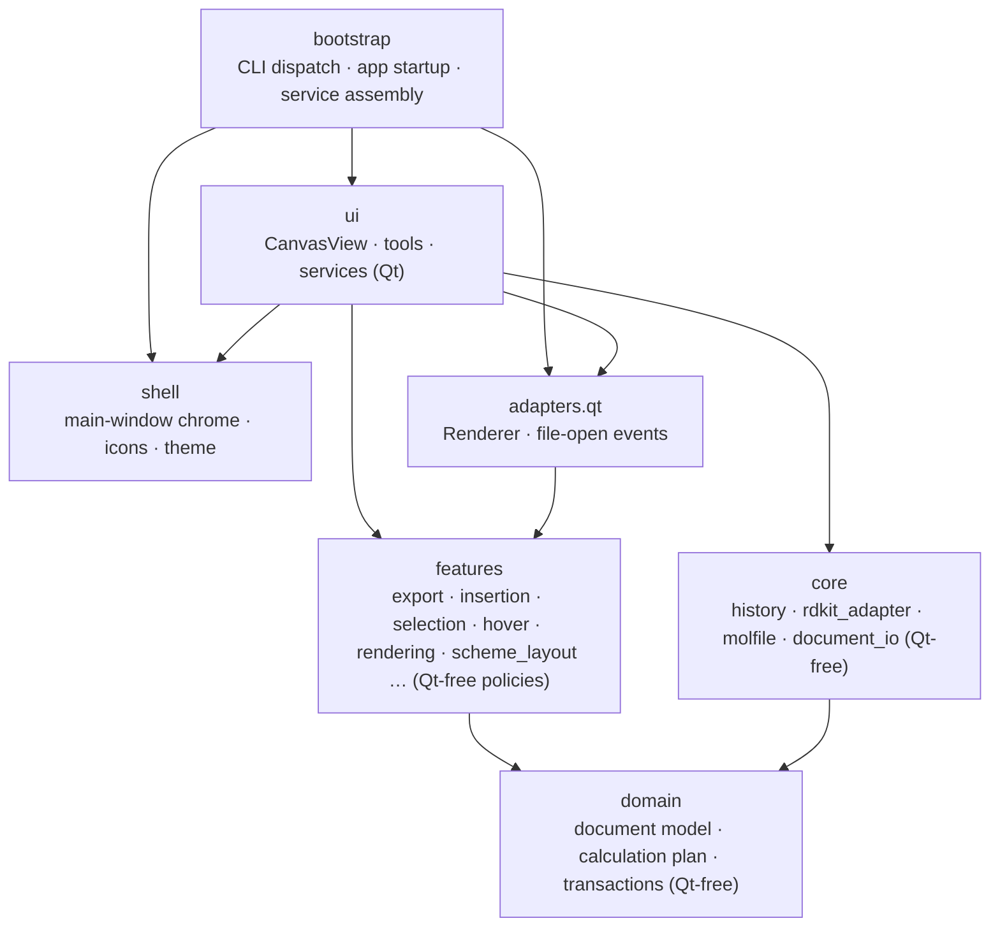
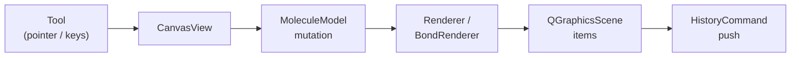

# Architecture

[한국어](ARCHITECTURE.ko.md)

## Layers at a glance

A non-normative snapshot of who may import whom. Arrows point from the
importing package to the one it depends on; the target boundaries are set by
[ADR 0001](adr/0001-feature-oriented-modularization.md).

## Current Implementation Map (Non-Normative)

This section describes the code as it exists during migration. The target
package boundaries and dependency direction are defined by
[ADR 0001](adr/0001-feature-oriented-modularization.md); new features should
follow the ADR instead of copying the flat `core` / `ui` layout below.
- CanvasView (`app/chemvas/ui/canvas_view.py`): input handling, tool dispatch, selection state, and coordinating model/render/history updates. It should not own low-level drawing primitives.
- MoleculeModel (`app/chemvas/domain/document/model.py`): pure atom/bond data and IDs. No Qt dependencies.
- RDKitAdapter (`app/chemvas/core/rdkit_adapter.py`): optional chemistry backend for SMILES import, property calculation, 3D coordinate generation, alias expansion, and preview scene building. Alias validation is centralized and shared by scene, XYZ, MOL, and calculation-artifact paths; carbon-bound `PPh3` expands only as one-single-bond phosphonium `C-[P+](Ph)3`, while ambiguous attachment or explicit electronic annotations fail closed. UI code should treat RDKit as a best-effort service, not a required startup dependency.
- Renderer (`app/chemvas/adapters/qt/renderer.py`): Qt pens/brushes and fonts,
  driven by the pure `chemvas.features.rendering.acs1996_style` policy.
- HistoryCommand (`app/chemvas/core/history.py`): delta-based undo/redo. Multi-entity operations are grouped with `CompositeCommand`, which applies its child delta commands in order on redo and in reverse on undo.
- Scene drawing (`scene_render_context.py`, `scene_rendering.py`): an explicit `SceneRenderContext` supplies the scene, current model, style and shared drawing state to molecular and annotation renderers. `CanvasRuntimeState` extends that same state with editor-only fields; the GUI does not keep a second drawing-state copy. See [ADR 0004](adr/0004-view-independent-scene-rendering.md).
- BondRenderer (`app/chemvas/ui/bond_renderer.py`): bond QGraphicsItem creation/updates using the drawing context. `SceneGeometry` and `AtomLabelRenderer` own view-independent geometry and label drawing; editor services retain edits and history.
- Arrows and lines (`app/chemvas/ui/canvas_arrow_build_service.py`): `CanvasArrowBuildService` owns record changes and derived paths and labels. Serialization, moves, handles and endpoint snapping read the same Qt-free `Arrow` records in the shared drawing state. Menu events carry kind IDs, not display labels.
- Graphics items (`app/chemvas/ui/graphics_items.py`): non-selectable QGraphicsItem wrappers.
- Label layout (`app/chemvas/features/annotations`): pure, Qt-free parsing of a raw atom-label string into typographic runs (subscripts) plus their placement. It is the single source of truth for both on-screen and outlined export typography.
- Figure export (`app/chemvas/features/export`): the feature package owns its public API, Qt-free dialog/plan rules, scene scoping, and SVG/PDF/raster renderers. External callers import only `chemvas.features.export`; renderer modules are private implementation details. The pure plan computes the padded source rect / physical output size in points. The Qt service collects visible content items, excludes transient overlays, uses item-specific export bounds when available, outlines labels, and renders to SVG, PDF, PNG, or TIFF. `unit_scale` or `target_width_pt` gives deterministic physical sizing independent of zoom; `scope` and `background` choose the exported content and backdrop.
- Insertion (`app/chemvas/ui/insert_controller.py`): `InsertController` owns SMILES and ring insertion sessions, mode switching, cancellation, sheet bounds, and preview lifetime. `app/chemvas/features/insertion` owns pure planning and geometry, including aromatic inner segments for benzene; the shared `preview_scene_*` modules render the previews. `InsertCommitService` retains the document mutation and undo/recovery path. Successful ring placement keeps insertion active; successful SMILES placement ends it.
- Bond previews (`app/chemvas/features/rendering/bond_preview.py`, `app/chemvas/ui/bond_preview_renderer.py`): the feature policy computes plain-double preview segments without Qt values, and one Qt renderer builds, updates, attaches, and clears preview items through the concrete `BondRenderer`. The canvas access leaf serves the two active callers; resolver dataclasses, per-call lambda wiring, and separate geometry/scene-item role modules have been removed.
- Selection (`app/chemvas/features/selection`, `app/chemvas/ui/selection_controller.py`): the feature package owns Qt-free hit/geometry policy. One per-canvas `SelectionController` owns structure and explicit note selection, group reconciliation, hit preference and outline updates. `SelectionOutlineService` remains its graphics collaborator. `selection_queries.py` reads the scene/note union; a snapshot reads Qt selection once. `selection_state.py` owns `SelectionState` (explicit notes, color, outlines and suspension) plus the one typed `selection_for(canvas)` lookup. Qt-selected notes and explicitly selected notes keep distinct group semantics. Document and scene savepoints restore both selection lists in place, preserving identity; scene reset clears them. Selection is held directly at `CanvasRuntimeServices.selection`, while the shared hit-testing service is a separate runtime field. The former selection bundle, access forwarding layer and four one-purpose services are removed.
- Hover (`app/chemvas/features/hover`, `app/chemvas/ui/hover.py`): the feature public API owns the Qt-free transient state and update policy. One per-canvas `HoverController` owns Qt orchestration, while `hover_rendering.py` owns graphics-item helpers. `canvas_hover_state.py` remains a one-function runtime-state leaf to keep the eager import graph acyclic. `CanvasRuntimeServices.hover` exposes the controller directly; the former hover access/ports/bundle and four-service stack have been removed.
- Domain document (`app/chemvas/domain/document`): owns the Qt-free molecule model plus versioned document/clipboard serialization and validation policies. The former `chemvas.core.model` and `document_state` paths have been removed.
- Calculation plans and artifacts (`app/chemvas/domain/document/calculation_plan.py`, `app/chemvas/domain/document/plan_validation.py`, `app/chemvas/domain/document/conversion.py`, `app/chemvas/domain/document/precomplex.py`, `app/chemvas/domain/document/precomplex_profile.py`, `app/chemvas/features/calculation_bundle`, `app/chemvas/bootstrap/calculation_bundle.py`): the document domain owns the strict Plan v2 schema, the plan's consistency rules (a state's declared charge against its components, matching element labels across a mapping) and the records a conversion hands back (`AtomMapEntry`, `CalculationArtifacts`). It still reads, validates and preserves endpoint precomplex state written by Chemvas 0.15.0 and earlier, using the profile registry for that validation only; Chemvas no longer generates or uses that state, and a supplied plan that contains it is stored unchanged. The Qt-free feature APIs own connected-component selection, endpoint-specific roles, correspondence readiness, bond changes, deterministic path prechecks, the electronic-state and atom-map validation of generated calculation artifacts, and the generated-atom correspondence between step endpoints. The Calculation dialog projects included atoms into one ID-based mapping table, preserves partial drafts and explicit unmapped choices, and delegates the final candidate to that same feature/domain validation path. `calculation_mapping_highlight.py` owns dialog-scoped, non-selectable atom-ID labels colored by mapping state; they never enter document serialization, selection state, or history and are cleared on every dialog exit. Bootstrap owns `.chemvas` I/O, optional RDKit composition, deterministic single-file step serialization, per-component geometry generation in reactant identity order, and atomic non-overwriting publication. `application.main` dispatches `inspect`, `attach-plan`, `inspect-plan`, and `pack-step` before importing Qt, while an argument-free invocation keeps the desktop startup path.
- Agent document patches (`app/chemvas/features/document_patch`, `app/chemvas/bootstrap/document_patch.py`): the Qt/provider-free feature API owns deterministic full-graph inspection, strict Graph Patch v1 validation, copy-based ordered mutation, dependent coordinate movement, and final document/Calculation Plan gates. Bootstrap reads and hashes the exact source bytes, rejects duplicate/non-standard JSON, encodes the candidate deterministically, and publishes through the shared atomic non-overwriting file creator. `inspect-document` and `apply-patch` are dispatched before Qt; no natural-language model or chemistry inference runs inside Chemvas.
- Headless document rendering (`app/chemvas/bootstrap/document_render.py`): bootstrap validates the bounded file/output contract before lazily composing a `QApplication`, `QGraphicsScene` and drawing context, without a `CanvasView`. The shared `populate_document_scene` builds graphics, and the same whole-sheet `FigureExportService` used by the GUI resolves content once, checks resource limits before painting, and renders SVG/PNG/PDF to private temporary storage. Bootstrap reuses the returned plan for render report v1, including native PDF whole-point dimensions. Only bounded output is atomically published without replacement; the source and output hashes, point/pixel dimensions, and document version form the report. Desktop windows, session recovery, RDKit loading, editable SVG payloads, and TIFF are outside this command.
- Migrated feature policies (`app/chemvas/features/{export,session,annotations,rendering,insertion,selection,hover}`): each package exposes one public API for its cohesive planning/geometry/state contracts. The former flat compatibility modules have been removed and `test_package_dependencies.py` prevents their return.
- Main-window composition: `chemvas.shell.main_window` owns the thin Qt shell; `chemvas.bootstrap` owns runtime/service assembly, window registration, document opening, and application startup. Qt file-open events enter through `chemvas.adapters.qt`.
- Application chrome (`app/chemvas/shell/{palette,stylesheet,theme,toolbar_styles,toolbar_buttons,icon_design,icon_factory,icon_pixmap_factory}.py`): the shared palette, main-window stylesheet, theme aggregation, toolbar button styles/widgets, and the SVG design-icon factories are shell-owned per ADR 0001. They form a closed leaf set (they import only each other), and the legacy flat `chemvas.ui` widgets consume them during the migration — those `ui -> shell` edges are legitimate (chrome belongs to shell) and sit outside the target-layer dependency gate, which only checks edges whose source is a target layer.

`chemvas.domain.document.inspection` owns shared connected-component inventory,
effective charge/radical marks and model/mark consistency checks. Composition,
graph inspection, patching and calculation preparation use this one owner,
and `chemvas.domain.document.plan_validation` owns the plan's consistency
rules the same way. Calculation state selection, readiness, bond changes
and artifact validation remain in `features.calculation_bundle`, which
re-exports the domain names it used to define. Saving, Graph Patch and the
RDKit conversion never import that feature; a dependency test keeps it so.
The inspection module itself imports neither Qt nor RDKit.
These semantic checks are not native document-opening gates: users must still
be able to open drawings that need repair. The previously published generic
exports at the calculation package root refer to the same canonical objects;
internal callers import the domain owner directly.

Calculation-plan validation and reporting reuse its request-local
`ComponentInventory`. Editor preparation uses structural validation so users can
repair semantic errors such as an inconsistent charge. The calculation feature's
pure step-edit operation owns duplicate-step rejection and the retention or
clearing of stored precomplex state; the dialog collects widget values and
presents errors.
No inventory is cached across document edits.

**Calculation support boundary.** Calculation-menu operations are separate from
saved calculation-plan data. The menu registers a lazy callback: opening the
main window does not load the calculation dialog, mapping overlay or calculation
feature. The existing command-line dispatcher likewise loads its calculation
bootstrap only for the registered calculation commands. Support remains enabled;
this boundary introduces no feature switch or plugin framework.

| Responsibility | Owner and support-retirement rule |
| --- | --- |
| Operational calculation UI | `ui/calculation_step_dialog.py` and `ui/calculation_mapping_highlight.py`; entered through `_build_calculation_menu` in `ui/main_window_menu_bar.py`. |
| Preparation and handoff | `features/calculation_bundle` and `bootstrap/calculation_bundle.py`; CLI registration/help in `bootstrap/application.py` owns `inspect`, `attach-plan`, `inspect-plan`, and `pack-step`. |
| Existing document data | The document domain, canvas plan state, snapshots and history retain the supported plan schema, structural validation, preservation and edit-integrity rules. These are document compatibility responsibilities, not optional calculation operations. |
| Shared chemical services | RDKit, molecule inspection, SMILES/MOL/XYZ conversion and Molecule Info serve other features. Retiring Calculation does not retire that backend or those capabilities. Calculation-specific adapter methods must be audited by their callers at retirement. |

If support is later retired, remove the GUI registration and the calculation CLI
registrations/help together with their operational consumers. Preserve supported
plan data and its integrity checks under the document compatibility policy;
removing that data would require a separate explicit compatibility decision.
Do not catch missing feature imports and silently discard plans. General editing
must not acquire new imports of these operational modules: the package dependency
check permits only their declared entry points and internal dependencies.
`test_calculation_feature_boundary.py` blocks operational-module imports in a
fresh process, opens the real main window, opens a document with a draft plan,
moves atoms, saves/reopens and renders PNG. Its output bytes must match two
normal baseline runs; menu dispatch remains separately tested.

Figure-export preflight and rendering share the items and geometry returned by
the feature's `resolve_export_plan` within one synchronous request. After the
export service validates the plan, `render_export_plan` paints it without measuring
again. Independent `export_scene` and `plan_figure_export` calls always resolve
fresh geometry; plans are not cached across edits. Selection rotation, clipboard
placement, and atom movement share the pure perspective geometry in
`chemvas.features.selection`. A screen-space move applies the inverse projection
delta to stored coordinates, preserving depth, the camera frame, and any existing
stale-coordinate residual. Selection status uses the same item identity for Qt
selection and the selected-note registry, so their overlap is counted once.

## Transitional UI Discipline (ports / access / state / services)
The `app/chemvas/ui` package retains small role modules where they separate real responsibilities during the structural migration. The goal is that `CanvasView` and `MainWindow` stay thin Qt shells (no god object), every service is constructible headlessly, and all dependencies are explicit.

These rules remain migration constraints for code that still lives in the flat
package. They are not a template that every new feature must reproduce:
new feature packages create role modules only when the boundary is useful.

- **State modules** (`*_state.py`): unmigrated concerns use one dataclass plus a `<name>_state_for(canvas)` accessor. These accessors read their field straight off the eagerly-built `CanvasRuntimeState` container (`chemvas.ui.canvas_runtime_state.py`) — `return cast(CanvasGraphState, canvas.runtime_state.graph_state)`. The container is a `slots=True` dataclass, so a renamed or misspelled field raises instead of quietly becoming a second copy of the state. They neither attach state lazily nor fall back to a plain canvas attribute: the former `ensure_canvas_state` and `canvas_state_object` seams have been removed, and `document_metadata_state_for` follows the same direct runtime-container rule as every other state accessor. `SheetSetupState` is the sole owner of sheet size, orientation, and rect; those values are not mirrored onto the canvas. Transaction snapshots likewise resolve optional runtime fields only from the container; lightweight model/scene-only captures without a container omit runtime state instead of consulting same-named canvas attributes. Focused tests give their doubles a partial container with `tests/runtime_state.canvas_runtime_state(**states)`, which validates the field names against the real one. `model` is a direct canvas attribute rather than a runtime field, but canvas setup creates it, so `model_for` only reads it — a canvas without one is a wiring bug, not a cue to substitute a fresh empty document. `renderer`, `rdkit`, and `bond_renderer` are setup-owned direct collaborators, resolved through their access modules without lazy creation or fallback. Migrated hover state is owned by `chemvas.features.hover`; its thin UI leaf reads the required runtime field directly and never attaches or falls back. Input-view keeps its real state dataclass in `input_view_state.py` with lookup in the canonical `input_view_access.py`, while callback state keeps its dataclass and getter together. `test_state_accessors_read_the_runtime_container_directly` enumerates the accessors in scope and fails an accessor that stops reading the container, so neither a renamed lookup helper nor an accessor that synthesizes its own state passes.
- **Access modules** (`*_access.py`): free functions (`foo_for(canvas)`) wrapping one operation. They must not reach into `canvas.services` directly; service lookup is delegated to the matching ports module.
- **Ports modules** (`*_ports.py`): the general modules that resolve the service container (`canvas_services_for` / `window` private storage). Everything else receives collaborators via injection or calls a port. Production ports read only the canonical `CanvasRuntimeServices` API. Cohesive groups remain grouped, while single runtimes such as `graph_service`, `tool_controller`, `hover`, `selection`, `hit_testing_service`, and `atom_label_service` are stored directly. Flat service aliases and duck-typed production adapters are removed; focused tests build partial canonical runtimes with `tests/runtime_services.py`. `canvas_service_ports` maps a role to its place in the container: within that module each container path has exactly one port name, and every port, plus the four access wrappers that pass a port's result straight on, returns the concrete service type, so a caller using the result is checked against the service it gets (`test_canvas_service_ports_name_each_container_path_once_with_its_type`). The window ports compose `active_canvas_for_window` with these canvas ports and never resolve the container themselves, so they add no container resolver. The selection feature has one explicit exception: its typed leaf `selection_state.selection_for` resolves only `.services.selection`, avoiding another port/access forwarding chain and runtime controller imports (`CANVAS_SERVICE_CONTAINER_RESOLVERS`). `CanvasRuntimeServices` names every bundle and single-runtime type under `TYPE_CHECKING`, so mypy sees what the container holds while the module stays a leaf at run time; the history/transaction cluster's acyclicity rule counts eager and lazy imports and leaves annotation-only edges out, because an edge that never executes cannot make two modules wait on each other. That `TYPE_CHECKING` block is the one separator between the cluster and the bundles that import it eagerly: moving one of its imports to module level or into a function closes a real cycle, which the cluster test and the eager-DAG test both reject. mypy resolves the annotation-only cycle as one unit, so a cross-module attribute inside it needs an explicit annotation where inference used to do (`Tool.canvas`). `CanvasView`'s event overrides ask `canvas_view_ports` for the input or pointer controller and call it, falling back to the Qt base handler while services are not attached yet; no router module sits in between.
- **Services and controllers**: constructed once per canvas in `chemvas.ui.canvas_services.py` with explicit keyword injection — no service locator inside services, no `=None` collaborator defaults that hide a missing wire. Assembly stores cohesive groups as bundles in `CanvasRuntimeServices`; a single runtime is stored directly instead of receiving a one-member bundle. The obsolete graph/tool wrapper bundles and the builder-injection composer layer have been removed. A service hands the canvas to access functions and never touches an attribute of it itself — not `canvas.model`, not `canvas.scene()`, not a `getattr` with a string name — so what a service can reach is the access functions it imports and what they return, and that import list is where to look when asking what an edit rule may change. `test_services_reach_the_canvas_only_through_access_functions` bans attribute access on the names `canvas`, `_canvas`, `view` and `_view`, bare or on `self`, in every `ui/*_service.py` and `ui/*_controller.py`, with no exception list; the canvas under another name is the reviewer's to catch. A service that needs something new from the canvas receives it as an injected collaborator where assembly can provide one (hit testing is handed the view's `viewportTransform` this way), and otherwise adds an access function; a function that only renames a lookup is not a boundary.
- **core is UI- and Qt-free**: `app/chemvas/core` must not import `ui` or Qt, including dynamic imports. History commands receive bound operations instead of selecting a UI implementation. Concrete Qt rendering lives in `chemvas.adapters.qt.renderer`; new core-to-Qt dependencies are forbidden.
- **RDKit is optional**: it must never become a hard import at app startup. Any feature that needs it degrades gracefully, or fails with a clear message, when it is absent — see `chemvas.core.rdkit_adapter`. The 3D constraints below say what that means for the export action specifically; the rule itself is general.

The two view-controller ports explicitly return `CanvasInputController | None`
and `CanvasPointerController | None`. Their concrete types are imported only
under `TYPE_CHECKING`; the existing `None` result during Qt setup is preserved.

These rules are enforced by `tests/test_architecture_boundaries.py`. New rules
must be dependency contracts or general pattern bans. Some transitional checks still
pin removed names or implementation locations; each feature migration replaces
those checks with package/public-API contracts before retiring them.

Known trade-offs of this discipline (accepted deliberately): a real indirection tax (~20% of ui LOC is wiring) and weak static typing at the canvas seam (`canvas: Any`); the `Any` is a key a service passes to accessors, not a door it opens, because the attribute-read ban above keeps it from becoming a service locator. When an invariant spans several of these small modules (e.g. the derived graph index), the consistency contract must be written down in one owner module — see the `chemvas.features.graph` package docstring and `CanvasGraphService.bond_id_between_with_repair` for the pattern.

## Feature Qt Migration Inventory

The target boundary keeps concrete Qt integration in `chemvas.adapters`, but the
ongoing namespace migration still has direct Qt imports in a fixed set of feature
implementation modules. `FEATURE_QT_MIGRATION_ALLOWLIST` in
`tests/test_package_dependencies.py` is the executable inventory: new modules may
not join it, and each adapter migration removes its module from the set.

Emptying the set is **not** currently a reachable goal — eight of the twelve
remaining entries are irreducibly Qt (figure export takes a `QGraphicsScene` as
input), and migrating the rest would add ports and wiring without removing a real
dependency. See [ADR 0001](adr/0001-feature-oriented-modularization.md) for the
measurement. Treat the list as a frozen inventory that may only shrink until that
end state is decided.

## Transaction and Recovery Ownership

- `ToolController.prepare_for_document_edit` cancels an active pointer gesture
  through that tool's existing owner before keyboard/menu document mutations.
  Tools expose their existing gesture state; there is no parallel mouse-state
  tracker. Focused text editors retain their own editing route. Ordinary
  Perspective tool switching still commits, while this boundary cancels.
- `CanvasHistoryService` is the sole owner of undo/redo stack policy and of the immutable `HistoryStackSnapshot` value. Exact top-level undo/redo operations capture one document savepoint; nested commands defer to that operation.
- Core and UI history commands receive bound operations, never the whole canvas.
  Small structural protocols describe the operations each command family needs.
  `CanvasRuntimeState.create` assembles one `CanvasHistoryOperations` per canvas;
  this UI adapter privately binds the canvas and reuses canonical mutation and
  transaction owners. It has no public canvas accessor or generic proxy.
  `CanvasHistoryService` receives the operations and stack state explicitly.
  Initial execution, inverse compensation, composite children, and nested
  transaction scopes all use the same operations instance. Commands retain their
  existing data payloads; annotation/sheet callbacks are bound to value-only calls.
  `test_history_operations.py` and `test_history_atom_lifecycle_port.py` exercise
  replay with small state-owning doubles, without importing UI or Qt or patching
  a global resolver. Real-Qt tests continue to cover scene identity, recovery,
  stack policy, and GUI/CLI equivalence. This is an execution boundary, not a new
  history engine or a replacement for the document savepoint.
- Note formatting reads the existing scene/note selection union; an active text
  editor keeps its native cursor and Undo across temporary menu-popup focus.
  `CanvasStyleController` owns document-wide note appearance and new-note defaults.
  Its existing annotation-style history command carries exact settings and affected
  note HTML/font/color/default text-option payloads; `DocumentSavepoint` remains
  the rollback owner.
- Selection nudge/alignment and Select/Move drag commands record exact before/after geometry,
  including existing depth coordinates and dependent marks/ring fills. Replay
  restores atoms before their dependent scene items, then refreshes the selection
  outline once. These command payloads are not a second rollback or stack owner.
- Bond-length history specializes that same exact-geometry command: restore
  the renderer length and mark glyph dimensions before atom positions and exact
  attached-mark positions in either direction. This preserves absolute-anchor
  marks as well as stored offsets without adding another savepoint owner.
- Drag command payloads are captured lazily at the first effective movement,
  alongside the existing scoped savepoint. Bound marks additionally retain exact
  local Qt positions in history only; persisted attachment offsets stay unchanged.
- Perspective session setup re-expresses unrelated cached drawing coordinates
  when replacing the global projection frame. Their screen positions and depth
  stay unchanged; cache-only edits join the existing rotation history and rollback
  payload without moving unrelated scene items. These are drawing coordinates,
  not a guarantee of a scientific conformer's geometry.
- Document replacement delegates stack capture/restore to that history owner, and destructive scene reset delegates silent stack discard. These operations preserve the live stack lists; document replacement separately retains the original Qt scene items through its detached-scene snapshot.
- Recorded structure builds keep their pre-build savepoint until history recording succeeds. A recording failure uses that existing rollback authority; successful publication does not capture another whole-document savepoint just to verify recording.
- Benzene template insertion uses that same committer scope around the mutation-only ring builder, without a nested recorded build. Successful insertion captures once; no-op and failed insertion restore through the same owner. The recorder's existing inverse-command savepoint on a failed history push remains separate from the pre-build capture.
- `chemvas.ui.transactions.document.DocumentSavepoint` is the public owner of whole-document capture, restore, verification, and release. It composes the lower-level object-graph, scene-runtime, and scene-rect primitives in the same package. `history_commands` owns command classes, not a private snapshot toolkit.
- `chemvas.domain.transactions` owns only framework-free `RestoreOutcome` validation, recovery-note attachment, the best-effort rollback-step runner that attaches those notes, and the one-shot restore helper. `chemvas.core.history` and the `chemvas.ui` rollback call sites share that one runner.
- `transactions.recovery` holds the only production call to `BaseException.add_note`, so the secondary-failure sentence is written once and every other module supplies a phase instead of its own wording. A call site either hands that phase to `run_rollback_step`, or — where one handler compensates in several steps, or has to re-raise or return a structured result — calls `add_recovery_error_note` directly; what it must not do is wrap either one back up into a private note helper or a private runner. `test_architecture_boundaries.py` fails if a second module attaches an exception note, or if a second function appears whose whole body is one `try` that does nothing but note the failure.
- A restore is applied once and verified once. If exact restoration cannot be established, history applies ADR 0002's conservative fail-closed stack policy and leaves durable recovery to autosave/session restore. The removed retry, authority-channel, compatibility-probing, and parallel stack-snapshot layers must not return.
- Autosave session ownership is bound to a PID plus a process-creation identity. `session.json` stays in the strict version-1 shape understood by older concurrent binaries; an atomic `owner.json` sidecar binds the PID to its creation identity for new readers. A live PID with the same or an unreadable identity remains untouched; a different identity proves PID reuse and makes the crashed session recoverable. Legacy identity-less manifests keep the conservative live-PID policy.
- Application Quit resolves all window prompts before recording the saved-file
  reopen list without serializing discarded live drafts, then freezes snapshots
  while existing asynchronous preview shutdown closes the
  windows. Alternate app-data recovery discovery is read-only and reports paths;
  it does not merge sessions or establish another durable recovery journal.
- Desktop startup does not reopen previous documents. Only explicitly requested files are loaded; crash autosave snapshots remain on disk with manual recovery instructions. Explicit recovery APIs and snapshot formats remain supported.
- Desktop document paths are canonical `.chemvas` paths. Startup, OS-open, File Open, and Open Recent reject or ignore `.json` drawing paths. An abnormal-session snapshot may recover current internal autosave state, but an unsupported original path is cleared so the recovered canvas is unbound and unsaved.

## Data/Render Flow
Tools -> CanvasView -> MoleculeModel mutation -> Renderer/BondRenderer -> QGraphicsScene updates -> HistoryCommand push.

3D flow: export command or preview refresh -> current molecule / active atom-bond selection -> MoleculeModel subgraph + atom mark annotations -> RDKitAdapter conversion graph build -> RDKit 3D embedding -> `.xyz` writer or preview scene.

Calculation flow: headless `inspect` -> validated `.chemvas` state -> stable indexed connected-component/bond/alias inventory; `attach-plan` or the Calculation dialog -> document with reusable states, endpoint-specific roles, an explicit included-atom mapping table, and Calculation Plan v2; dialog lifetime -> transient atom-ID labels colored by mapping state; `inspect-plan` -> mapping/readiness plus path precheck. A step with a complete mapping and matching charge and multiplicity proceeds to `pack-step` whatever its component count. `pack-step` applies the charge/multiplicity and complete-bijection gates, embeds each included component separately, and atomically publishes one `factory/machine-observation` v1 / `chemistry/elementary-step` v2 `machine.json`. A qualifying artifact carries per-component XYZ indexed in one canonical reactant identity order, canonical 0-based reaction-center indices, and bond changes with their atom indices, but no relative placement of separate molecules. The GUI suggests exact shared IDs and optional same-element structural mappings without mechanistic inference. Chemvas does not place components, claim optimization or stability, or replace downstream quantum optimization and scientific review.

Agent-edit flow: `inspect-document` -> exact source SHA-256 plus stable atom/bond inventory -> untrusted Graph Patch v1 -> strict schema/hash gate -> ordered mutations on a deep copy -> structural and semantic Calculation Plan validation -> deterministic candidate hash -> dry-run report or one atomic non-overwriting `.chemvas` publication. The input file version and out-of-scope scene state are preserved; any failed operation or stale plan produces no output.

Headless render flow: `render-document` -> exact source read/hash and record-count gate -> validated state populated in a view-independent scene -> canonical whole-sheet export plan -> point/pixel resource gate -> private SVG/PNG render -> output byte gate -> one atomic non-overwriting publication -> hash-and-dimension JSON report. Qt is lazy but required for painting; RDKit and the desktop session-recovery service are not started.

### Shared bond-removal semantics

What a bond removal takes with it is decided once, in
`domain.document.edits`: `orphaned_atom_ids` names the endpoints left with no
bond that nothing keeps on the sheet, `atom_shows_itself` says which atoms show
without a bond (a heteroatom or an explicit label; a mark is the caller's
knowledge), and `broken_ring_fill_indices` / `ring_fill_is_intact` name the
fills that no longer describe a bonded cycle. The single-bond delete, the
selection delete plan, the eraser session and Graph Patch `remove_bond` all
call these functions and apply the result in their own way: the GUI through
history commands and scene updates, the patch on its copied state, dropping the
removed atom's perspective coordinate and group membership and omitting an
emptied collection as the desktop does when it saves. Ring fills are judged on
the document as it will be after the edit, not on the removed edge alone.
`tests/test_document_edits.py` pins the rules, and the bond-deletion cases in
`tests/test_document_edit_roundtrip.py` delete the same bond on the desktop and
through `apply_document_patch` and compare the resulting documents. Breaking a
rule in the domain fails every path's tests, which is the point: a fix to what
counts as a bare atom is made in one place.

### Shared atom-move semantics

GUI moves and Graph Patch `move_atom` share the inverse-projection rule in
`domain.document.perspective`. GUI item updates and history remain separate from
the CLI's copied-state validation and publication. The cross-path regression in
`tests/test_document_move_equivalence.py` starts both from the same desktop
snapshot and compares actual Select/Move input with a separate `apply-patch`
process. It checks the moved atoms, bound marks, ring geometry and stored depth,
alongside unchanged document content, exact GUI Undo/Redo and GUI reopening of
both saved results.
Live mark centres and ring polygons are checked separately: a correct serialized
snapshot alone does not prove that the visible companions moved.

This is an atom-move contract, not a universal edit engine or byte-equivalence
promise for every accepted input. Desktop snapshots already rebuild ring points
from their atoms; a raw patch preserves tiny unmoved-point residuals accepted by
the document validator. Snapshots also omit stale perspective-cache entries;
their GUI movement and history are checked separately in live state, not claimed
as serialized CLI coverage. GUI cancellation/no-op history and CLI no-op rejection
remain distinct, as do CLI-only terminal-angle restrictions. Extend shared rules
and cross-path tests one operation at a time when there is a real common rule.

### Shared bond-edit semantics

GUI bond shortcuts and Graph Patch `update_bond` change the same document bond
fields. A patch matching a named GUI order/style action specifies both fields;
the CLI does not infer the GUI preset from an order-only request. Its unordered
endpoint locator retains the bond's stored direction and is not a direction-flip
operation. GUI graphics/history and CLI copy/validate/publish remain separate.

`tests/test_document_bond_edit_equivalence.py` compares actual hover/key input
and a separate public CLI process against a literal expected document, changing
only the requested bond order/style. Representative single/double/triple,
directed wedge/hash and explicit unknown-stereo removal cases also check live
Qt primitives and their paint, unchanged document/selection state, exact
Undo/Redo and GUI restoration from both saved results. These tests and the
atom-move regressions reuse the existing GUI fixtures and a shared public CLI
launcher; operation-specific fixtures and graphical expectations remain separate.

Input policies are not interchangeable. A repeated GUI preset can be a no-op,
while an unchanged patch is rejected. Drawing a new single bond over an existing
double is an overlay gesture, not the named Single action. Cosmetic GUI shortcuts
protect unknown double-bond stereo; choosing Double explicitly can remove its
unknown-stereo marker.
An explicit CLI style change is not that cosmetic gesture. These distinctions
do not require another shared edit engine.

### Document data ownership (shapes, TS brackets, arrows and lines)

`MoleculeModel` owns atoms and bonds as Qt-free data, and shapes, TS brackets,
arrows and lines are records (below). Every other drawn object a document saves — ring fills,
notes, marks, orbitals, images — is still read back from its live graphics item when the document is
written, and history commands hold those items. The pilot moves one kind at a
time to the same footing as the molecule, starting with shapes:
`chemvas.domain.document.Shape` is the Qt-free record, `shape_from_state` and
`shape_to_state` convert to and from the existing schema, and
`validate_shape_fields` stays the one definition of a valid shape state. The
graphics item stays (recovery keeps verifying item identity); what changes, step
by step, is that saving, undo and edits read the record and the item only draws
it. For shapes that is now the case. Each canvas has a shape store
(`CanvasShapeState`, a runtime-state field captured by every rollback path) and
every shape item carries a runtime id. An edit — state apply for
undo/redo/flip/rotate/restyle, move, resize, fill, a colour rollback — computes
a new `Shape` and hands it to `set_shape_record_for`, which stores its
`normalized_shape` and draws the item from it (`render_shape_item`; besides it
only the build service paints a shape item, once, and an exact rollback snapshot
restores paint together with the record). A state that arrives — open, paste,
undo re-creation — becomes the record as given. Every read of a shape's state —
document save, undo capture, clipboard, delete capture, flip and rotate, scheme
layout — comes from the record through `shape_state_dict_for`; an attached shape without
a record is an error, not something to reconstruct from its brush. The store is
a lookup, never the list of shapes: the attached shape items say which shapes
the document has. Detached records stay while history or a rollback snapshot
holds their items. A weak finalizer removes a record when the last reference to
its graphics-item wrapper is released, so discarded redo branches and evicted
history entries do not keep otherwise unreachable records. The finalizer holds
only the state and id, not the item, and reads the state's current mapping;
rollback and document replacement may replace that mapping. A new document
still clears the store explicitly; subsequent insertions retain records held
by earlier history commands. Ids are never reused: they come from
`new_scene_record_id`, a counter kept outside the runtime state so that no
rollback rewinds it while history still holds an item with a later id. Saved values are
therefore the ones the document states: an opacity of 0.25 is saved as 0.25
where Qt's read-back used to write 0.2500038, and a file Chemvas already saved
re-saves unchanged. `tests/test_shape_record_first.py` holds both criteria and
`tests/test_shape_store_sync.py` checks after every operation that the item
draws its record and carries nothing else: a shape item holds its kind and its
id, no rectangle, kind or stroke, and cannot join the document's shapes without
a record. `test_shape_values_live_in_records_not_on_graphics_items` keeps shape
outlines to the two modules that paint them and keeps the old item-side reader
from coming back. The same steps — record, store kept in step, reads flipped,
item emptied — are the template for the remaining kinds.

TS brackets follow the same record-first ownership. `chemvas.domain.document.TSBracket` is the
record, and each canvas has a bracket store (`CanvasTSBracketState`, in the same
two rollback field lists as the shape store) with a runtime id on every bracket
item. An edit — `CanvasMoveController.move_item`, state apply for undo, redo,
flip and rotate — computes a new `TSBracket` and hands it to
`set_ts_bracket_record_for`, which stores its `normalized_ts_bracket` and draws
the item from it (`render_ts_bracket_item`: the path is rebuilt in scene
coordinates with the document's bond settings and the item stays at the
origin). A state that arrives — open, paste, undo re-creation — becomes the
record as given, and a bracket drawn with the tool gets its record from the
rectangle and kind it was drawn with. Every read of a bracket's state —
document save, undo capture, clipboard, delete capture, flip and rotate, scheme
layout — comes from the record through `ts_bracket_state_dict_for`; an attached
bracket without a record is an error. A `TSBracket` no document could hold
cannot be built, so an edit that would produce one (a move past the largest
number a document may hold) raises before it touches the record or the item.
Saved values are therefore the ones the document states: a rectangle given
with its corners swapped saves 10.2 where Qt's read-back wrote
10.199999999999989, and a file Chemvas already saved re-saves unchanged.
Record lifetime follows the shape rule, and ids come from
`new_scene_record_id`. A failed add removes only its new record, without copying
either whole store. `tests/test_scene_record_lifetime.py` exercises record
release and retention through history and rollback for both kinds.
The bracket item carries its scene kind and id, not a second rectangle or
bracket kind. An item without a record cannot join the document's brackets;
the item-only reader, apply branch and adoption path are removed. Export
readability gets the bracket kind from the record while retaining the item's
construction glyph run to measure the font actually painted. Exact whole-document and scoped graphics snapshots retain that run together with the path, including across failed redraws; a path with missing provenance is still rejected.
`tests/test_ts_bracket_record_first.py` holds the
acceptance criteria and `tests/test_ts_bracket_store_sync.py` checks after
every operation that each attached bracket item shows exactly its record.

Arrows and lines use the immutable `chemvas.domain.document.Arrow` record and
`CanvasArrowState` in the existing scene-items state module. The shared
`SceneRenderState` owns this store, including for view-independent export.
`CanvasArrowBuildService.set_record` is the common edit and render path for
creation, restore, movement, endpoint/control edits, labels and color. Items
carry only their kind and runtime id; `arrow_state_dict_for` reads the record,
not paint or Qt payloads. Moving an arrow rebuilds it in scene coordinates.
Default curved controls retain the previous normalization and native and
clipboard schemas remain unchanged. The former curved-path service and its
forwarding ports are removed.

Both document rollback field lists include the arrow store. Records remain
while history retains detached items; weak finalizers read the current store
mapping and remove records when wrappers are released. Failed adds discard
their new record immediately, even if an exception retains the item. Document
replacement clears the store and rollback restores its original owner, values
and graphics identities. `tests/test_arrow_record_first.py` covers record
ownership and failed edits/adds; `tests/test_scene_record_lifetime.py` also
exercises straight arrows, curves and lines through history and finalization.

## Composite Grouping

Native template CLI composition (`bootstrap.document_template`) joins the
existing insertion public planner, Qt geometry resolver and native template
commit on an isolated canvas. It is an explicit legacy UI composition boundary,
registered in the package dependency test, not a second ring engine. Source
identity/geometry preservation and final document validation precede atomic
publication. Graph Patch's Qt-free `set_terminal_angle` delegates dependent
coordinates to its existing move-atom path and retains the final semantic gate.

Layout QA reuses native glyph and painted bond paths for atom–nonincident-bond
and attached-charge–bond intersections. The bootstrap candidate budget includes
both cross products before Qt restore. Attached arrow labels carry a native
above/below witness and use the same glyph paths against text, bonds, arrow
strokes and shape borders; their comparisons are included in the pre-Qt budget.
The report states diagnostic coverage without claiming semantic design approval.
These read-only diagnostics do not add geometry changes or a parallel font renderer.
Both default and sheet-only checks share one native-content containment pass,
including molecular paint, decoration children and attached arrow labels.
Sheet-only omits the pairwise work entirely, retains the input byte/record limits,
and reports boundary coverage without collision counts or approval. Publication
examples pin their final document bytes across checking and rendering; normal
document Save/Open and output-only physical sizing remain independent.

Explicit scheme layout uses a Qt-free request validator in
`chemvas.features.scheme_layout`, a headless bootstrap command, and
`ui.scheme_layout_service` beside the existing native canvas movement services.
The UI integration reuses the canonical document item-index map, text-paint
geometry and move kernels. It copies changed coordinates and native group
membership into the output; an explicit arrow-color override copies only that
existing per-arrow field. It does not serialize a replacement text/style
representation or add a second persistent layout schema. Named comparison rows
and per-block caption stacks are optional policies of the same planner.

Explicit `align-y` branches within the same measured-plan/movement pipeline. It
measures molecular paint only, supports explicit disjoint atom parts and row
reference blocks, and copies only vertical geometry changes back. Captions,
all X coordinates and existing groups stay exact. The omitted-mode arrange path
and its JSON report remain unchanged; no new persistent schema or GUI mode is added.

Optional width-limited layout reuses those measurements with a Qt-free ordered
row partitioner. Continuation arrows remain native arrows, placed at the start
of the next line; reports retain source row/block identities. Omitted width
budgets keep the original shared-column path.

The desktop Arrange Scheme dialog converts explicit existing-group choices into
the same validated request. Its read-only measured plan becomes native move
commands inside the existing document transaction, recorded as one composite
undo/redo operation without replacing the scene or group identities. An explicit
arrow-color override uses the existing scene-item state command in that same
composite edit. The dialog requires explicit note-role selection instead of
inferring captions from current coordinates. GUI export
options use the shared dimension-budget guard and canonical readability service;
the existing atomic temporary writer protects the destination on rejection.
Notes and arrow labels share one native rich-text export outline implementation.
Automatic list markers retain Qt numbering with resolved pixel fonts; no parallel
text layout or SVG-font parser is maintained.

When an operation touches multiple entity types at once (ex: atom creation plus bond creation), CanvasView groups the individual delta commands into a single `CompositeCommand` so the whole operation undoes/redoes atomically.

## 3D Conversion Constraints
- Export scope is limited to chemical graph data. Arrows, bracket annotations, free text, and other scene-only annotations must be ignored when building the export payload.
- RDKit stays optional. If it is unavailable, the export action should fail with a clear message rather than introducing a hard dependency into app startup.
- Canvas charge/radical marks should be normalized into per-atom annotations before conversion so formal charge and radical electrons survive into RDKit.
- The canonical alias table is `chemvas.domain.atom_aliases.ATOM_ALIAS_DEFINITIONS`: `Me`, `Et`, `OH`, `NH2`, `SH`, `Ph`, `PPh3`, `OMe`, `Boc`, `CO2Me`, `t-Bu`, `tBu`, `i-Pr`, `CF3`, `OTs`, `Ts`, `OMs`, `Ms`, `OTf`, `Tf`, `Ns`, `OAc`, and `Ac`. These aliases should be expanded into explicit fragments at conversion time. Unsupported abbreviations must still fail loudly instead of guessing.
- Wedge/hash bonds should be translated into RDKit bond directions on single bonds only. Invalid stereo usage should fail with a precise message.
- SMILES insertion uses RDKit wedging before copying bond endpoints to preserve absolute tetrahedral stereo; specified double-bond, non-tetrahedral, and relative/racemic stereo are rejected. After Kekulization, only RDKit single, double, and triple bond types are representable; dative, unspecified, quadruple, or residual aromatic types are rejected rather than rounded or clamped. Molecule Info identifiers reuse the preview conversion for element labels and neutral terminal `OH`, `NH2`, and `SH` aliases. These three aliases require exactly one single attachment bond (wedge/hash allowed) and no nonzero charge or radical annotation, preserving the displayed hydrogen count. Other aliases retain unavailable identifiers. SMILES import keeps element labels; hydrogen display is not inferred or written into document atoms.
- `.xyz` is coordinate-only. Bond order and reaction semantics are not preserved in the output format and should not be treated as round-trippable state.
- Calculation Plan v2 stores explicit states, `included`/`context_only` membership, endpoint-specific roles, and source atom correspondence. Plans saved by Chemvas 0.15.0 and earlier can also hold step-side precomplex ensembles and reviewer selections made with the `chemvas-rigid-precomplex-placement/2` profile; they remain readable and are preserved, but nothing uses them. The plan does not infer roles, contacts, spin state, coordination, or a reaction mechanism. The elementary-step handoff is one `machine.json` with a common envelope and an inline domain payload containing provenance, mapping, bond changes, and conditional separately embedded component geometries. Those geometries are initial guesses that require downstream placement, quantum optimization and researcher review.
- The preview window should reuse the same conversion path as `.xyz` export to avoid divergence between what the user sees and what gets exported.
- The 3D preview opens as a separate modeless window from **View ▸ Molecule Info**. It uses the selected-structure conversion path, owns the `Export 3D XYZ` action for the selected molecule, and shows an empty preview when no chemical structure is selected.
- Each open canvas tab is an independent document with its own file path and clean/dirty digest. `.chemvas` loading accepts only the canonical single-canvas payload.
- `.chemvas` reads versions 7 and 8 and writes version 8, schema 1 (minimum reader 0.18.0). Supported v7 reads must survive future writer-version changes, as required by the [document compatibility policy](DOCUMENT_COMPATIBILITY.md). Native I/O and embedded editable-SVG documents share the domain reader validation. The canonical payload uses compact bond arrays without deleted-slot tombstones and, when present, Calculation Plan v2. Bond identity is runtime-scoped — the calculation plan references stable atom ids and complete connected-component atom-id sets, not bond positions.

## Refactoring Sequence

The active modularization sequence, completion criteria, and dependency rules
are maintained in [ADR 0001](adr/0001-feature-oriented-modularization.md).
The transaction/history rollback ownership, threat model, and fail-closed
recovery semantics are decided in
[ADR 0002](adr/0002-single-rollback-kernel.md).
Selection-move savepoint scoping and its accepted limits are decided in
[ADR 0003](adr/0003-scoped-move-savepoint.md).
