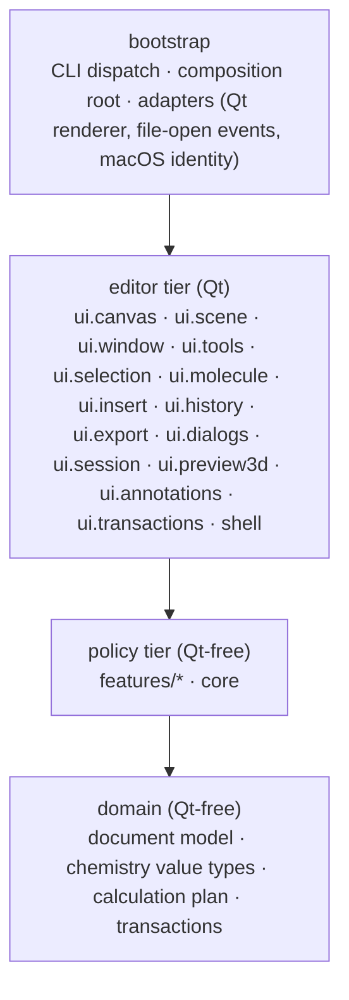
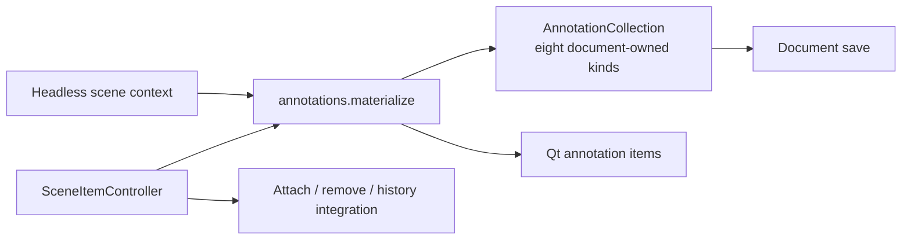
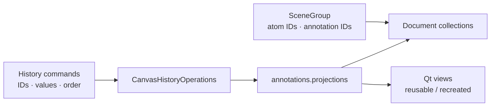
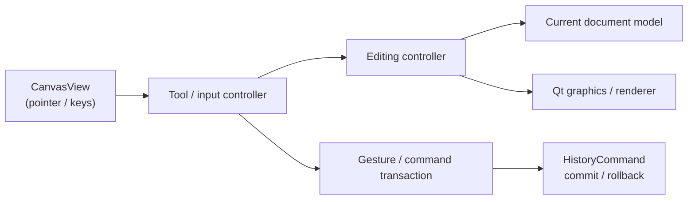

# Architecture

[한국어](ARCHITECTURE.ko.md)

## Package Responsibilities

Chemvas groups code by responsibility. The diagram shows the main package relationships; it is not a required call chain. [ADR 0005](adr/0005-responsibility-based-editor-boundaries.md) defines the current boundary policy.

Arrows only point downward. The tiers are measured from the import graph, not
asserted: `core` and `features` import only `domain`, the editor tier imports
`features`, `core` and `domain`, and `bootstrap` alone knows the adapters and
assembles the editor. `ui.annotations` and `ui.transactions` are subpackages of
the editor, not layers below it.

### Layer Responsibilities

| Layer | Responsibility | Qt-Free? |
| --- | --- | :---: |
| `bootstrap` | CLI dispatch, application startup, window and canvas service assembly, Qt and OS adapters | Partial |
| `shell` | Main window shell, window registry, theme, stylesheet, and toolbar controls | No |
| `ui.canvas` | `CanvasView`, its runtime state and services, and canvas-scoped controllers | No |
| `ui.scene` | Scene item operations: clipboard, delete, transform, groups, geometry, records | No |
| `ui.window` | Main window services, menus, context bar, panels, and recent documents | No |
| `ui.tools` | Drawing tools, tool dispatch, handles, snapping, and hover feedback | No |
| `ui.selection` | Selection state, outlines, queries, rotation, and the select tool | No |
| `ui.molecule` | Atom and bond graphics, labels, and structure building | No |
| `ui.insert` | SMILES and template insertion previews and commits | No |
| `ui.history` | Undo/redo command payloads and their replay operations | No |
| `ui.export`, `ui.dialogs`, `ui.session`, `ui.preview3d` | Figure export and layout checks; editor dialogs; autosave and recovery; the 3D preview dock | No |
| `ui.annotations` | Shared annotation items, rendering, record binding and state codecs; used by both editor and headless scenes | No |
| `ui.transactions` | Document and scene savepoints for exact rollback | No |
| `features` | Feature policies and Qt-free implementations | Yes |
| `core` | The Qt-free engine tier: history commands, optional RDKit backend, molfile and SVG round-trips, document I/O | **Yes** |
| `domain` | Core molecular graph, document schema, chemistry value types, Calculation Plan, and transactions | **Yes** |

## Core Components

- **CanvasView** (`app/chemvas/ui/canvas/canvas_view.py`): Handles input events, tool dispatch, and coordinate mapping. Selection mutations belong to `SelectionController`. Coordinates with controllers and renderers without directly managing low-level drawing primitives.
- **MoleculeModel** (`app/chemvas/domain/document/model.py`): Pure atom and bond data structure with stable integer IDs. Independent of Qt.
- **RDKitAdapter** (`app/chemvas/core/rdkit_adapter.py`): Optional chemistry backend for SMILES parsing, 3D coordinate generation, property calculation, and chemical alias expansion.
- **Renderer** (`app/chemvas/adapters/qt/renderer.py`): Qt painting implementation applying `acs1996_style` drawing policies.
- **HistoryCommand** (`app/chemvas/core/history.py`): Delta-based undo/redo engine. Multi-entity operations are atomically bundled into a `CompositeCommand`.
- **Scene Rendering** (`scene_render_context.py`, `scene_rendering.py`): `SceneRenderContext` provides a view-independent context for rendering molecular graphics and annotations ([ADR 0004](adr/0004-view-independent-scene-rendering.md)).
- **Domain Document** (`app/chemvas/domain/document`): Manages document serialization, schema validation, and Calculation Plan v2 data structures.

## UI Architecture & Service Boundaries

- **Feature ownership**: Interaction workflows are centered in controllers, which call concrete collaborators directly. Each canvas-owned collaborator has one spelling: runtimes are `canvas.services.<name>` (a flat `CanvasRuntimeServices`), state is `canvas.runtime_state.<name>`, and the objects canvas setup creates are `canvas.model`, `canvas.renderer`, `canvas.rdkit`, `canvas.render_context` and `canvas.bond_renderer`. Modules that only forwarded to one of those spellings were removed ([ADR 0012](adr/0012-flat-editor-runtime-and-ui-packages.md)).
- **State ownership**: `CanvasRuntimeState` is the single owner of canvas runtime state and extends `SceneRenderState`. Other modules interact via the owner's public interface without duplicate state; history, invalidation, and lifecycle management remain the owner's responsibility.
- **Dynamic dependencies and lifecycle**: Window actions resolve the active document at invocation time. The shared render context tracks replacement models and scenes, adhering to lifecycle contracts.
- **Document models and scene separation**: Molecular graphs and `AnnotationCollection` own document data independently of Qt. All eight annotation families use this collection for membership, order and saved values; graphics items are projections keyed by runtime ID ([ADR 0010](adr/0010-document-owned-notes-and-marks.md)).
- **Dependency boundaries**: `domain` and `core` remain Qt-free. Features may contain desktop Qt implementations but must not depend on editor widgets or application entry points. Headless feature APIs maintain GUI-free import guarantees, and cross-package eager imports remain acyclic.
- **Recovery and rendering contracts**: Transactions and error recovery adhere to `CanvasHistoryOperations`, shared document transactions, and `SceneRenderContext` contracts.
- **Optional RDKit**: Core editing, drawing, and figure export function independently without RDKit.

See [Contributing](../CONTRIBUTING.md#architecture-conventions) for review and test criteria.

### Selection and document construction

`SelectionController` owns scene selection writes, ID restoration, whole-canvas
selection and note selection. Queries and selection styling only read selection.
Clipboard, image and atom-label workflows call the controller; the document and
history rollback owners retain their exact selected-flag restoration. Qt still
owns rubber-band input. Structure selection batches intermediate signals, expands
groups, then publishes one complete outline update. Notes retain their explicit
selection list alongside the Qt scene flags.

`domain.document.build_normalized_document_payload` validates document state and
normalizes JSON numbers. Desktop creation and CLI composition, layout, template
insertion and patches share it. `DocumentPatchResult.payload` carries the validated
candidate to the CLI without rebuilding it. CLI encoding and byte limits remain
in `bootstrap.document_cli_shared`; desktop and CLI serializers retain their
existing byte formats and error messages.

### Moving document content

`CanvasMoveController` owns translation of atoms and annotation geometry, including
dependent marks, bonds, ring fills, handles and hit-test invalidation. Tool assembly
injects that canvas's controller into `ToolContext`; `MoveTool`, selection dragging
and `SceneTransformController` call it directly. Disposable layout canvases and
`CanvasHistoryOperations` use the same controller from their own canvas services.
Controllers retain the canvas, resolving its current model when used, so loading a
replacement document does not leave an old model attached to an editing command.

Gesture transactions, transform transactions and history replay retain their
existing capture, commit and rollback responsibilities. The movement controller
does not publish history independently.

### Document-owned annotation collections

`AnnotationCollection[Record]` in `domain/document/annotation_collection.py` owns
ordered IDs and canonical records for shapes, arrows, TS brackets, images,
orbitals, ring fills, notes and marks. The shared
render state holds these collections alongside graphics lookups.
Saving reads the document directly; detaching or destroying a graphics item does
not delete its annotation. Group references and layout diagnostics use document
order,
including empty slots where a projection is missing.

Explicit add/delete and history replay update document membership and the graphics
lookup together. Undo restores the original document order. Detached records stay
available while a live projection uses them. History retains IDs and copied values,
so it can recreate a collected record and projection. Finalization cannot remove
active document annotations. Existing document and scene savepoints capture
membership, records, and projections for short-lived rollback. The saved file
format and the shared GUI/headless renderer are unchanged.

Image records include the original encoded source, geometry, opacity and aspect
lock. Orbital records include kind, center, scale and rotation. Editing updates
these records and then redraws their projections; changing a Qt transform or data
role alone does not edit the document. Image insertion and paste budgets count
every active document image, including those without a live projection.

Ring-fill records retain ordered atom IDs, color and exact opacity. Their points
come from the current molecular graph. Saving and copying use these records even
when the Qt polygon is absent; graph deletion removes broken fills and Undo
restores them in document order. Before editing a ring whose projection is gone,
the renderer reuses its record ID to rebuild the view. Replacing a dead wrapper
transfers detached-record cleanup so that old wrappers cannot erase Undo data.
Qt brush opacity and topology roles do not own ring state.
Rings participate in groups through their atoms; no ring-item index is added to
the saved group format.

Notes retain plain text, sanitized HTML, position and rotation in document records.
Native editor changes publish those values while Qt retains cursor, focus and
text Undo. Marks retain kind, text, atom binding, offsets, center and color;
metadata roles are derived from these records. Save, atom-bound mark copying and
electronic-state reconciliation read records even when views are absent. Failed
native frame restoration reinstates the captured record after position, font and
text are restored, preventing intermediate editor signals from changing the result.

### Shared annotation rendering

`ui.annotations` groups the Qt annotation boundary in one package:

| Module | Responsibility |
| --- | --- |
| `items` | Note, image, orbital and ring-fill Qt item implementations |
| `materialize` | Create an annotation from saved state using a render context |
| `graphics`, `arrows` | Annotation drawing and arrow rendering |
| `records` | Bind shape/TS bracket records to their projections |
| `marks` | Bind native mark graphics to document values |
| `state` | Read and apply annotation state at the Qt boundary |
| `projections` | Resolve document IDs and recreate missing views during history replay |
| `text` | Apply common note typography and appearance |

The editor supplies note focus handling and attaches the resulting item. Creation,
styling and geometry use the same implementation as a headless scene. Seven
pairs of per-kind restoration wrappers and the separate state re-export facade
have been removed. The package owns no editor gesture or history stack.

### Groups and history use document identities

`SceneGroup` in `domain.document.groups` stores atom IDs and annotation IDs. Save
and clipboard serialization map those IDs through document order, including
members without a live view. The saved group format is unchanged.

Annotation, ring geometry, group, mark binding and text/style history commands
store IDs and values. `CanvasHistoryOperations` resolves views at replay time;
`annotations.projections` reuses a live view or recreates it under the same ID.
The weak projection cache does not prolong item lifetime. Replacement transfers
record cleanup ownership, and savepoints restore the cache on failed replay.
Undo preserves document order, selection, depth and stacking relative to molecular
graphics. Style commands retain copied Qt value types, never a widget, graphics
item or callback that closes over the canvas.

The `history_canvas_access` and `history_recording_access` forwarding modules are
removed. Callers use `DocumentSavepoint`, the history operations adapter, or the
recording service that owns the work. See [ADR 0011](adr/0011-document-identities-for-groups-and-history.md).

### Remaining design work

All eight annotation families own their values and order in the document. Group
membership and the long-lived history payloads now use IDs and values too. This
is a description of completed boundaries, not a percentage of the entire redesign.
History can recreate missing annotation projections; arbitrary external damage to
a live scene is not a general self-healing workflow. Other editor access/ports and
service forwarding modules remain outside this migration. Gesture state and
short-lived rollback snapshots intentionally retain the Qt objects they operate on.

## Transaction & Recovery Lifecycle

- **Atomic Transactions**: `DocumentSavepoint` handles whole-document capture, validation, and rollback upon error ([ADR 0002](adr/0002-single-rollback-kernel.md)).
- **History Management**: `CanvasHistoryService` manages commands and stack snapshots for undo/redo and rollback. Commands retain document identities and values; temporary rollback snapshots retain exact native state.
- **Autosave & Session Recovery**: Unexpected terminations are tracked via PID-bound session manifests in the application cache.

## Data & Render Flow

### Interactive Editing Flow

### Chemistry & 3D Flow
1. **Selection & Extraction**: Selected atoms and bonds form a `MoleculeModel` subgraph with normalized charge/radical annotations.
2. **Backend Conversion**: `RDKitAdapter` builds the molecular graph and generates 3D coordinates.
3. **Output**: Transferred to the 3D preview dock or exported directly to an `.xyz` file.

### Headless Document Flow
Headless CLI commands (`inspect-document`, `apply-patch`, `render-document`) validate source inputs deterministically and execute without launching desktop windows or session recovery.

## Chemical & Format Constraints

- **Export Scope**: 3D conversion and molecular exports include only chemical graph data; non-molecular annotations (arrows, brackets, text notes) are ignored.
- **Supported Aliases**: Canonical aliases defined in `ATOM_ALIAS_DEFINITIONS`:
  `Me`, `Et`, `OH`, `NH2`, `SH`, `Ph`, `PPh3`, `OMe`, `Boc`, `CO2Me`, `t-Bu`, `tBu`, `i-Pr`, `CF3`, `OTs`, `Ts`, `OMs`, `Ms`, `OTf`, `Tf`, `Ns`, `OAc`, and `Ac`.
- **Stereochemistry**: Wedge and hash stereochemistry maps only to single bonds.
- **Format Compatibility**: Chemvas reads document versions 7 and 8, and writes version 8 (schema 1).

## Architecture Decision Records (ADR)

- [ADR 0001: Feature-oriented modularization](adr/0001-feature-oriented-modularization.md)
- [ADR 0002: Single rollback kernel](adr/0002-single-rollback-kernel.md)
- [ADR 0003: Scoped move savepoint](adr/0003-scoped-move-savepoint.md)
- [ADR 0004: View-independent scene rendering](adr/0004-view-independent-scene-rendering.md)
- [ADR 0005: Responsibility-based editor boundaries](adr/0005-responsibility-based-editor-boundaries.md)
- [ADR 0006: Document-owned shapes](adr/0006-document-owned-shapes.md)
- [ADR 0007: Document-owned annotation collections](adr/0007-document-owned-annotation-collections.md)
- [ADR 0008: Shared annotation rendering and records](adr/0008-shared-annotation-rendering-and-records.md)
- [ADR 0009: Document-owned ring fills](adr/0009-document-owned-ring-fills.md)
- [ADR 0010: Document-owned notes and marks](adr/0010-document-owned-notes-and-marks.md)
- [ADR 0011: Document identities for groups and history](adr/0011-document-identities-for-groups-and-history.md)
- [ADR 0012: Flat editor runtime and `ui` subpackages](adr/0012-flat-editor-runtime-and-ui-packages.md)
- [ADR 0013: Module splits, window ports and `core` scope](adr/0013-editor-followups-splits-ports-core-scope.md)
- [ADR 0014: One spelling for canvas and window state](adr/0014-one-spelling-for-canvas-and-window-state.md)
- [ADR 0015: Owners for model and scene-item access, Qt-free `features`](adr/0015-owners-and-qt-free-features.md)
- [ADR 0016: A typed window boundary, and owners for state writes](adr/0016-typed-window-boundary-and-state-owners.md)
