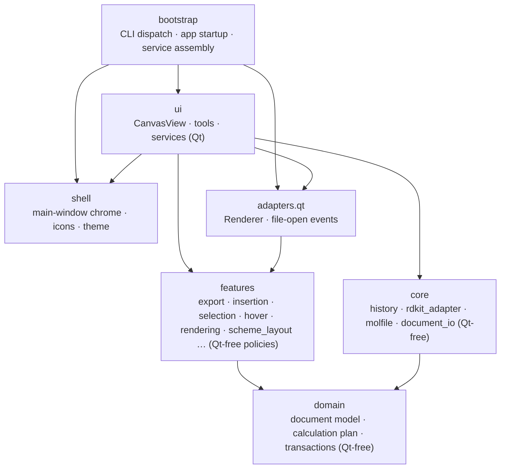
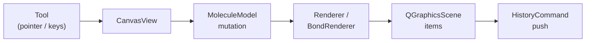

# Architecture

[한국어](ARCHITECTURE.ko.md)

## Layers at a Glance

Chemvas follows a feature-oriented layered architecture. Dependency arrows point from importing packages toward their dependencies ([ADR 0001](adr/0001-feature-oriented-modularization.md)).

### Layer Responsibilities

| Layer | Responsibility | Qt-Free? |
| --- | --- | :---: |
| `bootstrap` | CLI dispatch, application startup, and service assembly | Partial |
| `shell` | Main window shell, theme, stylesheet, and toolbar controls | No |
| `ui` | `CanvasView`, tool event handling, controllers, and canvas services | No |
| `adapters.qt` | Qt-specific rendering and OS file-open event filtering | No |
| `features` | Domain policies: figure export, structure insertion, selection, hover, and layout | **Yes** |
| `core` | History commands, optional RDKit backend, and molfile I/O | **Yes** |
| `domain` | Core molecular graph, document schema, Calculation Plan, and transactions | **Yes** |

## Core Components

- **CanvasView** (`app/chemvas/ui/canvas_view.py`): Handles input events, tool dispatch, selection state, and coordinate mapping. Coordinates with controllers and renderers without directly managing low-level drawing primitives.
- **MoleculeModel** (`app/chemvas/domain/document/model.py`): Pure atom and bond data structure with stable integer IDs. Independent of Qt.
- **RDKitAdapter** (`app/chemvas/core/rdkit_adapter.py`): Optional chemistry backend for SMILES parsing, 3D coordinate generation, property calculation, and chemical alias expansion.
- **Renderer** (`app/chemvas/adapters/qt/renderer.py`): Qt painting implementation applying `acs1996_style` drawing policies.
- **HistoryCommand** (`app/chemvas/core/history.py`): Delta-based undo/redo engine. Multi-entity operations are atomically bundled into a `CompositeCommand`.
- **Scene Rendering** (`scene_render_context.py`, `scene_rendering.py`): `SceneRenderContext` provides a view-independent context for rendering molecular graphics and annotations ([ADR 0004](adr/0004-view-independent-scene-rendering.md)).
- **Domain Document** (`app/chemvas/domain/document`): Manages document serialization, schema validation, and Calculation Plan v2 data structures.

## UI Architecture & Service Boundaries

To maintain modularity and prevent tight coupling in `app/chemvas/ui`:
- **State Modules** (`*_state.py`): Canvas-scoped state is held in explicit dataclasses stored on `CanvasRuntimeState`.
- **Access Modules** (`*_access.py`): Typed accessor functions query canvas state without exposing internal component references.
- **Ports Modules** (`*_ports.py`): Define explicit interfaces for service resolution and decoupling.
- **Services & Controllers**: Instantiated per canvas in `canvas_services.py` with explicit collaborator injection. Services interact with canvas state solely via accessor functions.
- **UI-Free Core**: `app/chemvas/core` and `app/chemvas/domain` must remain completely free of Qt imports.
- **Optional RDKit**: RDKit is strictly optional; core editing and drawing functionality functions normally without it.

## Transaction & Recovery Lifecycle

- **Atomic Transactions**: `DocumentSavepoint` handles whole-document capture, validation, and rollback upon error ([ADR 0002](adr/0002-single-rollback-kernel.md)).
- **History Management**: `CanvasHistoryService` maintains the undo/redo stack using immutable snapshots.
- **Autosave & Session Recovery**: Unexpected terminations are tracked via PID-bound session manifests in the application cache.

## Data & Render Flow

### Interactive Editing Flow

### Chemistry & 3D Flow
1. **Selection & Extraction**: Selected atoms and bonds form a `MoleculeModel` subgraph with normalized charge/radical annotations.
2. **Backend Conversion**: `RDKitAdapter` builds the molecular graph and generates 3D coordinates.
3. **Output**: Transferred to the 3D preview dock or exported directly to an `.xyz` file.

### Headless Document Flow
Headless CLI commands (`inspect-document`, `apply-patch`, `render-document`) validate source inputs deterministically and execute without launching desktop windows or session recovery.

## Chemical & Format Constraints

- **Export Scope**: 3D conversion and molecular exports include only chemical graph data; scene-only annotations (arrows, brackets, text notes) are ignored.
- **Supported Aliases**: Canonical aliases defined in `ATOM_ALIAS_DEFINITIONS`:
  `Me`, `Et`, `OH`, `NH2`, `SH`, `Ph`, `PPh3`, `OMe`, `Boc`, `CO2Me`, `t-Bu`, `tBu`, `i-Pr`, `CF3`, `OTs`, `Ts`, `OMs`, `Ms`, `OTf`, `Tf`, `Ns`, `OAc`, and `Ac`.
- **Stereochemistry**: Wedge and hash stereochemistry maps only to single bonds.
- **Format Compatibility**: Chemvas reads document versions 7 and 8, and writes version 8 (schema 1).

## Architecture Decision Records (ADR)

- [ADR 0001: Feature-oriented modularization](adr/0001-feature-oriented-modularization.md)
- [ADR 0002: Single rollback kernel](adr/0002-single-rollback-kernel.md)
- [ADR 0003: Scoped move savepoint](adr/0003-scoped-move-savepoint.md)
- [ADR 0004: View-independent scene rendering](adr/0004-view-independent-scene-rendering.md)
