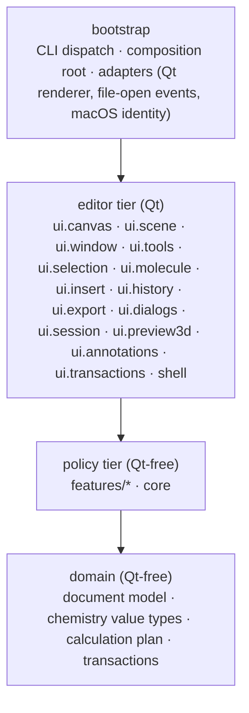
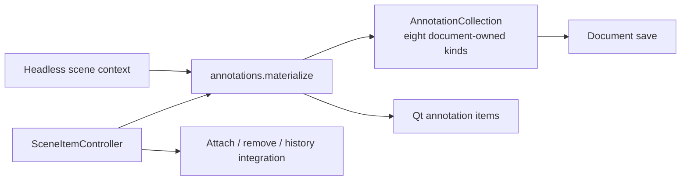
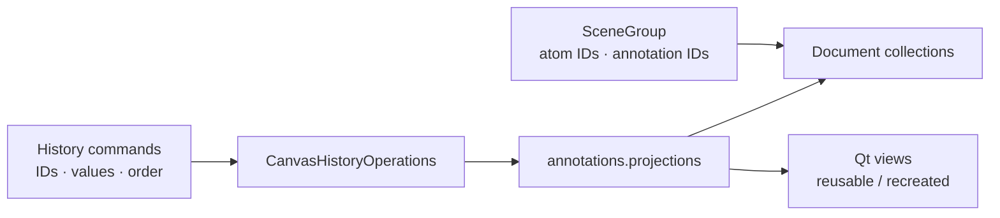
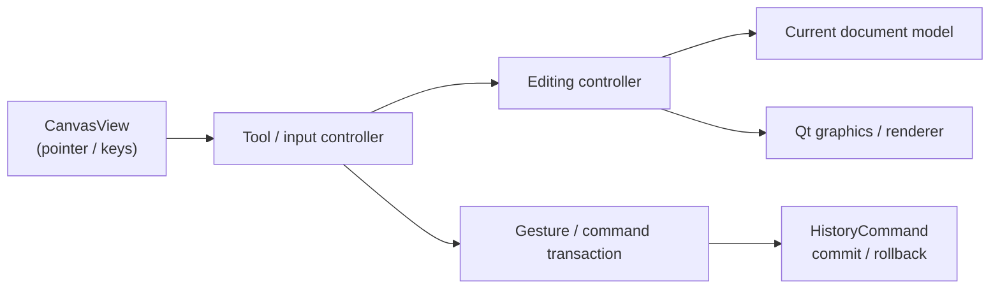

# Architecture

The browser presentation adapter is described in [WEB_ADAPTER.md](WEB_ADAPTER.md)
and [ADR 0029](adr/0029-browser-adapter.md). Its Python session
reuses existing document and feature APIs and CanvasHistoryService. The browser
mirrors accepted state; toolbar definitions and artwork come from the existing
desktop owners. SVG materialization and event wiring are cohesive adapters. The Qt architecture below remains the default desktop editor.

[한국어](ARCHITECTURE.ko.md)

## Package Responsibilities

Chemvas groups code by responsibility. The diagram shows the main package relationships; it is not a required call chain. [ADR 0005](adr/0005-responsibility-based-editor-boundaries.md) defines the current boundary policy.

```mermaid
flowchart TB
    bootstrap["bootstrap<br/>CLI dispatch · composition root · adapters (Qt renderer, file-open events, macOS identity)"]
    editor["editor tier (Qt)<br/>ui.canvas · ui.scene · ui.window · ui.tools · ui.selection · ui.molecule · ui.insert · ui.history · ui.export · ui.dialogs · ui.session · ui.preview3d · ui.annotations · ui.transactions · shell"]
    policy["policy tier (Qt-free)<br/>features/* · core"]
    domain["domain (Qt-free)<br/>document model · chemistry value types · calculation plan · transactions"]
    bootstrap --> editor
    editor --> policy
    policy --> domain
```

Arrows only point downward. The tiers are measured from the import graph, not
asserted: `core` and `features` import only `domain`, the editor tier imports
`features`, `core` and `domain`, and `bootstrap` alone knows the adapters and
assembles the editor. `ui.annotations` and `ui.transactions` are subpackages of
the editor, not layers below it.

### Layer Responsibilities

| Layer | Responsibility | Qt-Free? |
| --- | --- | :---: |
| `bootstrap` | CLI dispatch, application startup, window and canvas service assembly, Qt and OS adapters | Partial |
| `shell` | Main window shell, window registry, theme, stylesheet, and toolbar controls | No |
| `ui.canvas` | `CanvasView`, its runtime state and services, and canvas-scoped controllers | No |
| `ui.scene` | Scene item operations: clipboard, delete, transform, groups, geometry, records | No |
| `ui.window` | Main window services, menus, context bar, panels, and recent documents | No |
| `ui.tools` | Drawing tools, tool dispatch, handles, snapping, and hover feedback | No |
| `ui.selection` | Selection state, outlines, queries, rotation, and the select tool | No |
| `ui.molecule` | Atom and bond graphics, labels, and structure building | No |
| `ui.insert` | SMILES and template insertion previews and commits | No |
| `ui.history` | Undo/redo command payloads and their replay operations | No |
| `ui.export`, `ui.dialogs`, `ui.session`, `ui.preview3d` | Figure export and layout checks; editor dialogs; autosave and recovery; the 3D preview dock | No |
| `ui.annotations` | Shared annotation items, rendering, record binding and state codecs; used by both editor and headless scenes | No |
| `ui.transactions` | Document and scene savepoints for exact rollback | No |
| `features` | Feature policies and Qt-free implementations | Yes |
| `core` | The Qt-free engine tier: history commands, optional RDKit backend, molfile and SVG round-trips, document I/O | **Yes** |
| `domain` | Core molecular graph, document schema, chemistry value types, Calculation Plan, and transactions | **Yes** |

## Core Components

- **CanvasView** (`app/chemvas/ui/canvas/canvas_view.py`): Handles input events, tool dispatch, and coordinate mapping. Selection mutations belong to `SelectionController`. Coordinates with controllers and renderers without directly managing low-level drawing primitives.
- **MoleculeModel** (`app/chemvas/domain/document/model.py`): Pure atom and bond data structure with stable integer IDs. Independent of Qt.
- **RDKitAdapter** (`app/chemvas/core/rdkit_adapter.py`): Optional chemistry backend for SMILES parsing, 3D coordinate generation, property calculation, and chemical alias expansion.
- **Renderer** (`app/chemvas/adapters/qt/renderer.py`): Qt painting implementation applying `acs1996_style` drawing policies.
- **HistoryCommand** (`app/chemvas/core/history.py`): Delta-based undo/redo engine. Multi-entity operations are atomically bundled into a `CompositeCommand`.
- **Scene Rendering** (`scene_render_context.py`, `scene_rendering.py`): `SceneRenderContext` provides a view-independent context for rendering molecular graphics and annotations ([ADR 0004](adr/0004-view-independent-scene-rendering.md)).
- **Domain Document** (`app/chemvas/domain/document`): Manages document serialization, schema validation, and Calculation Plan v2 data structures.

## UI Architecture & Service Boundaries

- **Feature ownership**: Interaction workflows are centered in controllers, which call concrete collaborators directly. Each canvas-owned collaborator has one spelling: runtimes are `canvas.services.<name>` (a flat `CanvasRuntimeServices`), state is `canvas.runtime_state.<name>`, and the objects canvas setup creates are `canvas.model`, `canvas.renderer`, `canvas.rdkit`, `canvas.render_context` and `canvas.bond_renderer`. Modules that only forwarded to one of those spellings were removed ([ADR 0012](adr/0012-flat-editor-runtime-and-ui-packages.md)).
- **Service dependencies**: Graph queries receive a current-model provider, renderer and graph cache. Bond edits and ring fills use the existing `SceneRenderContext`; shortcuts receive their model provider, hover state and concrete editing collaborators. Document replacement therefore remains visible at invocation time without giving these services the whole view. View-level lifecycle and input controllers retain a typed `CanvasView`. Runtime assembly and history adapters use concrete types; note/mark edits and history recording require an injected history service. Graph and shortcut services are checked in strict mode. Heterogeneous scene snapshots and command composition still have dynamic parts. Reproducible edit/Undo/Redo measurements are described in [the performance baseline](performance/README.md).
- **State ownership**: `CanvasRuntimeState` is the single owner of canvas runtime state and extends `SceneRenderState`. Other modules interact via the owner's public interface without duplicate state; history, invalidation, and lifecycle management remain the owner's responsibility.
- **Dynamic dependencies and lifecycle**: Window actions resolve the active document at invocation time. The shared render context tracks replacement models and scenes, adhering to lifecycle contracts.
- **Document models and scene separation**: Molecular graphs and `AnnotationCollection` own document data independently of Qt. All eight annotation families use this collection for membership, order and saved values; graphics items are projections keyed by runtime ID ([ADR 0010](adr/0010-document-owned-notes-and-marks.md)).
- **Dependency boundaries**: `domain`, `core`, and `features` remain Qt-free. Desktop Qt implementations belong in `ui`, with framework adapters in `adapters` and application wiring in `bootstrap`. Features must not depend on adapters, editor widgets, or application entry points. Cross-package eager imports remain acyclic.
- **Recovery and rendering contracts**: Transactions and error recovery adhere to `CanvasHistoryOperations`, shared document transactions, and `SceneRenderContext` contracts.
- **Optional RDKit**: Core editing, drawing, and figure export function independently without RDKit.

See [Contributing](../CONTRIBUTING.md#architecture-conventions) for review and test criteria.

### Edit and recovery transactions

An edit changes document data and records its history command inside one document
savepoint. Paste and selection deletion use `document_transaction`; structure
building keeps its addition bookkeeping in `StructureBuildCommitter`. Both paths
use `DocumentSavepoint.rollback` for failed edits and cancellation. A rollback
failure is attached to the edit's original error; a failed cancellation raises
rather than silently accepting a partial document.

`history_command_transaction` owns capture, release and failure recovery for
simple history commands. Each command declares its headless inverse where one is
supported. Exact-restore failures do not trigger an inverse unless the restore
result explicitly permits it. Composite commands and commands with extra mutable
payload retain their own compensation order. Required deletion collaborators are
bound directly; replacement models are still resolved from the canvas at use time.

An exact history transaction binds its snapshot to the restore and release
callbacks resolved before capture. Later port-hook replacement cannot redirect
that snapshot to a different owner; restore and release take the bound transaction
alone. Capture and restore are one optional capability; resource-free headless
snapshots may omit release. Restore outcomes still pass runtime validation before
any inverse fallback is permitted.

Note text, document text style and annotation settings use separate typed history
commands and replay methods. A note text command requires its document ID;
commands do not select a payload interpretation through a string target.

Session recovery keeps one handoff path in `restore_previous`, used by the menu
as well as direct recovery. Once copies are open, a retry snapshots those copies
before releasing their sources; it does not open them again. Failed cleanup stays
pending without blocking a successful autosave.

### Selection and document construction

Selection deletion uses one `DeleteSelectionPlan` for single bonds and mixed
selections. The plan chooses live bonds, orphan atoms, attached marks and surviving
mark owners before mutation. The controller applies that plan, then coordinates
ring/group cleanup and records history inside its document transaction. Eraser
gestures retain their indexed session path for repeated pointer updates.

`SelectionController` owns scene selection writes, ID restoration, whole-canvas
selection and note selection. Queries and selection styling only read selection.
Clipboard, image and atom-label workflows call the controller; the document and
history rollback owners retain their exact selected-flag restoration. Qt still
owns rubber-band input. Structure selection and ID restoration batch intermediate
signals, expand groups, then publish one complete outline update. Notes retain
their explicit selection list alongside the Qt scene flags; structure selection
selects a note through that list, never by its Qt flag alone.

`domain.document.build_normalized_document_payload` validates document state and
normalizes JSON numbers. Desktop creation and CLI composition, layout, template
insertion and patches share it. A graph patch returns that validated payload
as its only document state (`DocumentPatchResult.payload`) beside its operation
summary, and the CLI encodes the payload without rebuilding it. CLI encoding and byte limits remain in
`bootstrap.document_cli_shared`; desktop and CLI serializers retain their
existing byte formats and error messages.

### Moving document content

`CanvasMoveController` owns translation of atoms and annotation geometry, including
dependent marks, bonds, ring fills, handles and hit-test invalidation. Tool assembly
injects that canvas's controller into `ToolContext`; `MoveTool`, selection dragging
and `SceneTransformController` call it directly. Disposable layout canvases and
`CanvasHistoryOperations` use the same controller from their own canvas services.
Controllers retain the canvas, resolving its current model when used, so loading a
replacement document does not leave an old model attached to an editing command.

Gesture transactions, transform transactions and history replay retain their
existing capture, commit and rollback responsibilities. The movement controller
does not publish history independently. Rotation drags and arrow endpoint drags
compute each frame from the state captured at the press, so a rotation back to
its starting angle, or an arrow end back to its original position, restores the
document exactly and records no history. Other handles apply the pointer to the
current record.

### Document-owned annotation collections

`AnnotationCollection[Record]` in `domain/document/annotation_collection.py` owns
ordered IDs and canonical records for shapes, arrows, TS brackets, images,
orbitals, ring fills, notes and marks. The shared
render state holds these collections alongside graphics lookups.
Saving reads the document directly; detaching or destroying a graphics item does
not delete its annotation. Group references and layout diagnostics use document
order,
including empty slots where a projection is missing.

Explicit add/delete and history replay update document membership and the graphics
lookup together. Undo restores the original document order. Detached records stay
available while a live projection uses them. History retains IDs and copied values,
so it can recreate a collected record and projection. Finalization cannot remove
active document annotations. Existing document and scene savepoints capture
membership, records, and projections for short-lived rollback. The saved file
format and the shared GUI/headless renderer are unchanged. State readers use the
concrete item or its document record; arbitrary Qt role-9 dictionaries are not a
second state source. Tests construct the same records and projections.

Image records include the original encoded source, geometry, opacity and aspect
lock. Orbital records include kind, center, scale and rotation. Editing updates
these records and then redraws their projections; changing a Qt transform or data
role alone does not edit the document. Image insertion and paste budgets count
every active document image, including those without a live projection.

Ring-fill records retain ordered atom IDs, color and exact opacity. Their points
come from the current molecular graph. Saving and copying use these records even
when the Qt polygon is absent; graph deletion removes broken fills and Undo
restores them in document order. Before editing a ring whose projection is gone,
the renderer reuses its record ID to rebuild the view. Replacing a dead wrapper
transfers detached-record cleanup so that old wrappers cannot erase Undo data.
Qt brush opacity and topology roles do not own ring state.
Rings participate in groups through their atoms; no ring-item index is added to
the saved group format.

Notes retain plain text, sanitized HTML, position and rotation in document records.
Native editor changes publish those values while Qt retains cursor, focus and
text Undo. Marks retain kind, text, atom binding, offsets, center and color;
metadata roles are derived from these records. Save, atom-bound mark copying and
electronic-state reconciliation read records even when views are absent. Failed
native frame restoration reinstates the captured record after position, font and
text are restored, preventing intermediate editor signals from changing the result.

### Shared annotation rendering

`ui.annotations` groups the Qt annotation boundary in one package:

| Module | Responsibility |
| --- | --- |
| `items` | Note, image, orbital and ring-fill Qt item implementations |
| `materialize` | Create an annotation from saved state using a render context |
| `graphics`, `arrows` | Annotation drawing and arrow rendering |
| `records` | Bind shape/TS bracket records to their projections |
| `marks` | Bind native mark graphics to document values |
| `state` | Read and apply annotation state at the Qt boundary |
| `projections` | Resolve document IDs and recreate missing views during history replay |
| `text` | Apply common note typography and appearance |

```mermaid
flowchart LR
    editor["SceneItemController"] --> create["annotations.materialize"]
    headless["Headless scene context"] --> create
    create --> values["AnnotationCollection<br/>eight document-owned kinds"]
    create --> view["Qt annotation items"]
    values --> save["Document save"]
    editor --> lifecycle["Attach / remove / history integration"]
```

The editor supplies note focus handling and attaches the resulting item. Creation,
styling and geometry use the same implementation as a headless scene. Seven
pairs of per-kind restoration wrappers and the separate state re-export facade
have been removed. The package owns no editor gesture or history stack.

### Groups and history use document identities

`SceneGroup` in `domain.document.groups` stores atom IDs and annotation IDs. Save
and clipboard serialization map those IDs through document order, including
members without a live view. The saved group format is unchanged.

Annotation, ring geometry, group, mark binding and text/style history commands
store IDs and values. `CanvasHistoryOperations` resolves views at replay time;
`annotations.projections` reuses a live view or recreates it under the same ID.
The weak projection cache does not prolong item lifetime. Replacement transfers
record cleanup ownership, and savepoints restore the cache on failed replay.
Undo preserves document order, selection, depth and stacking relative to molecular
graphics. Style commands retain copied Qt value types, never a widget, graphics
item or callback that closes over the canvas.

The `history_canvas_access` and `history_recording_access` forwarding modules are
removed. Callers use `DocumentSavepoint`, the history operations adapter, or the
recording service that owns the work. See [ADR 0011](adr/0011-document-identities-for-groups-and-history.md).

```mermaid
flowchart LR
    groups["SceneGroup<br/>atom IDs · annotation IDs"] --> document["Document collections"]
    history["History commands<br/>IDs · values · order"] --> replay["CanvasHistoryOperations"]
    replay --> resolve["annotations.projections"]
    resolve --> document
    resolve --> qt["Qt views<br/>reusable / recreated"]
```

### Remaining design work

All eight annotation families own their values and order in the document. Group
membership and the long-lived history payloads now use IDs and values too. This
is a description of completed boundaries, not a percentage of the entire redesign.
History can recreate missing annotation projections; arbitrary external damage to
a live scene is not a general self-healing workflow. Other editor access/ports and
service forwarding modules remain outside this migration. Gesture state and
short-lived rollback snapshots intentionally retain the Qt objects they operate on.

## Transaction & Recovery Lifecycle

- **Atomic Transactions**: `DocumentSavepoint` handles whole-document capture, validation, and rollback upon error ([ADR 0002](adr/0002-single-rollback-kernel.md)).
- **History Management**: `CanvasHistoryService` manages commands and stack snapshots for undo/redo and rollback. Commands retain document identities and values; temporary rollback snapshots retain exact native state.
- **Disabled history**: Only document replacement (`CanvasDocumentSessionService.apply_state`) disables history, and no editor runs while it does. While history is disabled, `CanvasHistoryService.push` refuses every edit by raising and the editor's transaction restores the document; editors do not check the state themselves ([ADR 0020](adr/0020-history-refuses-edits-while-disabled.md)).
- **Autosave & Session Recovery**: Startup opens a fresh workspace, while **File ▸ Recover Unsaved Work…** offers dirty snapshots from interrupted sessions as new unsaved copies ([ADR 0017](adr/0017-explicit-recovery-and-editor-state-policies.md)). Unexpected terminations are tracked via PID-bound session manifests in the application cache.

## Data & Render Flow

### Interactive Editing Flow

```mermaid
flowchart LR
    view["CanvasView<br/>(pointer / keys)"] --> tool["Tool / input controller"]
    tool --> edit["Editing controller"]
    edit --> model["Current document model"]
    edit --> scene["Qt graphics / renderer"]
    tool --> transaction["Gesture / command transaction"]
    transaction --> history["HistoryCommand<br/>commit / rollback"]
```

### Chemistry & 3D Flow
1. **Selection & Extraction**: Selected atoms and bonds form a `MoleculeModel` subgraph with normalized charge/radical annotations.
2. **Backend Conversion**: `RDKitAdapter` builds the molecular graph and generates 3D coordinates.
3. **Output**: Transferred to the 3D preview dock or exported directly to an `.xyz` file.

### Headless Document Flow
Headless CLI commands (`inspect-document`, `apply-patch`, `render-document`) validate source inputs deterministically and execute without launching desktop windows or session recovery.

### Reaction mapping edits

The mapping editor owns its draft correspondence. Canvas picks, dropdown edits,
clear and suggestion actions commit through one mutation method. Rendering
updates the dropdowns with their signals blocked; widget signals are not an
intermediate write path for canvas edits. Endpoint data determines active atoms,
while explicit cleared mappings and inactive entries retain their existing meaning.

### Calculation Handoff Flow
`features.calculation_bundle` builds the elementary-step handoff without Qt or RDKit imports. `pack-step` passes it one exact read of the source document, an RDKit adapter and the Chemvas version, then writes `machine.json` with the shared CLI encoder. The desktop check runs that command in a worker process, and `core.calculation_handoff_folder` publishes the worker's `machine.json` bytes unchanged and last, after the exact source, the XYZ files and a README ([ADR 0019](adr/0019-reaction-pair-handoff-and-opaque-endpoint-archives.md)).

## Chemical & Format Constraints

- **Export Scope**: 3D conversion and molecular exports include only chemical graph data; non-molecular annotations (arrows, brackets, text notes) are ignored.
- **Supported Aliases**: Canonical aliases defined in `ATOM_ALIAS_DEFINITIONS`:
  `Me`, `Et`, `OH`, `NH2`, `SH`, `Ph`, `PPh3`, `OMe`, `Boc`, `CO2Me`, `t-Bu`, `tBu`, `i-Pr`, `CF3`, `OTs`, `Ts`, `OMs`, `Ms`, `OTf`, `Tf`, `Ns`, `OAc`, and `Ac`.
- **Stereochemistry**: Wedge and hash stereochemistry maps only to single bonds.
- **Format Compatibility**: Chemvas reads document versions 7 and 8, and writes version 8 (schema 1).

## Architecture Decision Records (ADR)

When to write an ADR, its rules and its template are in [the ADR guide](adr/README.md).

- [ADR 0001: Feature-oriented modularization](adr/0001-feature-oriented-modularization.md)
- [ADR 0002: Single rollback kernel](adr/0002-single-rollback-kernel.md)
- [ADR 0003: Scoped move savepoint](adr/0003-scoped-move-savepoint.md)
- [ADR 0004: View-independent scene rendering](adr/0004-view-independent-scene-rendering.md)
- [ADR 0005: Responsibility-based editor boundaries](adr/0005-responsibility-based-editor-boundaries.md)
- [ADR 0006: Document-owned shapes](adr/0006-document-owned-shapes.md)
- [ADR 0007: Document-owned annotation collections](adr/0007-document-owned-annotation-collections.md)
- [ADR 0008: Shared annotation rendering and records](adr/0008-shared-annotation-rendering-and-records.md)
- [ADR 0009: Document-owned ring fills](adr/0009-document-owned-ring-fills.md)
- [ADR 0010: Document-owned notes and marks](adr/0010-document-owned-notes-and-marks.md)
- [ADR 0011: Document identities for groups and history](adr/0011-document-identities-for-groups-and-history.md)
- [ADR 0012: Flat editor runtime and `ui` subpackages](adr/0012-flat-editor-runtime-and-ui-packages.md)
- [ADR 0013: Module splits, window ports and `core` scope](adr/0013-editor-followups-splits-ports-core-scope.md)
- [ADR 0014: One spelling for canvas and window state](adr/0014-one-spelling-for-canvas-and-window-state.md)
- [ADR 0015: Owners for model and scene-item access, Qt-free `features`](adr/0015-owners-and-qt-free-features.md)
- [ADR 0016: A typed window boundary, and owners for state writes](adr/0016-typed-window-boundary-and-state-owners.md)
- [ADR 0017: Explicit recovery and editor state policies](adr/0017-explicit-recovery-and-editor-state-policies.md)
- [ADR 0018: Reaction-pair handoff and retired precomplex](adr/0018-reaction-pair-handoff-and-retired-precomplex.md)
- [ADR 0019: Reaction-pair handoff and opaque endpoint archives](adr/0019-reaction-pair-handoff-and-opaque-endpoint-archives.md)
- [ADR 0020: History refuses edits while it is disabled](adr/0020-history-refuses-edits-while-disabled.md)
- [ADR 0021: Ring-changing correspondences counted up to symmetry](adr/0021-ring-changing-correspondences-up-to-symmetry.md)
- [ADR 0022: Explicit reaction layout connectors](adr/0022-explicit-reaction-layout-connectors.md)
- [ADR 0023: Retire desktop scheme arrangement](adr/0023-retire-desktop-scheme-arrangement.md)
- [ADR 0024: Shared benzene placement for preview and insertion](adr/0024-shared-benzene-placement.md)

### Consolidated editing boundaries

`CanvasMoveController.set_atom_positions` owns absolute atom geometry application
as well as relative movement. History and selection transforms share this owner;
explicit depth restores remain distinct from depth-preserving screen translation
([ADR 0025](adr/0025-shared-atom-position-mutation.md)).

Reaction Mapping reads component inclusion and roles from `EndpointSelectionDraft`,
which also owns endpoint locking and modeled charge. Widgets display that draft
([ADR 0026](adr/0026-endpoint-selection-draft.md)). Shape, bracket and arrow rotation
and reflection use Qt-free record transforms; history codecs remain at the UI
boundary ([ADR 0027](adr/0027-record-based-annotation-transforms.md)).

Simple bond-length and bond-update history commands reuse
`history_command_transaction`. Document replacement snapshots require the native
Qt scene contract rather than alternate test-only scene representations. Calculation
handoff consumes the existing `RDKitResult` per call instead of reading a separate
mutable error slot.

- [ADR 0025: Shared atom position mutation](adr/0025-shared-atom-position-mutation.md)
- [ADR 0026: Endpoint selection draft](adr/0026-endpoint-selection-draft.md)
- [ADR 0027: Record-based annotation transforms](adr/0027-record-based-annotation-transforms.md)
