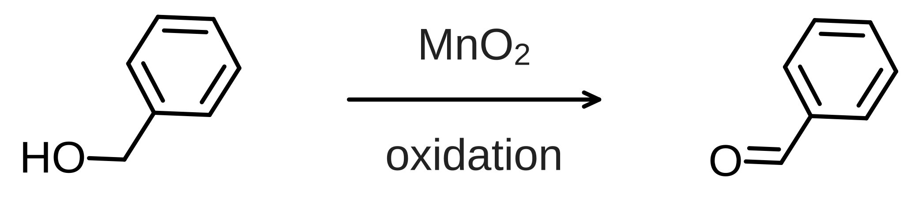

# 첫 반응식 만들기

[English](FIRST_SCHEME.md) · [소개로 돌아가기](../README.ko.md)

작은 반응식을 그리고, 편집 가능한 문서를 저장한 뒤 벡터 그림으로 출력해 봅니다.
예제는 벤질 알코올과 벤즈알데하이드에 이산화망가니즈 산화 라벨을 붙인 도식입니다.
그리기 연습용이며 실험 절차나 측정 결과를 나타내지 않습니다.
이 반응 유형의 배경은
[Gritter, DuPre, Wallace, *Nature* 202, 179–181 (1964)](https://doi.org/10.1038/202179a0)를
참고할 수 있습니다.



## 완성된 그림부터 열어보기

[first-scheme.chemvas](https://raw.githubusercontent.com/dhsohn/Chemvas/main/examples/first-scheme.chemvas)를
내려받아 **File ▸ Open**으로 여세요. 브라우저에 JSON이 보이면 링크를 우클릭해
**다른 이름으로 링크 저장**을 선택하고 `.chemvas` 확장자를 유지하세요.
예제는 별도 다운로드 파일이며 pip 설치에 포함되지 않습니다.

완성된 그림의 편집과 출력에는 기본 설치만 있으면 됩니다.

```bash
pip install chemvas
chemvas
```

Python 3.12+가 필요합니다. 아래의 SMILES 삽입부터 따라 하려면 선택적 RDKit
백엔드를 함께 설치하세요.

```bash
pip install "chemvas[rdkit]"
```

## 1. 두 구조 삽입하고 배치하기

1. **Ring** 도구를 고르고 옵션 바의 SMILES 입력란에 `OCc1ccccc1`을 입력한 뒤
   **Insert**를 누르세요.
   캔버스 왼쪽을 클릭해 벤질 알코올을 배치하세요.
2. 예제와 같은 방향으로 놓으려면 **Select**로 분자를 선택하고 **Alt+Up**을
   세 번 눌러 −45° 회전하세요. **Edit ▸ Rotate…**에서도 각도를 입력할 수 있습니다.
3. 알코올 산소 위에 포인터를 놓고 **Enter**를 누르세요. 라벨에 `OH`를 입력해
   확인하면 그림에 수산기의 수소가 표시됩니다.
4. 오른쪽에 `O=Cc1ccccc1`을 삽입해 벤즈알데하이드를 배치하세요.
   이 분자만 선택해 같은 방법으로 회전하세요. 두 구조 사이에는 화살표 자리를 남기세요.

처음 배치되는 방향은 RDKit 버전에 따라 달라질 수 있으므로 필요에 맞게 회전하세요.
완성 예제에는 좌표가 저장되어 있습니다. 오른쪽 아래 확대·축소 조절로 보기 편한
크기를 선택할 수 있습니다.

## 2. 화살표와 라벨 작성하기

**Arrow**를 고르고 두 구조 사이를 왼쪽에서 오른쪽으로 드래그하세요.
시작점과 끝점의 높이를 맞춰 수평으로 그리세요. Arrow에는 `Shift` 각도 잠금이
없습니다(Line 도구에서만 15° 단위 잠금을 지원합니다).
**Select**로 전환해 화살표를 더블클릭하고 다음 값을 입력하세요.

| 입력란 | 입력값 | 표시 |
| --- | --- | --- |
| Above | `MnO_2` | MnO₂ |
| Below | `oxidation` | oxidation |

**OK**를 누르세요. 라벨은 화살표에 연결되어 함께 움직입니다.
밑줄은 아래첨자를 만들며, 중괄호로 정확한 범위를 지정할 수 있습니다.
예를 들어 `K_{2}CO_{3}`·`H_{2}SO_{4}`는 숫자만 아래첨자로 표시합니다.
중괄호가 없으면 다음 공백이나 `_`·`^`까지 모두 첨자로 처리하므로,
`K_2CO_3`는 `CO`도 아래첨자가 됩니다. 입력란 아래의 실시간 미리보기로
표시 범위를 확인한 뒤 **OK**를 누르세요. 위첨자는 `ΔG^{‡}`처럼 입력합니다.
자신의 그림에서는 이 입력란에 반응 조건을 적으면 됩니다.
연습 예제에는 물질의 양·시간·수율·측정 데이터를 넣지 않았습니다.

## 3. 정렬하고 저장하기

**Edit ▸ Select All**로 선택하고 **Edit ▸ Align ▸ Middle**로 정렬하세요.
연결된 분자는 통째로 이동합니다. 빈 곳을 클릭해 선택을 해제하고 결과를 확인하세요.
**File ▸ Save As…**로 `first-scheme.chemvas`를 저장하세요.

## 4. 그림 출력하기

**File ▸ Export Figure…**에서 다음 값을 선택하세요.

| 항목 | 선택값 |
| --- | --- |
| Format | Plain SVG - vector |
| Size | Fit 2-column (174 mm) |
| Scope | Whole canvas |
| Background | White |
| Editable Chemvas SVG | 체크 해제 |

`first-scheme.svg`로 출력하세요. 원자·화살표 라벨은 아웃라인으로 저장됩니다.
선택한 단 너비는 174 mm이며, 반올림을 거친 예제 SVG에는 173.919 mm로 기록됩니다.
편집 원본은 `.chemvas` 문서로 보관하세요. 같은 창에서 PDF·PNG·TIFF도 선택할 수 있습니다.

다운로드용 [SVG](https://raw.githubusercontent.com/dhsohn/Chemvas/main/examples/first-scheme.svg)와
[300 DPI PNG](https://raw.githubusercontent.com/dhsohn/Chemvas/main/examples/first-scheme.png)도
이 설정으로 출력했습니다.

화살표 라벨은 글리프 아웃라인으로 출력되어 SVG에서도 캔버스의 아래첨자·위첨자
배치를 유지합니다. 아웃라인은 SVG 텍스트가 아닌 도형이므로 글자 편집에는 원본
문서를 쓰세요.

## 명령줄로도 사용하기

내려받은 그림이 있는 폴더에서 실행하세요.

```bash
chemvas inspect-document first-scheme.chemvas
chemvas check-layout first-scheme.chemvas
chemvas render-document first-scheme.chemvas --output first-scheme-rendered.svg
```

이 명령들은 RDKit 없이 동작합니다. 문서 검사는 구조와 문서 정보를 보여주고,
레이아웃 검사는 문서를 수정하지 않고 지원하는 글자·도형 경고를 알려줍니다.
반응의 타당성이나 모든 원자 라벨·화살표 겹침을 검사하는 기능은 아닙니다.
출력 명령은 새 SVG를 만들고 크기와 해시를 보고합니다.
기존 출력 파일이 있으면 거부하므로 다시 실행할 때는 새 파일명을 지정하세요.

명령줄 출력은 기본 결합 길이를 기준으로 크기를 정하므로 데스크톱의 174 mm
출력과 물리 크기가 다릅니다. 정확한 보장과 지원하는 작업은
[CLI 안내](AGENT_CLI.ko.md)를 참고하세요.

## 데모 제작 방식

[짧은 GIF](images/demo.gif)는 실제 Qt 컨트롤과 캔버스 편집을 캡처한 뒤
대기 시간을 줄이고 단계 설명을 붙인 것입니다. 스크립트로 재현한 사용 예시이며
작업 속도를 측정한 영상은 아닙니다.
[캡처 스크립트](../scripts/capture_first_scheme.py)는 연습용 입력만으로 편집 문서,
SVG·PNG와 화면을 함께 만듭니다. 재생성 방법은 [미디어 안내](images/README.ko.md)에 있습니다.
