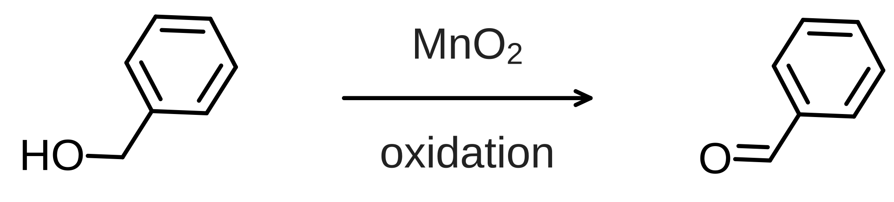

# 첫 반응식 만들기

[English](FIRST_SCHEME.md) · [소개로 돌아가기](../README.ko.md)

작은 반응식을 그리고, 편집 가능한 `.chemvas` 문서를 저장한 뒤 논문용 벡터 그림으로 내보내는 튜토리얼입니다. 벤질 알코올의 산화 반응식을 예제로 진행합니다.



## 완성된 예제 바로 열어보기

완성된 예제 파일인 [first-scheme.chemvas](https://raw.githubusercontent.com/dhsohn/Chemvas/main/examples/first-scheme.chemvas)를 내려받아 **File ▸ Open**으로 바로 열어볼 수 있습니다.

완성된 그림의 열람, 편집, 그림 출력은 기본 설치만으로 가능합니다:

```bash
pip install chemvas
chemvas
```

## 1. 구조 그리기 및 배치

1. **Ring** 도구(`J`)를 고르고 캔버스 왼쪽을 클릭해 벤젠을 놓습니다.
2. **Bond** 도구(`X`)로 고리 원자에서 바깥으로 결합을 하나 끌어 새 탄소를 만듭니다. 그 새 탄소에서 말단 원자까지 두 번째 결합을 끌어 냅니다.
3. 말단 원자 위에서 `o`를 누른 뒤 **Enter**로 라벨을 `OH`로 바꿉니다. 중간의 새 탄소는 그대로 둡니다.
4. **Select** 도구(`Space`)를 선택하고 분자를 클릭한 뒤, **Alt+Up**을 3번 눌러 −45° 회전합니다 (**Edit ▸ Rotate…**에서 직접 각도 입력 가능).
5. 오른쪽에도 벤젠을 놓습니다. 고리 원자에서 결합을 하나 끌어 새 탄소를 만든 뒤, 그 탄소에서 말단 원자까지 두 번째 결합을 끌어 냅니다. 두 번째 결합 위에서 `2`를 눌러 그 결합만 이중결합으로 바꿉니다. 말단 원자 위에서 `o`를 누릅니다. 두 구조 사이에 화살표가 들어갈 간격을 둡니다.

## 2. 반응 화살표 및 조건 라벨 작성

1. **Arrow** 도구(`E`)를 선택하고 두 구조 사이를 왼쪽에서 오른쪽으로 드래그합니다.
2. **Select** 도구(`Space`)로 화살표를 더블클릭하여 라벨 편집창을 엽니다:

| 입력란 | 입력값 | 실제 표시 |
| --- | --- | --- |
| Above (위) | `MnO_2` | MnO₂ |
| Below (아래) | `oxidation` | oxidation |

3. **OK**를 누릅니다. 라벨은 화살표에 귀속되어 화살표를 옮겨도 함께 이동합니다.
   - 밑줄(`_`)은 아래첨자(`MnO_2` → MnO₂)로 변환됩니다.
   - 여러 글자나 복합 기호는 중괄호로 묶습니다 (예: `K_{2}CO_{3}`, `\Delta G^{\ddagger}`).

## 3. 정렬 및 저장

1. **Edit ▸ Select All** (`Ctrl+A`)로 모든 구조와 화살표를 선택합니다.
2. **Edit ▸ Align ▸ Middle**을 눌러 세로 중앙을 정렬합니다.
3. **File ▸ Save As…**를 선택하고 `first-scheme.chemvas`로 저장합니다.

## 4. 그림 출력하기

**File ▸ Export Figure…**를 엽니다:

| 항목 | 선택값 | 설명 |
| --- | --- | --- |
| Format | Plain SVG | 깔끔한 벡터 파일 출력 |
| Size | Fit 2-column (174 mm) | 일반 논문 2단 너비(174 mm)에 맞춤 |
| Scope | Whole canvas | 캔버스 전체 영역 내보내기 |
| Background | White | 흰색 불투명 배경 |
| Editable Chemvas SVG | 체크 해제 | 표준 벡터 그래픽 출력 |

`first-scheme.svg`로 저장합니다. 라벨 텍스트는 글꼴 깨짐이 없도록 벡터 아웃라인으로 변환됩니다. 나중에 다시 편집할 수 있도록 `.chemvas` 원본 파일을 보관하세요.

동일한 설정으로 미리 출력된 [SVG](https://raw.githubusercontent.com/dhsohn/Chemvas/main/examples/first-scheme.svg) 및 [300 DPI PNG](https://raw.githubusercontent.com/dhsohn/Chemvas/main/examples/first-scheme.png) 파일도 확인할 수 있습니다.

## 명령줄(CLI)로 다루기

터미널에서 직접 `.chemvas` 파일을 검사하고 렌더링할 수도 있습니다:

```bash
chemvas inspect-document first-scheme.chemvas
chemvas check-layout first-scheme.chemvas
chemvas render-document first-scheme.chemvas --output first-scheme-rendered.svg
```

- `inspect-document`: 원자, 결합, 라벨 및 메타데이터를 JSON으로 요약합니다.
- `check-layout`: 요소 간의 겹침이나 화면 경계 초과 경고를 검사합니다.
- `render-document`: GUI 창을 띄우지 않고 명령줄에서 바로 SVG/PDF 그림을 생성합니다.

자세한 CLI 사용법은 [에이전트 CLI 안내](AGENT_CLI.ko.md)를 참고하세요.
