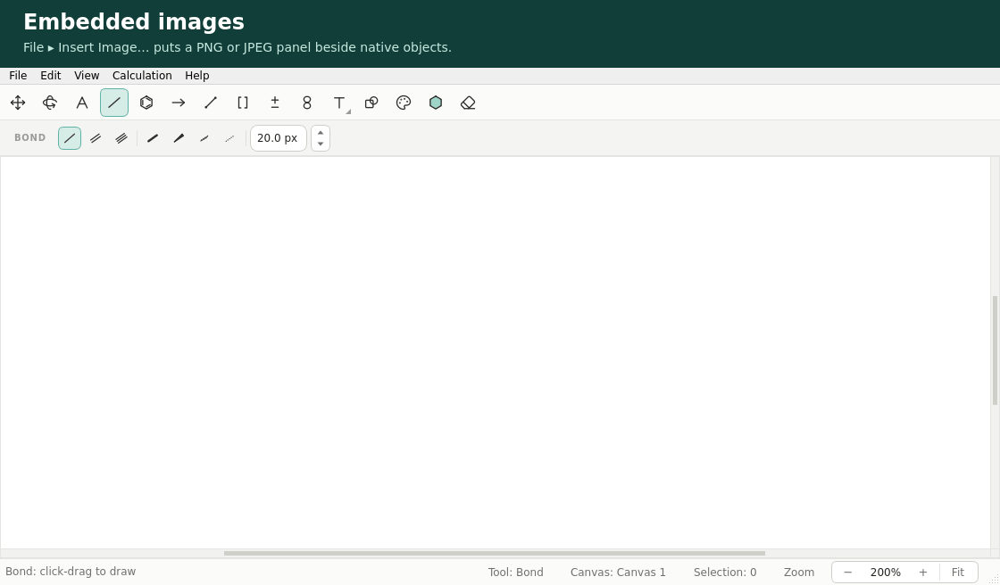

# 내장 PNG/JPEG 이미지

[English](IMAGE_OBJECTS.md)

Chemvas는 완전한 PNG/JPEG 래스터를 원본 구조, 노트, 화살표, 그래프와 함께 하나의
`.chemvas` 문서에 담을 수 있습니다. 이미지 위치와 표시 크기는 편집 가능한 캔버스
속성입니다. 삽입, 저장, 재열기, 선택 복사, 편집의 실행 취소/다시 실행은 원래
인코딩된 이미지 바이트를 유지합니다. 이미지는 내장되므로 문서를 다시 열 때 원본
파일이 필요 없습니다.

## GUI



**File → Insert Image…**를 고르고 `.png`, `.jpg`, `.jpeg` 파일을 선택합니다. 만들어진
이미지는 Select 도구로 옮깁니다. 이미지 하나를 선택하고 **Edit → Image
Properties…**를 고르면 X, Y, 너비, 높이, 비율 잠금, 불투명도를 설정할 수 있습니다.
좌표와 크기는 원본 픽셀이 아니라 캔버스 단위입니다. 투명 여백을 포함해 래스터
전체가 표시되며, 크기를 바꿔도 잘리지 않습니다. 처음 삽입할 때는 시트의 보이는
부분에, 시트가 화면 밖이면 시트 자체에 맞춥니다. 이후 수동으로 옮기면 픽셀이
출력 시트 밖으로 나갈 수 있습니다.

다른 애플리케이션에서 이미지를 복사해 캔버스에 붙여 넣을 수도 있습니다.
클립보드가 PNG/JPEG 파일 바이트를 제공하면 그 바이트가 유지됩니다. 디코딩된
이미지만 제공하면 Chemvas는 그 클립보드 픽셀의 무손실 PNG를 내장하며, 이 경로에서는
원본 파일의 JPEG 인코딩이나 메타데이터를 쓸 수 없습니다. Chemvas 선택의
복사/붙여넣기는 내장 바이트와 원본 객체를 유지합니다. 이미지 삽입과 속성 편집은
실행 취소/다시 실행에 참여합니다. 이미지는 도형과 고리 채움 위, 원본 라벨과
화살표 아래의 고정된 층에 있습니다. 이미지끼리의 순서는 삽입 순서를 따릅니다. 크기
조절은 속성 대화상자로 하며 이미지 모서리 핸들은 없습니다. 그룹 회전과 뒤집기는
텍스트 라벨처럼 픽셀은 똑바로 둔 채 이미지 사각형만 재배치합니다. 픽셀 회전,
반전, 자르기, 필터는 지원하지 않습니다. 자동 **Arrange Scheme**은 이미지를 포함한
그룹을 지원하지 않으므로, 이미지 패널에는 수동 Select, 정렬, Image Properties를
쓰세요.

원본 NMR/SEM 그림은 파일 삽입이 원본 파일 바이트를 보존하는 직접적인 방법입니다.
선택한 원본에 완전한 NMR 축, 농도 라벨, SEM 스케일 바가 들어 있는지 확인하세요.
Chemvas는 빠진 원본 내용을 추론하거나 재구성하지 않습니다.

## CLI 구성

composition v1에 `images` 배열을 추가합니다. 각 항목에는 `source`, `x`, `y`가
필요합니다. 소스는 절대 경로이거나 명령의 작업 디렉터리와 무관하게 구성 JSON의
디렉터리를 기준으로 한 상대 경로입니다. 일반 PNG/JPEG 파일만 읽습니다. URL 가져오기는
하지 않습니다.

```json
{
  "format": "chemvas-document-composition",
  "version": 1,
  "atoms": [],
  "bonds": [],
  "notes": [
    {"text": "Original ¹H NMR", "x": -350, "y": -265},
    {"text": "Original SEM", "x": -350, "y": 15}
  ],
  "images": [
    {"source": "originals/proton-nmr.png", "x": -350, "y": -240, "width": 700},
    {"source": "originals/sem.jpg", "x": -350, "y": 40, "width": 250,
     "opacity": 1.0, "lock_aspect": true}
  ]
}
```

```bash
chemvas compose-document figure.json --output figure.chemvas
chemvas check-layout figure.chemvas --sheet-only
chemvas render-document figure.chemvas --output figure.svg
chemvas render-document figure.chemvas --output figure.pdf
chemvas render-document figure.chemvas --output figure.png
```

`width`를 줄 때 `height`를 생략하거나 그 반대로 하면 빠진 치수를 원본 픽셀
비율로 계산합니다. 둘 다 생략하면 원본 픽셀 치수를 캔버스 단위로 씁니다. 둘 다
주면 의도적인 늘이기를 포함해 그 치수를 그대로 유지합니다. `lock_aspect`(기본
`true`)는 이후 GUI 크기 조절을 좌우하고, `opacity`는 기본 `1.0`이며 0에서 1 사이
값을 받습니다. 이미지는 문서 시트 안에 놓아야 합니다. 캔버스 원점은 시트 중심이고,
기본 가로 A4는 X −421…421, Y −297.5…297.5입니다. 이 예제는 3:1 NMR 원본과 4:3 SEM
원본에 맞춘 것이므로 다른 비율에는 패널 위치/크기를 조정하고 출력 전에 sheet-only
검사를 실행하세요. 구성은 새 출력을 원자적으로 쓰며 기존 경로 덮어쓰기를
거부합니다. JSON 보고서에는 `image_count`와 `output_sha256`이 들어 있습니다.

Qt 없는 Python 구성 API는 명시적 `image_source_reader: Callable[[str], bytes]`
키워드 인자를 받습니다. 파일 접근과 상대 경로 해석은 구성 기능이 아니라 CLI
부트스트랩의 몫입니다.

## 원본 스키마와 한계

문서 v7은 선택적 `state.images` 배열을 가질 수 있습니다. 빈 이미지 컬렉션은 일반
구성과 캔버스 직렬화에서 생략되므로 이미지 없는 문서는 이전 모양을 유지합니다.
이미지를 담은 문서는 이미지를 지원하는 Chemvas 설치가 필요합니다. 옛 v7
리더는 알 수 없는 `images` 필드를 조용히 잃는 대신 거부합니다.

각 원본 이미지는 정확히 다음 필드를 갖습니다.

```json
{
  "kind": "image",
  "mime_type": "image/png",
  "data_base64": "<canonical base64 of the complete original file>",
  "pixel_width": 2400,
  "pixel_height": 1200,
  "x": 30,
  "y": 40,
  "width": 650,
  "height": 325,
  "opacity": 1.0,
  "lock_aspect": true
}
```

MIME 유형은 `image/png` 또는 `image/jpeg`이며 디코딩된 내용과 일치해야 합니다.
픽셀 치수는 원본 래스터와 일치해야 합니다. 표시 너비와 높이는 양의 유한수여야
합니다. `lock_aspect`는 불리언이어야 합니다. 원본 그룹은 이미지를
`["images", index]`로 참조할 수 있고, 클립보드 선택은 같은 필드의 이미지를
`scene_items`에 담아 `["scene_items", index]`로 참조합니다.

한계는 이미지당 원본 바이트 16 MiB와 2,500만 픽셀, 문서/선택당 합산 원본 바이트
64 MiB, 합산 1억 픽셀, 이미지 객체 256개입니다. 원본 문서와 선택 봉투는 base64와
다른 문서 데이터를 포함해 96 MiB까지 허용합니다. 구성 JSON 자체는 이미지
바이트가 아니라 파일 경로를 담으므로 1 MiB 제한이 유지됩니다. 파일은 유계 전체
디코드로 검사하며, 손상되거나 잘렸거나 지원하지 않거나 애니메이션이거나 다중
프레임인 이미지는 거부됩니다. 픽셀 치수는 저장된 픽셀을 설명하며, EXIF 방향은
원본에 적용되거나 다시 쓰이지 않습니다.

## 출력 동작

SVG와 PDF 출력은 픽셀을 벡터 조각으로 바꾸지 않고 래스터 이미지를 그대로
싣습니다. 편집 가능한 SVG는 추가로 원본 문서 메타데이터를 실어 Chemvas 왕복을 위한
원래 인코딩 바이트를 보존합니다. SVG의 보이는 래스터 스트림은 Qt가 PNG로 다시
인코딩할 수 있고, PNG 그림 출력은 전체 구성을 선택한 출력 크기/DPI로
래스터화합니다. 따라서 캔버스에서 크기를 줄이거나 저해상도 그림 출력을 고르면
내장 원본이 온전해도 원본 이미지 텍스트의 가독성이 떨어질 수 있습니다. PDF 이미지
렌더링은 무손실 이미지 렌더링을 씁니다. PNG 투명도와 객체별 불투명도는 렌더링의
일부로 유지됩니다. 원본 16비트 PNG 파일과 그 SVG 래스터는 그 정밀도를 유지할 수
있지만, PDF와 전체 그림 PNG 출력은 8비트 표시 출력입니다. 원본 픽셀 정밀도가
필요하면 내장된 원본을 쓰세요.

실효 객체 불투명도가 0인 이미지는 전체 캔버스나 선택 그림 출력 범위에 기여하지
않습니다. 그런 이미지만 있는 그림은 출력할 것이 없습니다. 양의 불투명도를 가진
이미지는 투명 픽셀 여백을 포함한 전체 사각형을 유지합니다. 원본 이미지 상태와
비트맵 클립보드 복사가 쓰는 원래 선택 프레임은 바뀌지 않습니다.

이미지 텍스트는 래스터 내용입니다. `--min-font-pt`는 원본 텍스트를 재지, 이미지
안의 NMR 라벨이나 SEM 스케일 바는 재지 않습니다. OCR이나 과학 주석 검증은
없습니다. 편집 가능한 SVG 입력 봉투는 256 MiB(원본 페이로드 96 MiB)로 유계이고,
64 MiB 헤드리스 렌더 출력 제한도 적용되므로, 노이즈가 많은 큰 이미지를 SVG로
다시 인코딩하면 이를 넘을 수 있습니다. `.chemvas`를 편집 가능한 원본으로 유지하고,
출력된 축, 라벨, 스케일 바, 이미지 가장자리를 의도한 출판 크기에서 눈으로
확인하세요.
