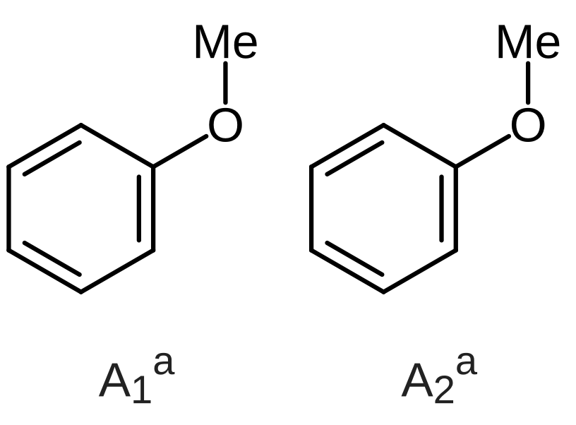
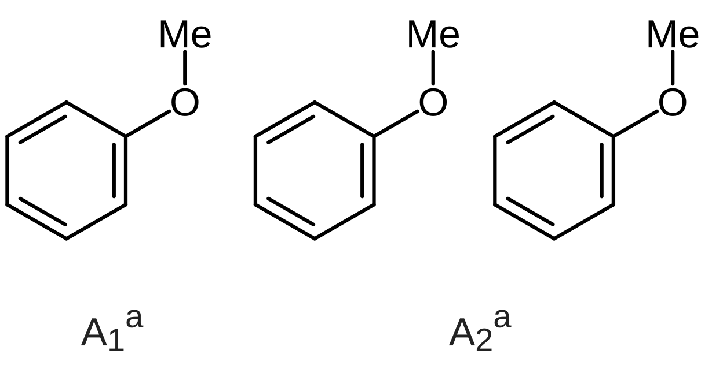
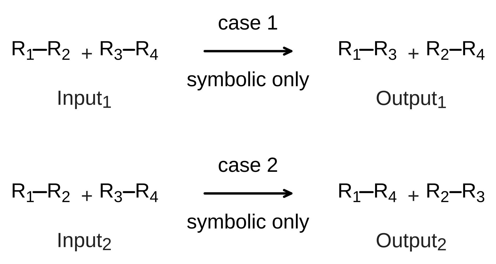

# 재현 가능한 출판 그림

[English](PUBLICATION_SCHEMES.md)

이 레시피는 두 개의 **합성 그리기 예제**를 만듭니다. 반응 메커니즘이나 연구
결과가 아닙니다. 공개 Chemvas 명령을 쓰고 모든 출력 옆에 편집 가능한 원본 문서를
남깁니다. 개인 원고나 계산 데이터는 없으며 RDKit이 필요 없습니다.

소스 체크아웃에서 Chemvas가 설치된 Python 환경을 씁니다.

```bash
python examples/publication_scheme.py --output-dir /absolute/existing-parent/new-figures
```

공통 5 mm/결합 배율로 만들어지는 두 그림입니다.





출력 디렉터리는 존재하지 않아야 합니다. 요청, 중간 그림, 측정된 배치/글꼴
보고서, SVG, 600 dpi PNG, `manifest.json`이 검토용으로 남습니다. 실패한 실행은
진단을 위해 새 디렉터리를 남기므로 다시 시도할 때는 새 디렉터리를 고르세요.
기존 그림이나 출력은 덮어쓰지 않습니다. CLI 오류나 배치 경고는 더 게시하기 전에
이 예제를 멈추며, 화학을 자동으로 고치지 않습니다. 최종 원본 SHA-256은 배치 검사
전에 고정됩니다. 검사, 출력 상자 프로브, 두 최종 출력 보고서는 모두 같은
바이트를 참조해야 합니다. manifest의 각 그림에는 저장된 보고서 파일 이름과 그
SHA-256을 담은 `layout_check`가 있습니다. 원본 불일치는 최종 manifest 없이
레시피를 멈추며, 남은 중간 파일은 진단 자료이지 인수된 산출물이 아닙니다.

## 재사용할 것

1. **원본 템플릿 먼저.** `insert-template`은 정규 벤젠을 만들고 안쪽 이중 결합
   획에 필요한 원본 고리 소속을 기록합니다. 치환기에는 명시적 결합과 원자 ID를
   쓰세요. 예제는 `set_terminal_angle`로 O–Me를 꺾으며, 말단기를 옮기려고 고리를
   찌그러뜨리지 않습니다.
2. **그림 세트에 배율 하나.** 보통 결합 기하, 렌더러 메트릭, 글꼴 계열,
   본문/첨자 크기를 공통으로 둡니다. 각 출력 너비는 측정된 여백 포함 캔버스
   너비에 하나의 `mm_per_unit` 값을 곱해 정합니다. 따라서 긴 그림은 작아지지 않고
   길게 남습니다.
3. **캡션을 한 번 배치한 뒤 그림을 정렬.** 보통 `layout-document`가 원본
   구조/캡션 그룹을 만듭니다. 두 번째 `mode: "align-y"` 연산은 분자 Y 위치만
   고칩니다. 두 번째 예제에서는 캡션 하나가 명시적으로 독립된 두 분자 part를
   설명하며, 그 수평 위치와 텍스트는 고정됩니다.
4. **진짜 조판을 쓰기.** 노트는 `vertical_align: "sub"`와 `"super"`가 있는 원본
   `runs`를 갖습니다. `A_1`과 `kcal mol^-1`은 서식의 대체물이 아닙니다. 예제의 A
   식별자와 위 첨자 a는 조판 견본일 뿐입니다. 원고 캡션을 중복하는 전체 그림
   제목은 없습니다.
5. **편집 가능 크기와 인쇄 크기를 따로 검증.** 출력 전에 전체 원본 시트 포함을
   포함한 깨끗한 `check-layout` 결과를 요구합니다. 높이와 최소 글꼴 가드를 걸고
   렌더링한 뒤 원본 그림과 최종 SVG/PNG를 모두 검사합니다. 깨끗한 진단 보고서는
   화학이나 입체화학 검증이 아닙니다.

작은 예제에는 의도적으로 지어낸 화살표, 에너지, TS 기하가 없습니다. 실제 경로에는
연구자가 제공한 상태와 화살표를 그 그림에 속하는 모든 중간체와 분기를 포함해
명시적으로 더하세요. 독립적 이동이 명시적으로 의도되지 않는 한 복합체와 TS는
강체 블록으로 보존하세요. 쐐기/해시 방향이나 배위 기하를 미관으로 고르지 마세요.

## 예시 인쇄 프로필이지 새 기본값이 아님

### 연결된 약어

내부 O–Me 결합을 명시적으로 그리지 않아야 할 때 `OMe` 같은 원본 원자 약어를
씁니다. 부착점은 산소입니다. O 글리프는 수평, 수직, 가파른 각도의 결합에서 결합된
원자에 머뭅니다. 왼쪽을 향한 라벨은 `MeO`로, 오른쪽을 향한 라벨은 `OMe`로 표시될
수 있습니다. 정확히 수직인 부착은 입력한 순서를 유지하면서 여전히 O를 고정합니다.
결합을 옮기거나 그림을 다시 열면 캔버스와 그림 출력이 쓰는 같은 원본 라벨
서비스가 이 표시를 다시 계산합니다.

이는 표시 배치이지 저장된 라벨, 원자 좌표, 화학 변환 약어의 변경이 아닙니다. 이
규칙은 뒤집을 수 있는 라벨의 기존 부착 정보를 쓰며, 알 수 없거나 뒤집을 수 없는
문자열에서 부착 원자를 추론하지 않습니다. 고립된 라벨과 라벨 본문 충돌 가드는
기존 배치를 유지합니다. 올바른 글리프를 고정하면 약어의 나머지가 옆으로 밀리므로
재배치 후 주변 텍스트를 확인하세요.

### 공통 물리 배율

레시피는 보통 결합 길이 40 캔버스 단위, 목표 5 mm/결합, Arial, 원본 본문 글꼴 17,
첨자 run 글꼴 22를 씁니다. Qt는 원본 배치의 일부로 첨자 run을 줄입니다. 이 값들은
시험 환경에서 약 8.1 pt 본문/원자 텍스트와 6.7 pt 첨자를 만들며, 출력 보고서가
실제 해석된 크기를 제공합니다. 글꼴 가용성과 Qt의 물리 뷰포트 반올림은 달라질
수 있습니다. 6 pt 최소값은 여유를 둔 가드이지 주장된 저널 규칙이 아닙니다.

`settings.bond_length_px`는 현재 렌더러의 펜과 원자 글꼴 메트릭이기도 합니다.
`text_font_size`만으로는 원자 텍스트 크기를 독립적으로 정하지 못합니다. 이 예제는
명시적으로 제공한 40단위 기하를 렌더러 메트릭 `17 × 20 / 12`와 분리합니다. 그다음
여백 포함 기본 ACS 출력(렌더러 메트릭당 14.4 pt)을 측정해 캔버스 너비를 유도한 뒤
공통 5/40 mm 배율을 적용합니다. SVG를 다시 쓰거나 개별 노트를 확대·축소하거나
병렬 스타일 엔진을 설치하지 **않습니다**. 프리셋이나 글꼴 설정을 바꾸면 그림
세트 전체를 다시 측정하고 검토하세요. ACS 변환 상수를 다른 프리셋에 복사하지
마세요.

원본 작업 시트와 물리 출력은 서로 다른 좌표 공간입니다. 작은 PDF 치수가 너무 큰
저장 그림을 시트 안에서 편집 가능하게 만들지는 않습니다. 원본 기하, 글꼴, 전체
그림 배치를 처음부터 그 시트 안에 두세요. 경계 경고를 무시하고 출력 배율이
그것을 숨겨 주리라 기대하지 마세요. 납품 전에 최종 원본 파일을 다시 열어 전체
그림이 보이고 그룹을 의도대로 선택·이동할 수 있는지 확인하세요. 임시 검토용
이동을 납품 파일에 저장하지 마세요.

더 큰 저작 문서에는 `check-layout --sheet-only`가 쌍별 충돌 검사 없이 유계 선형
포함 검사를 실행할 수 있습니다. 그 보고서는 시트 맞춤 근거일 뿐 충돌이나 시각
검토의 대체물이 아닙니다. 여기의 작은 예제는 기본 결합 검사를 한 번 쓰며 중복된
sheet-only 호출이 필요 없습니다. 어느 모드도 Save/Open을 수정하거나 내용을
자동으로 줄이지 않습니다.

템플릿에서 구성으로 가는 단계는 예제 안에서 만든 새 그래프 전용 시드에 의도적으로
한정됩니다. inspect한 그래프 데이터와 생성된 원본 `ring_fills`를 Composition v1을
통해 옮깁니다. `inspect-document`만으로는 완전한 문서 직렬화기가 아닙니다. 그
단계를 기존 그림의 변환기로 재사용하지 마세요. 노트, 그룹, 계획, 원근, 그 밖의
장면 데이터에는 각자의 원본 문서 작업 흐름이 필요합니다.

## 배율을 바꾸지 않고 원고에 넣기

`manifest.json`의 각 그림 `embed_width_mm`를 쓰고 종횡비를 유지하세요. 모든
이미지를 공통 Word 단 너비로 늘리지 마세요. PNG/SVG 치수 반올림은 글꼴 보고서에
포함되며 작은 배율 차이를 만들 수 있습니다. 캡션은 그래픽 안의 반복 제목이 아니라
원고에 두세요.

예시 `--max-height-mm 105`는 그림 전용의 설명용 상한이지 자동 "반 페이지" 규칙이
아닙니다. 실제 원고 페이지, 여백, 캡션 공간에서 높이 예산을 계산하세요. Chemvas는
DOCX 페이지 배치를 검사하거나 원고 텍스트를 서식화하지 않습니다. 출력된 원고
PDF에서 위·아래 첨자와 최종 그림 크기를 다시 확인하세요.

선택한 가독 배율에서 그림이 들어가지 않으면 패널을 줄이거나 재구성하거나 새 행
구조를 명시적으로 고르세요. `max_row_width`는 줄바꿈을 요청하며, 생략하면 지정한
한 행을 유지합니다. 너비/높이/글꼴 가드는 절대 대신 줄바꿈하거나 글꼴을 줄이거나
구조를 축소하지 않습니다.

원본 해시, 명시적 part 소속, 지원 연산, 자원 한계는
[CLI 계약](AGENT_CLI.ko.md)과 [정렬 계약](SCHEME_LAYOUT.ko.md)을 보세요.

## 완전한 비교 행 두 개

좁은 단의 비교에서는 두 번째 실행 가능 예제가 독자가 공유 반응물이나 생성물을
재구성하게 하는 대신 두 대안을 모두 완전하게 유지합니다.

```bash
python examples/publication_comparison.py --output-dir /absolute/existing-parent/new-comparison
```



이것은 **기호적 연결성 예제일 뿐입니다**. R₁–R₄는 특정 화합물이 아니라 추상
조각을 뜻합니다. 각 입력과 출력은 네 조각 라벨을 한 번씩 담으며, 두 생성물
짝짓기는 Chemvas가 예측한 것이 아니라 명시적으로 저작된 것입니다. 원본 화살표
라벨 "case 1"/"case 2"와 "symbolic only"는 시약, 조건, 수율, 선택성을 지어내지 않고
위/아래 조건 배치를 보여 줍니다. 실제 그림에 맞는 정보로만 바꾸세요.

이 예제는 기존 레시피의 공개 명령 헬퍼를 씁니다. 구성, 원본 고정 배치 요청, 원본
소스와 최종 문서, `comparison-graph.json`, 충돌 보고서, SVG/600 dpi PNG,
`manifest.json`을 저장합니다. 출력 디렉터리는 새 것이어야 하며, 명령 오류나 충돌
경고는 실행을 멈춥니다. 원래 템플릿 예제와 그 인쇄 프로필은 바뀌지 않습니다.
같은 원본 고정 `layout_check` 영수증과 출력 검사가 이 비교의 manifest에도
적용됩니다.

배치 요청에서 소유권은 명시적입니다.

- 각 쪽은 원자 ID 네 개와 더하기 기호 노트를 담은 강체 블록입니다. 별도의
  Input/Output 캡션은 화살표가 아니라 그 블록에 속합니다.
- 완전한 두 행은 `column_group: "comparison"`을 쓰고 행마다 기존 수평 화살표
  하나가 있습니다. 행, 성분, 캡션, 분기는 추론되지 않습니다.
- `caption_alignment: "structure"`는 각 캡션을 자기 블록 아래 가운데에 둡니다.
  공유 캡션 기준선이 의도한 디자인이면 `"row"`를 쓰세요.
- `arrow_color: "#000000"`은 나열한 행 화살표에 검정을 명시적으로 적용합니다.
  구조, 노트, 다른 화살표에 대한 전역 재채색이 아닙니다.
- `max_row_width`는 생략됩니다. 지정한 각 경로는 수평 한 행으로 남습니다.

비교는 20단위 결합을 **5 mm/결합**, Arial, 원본 본문 글꼴 10, 노트 첨자 글꼴
13으로 씁니다. 이 하나의 프로필을 두 행, 모든 구조, 캡션, 조건 라벨이 공유합니다.
시험 환경에서 약 9.2 pt 본문 텍스트, 7.1 pt 원자 아래 첨자, 7.8 pt 캡션 아래
첨자가 나옵니다. 더 작은 원본 좌표는 배치된 예제를 원본 A4 작업 시트 안에
유지하기도 합니다. 물리 크기는 시트를 채우거나 개별 구조를 확대·축소하는 것이
아니라 공통 5/20 mm/단위 변환에서 나옵니다. 글꼴이나 Qt 버전이 다르면 실제
글꼴 보고서가 권위를 가집니다.

결과 그림은 약 79 × 42 mm입니다. **85 × 100 mm** 경계는 최댓값이지 짧은 그림을 그
크기로 늘리라는 명령이 아닙니다. 원고에 넣을 때는 `embed_width_mm`를 쓰고
종횡비를 유지하세요. 너비 실패는 명시적 재구성을 요구하고, 높이나 글꼴 실패는
원본 출력을 멈춥니다. 이 가드들 중 어느 것도 맞추려고 분자, 글꼴, 화살표를 줄이지
않습니다.

특히 조건이나 생성물이 다를 때처럼 비교 자체가 메시지일 때는 평행한 완전한 행을
고르세요. 대칭 분기는 다른 저작 도식입니다. 공유 기원과 의도한 화살표 연결이
실제로 적절할 때만 쓰세요. 너비를 아끼려고 비교를 분기로 바꾸지 말고, 공간적
대칭에서 화학적 관계를 암시하지 마세요. 의미 있는 내용이 가독 배율에서 너무
넓으면 패널을 나누거나 행을 명시적으로 재구성하세요.

`check-layout`은 보고하는 충돌과 시트 경계 부류만 다룹니다. 캡션 소유권, 화학적
의미, 시각적 균형, 최종 출판 품질을 확립하지 않습니다. 완전한 원본 그림과 출력
이미지를 의도한 삽입 크기와 확대 상태에서 모두 검토하세요. 깨끗한 충돌 보고서만으로
디자인이 승인되는 것은 아닙니다. 예제의 회귀 테스트는 그래프 보존, 명시적
그룹화, 원본 첨자, 물리 치수를 따로 검사합니다.
