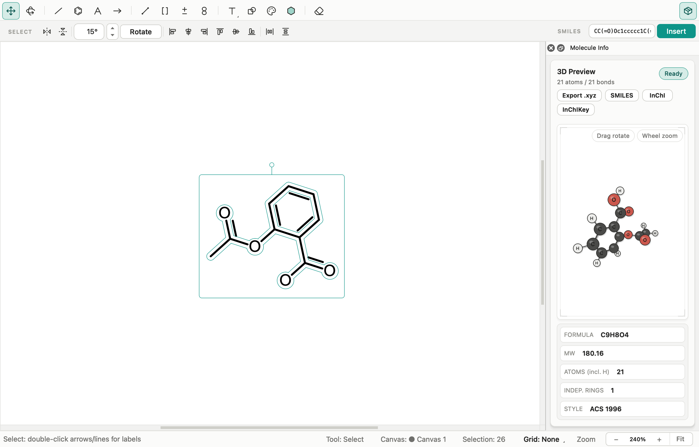

# Chemvas 레퍼런스

[English](REFERENCE.md)

Chemvas의 앱 실행, 그리기 도구, 문서 형식, 그림 내보내기, 단축키에 대한 상세 레퍼런스입니다. 제품 소개는 [README](../README.ko.md), 헤드리스 자동화는 [에이전트 CLI 안내](AGENT_CLI.ko.md)를 참고하세요.

## 앱 실행

```bash
python app/main.py    # development tree
chemvas               # after install
chemvas --help        # root CLI help without starting Qt
chemvas --version     # package version without starting Qt
```

- **그리기**: 상단 툴바에서 원하는 도구를 선택하고 캔버스를 클릭하거나 드래그합니다.
- **SMILES 삽입**: 툴바 아래 SMILES 입력란에 문자열을 넣고 **Insert** (또는 Enter)를 누른 뒤 캔버스를 클릭하여 배치합니다 (`Esc`로 취소).
- **템플릿 삽입**: 고리 또는 구조 템플릿을 선택하고 캔버스를 클릭하여 즉시 삽입합니다.
- **예제 파일 열기**: **File ▸ Open**으로 [`examples/`](../examples/) 디렉터리의 예제 문서를 열람할 수 있습니다 ([예제 README](../examples/README.ko.md) 참고).
- **새 캔버스 (`Ctrl+N`)**: 현재 문서의 용지 크기, 방향, 결합 길이, 스타일 설정을 그대로 유지한 채 새 빈 캔버스를 엽니다.

## 그리기 기능


- **결합 (Bonds)**
  - **종류**: 단일선, 이중선, 삼중선, 굵은 결합, 쐐기(Wedge), 해시(Hash).
  - **Bold 편집**: 기존 결합을 클릭하거나 결합을 따라 드래그하면 결합 차수와 이중결합 위치를 보존합니다. 입체배치 미지정 교차 이중결합은 Bold로 변경할 수 없습니다.
  - **스냅**: 30° 각도 스냅과 일정한 기본 결합 길이를 제공합니다.
  - **단축키**: 결합 위에 마우스를 올리고 `1`(단일선), `2`(이중선), `3`(삼중선), `w`(쐐기), `h`(해시), `d`(점선)을 누르면 즉시 변경됩니다.
  - **길이 조정**: 결합 길이를 변경하면 분자 전체의 구조, 고리 채움, 전하 표시가 분자 중심을 기준으로 균형 있게 확대/축소됩니다.

- **고리 및 템플릿 (Rings & Templates)**
  - **빠른 삽입**: 벤젠, 사이클로알케인(3원환~8원환), 의자 형태 콘포메이션을 클릭 한 번으로 삽입합니다.
  - **고리 융합**: 기존 결합을 드래그하거나 결합 위에서 단축키 `a`(벤젠) 또는 `4`~`8`을 눌러 고리를 결합에 융합할 수 있습니다.
  - **고리 채움 (Ring Fill)**: 닫힌 고리 전체를 선택한 뒤 Ring Fill 팔레트를 열어 색상을 채웁니다.

- **화살표 (Arrows)**
  - **스타일**: 반응 화살표, 평형 화살표(대칭 및 편향), 공명 화살표, 곡선 화살표, 점선 화살표, 호 화살표(90°, 180°, 270°; `Shift`를 누르면 호 방향 반전).
  - **설정**: 화살표 선 두께와 머리 크기는 문서 전체 설정으로 제어되며, 즉시 다시 그려지고 Undo/Redo를 지원합니다.
  - **끝점 스냅**: 화살표와 선을 그릴 때 12픽셀 내의 다른 끝점에 자석처럼 자동 정렬됩니다.

- **화살표 라벨 (Arrow Labels)**
  - **편집**: 화살표나 선을 더블클릭하여 위(Above)와 아래(Below)에 조건을 입력합니다.
  - **서식**: `_`로 아래첨자(`MnO_2` → MnO₂), `^`로 위첨자(`\Delta G^\ddagger`)를 입력하며, 중괄호 `{}`로 여러 글자를 묶을 수 있습니다 (예: `K_{2}CO_{3}`).
  - **줄바꿈 지원**: 여러 줄의 반응 조건을 지원하며, 라벨은 화살표와 함께 이동하고 문서의 글꼴/색상 설정을 따릅니다.

- **선 (Lines)**
  - 결합이 아닌 일반 선(실선, 점선, 물결선, 굵은 선)을 그려 에너지 준위 도표나 연결선으로 활용합니다.
  - 드래그 중 `Shift`를 누르면 각도가 15° 단위로 고정됩니다. 드래그 없이 클릭하면 기본 길이의 수평 준위선이 생성됩니다.

- **괄호 및 주석 (Brackets & Annotations)**
  - 대괄호, 소괄호, 중괄호 및 단검(`†`), 이중 단검(`‡`) 주석 기호를 지원합니다.
  - Select 도구로 괄호 선을 드래그하여 원하는 위치로 옮길 수 있습니다.

- **오비탈 (Orbitals)**
  - s, p, sp, sp2, sp3, d 오비탈 및 MO 결합/반결합 형태를 지원합니다.
  - 선택 후 다시 클릭하면 크기 및 회전 핸들이 나타납니다. Phase On/Off로 음영을 전환할 수 있습니다.

- **노트 (Notes / Text)**
  - 자유 텍스트 노트로 글꼴, 크기(6~96 pt), 굵기, 색상, 정렬, 위첨자/아래첨자를 지원합니다.
  - **외형 설정**: **Edit ▸ Note Appearance…**에서 배경 채움, 테두리, 불투명도, 여백, 줄 간격을 일괄 설정할 수 있습니다.

- **원자 라벨 (Atom labels)**
  - 지원 약어 목록: `Me`, `Et`, `OH`, `NH2`, `SH`, `Ph`, `PPh3`, `OMe`, `Boc`, `CO2Me`, `t-Bu`, `tBu`, `i-Pr`, `CF3`, `OTs`, `Ts`, `OMs`, `Ms`, `OTf`, `Tf`, `Ns`, `OAc`, `Ac`.
  - 중성 단일 결합으로 연결된 `OH`, `NH2`, `SH`는 분자 물성 조회 및 식별자 생성을 지원합니다.

- **전하 및 라디칼 표시 (Charge Marks)**
  - 원자 위에서 `+` 또는 `-`를 누르면 전하가 1씩 증감합니다.
  - 전하 표시를 드래그해 보기 편한 위치로 이동할 수 있으며, 원래 원자와의 화학적 결속 관계는 유지됩니다.
  - 표시를 우클릭하고 **Reassign to atom…**을 선택하면 다른 원자로 귀속을 변경할 수 있습니다.
  - 전하/라디칼 표시는 원자 색상과 독립적으로 색상을 지정할 수 있습니다.

- **색상 (Coloring)**
  - 색상 도구에서 스와치를 선택한 뒤 요소를 클릭하여 색을 입힙니다. 원자, 결합, 노트, 전하 표시에 각각 독립적인 색상을 적용할 수 있습니다.

- **격자 및 스냅 (Grid & Snapping)**
  - 상태바의 **Grid** 버튼을 눌러 **None → Hex → Square** 모드를 전환합니다.
  - 격자 간격은 결합 길이의 절반으로 설정되며, 화살표 끝점이 격자에 맞춰 정밀하게 스냅됩니다.

- **시각적 피드백 (Visual Feedback)**
  - **각도/길이 가이드**: 결합을 드래그할 때 실시간 각도 배지와 가이드라인이 표시됩니다.
  - **원자가 검사**: **View ▸ Valence Checking**을 켜면 주요 원소(H, B, C, N, O, F)의 과도한 결합 차수에 붉은 밑줄을 표시해 줍니다.

- **편집 및 변형 (Editing & Transformations)**
  - **선택**: 개별 원자/결합을 클릭하거나 영역을 드래그해 선택합니다. `Ctrl+G` / `Ctrl+Shift+G`로 그룹화/해제할 수 있습니다.
  - **변형**: 좌우 반전(`Ctrl+Shift+H`), 상하 반전(`Ctrl+Shift+V`), 회전(`Alt+Up/Down` 15°, `Alt+Left/Right` 1°).
  - **지우개**: 클릭 또는 드래그하여 요소를 삭제합니다. 결합이 모두 제거된 탄소 원자는 자동으로 정리됩니다.
  - **정렬/분배**: **Edit ▸ Align** (좌, 우, 상, 하, 중앙) 및 **Edit ▸ Distribute**를 통해 구조들을 깔끔하게 정렬할 수 있습니다.

## `.chemvas` 파일 형식

Chemvas는 분자 모델, 주석, 화살표, 설정 정보를 사람이 읽기 쉬운 표준 JSON 기반 파일로 저장합니다:

```json
{ "type": "chemvas", "version": 8, "schema": 1, "min_reader": "0.18.0", "state": { /* ... */ } }
```

- **현재 형식 버전**: Version 8, schema 1 (Chemvas 0.18.0 이상에서 도입).
- **하위 호환성 보장**: 기존의 정상적인 v7 파일도 완벽하게 읽고 편집할 수 있습니다 ([문서 호환성 정책](DOCUMENT_COMPATIBILITY.ko.md) 참고).
- **데이터 안전성**: 외부에서 파일이 변경되었거나 복구된 문서의 경우 덮어쓰기 전에 확인 대화상자를 표시합니다.

## 자동 저장 및 세션 복구

- **백그라운드 스냅샷**: 작업 중인 파일을 건드리지 않고, 사용자 앱 데이터 폴더에 몇 초마다 변경 사항을 안전하게 임시 저장합니다.
- **비정상 종료 복구**: **File ▸ Recover Unsaved Work…**를 선택하면 중단된 작업을 저장되지 않은 새 사본으로 엽니다. 앱 시작 시 이전 문서를 자동으로 열지 않습니다. 사본의 자동 저장이 성공할 때까지 복구 원본을 보관하며, 읽지 못한 복구 파일도 경고와 함께 보존합니다.
- **저장 또는 버리기**: 복구된 사본은 저장하여 보관합니다. 정상 종료를 완료하면서 명시적으로 버린 작업은 복구 대상에서 제거됩니다.
- **세션 상태 표시**: 저장되지 않은 탭에는 `●` 표시가 나타나며, **File ▸ Open Recent**에서 최근 문서를 쉽게 열 수 있습니다.

## 그림 출력

출판용 고해상도 벡터 및 래스터 이미지(SVG, PDF, PNG, TIFF)로 내보낼 수 있습니다:

- **벡터 텍스트 아웃라인**: SVG 및 PDF 출력 시 원자 및 화살표 라벨이 벡터 윤곽선(Outline)으로 변환되어, 글꼴이 설치되지 않은 환경에서도 완벽한 조판을 유지합니다.
- **논문 규격 맞춤**: 일반 논문 1단(84 mm) 또는 2단(174 mm) 규격에 정확한 DPI(최대 600 DPI)로 렌더링할 수 있습니다.
- **편집 가능한 SVG (Editable Chemvas SVG)**: 옵션을 선택하면 SVG 내부에 `.chemvas` 원본 데이터를 내장하여, 내보낸 SVG 파일을 Chemvas에서 다시 열어 언제든 계속 편집할 수 있습니다.
- **무손실 TIFF**: LZW 무손실 압축과 투명 배경을 완벽하게 지원합니다.

## 화학 입출력

*(RDKit)* 표시된 기능은 선택적 백엔드 설치가 필요합니다 (`pip install "chemvas[rdkit]"`).


### SMILES 삽입 *(RDKit)*

- 캔버스 상단 입력창에 SMILES 문자열을 입력해 구조를 배치합니다.
- 사면체 입체화학(`@`/`@@`)은 쐐기/해시 결합으로 정확하게 표현됩니다.
- 입체배치가 지정되지 않은 이중결합은 교차선(`double_either`)으로 삽입됩니다.
- 입력 문자열은 삽입에 사용하며, 문서의 Undo 기록에 저장하거나 문서를 열 때 복원하지 않습니다.

### MOL 파일 호환

- 표준 MDL Molfile(`.mol`, V2000)을 열거나 내보낼 수 있습니다.
- 기본 분자의 내보내기는 RDKit 없이도 작동하며, 복잡한 작용기 약어 확장은 RDKit 백엔드를 활용합니다.
- 전하, 라디칼, `double_either` 입체 플래그를 정확하게 보존합니다.

### Molecule Info 인스펙터 *(RDKit)*



**View ▸ Molecule Info** 또는 툴바의 큐브 아이콘으로 인스펙터를 엽니다:
- **실시간 3D 미리보기**: 마우스 드래그로 회전하고 스크롤로 확대/축소합니다.
- **물성 정보**: 분자식, 분자량, 총 원자 수, 고리 개수를 즉시 확인합니다.
- **원클릭 식별자 복사**: 표준 SMILES, InChI, InChIKey를 클릭 한 번으로 클립보드에 복사합니다.
- **3D XYZ 내보내기**: 에너지 최소화 기하 구조를 `.xyz` 파일로 내보냅니다.

### 2D→3D `.xyz` 내보내기 *(RDKit)*

- 2D 평면 화학 구조를 정밀한 3D 직교좌표(`.xyz`)로 변환합니다.
- `OTs`, `Boc`, `Ph` 등 등록된 작용기 약어를 전체 원자 구조로 자동 전개합니다.
- 쐐기/해시 결합으로 지정된 카이랄 중심의 입체 배치를 3D 모델에 정확히 반영합니다.

## 단축키

캔버스 빈 공간에서 도구를 선택하거나, 마우스를 올린 원자/결합을 단축키로 편집할 수 있습니다.

- **도구 선택**: Select `Space`, Bond `X`, Atom `A`, Text `T`, Arrow `E`, Benzene `J`, Brackets `Shift+T`, Orbitals `Shift+G`, Mark(전하/라디칼) `Shift+E`, Perspective `Alt+D`
- **원자 편집 (원자 위에 마우스 올림)**: 원소/약어 변경 [원자 라벨 단축키 표](#원자-라벨-단축키-표), 전하 증감 `+`/`-`, 라벨 직접 입력 `Enter`, 사슬 뻗기 `0`~`9` (`9` = gem-디메틸)
- **결합 편집 (결합 위에 마우스 올림)**: 단일선 `1`, 이중선 `2`, 삼중선 `3`, 굵은선 `b`, 쐐기 `w`, 해시 `h`, 점선 `d`, 이중선 위치 `l`/`c`/`r`, 벤젠 융합 `a`, 고리 융합 `4`~`8`
- **변형 및 조작**: 좌우 반전 `Ctrl+Shift+H`, 상하 반전 `Ctrl+Shift+V`, 회전 `Alt+Up/Down`(15°) / `Alt+Left/Right`(1°), 미세 이동 `Shift+방향키`(10 pt)
- **정렬 및 배치**: **Edit ▸ Align** (좌, 우, 상, 하, 중앙) 및 **Edit ▸ Distribute** (가로, 세로)
- **일반**: 저장 `Ctrl+S`, 열기 `Ctrl+O`, 전체 선택 `Ctrl+A`, 그룹화 `Ctrl+G`, 그룹 해제 `Ctrl+Shift+G`, 실행 취소 `Ctrl+Z`, 다시 실행 `Ctrl+Y`, 삭제 `Delete`/`Backspace`

### 원자 라벨 단축키 표

원자 위에 마우스를 올리고 키를 누르면 해당 원소나 약어로 즉시 변경됩니다:

| 키 | 라벨 | Shift + 키 → 라벨 |
| --- | --- | --- |
| `a` | — (벤젠 뻗기) | `Ac` |
| `b` | `Br` | `B` |
| `c` | `C` | `Cl` |
| `d` | `D` | — |
| `e` | `Et` | `CO2Me` |
| `f` | `F` | `CF3` |
| `h` | `H` | `Cbz` |
| `i` | `I` | — |
| `k` | `SO2` | `t-Bu` |
| `l` | `Cl` | `Li` |
| `m` | `Me` | `MgBr` |
| `n` | `N` | `NO2` |
| `o` | `O` | `OMe` |
| `p` | `P` | `Ph` |
| `q` | `O` | `Fmoc` |
| `r` | `R` | — |
| `s` | `S` | `Si` |
| `w` | `N` | — |
| `x` | `X` | — |
| `y` | — | `Boc` |
| `z` | — (뻗기) | `N3` |

### 단축키 호환성

ChemDraw 등 기존 상용 드로잉 툴의 주요 단축키와 호환되도록 구성되어 있어 기존 작업 습관을 그대로 활용할 수 있습니다.

## 향후 로드맵 / 미지원 항목

- **SDF (다중 분자) 가져오기/내보내기**: 여러 분자가 포함된 파일 입출력 지원 예정.
- **단일 실행 바이너리**: 원클릭 설치 파일 패키징 (현재는 PyPI `pip install chemvas`로 배포).
- **반응 경로 3D 모델링**: 다단계 반응 경로의 입체 구조 시각화 및 풍부한 템플릿 라이브러리 확장.
