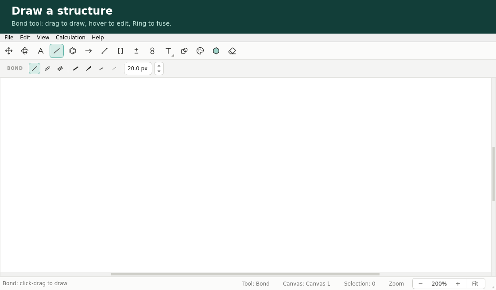
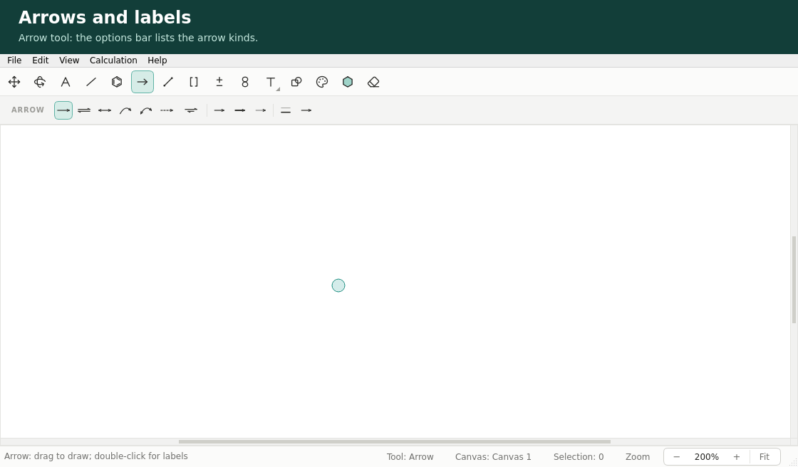
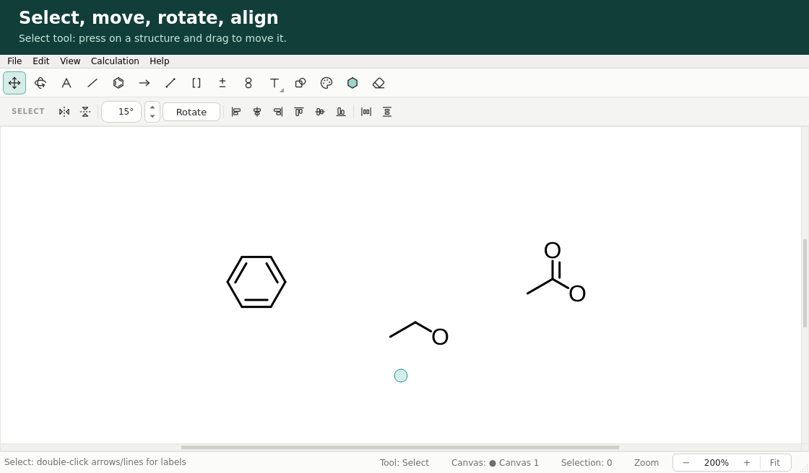
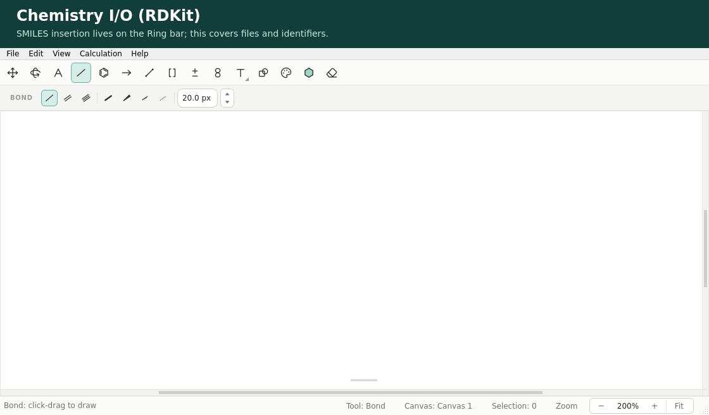

# Chemvas reference

[한국어](REFERENCE.ko.md)

User-facing detail for Chemvas: running the app, drawing features, the document
format, export behavior, and shortcuts. The landing overview is the
[README](../README.md); headless and agent contracts are in
[AGENT_CLI.md](AGENT_CLI.md).

## Running

```bash
python app/main.py    # development tree
chemvas               # after install
chemvas --help        # root CLI help without starting Qt
chemvas --version     # package version without starting Qt
```

Pick a tool from the top toolbar and click/drag on the canvas to draw. For SMILES,
choose **Ring**, enter a string in its options bar, and press **Insert** to enter
placement mode: move the mouse to preview, click to insert, `Esc` to cancel.
Templates work the same preview-and-click way.

Open a sample document from [`examples/`](../examples/) via **File ▸ Open** —
the [examples README](../examples/README.md) describes what each one contains.

## Drawing features

Three short walkthroughs captured from the application; the
[first reaction scheme](FIRST_SCHEME.md) covers SMILES insertion and export.

**Draw a structure** — bonds by dragging, bond order and element hotkeys under
the pointer, a charge, and a benzene ring fused onto a bond.



**Arrows and labels** — reaction, equilibrium and curved arrows, labels typed
through the arrow dialog, and a reaction profile drawn with the Line tool whose
connectors snap to the energy-level ends.



**Select, move, rotate, align** — move a molecule, rotate the selection with
its knob, flip, align, and distribute.



- **Bonds** — single / double / triple, bold, wedge & hash; 30° angle snapping and
  a consistent default bond length.
- **Rings & templates** — benzene, cycloalkanes, chair/boat conformers placed by
  live preview and click-to-insert.
- **Arrows** — reaction, equilibrium (balanced, or favored in either direction
  with a shortened harpoon), resonance, curved, dashed, and arc arrows (90°,
  180°, 270° for catalytic cycles; hold `Shift` while dragging to bulge the
  arc to the other side) with adjustable width and head scale. Arrow and line
  endpoints snap to nearby arrow and line endpoints while drawing, within
  twelve pixels of the cursor whatever the zoom, and a ring marks an end
  that has taken one. A snap takes precedence over the `Shift` angle lock.
  Moving an arrow or line — or a selection containing one — connects the
  same way: carrying an end within reach of another item's end joins them
  exactly, and carrying on past it leaves the drag where the pointer is.
- **Arrow labels** — double-click an arrow or line to give it a label above and
  below, such as rate constants. `_` starts a subscript and `^` a superscript,
  and braces set the exact range: `K_{2}CO_{3}`, `H_{2}SO_{4}`, `ΔG^{‡}`.
  Without braces, a marker applies until the next space, `_`, or `^`;
  `K_2CO_3` therefore also puts `CO` in the subscript. The dialog previews
  both labels as you type so you can check their scope before choosing OK.
  Labels take
  the text font settings in force when they are created or edited, and move
  with their arrow.
- **Lines** — plain, dashed, wavy, and bold lines that are not bonds, for
  energy-level diagrams, connectors, and annotations. Hold `Shift` while
  dragging to lock the angle to 15° steps; a click without a drag places a
  horizontal level two bond lengths long. Plain, dashed, and wavy lines
  follow the arrow line width; bold lines use the bold bond width. Lines are
  saved in the document's arrow list.
- **Brackets & annotations** — square / round / curly brackets, dagger (`†`) and
  double dagger (`‡`) annotation objects.
- **Atom labels** — elements, charges, radicals, and common alias labels
  (`Me`, `Et`, `OH`, `NH2`, `SH`, `Ph`, `PPh3`, `OMe`, `Boc`, `CO2Me`, `t-Bu`, `tBu`,
  `i-Pr`, `CF3`, `OTs`, `Ts`, `OMs`, `Ms`, `OTf`, `Tf`, `Ns`, `OAc`, `Ac`).
  OH, NH2, and SH support Molecule Info identifiers when neutral and attached
  through exactly one single bond, including wedge/hash. Use an element label
  for a charged or radical atom; these hydride aliases reject those annotations.
  Other aliases do not provide identifiers. SMILES insertion keeps element labels.
- **Charge marks** — over an atom, `+` / `-` changes its charge by one: an opposite bound charge
  mark is removed first; otherwise a new mark is placed without overlapping
  its existing marks. Each shortcut is one undoable edit. Radical and free
  marks are left alone. Bound marks can be selected, moved, or erased without
  selecting their atom; the Mark tool previews the same binding its click uses.
- **Snap to grid** — **View ▸ Snap to Grid** shows a faint grid of half a bond
  length on the sheet and snaps the points arrows and lines are drawn at, and
  the ends dragged with their endpoint handles, curved arrows included, onto
  it. Order of precedence: an existing endpoint wins, then `Shift`, then the
  grid. A click, and a drag shorter than one grid step, both read as a click.
  The grid is hidden while it would be too dense to read on screen, and it
  belongs to the window, not the document.
- **Editing** — endpoint handles (select an arrow or line, then click it to
  show a handle at each end; drag one to move that end, snapping to nearby
  endpoints — a handle sitting on another item's endpoint is drawn filled
  rather than hollow — and curved arrows keep their third handle for the
  curve),
  select / move, an eraser tool (click or drag to erase; atoms a
  deletion leaves with no bond and nothing visible — no label or mark — are
  removed with it), horizontal & vertical flip, perspective rotation, and
  undo/redo. Nudging and aligning selections restore their recorded coordinates
  exactly, including existing perspective depth.
  With Select, press near a line or arrow's stroke to select it and keep
  dragging to move it in the same gesture. The click margin is measured on
  screen, independent of zoom; a curve's interior is not treated as a filled
  click target. Before a drag starts, pointer movements below the system drag
  threshold leave the drawing and undo/redo stacks unchanged. Click an already
  selected stroke to toggle its endpoint handles.
- **Desktop menus** — standard File / Edit / View menus, including a
  **Canvas Size** dialog for the sheet size and orientation.
- **Keyboard shortcuts** — tool selection and atom/bond editing under the pointer
  (see [Keyboard shortcuts](#keyboard-shortcuts)).

## The `.chemvas` file format

File ▸ Save / Open works with `.chemvas` files — a JSON-based format holding the
molecule model, annotations, arrows, bracket annotations, and settings:

```json
{ "type": "chemvas", "version": 7, "state": { /* ... */ } }
```

Version 7 is the only supported document contract. It can carry an optional
Calculation Plan v2 with bounded precomplex candidates, exact XYZ provenance,
and explicit endpoint review selections. Earlier document versions and
Calculation Plan v1 payloads are rejected.

Opening or inserting a drawing preserves overlapping atoms: move or edit them
on the canvas to correct the layout. Save asks before replacing a file changed
outside Chemvas, or a recovered document's original file when its saved baseline
is unknown. Choose No and use Save As to keep both versions. This detects observed
file changes; it is not a cross-process editing lock.

Chemvas drawings must use the `.chemvas` suffix. Desktop startup arguments, OS
file-open events, **File ▸ Open**, **Open Recent**, and clean-session reopening
all reject or ignore `.json` drawing paths; **Save** and **Save As** publish
drawings only as `.chemvas`. JSON request, patch, report, and machine-artifact
files used by headless commands remain separate protocols and are unaffected.

## Autosave & recovery

Chemvas snapshots every open document to a per-user app-data folder every few
seconds — nothing is written next to your own files. If the app is killed or
crashes, the next launch restores those documents (unsaved ones flagged with a
`●` and a status-bar note); a clean quit simply reopens whatever files were
open. Snapshots are pruned once a session has been restored or closed cleanly.
Stale recent-file and clean-session entries for unsupported drawing paths are
ignored. A current internal crash autosave can still recover the drawing data,
but an unsupported original path is discarded and the recovered canvas opens
unbound as an unsaved document.

Autosave never replaces a complete recovery snapshot with one whose capture
reported a warning. It keeps the last good snapshot and shows a persistent
status-bar warning instead; the warning clears only after a later autosave
succeeds without warnings.

In sessions confirmed to have stopped, unreadable dirty snapshots and orphaned
snapshot payloads are retained with a warning, not silently pruned. If ownership
cannot be established, damaged sessions may be kept without a warning.
Multiple dirty recoveries of one file are kept;
additional versions open as unsaved recovered copies without the original path.

Quit resolves Save / Discard / Cancel for all windows before closing any of
them, then preserves the complete final reopen list. Cancelling or a failed
save leaves the windows open. Restored untitled drawings receive distinct names.
File Open and Open Recent reuse an existing blank drawing when possible.
Imported drawings with content are not blank targets. OS file-open requests
during Quit are declined with a status message; retry after cancelling Quit or
restarting Chemvas. They are not queued for automatic reopening.

If the writable app-data location changes, Chemvas also checks its known
alternate locations for abandoned recovery snapshots. A persistent warning
gives their location and recovery steps; these snapshots are neither merged
nor deleted automatically. Copy a `doc-*.json` snapshot to a new `.chemvas`
file and open that copy, keeping the original recovery file intact.

Unsaved tabs show a `●` marker, the File menu keeps an **Open Recent** list, and
reopening an already-open file switches to its window instead of duplicating it.

## Figure export

Plain SVG / PDF / PNG / TIFF with physical-size presets (bond-length or
84 / 174 mm column fit), independent of zoom. Atom and arrow labels are outlined
in vector exports, preserving the shaped glyphs and subscript/superscript
positions. Other text items retain their own rendering behavior. See the
[worked example](FIRST_SCHEME.md#4-export-the-figure) for output settings and
version availability.

Figure export defaults to plain SVG without Chemvas source metadata. Choose
**Editable Chemvas SVG** only when you want the SVG to carry the original
document payload for round-tripping back into Chemvas.

All GUI export presets enforce the same size limits as `render-document`:
14,400 points per side, and for PNG/TIFF at most 10,000 pixels per side and
25 million pixels in total. Oversized output is rejected before painting and
leaves any existing destination unchanged. PDF pages use custom whole-point
dimensions rather than snapping to nearby standard paper sizes; the drawing
fits that page with its aspect ratio preserved.

## Chemistry I/O

RDKit is an optional backend — Chemvas runs without it. The features marked
*(RDKit)* need `pip install "chemvas[rdkit]"`.



### SMILES import *(RDKit)*

Choose **Ring**, type a SMILES string in its options bar, and press **Insert**.
Preview it under the cursor and click to place it on the canvas.
`Ts` and `Ac` name the tosyl and acetyl abbreviations on
the canvas, so a SMILES asking for tennessine or actinium is refused rather than
drawn as the abbreviation.

Absolute tetrahedral stereochemistry (`@` / `@@`) is drawn with wedge/hash
bonds. Specified double-bond stereochemistry (`/` / `\`), non-tetrahedral
stereochemistry, and relative or racemic CXSMILES stereo groups are refused
because the canvas cannot preserve them. Isotope labels are also unsupported.

Single, double, and triple bonds are supported, including aromatic structures
that RDKit can Kekulize into those bond orders. Other bond types, such as dative,
unspecified, and quadruple bonds, are refused rather than approximated. Aromatic
input that cannot be represented by Kekulization is also refused.

Explicitly drawn hydrogens count toward normal valence; they do not disable all
remaining implicit hydrogens. For example, unmarked O–H is completed to water;
use a radical mark when a hydroxyl radical is intended. Abbreviations require
supported single-bond attachments. Dotted and dotted-double contacts remain
editable drawing objects, but chemical identifiers, MOL/XYZ, 3D conversion and
calculation conversion reject selections containing them instead of treating
them as covalent bonds.

### MOL interchange

Open MDL Molfiles (`.mol`, V2000) as new documents and export the selected
structure as `.mol`. Import and plain-element export need no RDKit; abbreviation
labels require optional RDKit expansion. `Ts` and `Ac` are the tosyl and acetyl
abbreviations on the canvas rather than tennessine and actinium, so a molfile
that uses either symbol for the element is rejected on import. Property records
are limited to `M  CHG` / `M  RAD`, wedge/hash stereo to single bonds, and the
counts-line chiral flag to zero. Singlet `M  RAD` code 1 is rejected until the
annotation model can preserve spin multiplicity.

### Molecule Info window *(RDKit)*

**View ▸ Molecule Info** opens a separate window with a 3D preview (drag to
rotate, scroll to zoom), the molecular formula and weight, and one-click copy of
the canonical SMILES, InChI, and InChIKey for the current selection. The
`Export 3D XYZ` button exports the selected molecule.
Identifiers preserve drawn wedge/hash stereochemistry using the same conversion
as the preview. They remain unavailable for abbreviation labels; preview and
3D export can still expand supported abbreviations.

### 2D→3D `.xyz` export *(RDKit)*

Convert the current molecule or atom/bond selection into 3D coordinates:

- Export scope is the current chemical graph or the current atom/bond selection.
  Arrows, bracket annotations, and free text are **not** included in `.xyz`.
- `+`/`-`/radical marks become formal charges / radical electrons; wedge/hash bonds
  on single bonds become RDKit stereochemistry hints.
- Alias labels expand into explicit fragments (e.g. `OTs` → the full
  `-O-S(=O)(=O)-C6H4-CH3` tosylate). Each alias attaches through a single bond;
  `Ns` is the para (4-nitrobenzenesulfonyl) isomer. Carbon-bound `PPh3` is
  accepted only through exactly one ordinary covalent single bond and expands as
  phosphonium `C-[P+](Ph)3`; standalone, non-carbon, multiple, non-single, styled,
  or explicitly charge/radical-annotated uses fail closed.
- Unsupported labels, mis-connected aliases, and invalid wedge/hash use fail with an
  explicit error message instead of guessing.
- `.xyz` stores element symbols and 3D coordinates only — it is **not** a full
  round-trip of bond orders, stereochemistry, or reaction semantics.

## Keyboard shortcuts

While editing a free-text note, drag to select text, double-click to select a word,
or Shift-click to extend a text selection. Formatting controls keep the editor
active. Choosing another tool commits the note and returns keyboard input to the
drawing. Undo within the editor affects the current editing session; after leaving
the editor, document Undo reverses the committed edit. Unsaved markers also track
typing, formatting, and text Undo before the note loses focus.
Press `Esc` to commit the note and return to Select without discarding the text.
Note spacing, tabs, and empty paragraphs are retained when saving/reopening or
undoing/redoing a committed edit.

In Select, notes and shapes can be moved with the first drag, like arrows.
Click empty canvas outside the selection to clear it, including selected notes.
Copy/paste preserves complete groups as independent copies; one Undo removes
the pasted objects and their groups together. Partial groups supplied by a
programmatic selection are copied as ungrouped objects.

Choose a tool on an empty area of the canvas, or hover over an atom or bond to
edit it with the keys below.

- **Empty canvas (tool hotkeys):** Select/Marquee `Space`, Bond `X`, Atom `A`,
  Text `T`, Arrow `E`, Benzene `J`, Brackets `Shift+T`, Orbitals `Shift+G`,
  Chemical symbols `Shift+E`, Perspective `Alt+D`
- **Atom hotkeys (hover over an atom):** element/alias labels
  `c n o s p f h b i l m e r x d` and `Shift+f/p/a/b/s/n/e/z/m/l/o/q/h/y`, charge `+`/`-`,
  edit label `Enter`, sprout `0/1/2/3/a/4/5/6/7/8/9/z/v/u` (`9` = gem-dimethyl)
- **Bond hotkeys (hover over a bond):** Single `1`, Double `2`, Triple `3`,
  Bold `b`/`Shift+B`, Wedge `w`, Hash `h`/`Shift+H`, Dashed `d`/`Shift+D`,
  double-bond position `l`/`c`/`r`, Benzene fusion `a`,
  Ring fusion `4/5/6/7/8`, Chair fusion `9/0`
- **Objects:** Flip Horizontal `Ctrl+Shift+H`, Flip Vertical `Ctrl+Shift+V`,
  Rotate selection `Alt+Up/Down` (15°) and `Alt+Left/Right` (1°),
  Nudge selection `Shift+Arrows` (10 pt); **Edit ▸ Align** (left, center,
  right, top, middle, bottom) and **Edit ▸ Distribute** (horizontally,
  vertically) arrange the selected structures and objects as whole units: a
  molecule moves whole even when only part of it is selected, and a group
  moves as one
- **View:** Actual size `F5`, Fit to window `F6`, Magnify `F7`, Reduce `F8`
- **File / edit:** Save / Open / Undo / Redo (platform defaults), `Ctrl+A` (select
  all, switches to the Select tool), `Ctrl+C` (copy selection — PNG plus SVG/PDF
  vector clipboard flavors), `Ctrl+X` (cut selection), `Ctrl+V` (paste the copied
  selection), `Ctrl+G` / `Ctrl+Shift+G` (group / ungroup selection),
  `Delete`/`Backspace` (delete selection, or edit/delete the hovered atom/bond),
  `Esc` (cancel template / SMILES insertion; otherwise cancel the active gesture
  and return to Select, or commit and leave note editing)

### Shortcut compatibility

Many of these bindings are shared with ChemDraw, so familiar drawing habits can
carry over. The list above defines Chemvas's supported keys; it does not imply
complete shortcut or file-format compatibility.

## Roadmap / not yet supported

These are known gaps, not bugs — contributions welcome:

- **SDF (multi-molecule) interchange:** import and export. Single-molecule
  `.mol` import/export, SMILES export ("copy as SMILES"), and InChI / InChIKey
  have landed.
- **Distribution:** one-file desktop binaries (Chemvas is already on PyPI —
  `pip install chemvas`).
- **Multi-molecule / reaction-scheme 3D export** and richer template libraries.
- **Deliberately out of scope for now:** printing (export a PDF instead),
  persistent preferences (every document starts from the ACS 1996 defaults),
  pasting external clipboard content, and drag-and-drop file open.
