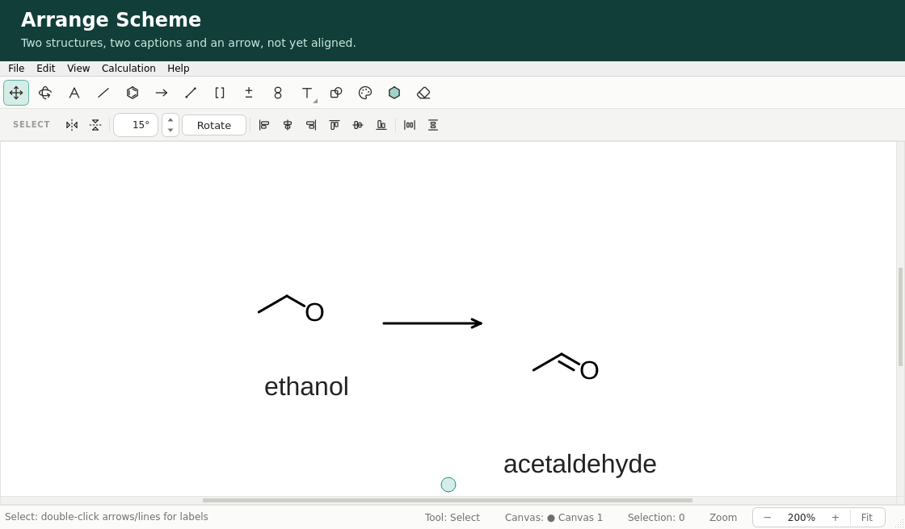
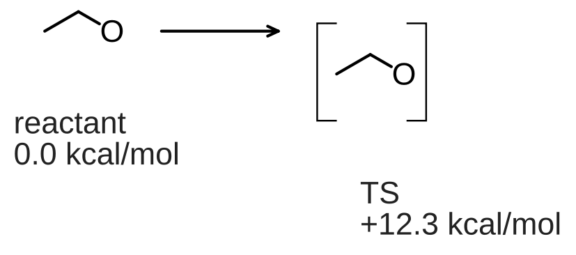
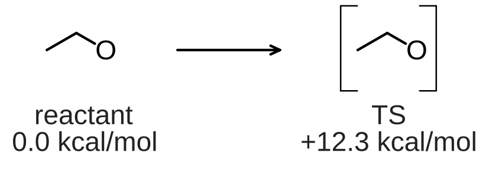
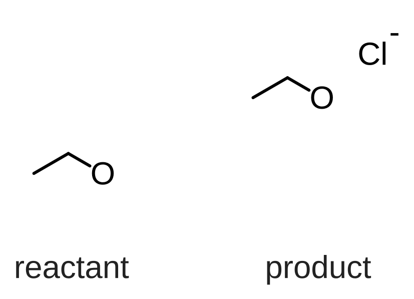
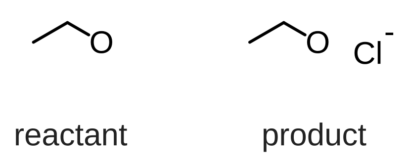
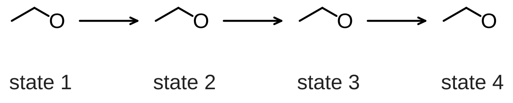
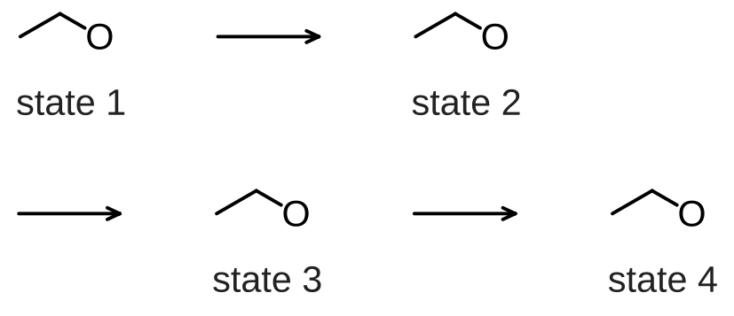

# 구조와 캡션 배치

[English](SCHEME_LAYOUT.md)

`layout-document`는 기존 구조와 캡션 노트를 명시적인 행으로 배치합니다. 원본이
그린 텍스트를 측정하고, 각 구조 아래에 캡션을 가운데 맞추고, 캡션 단계마다 첫
텍스트 기준선을 정렬하며, 블록 수가 같은 행에는 공통 열 너비를 씁니다. 선택적
원자 앵커는 구조의 경계 상자 중앙 대신 반응 중심을 정렬합니다.

간격이 이미 맞는 그림에는 CLI가 `"mode": "align-y"`도 지원합니다. 캡션을 옮기거나
수평 배치를 바꾸지 않고 분자 그림만 수직으로 정렬합니다. 이 모드는 명시적이며
기본값이 아닙니다.

Arrange는 구조, 지정한 객체/캡션과 연결 화살표가 차지하는 원본 영역의 왼쪽 위를
보존하며 (0,0)으로 옮기지 않습니다. Wrap width는 절대 X 좌표가 아닌 결과 영역의
너비입니다. 미지정 객체는 그대로이고 자동 페이지 맞춤은 아니므로 배치 후 시트
포함 검사를 실행하세요. `align-y`에서는 화살표 위치도 유지합니다.
여러 반응물이 속한 블록은 하나의 캡션 묶음을 공유합니다. 별도 캡션에는 블록을
나누거나 개별 오프셋을 보존하는 Attached note를 사용하세요. 역할은 명시적으로
지정하며 추론하거나 새로운 캡션 스키마로 저장하지 않습니다.

## 데스크톱에서 배치하기



1. 각 완전한 구조를 캡션 노트와 함께 선택하고 **Edit ▸ Group**을 씁니다. 그
   상태에 속하는 분리된 조각과 TS 괄호도 같은 그룹에 넣습니다.
2. **Edit ▸ Arrange Scheme…**을 엽니다. 기존 그룹 하나가 블록 하나입니다. 행과 행
   안의 순서를 정합니다. 행 **0**은 그 그룹을 건드리지 않습니다.
3. **Choose…**로 이름 붙은 각 노트를 **Structure caption** 또는 오프셋을 유지하는
   **Attached note**로 지정합니다. 위치로 캡션을 추측하지 않습니다. 캡션 필드는
   1부터 시작하는 노트 번호를 나열하며, 순서를 바꿔 캡션 단계를 고릅니다. 포인터를
   올리면 노트 텍스트와 그룹 원자 ID가 보입니다. 반응 조건은 화살표의 기존
   Above/Below 필드에 두고, 패널 설명은 구조 그룹 밖에 두세요.
4. 연결하는 **Arrow after**를 각각 명시적으로 고르거나, 화살표 없는 갤러리라면
   없음을 고릅니다. 논리적 행의 마지막 블록은 나가는 화살표가 없어야 합니다. 기존
   화살표는 CLI와 같은 수평 화살표 규칙을 만족해야 합니다.
5. 간격과 선택적 **Wrap width**를 캔버스 단위로 정한 뒤 **Arrange**를 클릭합니다.
   줄바꿈 너비 **0**은 줄바꿈 없음입니다. 전체 편집은 **Ctrl+Z**로 되돌리고 보통
   방식으로 다시 실행할 수 있으며, 기존 그룹 구성은 그대로 남습니다.

관련된 비교 행에 이름을 붙이려면 **Alignment group**을 씁니다. 같은 이름은 열
너비를 공유하고, 다른 이름은 무관한 비교를 독립적으로 둡니다. 행마다 이름 하나면
충분하며, 한 행에 충돌하는 이름은 거부됩니다. 비워 두면 원래의 블록 수 기준
정렬을 유지합니다. 캡션을 공유 행 기준선이 아니라 자기 블록 아래에 두려면
**Close to each structure**를 고릅니다. 선택적 **Connecting-arrow color**(예:
`#000000`)는 고른 화살표와 그에 붙은 라벨에만 적용됩니다. 비워 두면 색을
보존합니다. 화살표 선 너비와 라벨 글꼴은 문서의 공통 설정을 유지합니다.

대화상자는 메커니즘을 추론하거나 어떤 노트가 어떤 구조를 설명하는지 정하지
않습니다. 지정하지 않은 화살표와 다른 객체는 있던 자리에 남습니다. 지원하지
않거나 오래된 입력, 불가능한 너비 예산은 그림을 바꾸지 않으며, 취소하면 아무
편집도 하지 않습니다. 데스크톱은 아래 명령과 같은 측정 배치 계획을 씁니다. 첫
버전은 기존 그룹과 그 기하 중심을 쓰므로, 명시적 원자 앵커나 배치의 일부로
그룹을 만드는 일에는 CLI를 쓰세요.

**File ▸ Export Figure…**에서 **Custom width (mm)**나 크기 프리셋을 고르고, 선택적으로
**Limit exported height**와 **Minimum exported font size**를 켭니다. 글꼴 검사는
전체 캔버스 SVG/PNG에서만 가능하며 선택 영역 출력, PDF, TIFF에서는 되지 않습니다.
사용자 지정 너비와 가드가 걸린 출력은 벡터와 래스터 치수가 유계입니다. 거부된
제한은 기존 대상 파일을 그대로 둡니다. 높이 검사는 최종 형식의 치수 반올림을
포함합니다(PNG/TIFF는 요청한 DPI를 쓰고 해상도 메타데이터 양자화는 제외).

## 스크립트에서 배치하기

```bash
chemvas inspect-document scheme.chemvas
chemvas layout-document scheme.chemvas --layout layout.json --output arranged.chemvas
chemvas check-layout arranged.chemvas
chemvas render-document arranged.chemvas --output arranged.svg --width-mm 174 --max-height-mm 120
```

inspection의 정확한 원본 해시를 요청에 복사합니다. 원자 참조는 안정된 ID이고,
노트·화살표·기타 항목 참조는 원본 문서의 0부터 시작하는 인덱스입니다. 이 예제에는
해당 원자와 항목이 있어야 합니다.

```json
{
  "format": "chemvas-scheme-layout",
  "version": 1,
  "source_sha256": "<64 lowercase hexadecimal characters>",
  "gap": 12,
  "row_gap": 24,
  "caption_gap": 8,
  "line_gap": 4,
  "rows": [{
    "blocks": [
      {"atoms": [0, 1, 2], "captions": [0, 1], "anchor_atom": 0},
      {"atoms": [3, 4, 5], "captions": [2, 3], "anchor_atom": 3,
       "items": [["ts_brackets", 0]]}
    ],
    "arrows": [0]
  }]
}
```

캡션이 둘씩 있는 구조 두 개, 두 번째에 TS 괄호, 화살표 하나에 이 요청을 적용한
전/후입니다.





각 블록은 연결된 구조 전체를 포함해야 합니다. 같은 상태에 속하는 분리된
반응물이나 생성물은 명시적으로 포함하세요. `captions`는 기존 노트를 위에서
아래로, 예를 들어 식별자 다음 에너지 순으로 나열합니다. `items`는 구조와 함께
강체로 움직이는 노트, TS 괄호, 도형을 더합니다. 둘 다 선택 사항입니다. 이중 단검
같은 별도의 TS 기호도 괄호와 함께 포함하세요. `anchor_atom`은 자기 블록에 속해야
합니다. 선택적 `arrows`는 인접한 블록 쌍마다 항목 하나를 가져야 합니다. 이들은
이미 수평이고 왼쪽에서 오른쪽으로 향하는 `arrow` 또는 `equilibrium` 항목이어야
합니다. 길이와 라벨 텍스트는 보존되고, 색도 아래에 설명한 대로 명시적으로
덮어쓰지 않는 한 유지됩니다.

## 명시적 비교 행

기존 행 계획기는 arrange 모드에서 세 가지 선택을 지원합니다.

- `rows[].column_group`: 공백 아닌 인쇄 가능 문자 1–64자의 식별자. 같은 식별자를
  가진 행은 블록 수가 같아야 하며 열과 화살표 슬롯 너비를 공유합니다. 다른 이름은
  비교를 독립적으로 둡니다. 생략된 그룹은 이름 있는 그룹과 별개로 원래의 블록 수
  공유를 유지합니다. 너비 제한 줄바꿈은 여전히 독립된 표시 줄을 씁니다.
- `caption_alignment`: `"row"`(기본)는 행 전체에서 캡션 기준선을 맞추고,
  `"structure"`는 TS 괄호처럼 명시적으로 붙인 항목을 포함한 자기 블록의 그려진
  영역 아래에 각 캡션 묶음을 둡니다. 그 항목들을 무시하거나 텍스트를 관통해 분자
  경계 상자에 닿게 하지 않습니다.
- `arrow_color`: `"#000000"` 같은 16진 색으로, 명시적으로 나열한 `rows[].arrows`와
  그 라벨에만 적용됩니다. 나열되지 않은 화살표, 분자 색, 캡션, 글꼴, 선 너비,
  화살표 종류는 바뀌지 않습니다. 의도한 색 구분을 보존하려면 생략하세요.
  의도적으로 다른 색을 쓰는 그룹에는 별도 요청을 쓰세요.

이 선택들은 분기를 추론하거나 반응물을 복제하거나 화학적 동등성을 판단하지
않습니다. 배치 전에 행을 정하세요. 좁은 그림에서는 짓눌린 분기보다 두 개의
완전한 반응 행이 비교를 더 분명하게 전달할 수 있습니다. 이는 저작 결정이지 자동
템플릿 변환이 아닙니다.

GUI와 CLI는 같은 검증과 측정 계획을 씁니다. 역할 선택은 일회성 배치 지시이지 새
영구 문서 스키마가 아닙니다. 다시 연 뒤에는 역할을 다시 고르거나 현재 원본
해시로 명시적 요청을 다시 실행하세요. 원본 그룹과 화살표 라벨 자체는 영구적으로
남습니다.

## 분자 그림만 정렬하기

생성물 그림이 이웃보다 떠 있지만 캡션과 수평 간격은 이미 맞을 때, 같은 명령에 이
요청을 씁니다.

```json
{
  "format": "chemvas-scheme-layout",
  "version": 1,
  "mode": "align-y",
  "source_sha256": "<64 lowercase hexadecimal characters>",
  "rows": [{
    "reference_blocks": [0],
    "blocks": [
      {"atoms": [0, 1, 2], "captions": [0]},
      {"atoms": [3, 4, 5, 6], "captions": [1],
       "parts": [[3, 4, 5], [6]]}
    ]
  }]
}
```

반응물 위에 떠 있는 생성물에 같은 요청을 적용한 모습입니다. 별도의 염화 이온은
독립된 part이고, 캡션과 모든 X 좌표는 제자리에 남습니다.





`reference_blocks`는 그 행에서 0부터 시작하는 블록 인덱스입니다. 목표는 **그
블록들의 원래 분자 그려진 범위의 합집합**의 수직 중점이며, 원자 위치의 평균도
아니고 지정된 P 원자도 아닙니다. 생략하면 행의 모든 블록을 씁니다. 캡션, 자유
텍스트, 괄호, 도형은 그 분자 측정에 영향을 주지 않고, 원자 글리프와 붙은 분자
표시는 영향을 줍니다. 모든 목표는 무엇이든 움직이기 전에 측정됩니다.

기본적으로 블록은 복합체 안의 분리된 반응물을 포함해 하나의 강체 단위입니다.
`parts`는 독립적으로 수직 이동하는 단위를 명시적으로 선언합니다. 점선 TS 접촉을
포함해 어떤 결합도 자르지 않고 블록의 모든 원자를 정확히 한 번씩 분할해야
합니다. part 하나가 강체로 유지되어야 하는 여러 연결 성분을 가질 수도 있습니다.
모델에 분리된 성분이 있다는 이유만으로 TS나 복합체를 나누지 마세요.

모든 원자와 장면 항목의 X 좌표, 모든 노트 내용/위치, 모든 기존 원본 그룹은 정확히
유지됩니다. 나열된 캡션은 검증되지만 재배치되지 않으며, `items`의 노트도 고정된
채입니다. 명시적으로 나열한 TS 괄호/기호와 도형은 강체 블록 전체를 따라갈 수
있으며, 분자 중심에서는 제외됩니다. 움직이는 장식과 여러 `parts`를 함께 쓰는 것은
모호하므로 거부됩니다. 화살표는 고정입니다. 기존 그룹 경계는 여전히 지켜야
하며, 보통 배치와 달리 이 모드는 그룹을 만들지 않습니다.

`anchor_atom`, `gap`, `row_gap`, `caption_gap`, `line_gap`, `max_row_width`,
`column_group`, `caption_alignment`, `arrow_color`는 옛 기본값으로 설정해도
`align-y`에서 거부됩니다. 이 모드는 열을 배치하지도 행을 줄바꿈하지도 않습니다.
`parts`와 `reference_blocks`는 보통 arrange 요청에서 거부됩니다. `mode`를 생략하면
기존 배치 경로와 보고서를 유지합니다. align 전용 보고서는 `mode`, `part_count`,
행별 참조/목표 근거, 각 part의 이동 전/후 분자 범위를 `dx: 0`과 `dy`와 함께
더합니다.

데스크톱의 Arrange Scheme 대화상자는 여전히 완전한 배치 인터페이스입니다. 새
align 전용 계약은 현재 CLI로 제공됩니다. 캡션을 고정해야 할 때 데스크톱의 캡션
재배치 동작으로 대신하지 마세요.

## 긴 경로 줄바꿈

요청 루트에 선택적 `"max_row_width": 900`을 더하면 지정한 각 행을 900 캔버스
단위보다 넓지 않은 줄들로 나눕니다. 값은 양의 유한수이고 100,000 이하여야 합니다.
생략하면 명시적 행과 공유 열 너비를 유지합니다. 이것은 배치 예산이지 밀리미터
단위의 출력 너비가 아닙니다.





줄바꿈은 나열한 블록 순서를 따릅니다. 각 완전한 구조/캡션 블록은 명시적으로
그룹화된 조각과 TS 기호를 포함해 함께 남습니다. 줄 경계를 넘는 연결 화살표는
다음 줄의 시작, 목표 블록 바로 앞으로 이동합니다. 왼쪽에서 오른쪽으로 읽고 다음
줄로 이어지며, 앞선 화살표는 이전 줄의 계속을 뜻합니다. 명령은 페이지를 가로지르는
연결선을 그리거나 중간체를 복제하거나 분기를 추론하거나 별도 입력 행을 합치지
않습니다.

너비에는 그려진 캡션과 화살표 라벨이 포함됩니다. 줄은 공유 열로 늘리지 않고
빽빽한 왼쪽 정렬 배치를 씁니다. 블록 하나, 또는 앞선 화살표와 그 목표 블록이
들어가지 않으면 출력 없이 배치가 실패합니다. 구조를 줄이거나 화살표만 있는 줄을
만들지 않습니다. 표시 줄은 최대 128개입니다. 줄바꿈 보고서는 검사를 위해 원본
행/블록 위치와 각 계속 화살표를 식별합니다.

예산은 그려진 배치 범위를 설명하며, 전체 출력의 텍스트 상자 여백이나 바깥
여백은 포함하지 않습니다. 나열되지 않은 객체는 여전히 제자리에 남고 전체 출력을
키울 수도 있습니다. 배치한 뒤 물리적 출력 너비를 고르고 그 크기에서 결과를
검사하세요. 별도의 글꼴 크기 가드는 읽을 수 없이 작은 텍스트를 거부할 수
있습니다.

```bash
chemvas render-document arranged.chemvas --output arranged.svg --width-mm 174 --min-font-pt 6
```

여기서 6 pt는 예시 문턱이지 보편적인 저널 요구 사항이 아닙니다. 문턱에는 작은
아래·위 첨자 글리프가 포함됩니다. 의도한 그림과 출판물의 요구 사항을 쓰세요.

거리는 캔버스 단위입니다. 기본값은 gap 40, row gap 30, caption gap 10, line gap
4입니다. gap은 이웃한 셀 사이, 또는 셀과 행 화살표 사이의 최소 여백이며, 셀은
가장 넓은 캡션을 포함합니다. 나머지 gap은 행 사이, 구조 그림과 캡션 사이, 캡션
단계 사이를 띄웁니다. 모든 거리는 최대 10,000이며, gap은 양수여야 하고 나머지는
0일 수 있습니다.

캡션 범위에는 텍스트뿐 아니라 보이는 노트 상자의 채움과 테두리도 포함됩니다.
따라서 구조–캡션 간격과 캡션 단계 간격은 그려진 상자 바깥에서 측정합니다.
숨겨졌거나 완전히 투명한 상자는 간격을 늘리지 않습니다.

요청은 1 MiB, 행 128개, 블록 128개, 원자 참조 4,096개, 항목 참조 4,096개로
제한됩니다. 입력은 96 MiB / 그래픽 레코드 20,000개 한계를 유지합니다. 기존 출력
파일과 심링크는 거부되고, 새 출력은 원본을 수정하지 않고 원자적으로 게시됩니다.
JSON 보고서는 원본, 요청, 출력 해시, 이동량, 나열되지 않은 객체를 제외한 배치
영역의 치수를 캔버스 단위로 기록합니다.

## 범위와 남은 한계

- 기하 변경은 이동뿐입니다. 명시적 화살표 색 덮어쓰기는 기하와 별개입니다. 배치는
  결합을 정규화하거나 구조를 회전하거나 입체화학을 추론하거나 텍스트를 바꾸거나
  글꼴 크기를 조정하지 않습니다. 나열되지 않은 객체는 제자리에 남습니다.
- 자동 번호/글머리 목록은 캡션 단계가 아닙니다. 그 표식은 캡션 글리프 범위에
  들지 않습니다. 대화상자에서 캡션 번호를 생략하거나(CLI 블록에서는 `items`에
  넣어) 보통 그룹 항목으로 옮기세요. 텍스트와 출력 렌더링은 계속 지원됩니다.
- 보통 arrange 모드에서 블록은 원본 GUI 그룹이 됩니다. 다시 연 뒤 그룹을 옮기면
  구조와 캡션이 함께 움직입니다. 기존 그룹은 전체 단위로만 교체됩니다. 캡션
  앵커는 한 번 적용되며 새 문서 스키마로 저장되지 않습니다. 나중에 텍스트를
  편집해도 자동으로 다시 흐르지 않습니다. 그런 편집 뒤에는 새 원본 해시로 배치를
  다시 실행하세요.
- 행은 `max_row_width`를 줄 때만 줄바꿈됩니다. Calculation Plan이나 저장된 3D
  원근이 있는 문서는 데이터를 지우지 않고 거부됩니다.
- 성공한 배치는 충돌이나 출판 가독성 증명서가 아닙니다. `check-layout`을 실행하고
  의도한 인쇄 크기에서 원본 출력을 검사하세요.
- `--width-mm` 렌더링은 개별 구조가 아니라 전체 그림을 확대·축소합니다.
  `--max-height-mm`는 너무 높은 계획을 그리기 전에 거부하며 줄이지 않습니다.
  최종 텍스트 크기를 검사하려면 `--min-font-pt`를 더하세요. 이 옵션들 중 어느 것도
  원본 글꼴을 바꾸거나 충돌 없는 배치를 약속하지 않습니다.

출력 반올림, 자원 한계, 결정적 렌더링 보장은
[문서 CLI](AGENT_CLI.ko.md#헤드리스-문서-렌더링)를 보세요.
[출판 레시피](PUBLICATION_SCHEMES.ko.md)는 공통 물리 배율과, 캡션 배치와 분자
전용 정렬의 차이를 보여 줍니다.
