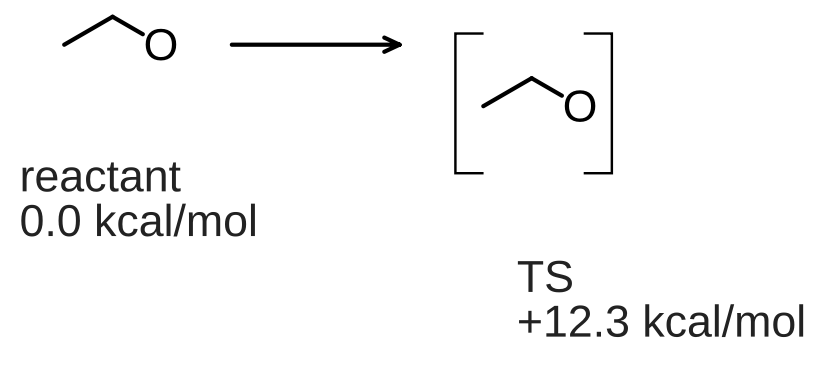
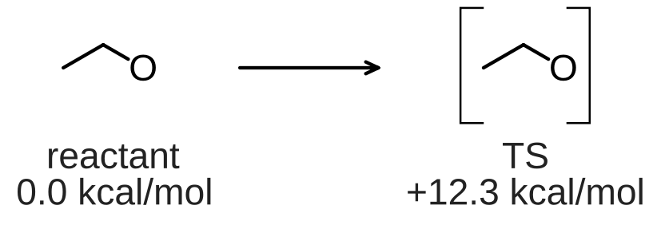
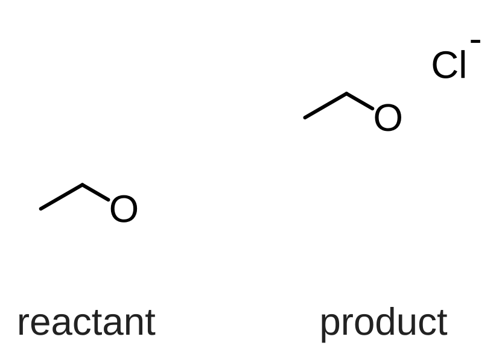
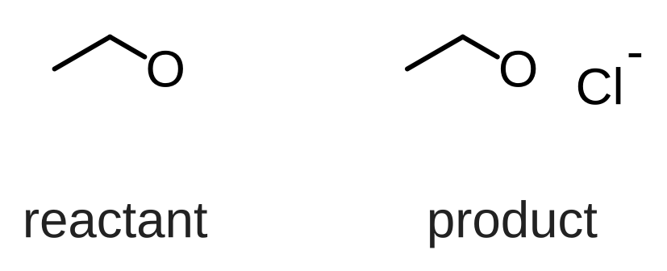
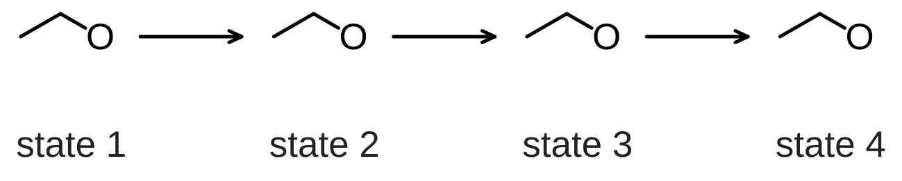
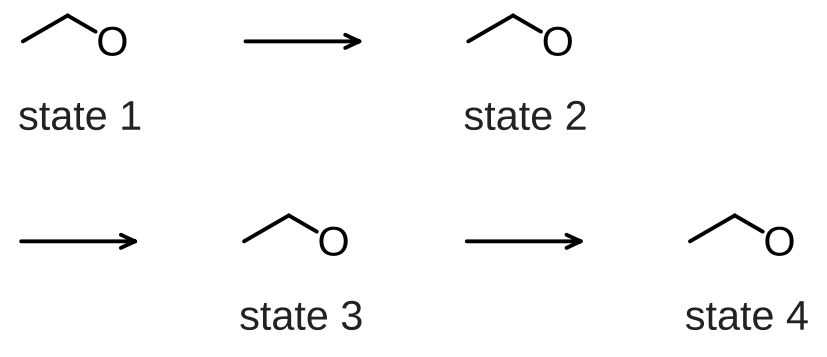

# Structure and Caption Layout

[한국어](SCHEME_LAYOUT.ko.md)

`layout-document` aligns reaction structures and captions into clean, publication-ready rows. It automatically centers captions beneath each molecule, aligns text baselines, and enforces uniform column widths across parallel reactions.

## Arranging via CLI

You can script the layout pipeline using `layout-document`:

```bash
chemvas inspect-document scheme.chemvas
chemvas layout-document scheme.chemvas --layout layout.json --output arranged.chemvas
chemvas check-layout arranged.chemvas
chemvas render-document arranged.chemvas --output arranged.svg --width-mm 174 --max-height-mm 120
```

### Layout Specification (Arrange Mode)

A standard layout request aligns blocks along rows and positions captions underneath:

```json
{
  "format": "chemvas-scheme-layout",
  "version": 1,
  "source_sha256": "<64 lowercase hexadecimal characters>",
  "gap": 12,
  "row_gap": 24,
  "caption_gap": 8,
  "line_gap": 4,
  "rows": [{
    "blocks": [
      {"atoms": [0, 1, 2], "captions": [0, 1], "anchor_atom": 0},
      {"atoms": [3, 4, 5], "captions": [2, 3], "anchor_atom": 3,
       "items": [["ts_brackets", 0]]}
    ],
    "arrows": [0]
  }]
}
```





- **`blocks`**: Array of molecular units. `atoms` specifies atom IDs, `captions` lists note indices (top to bottom), and `anchor_atom` optionally aligns a specific reaction center.
- **`column_group`**: Shared identifier across rows to enforce identical column widths for comparison schemes.
- **`caption_alignment`**: `"row"` aligns captions across a shared baseline; `"structure"` centers each caption directly below its molecule.

## Separate Captions for `1 + 2 → 3`

Keep each molecule and its caption in a separate block. Create a note whose visible
text is `+` and keep it outside the structure blocks. Reference that note after
the first reactant and an arrow after the second.

In a CLI request, use this row inside `rows` (all indices are zero-based):

```json
{
  "blocks": [
    {"atoms": [0, 1, 2], "captions": [0]},
    {"atoms": [3, 4, 5], "captions": [1]},
    {"atoms": [6, 7, 8], "captions": [2]}
  ],
  "connectors": [["notes", 3], ["arrows", 0]]
}
```

Here note 3 is the existing `+`; notes 0–2 are the individual captions. The planner
centers the plus sign on the molecular axis and retains each caption under its
own block.

Choose one connector per gap, or omit connectors for a gallery. `connectors`
and the existing arrow-only `arrows` field cannot be combined in one row. Each
connector must be a distinct existing arrow or `+` note, and cannot also be a
caption or block item. `arrow_color` changes only arrows. Explicit `connectors`
are for arrange mode; `align-y` continues to leave connectors untouched.

Wrapping keeps blocks joined by a plus sign together. If that entire unit cannot
fit, increase the wrap width; a plus sign never starts a continuation line.
Layout moves existing objects into a new output document without introducing a
new document format. Reopening and exporting preserve the arranged captions,
plus sign and arrows.


## Aligning Molecular Drawings Only (`align-y`)

When horizontal spacing and captions are already positioned, use `"mode": "align-y"` to align the vertical centers of molecules without moving text or arrows:

```json
{
  "format": "chemvas-scheme-layout",
  "version": 1,
  "mode": "align-y",
  "source_sha256": "<64 lowercase hexadecimal characters>",
  "rows": [{
    "reference_blocks": [0],
    "blocks": [
      {"atoms": [0, 1, 2], "captions": [0]},
      {"atoms": [3, 4, 5, 6], "captions": [1],
       "parts": [[3, 4, 5], [6]]}
    ]
  }]
}
```





- **`reference_blocks`**: Zero-based block indices whose vertical center acts as the target alignment line.
- **`parts`**: Defines sub-units within a block that can shift vertically independently (e.g., a counter-ion or separate reagent).

## Wrapping Long Pathways

To wrap long multi-step pathways into multiple rows, specify `"max_row_width"` in canvas units:





When a reaction wraps:
- Blocks are kept intact without splitting.
- The connecting arrow that crosses a line break moves to the start of the next line, clearly indicating continuation.

## Verifying & Guarding Layouts

Before finalizing figures, enforce minimum font size and height constraints during headless rendering:

```bash
chemvas render-document arranged.chemvas --output arranged.svg --width-mm 174 --min-font-pt 6
```

- `--min-font-pt`: Rejects exports if scaling causes any text (including sub/superscripts) to fall below the specified threshold.
- `--max-height-mm`: Rejects exports that exceed the journal's maximum allowable figure height.
