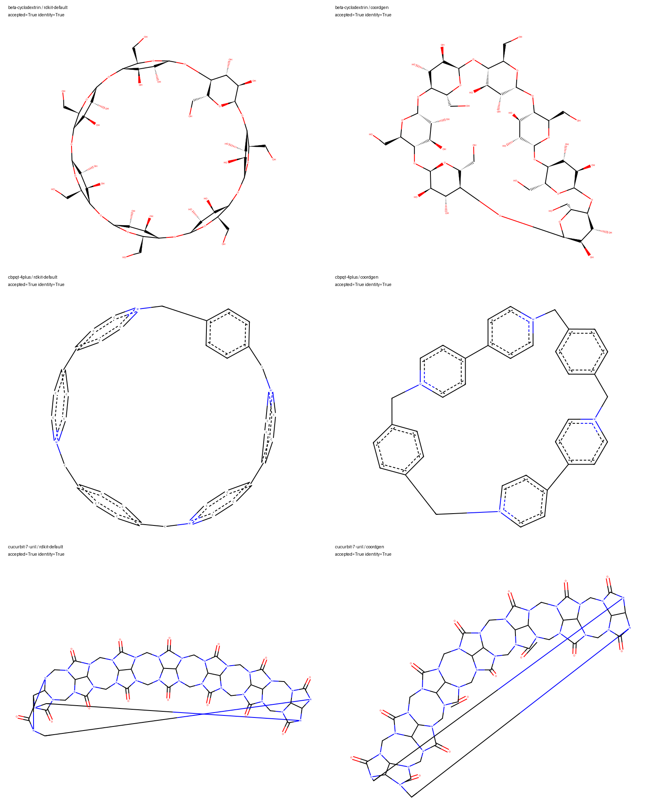

# Macrocycle depiction baseline

This investigation establishes a reproducible comparison for [#313](https://github.com/dhsohn/Chemvas/issues/313). It does **not** select a new depiction policy or resolve that issue.

## Reproduce

With the development environment and optional RDKit backend installed, run from the repository root:

```bash
PYTHONPATH=app python scripts/depiction/evaluate_macrocycles.py --output-dir /tmp/chemvas-macrocycle-review
```

The evaluator reads the checked-in corpus without network access. It validates the formula and InChIKey before generating coordinates. Both cases run through `RDKitAdapter.smiles_to_2d`, including the production kekulization, bond scaling, wedge/hash conversion and tetrahedral stereo guard. A scoped `rdDepictor.UsingCoordGen` preference selects each method in this separate process and restores the original preference afterward. No application default changes.

The pinned corpus stores exact SMILES and retrieval metadata from PubChem:

- [β-cyclodextrin, CID 444041](https://pubchem.ncbi.nlm.nih.gov/compound/444041): C42H70O35; 35 specified tetrahedral centers.
- [CBPQT⁴⁺, CID 4457151](https://pubchem.ncbi.nlm.nih.gov/compound/4457151): C36H32N4+4; bare tetracation without counterions.
- [Cucurbit[7]uril, CID 6096207](https://pubchem.ncbi.nlm.nih.gov/compound/6096207): C42H42N28O14. The public SMILES leaves tetrahedral stereochemistry unspecified. It is a geometry stress case, not a reference establishing the intended stereoisomer.

The API behavior was checked against the RDKit [depictor documentation](https://www.rdkit.org/docs/source/rdkit.Chem.rdDepictor.html), [CoordGen documentation](https://www.rdkit.org/docs/source/rdkit.Chem.rdCoordGen.html), and [Python guide](https://github.com/rdkit/rdkit/blob/master/Docs/Book/GettingStartedInPython.md).

## Observations on 2026-09-28

RDKit 2026.03.6, Python 3.13.14, macOS arm64. The full environment and corpus hash are in [results.json](macrocycles-2026-09-28/results.json).

| Molecule | Method | Close nonbonded pairs | Closest pair / median bond | Maximum bond / median bond |
|---|---|---:|---:|---:|
| β-cyclodextrin | Default | 12 | 0.357 | 1.936 |
| β-cyclodextrin | CoordGen | 0 | 0.799 | 4.022 |
| CBPQT⁴⁺ | Default | 10 | 0.353 | 1.901 |
| CBPQT⁴⁺ | CoordGen | 0 | 0.897 | 2.426 |
| Cucurbit[7]uril | Default | 0 | 0.546 | 21.678 |
| Cucurbit[7]uril | CoordGen | 0 | 0.892 | 21.162 |

A close nonbonded pair is a distinct heavy-atom pair without a direct bond, separated by less than 0.5 median bond lengths. The atom–bond contact metric in the JSON counts nonincident atoms whose perpendicular projection lies strictly inside a bond and is closer than 0.1 median bond lengths. This explicit threshold is not assumed equivalent to the original issue's unspecified atom-on-bond criterion. Metrics describe atom coordinates, not glyph overlap or publication suitability.

All six imports were accepted and retained canonical isomeric identity after reconstruction from the Chemvas model. This checks represented graph, charge and specified stereo; it does not prove the intended stereochemistry of an unspecified input or assess whether wedge placement is easy to read.



The comparison was visually inspected. Default β-cyclodextrin and CBPQT have flattened constituent rings. CoordGen separates those rings, but β-cyclodextrin has a conspicuously extended closure connection and CBPQT retains uneven connection lengths. Both cucurbit[7]uril depictions are stretched chains with long crossing closure bonds. Fewer close atom pairs alone would therefore select drawings that still need review.

The image uses RDKit drawing of coordinates reconstructed from the actual imported model; it does not regenerate coordinates. Its fonts/aromatic rendering are RDKit's, not a screenshot of Chemvas. The six `.mol` files preserve those same coordinates for independent inspection. Native Chemvas label clearance, scaling and final export remain separate acceptance checks.

## Hard gates and advisory metrics

The evaluator exits unsuccessfully for a corpus formula/InChIKey mismatch, rejected
import, nonfinite or zero-length bond geometry, or changed canonical isomeric
identity. These are safety invariants. The optional-RDKit smoke test
`tests/test_macrocycle_depiction_evaluation.py` also checks all six outcomes,
output artifacts and restoration of the library preference; it injects a bad
formula to verify rejection before depiction.

Close-pair counts, atom–bond proximity and bond-length ratios are **advisory**.
They have no production acceptance threshold and do not turn the known poor
cucurbit[7]uril result into a passing quality assessment. No warning is added
based on these provisional measures.

## Acceptance work before changing policy

1. Preserve the current fail-closed import behavior: finite coordinates, exact graph/charge and specified-stereo identity are required for every candidate. A rejected import must leave the document unchanged.
2. Inspect both overlap and distorted-bond measures. Record per-molecule decisions; do not minimize close-pair count as a sole score. The observed 4× and 21× bonds are unresolved quality defects, not accepted thresholds.
3. Add ordinary aromatic rings, fused/bridged rings, charged systems, salts and absolute tetrahedral controls before considering a global engine change. Include atom-order permutations to identify order-dependent quality.
4. Check native insert → save → reopen → export, including drawn wedge/hash readability, label collision and unknown stereo. A precisely specified cucurbit[7]uril reference requires chemical review before stereo claims.
5. Keep known poor layouts in the corpus. Future regressions should assert chemistry invariants and explicit quality budgets after review; do not freeze machine-specific timing or pixel-identical images as the scientific contract.

No global CoordGen preference, automatic scoring heuristic or warning UI is introduced by this baseline.
