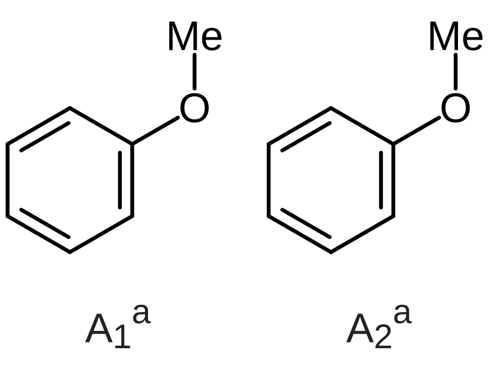
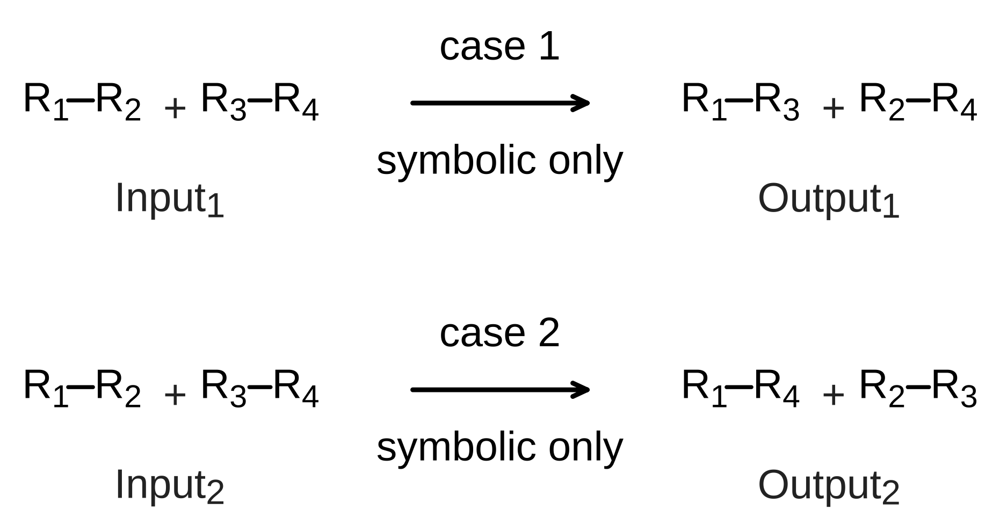

# Examples

[한국어](README.ko.md)

Sample schemes, starter documents, and reproducible publication recipes.

## Publication Figure Gallery

All sample PNG figures are exported at 600 DPI.

### Molecule pair
Two anisole structures with baseline-aligned captions and subscript/superscript identifiers. [Download PNG](publication-pair.png).

### Independent molecular parts
Two independently aligned molecular parts sharing a single caption block. [Download PNG](publication-independent-parts.png).

### Two-row comparison
Two multi-step reaction rows with uniform column widths and labeled arrows. [Download PNG](publication-comparison.png).

To regenerate or modify these figures, see [Publication Figure Recipes](../docs/PUBLICATION_SCHEMES.md).

## Getting Started

Open [first-scheme.chemvas](first-scheme.chemvas) via **File ▸ Open** for an editable reaction scheme.
[Walkthrough](../docs/FIRST_SCHEME.md) · [한국어](../docs/FIRST_SCHEME.ko.md) · [SVG](first-scheme.svg) · [PNG](first-scheme.png).

- Core features (opening, editing, figure export) work out of the box.
- SMILES insertion requires the optional RDKit dependency (`pip install "chemvas[rdkit]"`).
